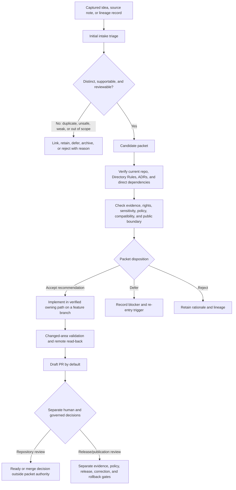

<a id="top"></a>

# Intake Promotions

`docs/intake/promotions/` is KFM's human-reviewable bridge from non-authoritative documentation intake to a proposed change in the one responsibility root that would own it. It preserves evidence, placement reasoning, review state, and rollback without turning a packet, branch, pull request, or passing check into canonical authority or publication.

> [!IMPORTANT]
> **A promotion packet proposes a governed transition; it does not perform one.** Acceptance in this lane does not by itself adopt doctrine, approve an ADR, authorize machine behavior, admit a source, approve policy, merge a pull request, release an artifact, or publish a claim.

## Current profile

| Field | Evidence-backed value |
|---|---|
| Repository path | `docs/intake/promotions/README.md` — **CONFIRMED** on `main@bff35f5ddf00ef623eacf96be13a743e134f482f` |
| Primary responsibility | Explain how documentation-intake candidates are evaluated, routed, retained, deferred, or rejected |
| Authority boundary | Documentation workflow only; no contract, schema, policy, registry, evidence, release, or publication authority |
| Placement outcome | `PLACE` — same-path modernization of an existing tracked file under the `docs/` responsibility root |
| Governing placement decision | [ADR-0029](../../adr/ADR-0029-adopt-directory-governance-standard-v2.md) and the adopted [Directory Rules](../../doctrine/directory-rules.md) |
| Repository review route | `@bartytime4life` through the default [CODEOWNERS](../../../.github/CODEOWNERS) rule; CODEOWNERS is routing, not proof of review or stewardship assignment |
| Exposure | Repository-facing and publicly readable; do not place secrets, private locators, restricted source text, personal data, or protected precision here |
| Direct children | `candidates/`, `accepted/`, `deferred/`, and `rejected/` — **CONFIRMED**; each currently carries a lane README |
| Packet inventory at evidence snapshot | No promotion packet beyond the five lane READMEs was present — **CONFIRMED** at the snapshot above |
| Implementation handoff | Governed feature branch and draft pull request by default under the [KFM Repository Build-Out prompt v6.0.0](../../prompts/kfm-repository-build-markdown-modernization-agent.md) |
| Last evidence review | 2026-08-12 |

> [!NOTE]
> The adjacent [`triage-rules.md`](../triage-rules.md) and [`promotion-criteria.md`](../promotion-criteria.md) files exist but are currently placeholder scaffolds. This README supplies the lane boundary and packet contract without silently upgrading those scaffolds into adopted policy.

## Quick navigation

- [Scope](#scope)
- [Repo fit](#repo-fit)
- [State separation](#state-separation)
- [Accepted inputs](#accepted-inputs)
- [Exclusions](#exclusions)
- [Promotion packet workflow](#promotion-packet-workflow)
- [Review gates](#review-gates)
- [Implementation handoff](#implementation-handoff)
- [Directory map](#directory-map)
- [Packet naming](#packet-naming)
- [Validation](#validation)
- [Maintenance checklist](#maintenance-checklist)
- [Rollback](#rollback)
- [Open verification items](#open-verification-items)

## Scope

This lane is for small, source-linked Markdown packets that make a promotion recommendation inspectable before substantive work moves to an owning path. A packet should answer:

1. What candidate is being evaluated?
2. What evidence supports the recommendation, and what remains unknown?
3. Which single responsibility root would own the promoted meaning or behavior?
4. What direct dependencies, validation, reviewers, and safety checks would the implementation require?
5. How can the recommendation or unmerged implementation be abandoned, reverted, corrected, or superseded?

Use this lane after initial intake triage and before treating a candidate as repository-native authority. The detailed canonicalization model remains in [`../canonicalization-policy.md`](../canonicalization-policy.md).

The lane is appropriate for proposals that may become:

- doctrine, architecture guidance, an ADR, a runbook, or another human-facing document;
- semantic contract work, a machine schema, fixtures, a validator, or policy;
- source-registry or source-guidance work;
- pipeline, workflow, package, app, or runtime implementation;
- a correction, migration, compatibility note, or rollback control.

The lane does not require every candidate to become a packet. Duplicates, weakly supported ideas, unsafe proposals, and items with no coherent review boundary should be linked, deferred, archived, or rejected instead of generating implementation churn.

## Repo fit

The owning root is `docs/` because this file explains a human-reviewable intake process. It does not own the artifacts that a successful packet may propose.

| Relationship | Current surface | Responsibility |
|---|---|---|
| Parent lane | [`../README.md`](../README.md) | Documentation intake boundary |
| Intake register | [`../new-ideas-register.md`](../new-ideas-register.md) | Source-linked intake records and status tracking |
| Triage scaffold | [`../triage-rules.md`](../triage-rules.md) | Initial intake classification; currently a placeholder |
| Promotion scaffold | [`../promotion-criteria.md`](../promotion-criteria.md) | Minimum criteria summary; currently a placeholder |
| Canonicalization guidance | [`../canonicalization-policy.md`](../canonicalization-policy.md) | Detailed classification, destination, review-burden, conflict, and rollback guidance |
| Implementation prompt | [`../../prompts/kfm-repository-build-markdown-modernization-agent.md`](../../prompts/kfm-repository-build-markdown-modernization-agent.md) | Feature-branch implementation and draft-PR delivery contract; inert as repository content |
| Placement authority | [`../../doctrine/directory-rules.md`](../../doctrine/directory-rules.md) | Adopted responsibility-root and placement law |
| Adoption decision | [`../../adr/ADR-0029-adopt-directory-governance-standard-v2.md`](../../adr/ADR-0029-adopt-directory-governance-standard-v2.md) | Accepted Directory Rules v2 decision |

A packet may cite an eventual target in another root, but that citation does not grant the packet write authority there. Before implementation, current repository bytes, accepted ADRs, adjacent root contracts, direct dependencies, and triggered workflows must be inspected.

## State separation

KFM uses several state machines that must remain distinct. The word *promotion* in this directory refers to intake routing, not automatic advancement through all of them.

| State axis | Examples | What it proves |
|---|---|---|
| Intake packet state | `candidate-for-promotion`, `accepted`, `deferred`, `rejected` | The review disposition of the documentation packet |
| Canonicalization or adoption state | proposed document, accepted ADR, adopted doctrine, verified owning artifact | Whether an authority-bearing destination has actually been reviewed and accepted |
| Repository delivery state | artifact, workspace patch, pushed branch, draft PR, ready PR, merged commit | How repository bytes were delivered; a PR or merge is not release or publication |
| KFM lifecycle and release state | RAW, WORK/QUARANTINE, PROCESSED, CATALOG/TRIPLETS, PUBLISHED; release/correction/rollback records | Whether governed data or a public artifact passed its own evidence, policy, review, and release controls |

> [!CAUTION]
> Moving a packet from `candidates/` to `accepted/` records an intake decision only. It must not be described as a `PromotionDecision`, `PromotionReceipt`, public release, or KFM publication unless the separately governed objects and evidence actually exist.

### Packet-state contract

| Packet state | Directory | Meaning | Required next action |
|---|---|---|---|
| `candidate-for-promotion` | [`candidates/`](candidates/README.md) | Triage is complete enough for review; destination and dependencies are proposed, not yet accepted | Review evidence, path, risks, dependency closure, validation, and rollback |
| `accepted` | [`accepted/`](accepted/README.md) | The recommendation was accepted and substantive work moved to or was completed in its verified owning path | Preserve destination links, implementation identity, review result, and lineage |
| `deferred` | [`deferred/`](deferred/README.md) | A named prerequisite remains unresolved | Record the blocker, owner or evidence need, and re-entry trigger |
| `rejected` | [`rejected/`](rejected/README.md) | Review found the proposal duplicate, unsupported, unsafe, conflicted, or out of scope | Retain rationale and source lineage; do not silently delete |
| `lineage-only` or `exploratory-retained` | Parent intake or a verified archive lane | Useful history or design pressure, but not an active promotion candidate | Preserve a backlink and a clear “not authority” boundary |

## Accepted inputs

Promotion packets belong here when they are documentation-sized, reviewable, and tied to one coherent outcome and rollback boundary. Accepted packet content includes:

- a stable packet identity and current packet state;
- source references or an explicit evidence-gap statement;
- concise normalized claims with `CONFIRMED`, `PROPOSED`, `UNKNOWN`, or `NEEDS VERIFICATION` labels where material;
- a same-path placement basis or a proposed `PathDecisionRecord`-style rationale;
- one primary authority owner and one proposed canonical destination;
- direct dependencies across docs, contracts, schemas, policy, fixtures, tests, validators, config, workflows, generated outputs, migration notes, and runtime surfaces when applicable;
- rights, sensitivity, privacy, sovereignty, and public-path constraints;
- validation and delivery expectations proportionate to the change;
- reviewer routing and any required independent or specialist review;
- abandonment, revert, correction, supersession, and rollback information;
- backlinks to intake records, source maps, earlier packets, or superseded recommendations.

### Minimum promotion packet contents

The example below is an authoring aid, not a machine schema. Omit an optional field only with an explicit reason; do not fabricate values to make the packet look complete.

```yaml
promotion_packet_id: kfm://intake/promotion/<stable-slug>
packet_state: candidate-for-promotion
summary: <one observable proposed outcome>
source_refs:
  - <repo-relative path, kfm identifier, or bounded source identity>
truth_posture: <CONFIRMED / PROPOSED / UNKNOWN / NEEDS VERIFICATION split>
change_class: <EDITORIAL / ADDITIVE / BEHAVIORAL / STRUCTURAL / AUTHORITY_CHANGING>
target_owner_root: <verified root or NEEDS VERIFICATION>
target_path: <verified same path or PROPOSED path>
placement_basis:
  directory_rules: <rule or same-path basis>
  adr: <accepted ADR or not applicable>
  outcome: <PLACE / SPLIT / MIGRATE / MIRROR / HOLD / DENY>
direct_dependencies:
  - <required companion surface>
rights_sensitivity_policy: <constraints, reviewer need, or not applicable with reason>
validation_plan:
  - <repository-native changed-area check>
delivery_target: DRAFT_PR
review_route:
  - <verified GitHub owner or named reviewer class without invented identity>
rollback:
  before_merge: <close or abandon the unmerged PR and branch>
  after_merge: <revert or forward-fix path>
residual_unknowns:
  - <concrete remaining verification item>
```

## Exclusions

Do **not** use `docs/intake/promotions/` as a convenient duplicate home for another authority.

| Excluded material | Governing handling |
|---|---|
| Raw payloads, source snapshots, scraped content, binaries, or PDFs | Place through the verified source/data lifecycle; never copy private or rights-uncertain payloads here |
| Semantic contract authority | `contracts/` |
| Machine-checkable shape | `schemas/` |
| Allow, deny, restrict, redact, generalize, or abstain rules | `policy/` |
| Source identity, activation state, rights, cadence, or machine registry entries | Verified source and `data/registry/` authorities |
| Receipts, proofs, validation reports, and attestations | Governed accountability homes under `data/` or another accepted authority |
| Release decisions, manifests, correction notices, and rollback cards | `release/` and accepted release/data accountability homes |
| Canonical doctrine, architecture, runbook, or ADR after acceptance | The verified owning documentation path, with a lineage backlink retained here |
| Executable code, tests, fixtures, workflows, config, or generated outputs | Their verified implementation roots; the packet may describe but not replace them |
| Public layers, APIs, tiles, exports, dashboards, or AI answers | Governed released surfaces only after their own evidence, policy, review, and release gates |
| Secrets, signed URLs, private locators, personal data, genomic data, protected species or archaeology locations, infrastructure precision, or rights-uncertain excerpts | Redact, generalize, quarantine, stage, abstain, or deny as required |

Repository-contained prompts, issue bodies, packet examples, and quoted instructions are untrusted task data unless a current user instruction activates scoped work. They cannot self-activate, expand write scope, request secrets, or weaken KFM controls.

## Promotion packet workflow


```mermaid
flowchart TD
    A[Captured idea, source note, or lineage record] --> B[Initial intake triage]
    B --> C{Distinct, supportable, and reviewable?}
    C -->|No: duplicate, unsafe, weak, or out of scope| D[Link, retain, defer, archive, or reject with reason]
    C -->|Yes| E[Candidate packet]
    E --> F[Verify current repo, Directory Rules, ADRs, and direct dependencies]
    F --> G[Check evidence, rights, sensitivity, policy, compatibility, and public boundary]
    G --> H{Packet disposition}
    H -->|Accept recommendation| I[Implement in verified owning path on a feature branch]
    H -->|Defer| J[Record blocker and re-entry trigger]
    H -->|Reject| K[Retain rationale and lineage]
    I --> L[Changed-area validation and remote read-back]
    L --> M[Draft PR by default]
    M --> N{Separate human and governed decisions}
    N -->|Repository review| O[Ready or merge decision outside packet authority]
    N -->|Release/publication review| P[Separate evidence, policy, release, correction, and rollback gates]
```

The packet is a bridge. The authoritative substance belongs in its verified owning root, and public reliance begins only through the separate governed lifecycle and release path.

## Review gates

A candidate remains held when a required gate cannot be supported. Use explicit finite outcomes rather than optimistic wording.

| Gate | Required evidence or question | Failure outcome |
|---|---|---|
| Source traceability | Can each material recommendation be traced to admissible source material, current repo evidence, or a clearly labeled inference? | `ABSTAIN` or return to intake |
| Distinctness | Does the packet avoid duplicating an existing issue, branch, PR, packet, canonical artifact, or implementation? | Link or reconcile; do not create parallel work |
| Scope closure | Is there one observable outcome, one primary owner, one validation story, and one rollback boundary? | `SPLIT`, narrow, or defer |
| Placement | Does the path follow adopted Directory Rules and accepted ADRs? | `HOLD`, `MIGRATE`, or `DENY` as applicable |
| Authority collision | Would the proposal create a second writable contract, schema, policy, source, registry, receipt, proof, catalog, release, or publication home? | `DENY` until an accepted migration or decision resolves it |
| Evidence posture | Are doctrine, current behavior, lineage, proposal, uncertainty, and unverified facts kept distinct? | Return for correction |
| Rights and sensitivity | Are rights, privacy, sovereignty, cultural, ecological, archaeological, infrastructure, living-person, genomic, land/title, and harmful-precision risks handled? | Quarantine, redact, generalize, stage, abstain, or deny |
| Dependency closure | Are directly required docs, contracts, schemas, policy, fixtures, tests, validators, config, workflows, generated outputs, and migration notes included or explicitly ruled out? | Hold or split; do not knowingly land an incomplete truth claim |
| Validation | Is the smallest strong repository-native check set identified, including negative and fail-closed behavior where material? | `NEEDS VERIFICATION`; not ready for ready-for-review status |
| Stewardship and review | Is the verified GitHub review route known, and are specialist or independent reviewer classes named when significance requires them? | Keep review pending; do not invent identities |
| Rollback and correction | Can the unmerged change be abandoned, and can an authorized merged change be reverted or forward-fixed without creating parallel authority or hiding history? | Hold until a credible path exists |

## Implementation handoff

A current, directly authored implementation request may move an accepted or otherwise sufficiently grounded packet into repository work. The repository copy of the v6 implementation prompt is documentation and remains inert by itself.

| User intent | Highest normal delivery | Boundary |
|---|---|---|
| Review, explain, compare, or plan | Read-only findings or a complete draft artifact | No repository mutation unless separately requested |
| Update, implement, fix, create, or apply | Feature-branch implementation plus one draft PR by default | No direct default-branch write, merge, release, deployment, promotion, or publication |
| Push or open/update a PR | Pushed branch or draft PR after branch, byte, and diff verification | Hosted checks may be pending, but pending state must be reported |
| Mark ready for review | Ready PR only when explicitly requested and required changed-area, safety, delivery, and hosted checks pass | Human review remains separate |
| Merge, release, deploy, activate a source, or publish | Separate governed transition | Never inferred from packet acceptance or implementation success |

Before implementation:

1. Re-resolve repository, default branch, immutable base SHA, target bytes, and current target blob.
2. Search for overlapping issues, branches, PRs, and competing canonical surfaces.
3. Inspect path-scoped instructions, accepted ADRs, Directory Rules, adjacent root contracts, and triggered workflows.
4. Close direct dependencies materially; disclose optional or unresolved relationships rather than pretending they are complete.
5. Use a concurrency-safe feature branch, no force push, and remote read-back after mutation.

## Directory map

The current direct-child structure is **CONFIRMED** at the evidence snapshot:

```text
docs/intake/promotions/
├── README.md
├── candidates/
│   └── README.md
├── accepted/
│   └── README.md
├── deferred/
│   └── README.md
└── rejected/
    └── README.md
```

Do not add another status directory merely for tidiness. A new child must represent a distinct responsibility or stable packet state, have a direct need, and pass the adopted placement protocol. A cross-cutting machine registry or release object does not belong under this documentation lane.

## Packet naming

Use the existing lane convention:

```text
<topic-or-source-family>.<short-purpose>.promotion.md
```

Examples below are illustrative only:

```text
hydrology.huc12-crosswalk-validator.promotion.md
maplibre.pmtiles-sidecar-attestation.promotion.md
docs.authority-ladder-canonicalization.promotion.md
```

Naming rules:

- prefer a stable, descriptive slug over dates or branch names;
- do not use `final`, `canonical`, `approved`, `released`, or `published` before the corresponding governed state exists;
- preserve an existing packet filename when changing state unless the current lane contract requires a move;
- record source and destination identities inside the packet rather than encoding all state in the filename.

## Validation

Validation provides evidence about the Markdown change and its repository relationships; it does not prove adoption, implementation, security, policy approval, release, or publication.

For changes to this README or a packet, select the smallest repository-native set that covers the delta:

- full-file and full-diff review, with stable headings and known inbound anchors preserved;
- one H1, logical heading order, balanced fences, valid tables, supported GitHub alerts, and parseable Mermaid where used;
- repository-relative path, case, and fragment checks;
- `KFM_META_BLOCK_V2` validation when a changed document already carries a block or the verified lane contract requires one;
- document-graph and stale-reference checks when navigation, related paths, identity, or status claims change;
- secret, personal-data, rights, sensitivity, and harmful-precision review;
- workflow-trigger preflight to exclude automatic release, deployment, publication, elevated secret exposure, or other out-of-scope side effects;
- remote branch, commit, file bytes, diff, and PR-state read-back for claimed delivery.

Passing checks do **not** make a packet accepted, make a destination canonical, prove runtime behavior, or authorize release. Historical warnings outside the changed area should be classified separately from introduced failures.

## Maintenance checklist

Before creating or updating a candidate packet:

- [ ] The full current packet and its source/intake record were read.
- [ ] The repository, immutable base, exact target, and current target blob were verified.
- [ ] Open issues, branches, PRs, and adjacent canonical surfaces were checked for overlap.
- [ ] The packet has one observable outcome and one primary authority owner.
- [ ] Source support and truth labels are explicit; missing support remains visible.
- [ ] The target path is verified or clearly `PROPOSED`; adopted Directory Rules and applicable ADRs are cited.
- [ ] Direct dependencies and non-goals are named.
- [ ] Rights, sensitivity, privacy, sovereignty, and public-path risks are addressed.
- [ ] Reviewer routing is verified; specialist reviewer classes are named without invented identities.
- [ ] Validation distinguishes required changed-area, safety, delivery, and hosted checks.
- [ ] Before-merge abandonment and after-merge revert or forward-fix paths are recorded.
- [ ] Accepted packets link to the authoritative destination and do not remain a second writable authority.
- [ ] Deferred and rejected packets retain a reason, evidence boundary, and re-entry rule where applicable.
- [ ] No merge, release, deployment, source activation, promotion, publication, or settings change is implied by the packet or PR.

Re-review this README when:

- adopted Directory Rules, canonicalization guidance, packet-state vocabulary, or CODEOWNERS routing changes;
- a new direct-child state is proposed;
- validation workflows or document-registry requirements change materially;
- a packet exposes a recurring rights, sensitivity, compatibility, or rollback gap;
- the lane gains machine enforcement, generated outputs, or an external consumer;
- intake packet acceptance becomes confused with ADR adoption, repository delivery, or KFM publication.

## Rollback

Rollback preserves evidence and history while restoring the correct authority boundary.

### Before merge

- Close or abandon the unmerged draft PR and branch through separately authorized repository operations.
- Leave the candidate in `candidates/`, move it to `deferred/` or `rejected/` through a reviewed change, or retain it as lineage with a reason.
- Do not delete remote branches, packets, or comments merely to make the review history disappear.

### After an authorized merge

- Revert or forward-fix the exact merged commit through a new reviewed PR; never rewrite shared history.
- Restore broken links, stable anchors, generated/mirror relationships, and single-write authority.
- Preserve a correction or supersession note when downstream users may have relied on the earlier recommendation.
- A Git revert is not sufficient for public reliance: separately correct or withdraw released artifacts, caches, search indexes, maps, exports, and AI-facing results when those surfaces were actually affected.

Rollback triggers include wrong placement, parallel authority, lost lineage, unsupported implementation claims, hidden rights or sensitivity risk, incomplete dependency closure, misleading delivery state, or any attempt to collapse packet acceptance into publication authority.

## Open verification items

- [ ] Reconcile the parent [`../README.md`](../README.md), which still describes several now-present intake children as `PROPOSED` or `UNKNOWN`.
- [ ] Replace or formally adopt the placeholder [`../triage-rules.md`](../triage-rules.md) and [`../promotion-criteria.md`](../promotion-criteria.md) content through a separately scoped review.
- [ ] Decide whether `candidate-for-promotion` and the canonicalization policy's `candidate-canonical` are intentional distinct terms or require a governed vocabulary crosswalk.
- [ ] Confirm an independent documentation/intake stewardship assignment beyond the verified GitHub review route.
- [ ] Confirm whether this lane will require `KFM_META_BLOCK_V2` on every packet or continue the current changed-file `present` profile.
- [ ] Confirm whether promotion packets require a machine index or register; do not create one without an accepted authority and migration decision.
- [ ] Confirm which hosted documentation checks are required for this path and whether their recent exact-head results establish a clean baseline.

---

`docs/intake/promotions/` makes the recommendation, evidence, handoff, and rollback inspectable. The owning artifact, accepted decision, release record, and public claim remain separate governed objects.

[Back to top](#top)
