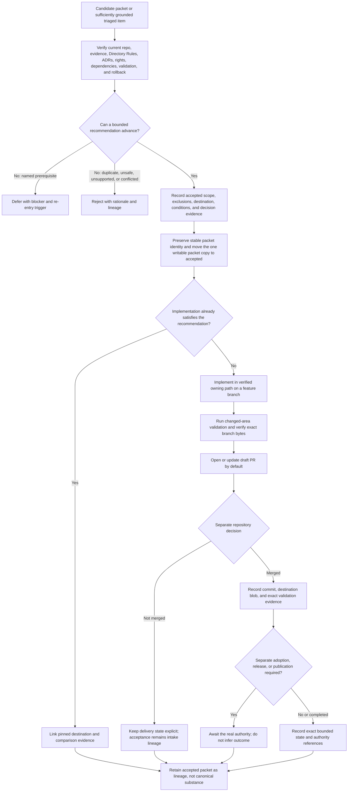

<a id="top"></a>

# Accepted Promotion Packets

`docs/intake/promotions/accepted/` retains human-reviewable records for promotion recommendations that KFM reviewed and chose to advance, in whole or in a clearly bounded part, toward one verified owning path. The lane preserves the accepted scope, evidence boundary, destination, implementation handoff, review result, correction path, and lineage without turning an intake decision into canonical authority, implementation proof, release, or publication.

> [!IMPORTANT]
> **Acceptance is an intake-packet disposition only.** It means the recommendation may proceed through its separately governed owning path. It does not by itself adopt doctrine, accept an ADR, change a contract or schema, admit a source, approve policy, prove implementation, merge a pull request, release an artifact, or publish a claim.

## Current profile

| Field | Evidence-backed value |
|---|---|
| Repository path | `docs/intake/promotions/accepted/README.md` — **CONFIRMED** on `main@ce28bd501c593e668461b6ffc66bb1c8ef9d6e91` |
| Prior target blob | `fe2375cde888d81473620773b6c3d3d5eaddcf1b` |
| Primary responsibility | Explain how accepted documentation-promotion packets are recorded, handed off, verified, corrected, and retained |
| Authority boundary | Documentation intake only; no contract, schema, policy, source, registry, evidence, receipt, proof, release, or publication authority |
| Placement outcome | `PLACE` — same-path modernization of an existing tracked README under the `docs/` responsibility root |
| Governing placement decision | [ADR-0029](../../../adr/ADR-0029-adopt-directory-governance-standard-v2.md) and the adopted [Directory Rules](../../../doctrine/directory-rules.md) |
| Parent lane contract | [`docs/intake/promotions/README.md`](../README.md) |
| Repository review route | `@bartytime4life` through the default [CODEOWNERS](../../../../.github/CODEOWNERS) rule; routing is not proof of review, approval, stewardship, or separation of duties |
| Exposure | Repository-facing and publicly readable; do not place secrets, private locators, restricted source text, personal data, protected precision, or unsafe acceptance detail here |
| Packet inventory at evidence snapshot | Only this README was present — **CONFIRMED** at the snapshot above |
| Last evidence review | 2026-08-12 |

## Quick navigation

- [Scope](#scope)
- [Authority and state separation](#authority-and-state-separation)
- [What belongs here](#what-belongs-here)
- [What does not belong here](#what-does-not-belong-here)
- [Acceptance posture vocabulary](#acceptance-posture-vocabulary)
- [Required accepted record](#required-accepted-record)
- [Destination and implementation evidence](#destination-and-implementation-evidence)
- [Review and handoff workflow](#review-and-handoff-workflow)
- [Naming and stable identity](#naming-and-stable-identity)
- [Evidence, rights, and sensitive detail](#evidence-rights-and-sensitive-detail)
- [Retention, correction, and supersession](#retention-correction-and-supersession)
- [Directory map](#directory-map)
- [Validation](#validation)
- [Maintenance checklist](#maintenance-checklist)
- [Rollback](#rollback)
- [Open verification items](#open-verification-items)

## Scope

This lane is for promotion packets whose recommendation has passed intake review and should proceed to, or has been satisfied in, one verified owning path. An accepted record should make seven things inspectable:

1. what recommendation was reviewed;
2. which bounded scope was accepted and which scope was excluded, deferred, or rejected;
3. which evidence, repository state, Directory Rules, ADRs, rights, sensitivity, and compatibility constraints were considered;
4. which responsibility root and destination own the accepted substance;
5. what implementation, adoption, delivery, validation, release, and publication states actually exist;
6. which predecessor, issue, branch, pull request, commit, decision, or authoritative destination carries the lineage; and
7. how the acceptance, destination, or implementation can be corrected, superseded, abandoned, reverted, or forward-fixed.

The accepted packet is a durable review and lineage record. It does **not** become the authoritative substance merely because it is retained here. The accepted meaning belongs in its verified owning root, and public reliance begins only through the separately governed evidence, policy, review, release, and publication path.

Use [`../candidates/`](../candidates/README.md) while the recommendation is still under review. Use [`../deferred/`](../deferred/README.md) when a named prerequisite blocks the same proposal. Use [`../rejected/`](../rejected/README.md) when the submitted form should not advance.

## Authority and state separation

KFM uses several independent decision axes. Keep them distinct in every accepted record.

| Decision axis | Example state | What an accepted packet proves |
|---|---|---|
| Intake packet review | `accepted` | The reviewed recommendation, within its recorded scope, may advance to the verified owning path |
| Canonicalization or adoption | proposed destination, accepted ADR, adopted doctrine, verified owning artifact | Nothing by itself; cite the actual accepted decision or destination bytes |
| Repository delivery | not started, draft artifact, workspace patch, pushed branch, draft PR, ready PR, merged commit | Only the exact delivery state that is linked and verified |
| Implementation behavior | absent, partial, fixture-only, implemented, tested, deployed | Nothing unless current code, configuration, tests, artifacts, logs, or runtime evidence supports the claim |
| Source admission and evidence | admitted, context-only, quarantined, denied, unresolved | Nothing unless the governing source and evidence authorities separately record it |
| Policy and sensitivity | allow, restrict, redact, generalize, abstain, deny | Nothing unless a real policy decision and required review evidence exist |
| KFM release and publication | candidate, held, released, corrected, withdrawn, rolled back | Nothing; packet acceptance is not release or publication state |

> [!CAUTION]
> Do not use `PromotionDecision`, `PromotionReceipt`, `PolicyDecision`, `ReleaseManifest`, `ProofPack`, or `PUBLISHED` as decorative labels for an accepted intake packet. Use those names only when the separately governed object actually exists and is cited.

### Acceptance does not erase conditions

Acceptance may be bounded by conditions, but those conditions must not hide a blocker that should keep the packet in `deferred/`. A condition is appropriate when it constrains the implementation without reopening the decision, such as:

- preserve a named compatibility surface;
- include a specific validator, fixture, migration note, or documentation update;
- keep a source inactive until a separate source-admission decision;
- keep public exposure denied until policy and release gates pass;
- require a specialist or independent reviewer before a later transition; or
- deliver only a draft pull request.

A missing owner, unresolved path authority, unknown rights posture, unresolved material conflict, or absent dependency closure is normally a deferral or rejection reason rather than an acceptance condition.

## What belongs here

A packet belongs in `accepted/` when the acceptance decision is reviewable and all of the following are true at the appropriate level for the change:

- the accepted recommendation and its observable scope are explicit;
- the accepted scope is distinct from any excluded, deferred, or rejected remainder;
- the source and evidence boundary is recorded without presenting proposal as fact;
- one primary responsibility root and destination own the accepted substance;
- the placement basis is verified against adopted Directory Rules and applicable accepted ADRs;
- the proposal does not create a second writable contract, schema, policy, source, registry, receipt, proof, catalog, release, or publication authority;
- direct dependencies are included in the handoff or explicitly shown not to be required;
- rights, privacy, sovereignty, cultural, ecological, archaeological, infrastructure, living-person, genomic, land/title, and harmful-precision concerns are bounded;
- validation, review, correction, and rollback expectations are credible;
- implementation and delivery status are stated separately from acceptance;
- the packet links to the canonical destination or records why implementation has not yet created it; and
- the packet preserves its intake, source, decision, and repository-delivery lineage.

A packet may be accepted as already satisfied when current repository evidence proves that an existing authoritative destination already fulfills the recommendation. In that case, no duplicate implementation should be created; the packet should link the existing destination and record the comparison.

## What does not belong here

| Material or condition | Correct handling |
|---|---|
| A recommendation still under active review | [`../candidates/`](../candidates/README.md) |
| A recommendation waiting on a named unresolved prerequisite | [`../deferred/`](../deferred/README.md) |
| A recommendation that should not advance in its submitted form | [`../rejected/`](../rejected/README.md) |
| Substantive canonical doctrine, architecture, runbook, ADR, contract, schema, policy, code, fixture, test, workflow, configuration, or migration content | Its verified owning responsibility root; retain only the accepted packet and backlinks here |
| Raw source payloads, scraped content, binaries, private attachments, or evidence bytes | Governed source/data lifecycle; do not copy them into documentation intake |
| Source admission, source health, rights activation, or evidence-resolution decisions | The verified source, evidence, policy, and accountability authorities |
| Policy allow, deny, restrict, redact, generalize, or abstain decisions | `policy/` and its accepted decision/review records |
| Receipts, proofs, validation artifacts, attestations, or generated release evidence | Governed accountability homes under `data/` or another accepted authority |
| Release decisions, manifests, correction notices, withdrawal records, and rollback cards | `release/` and accepted release/data accountability homes |
| An open, closed, or merged pull request without an accepted packet-review decision | Preserve the GitHub delivery state; do not infer packet acceptance |
| Sensitive rationale or destination detail that would expose protected information | Record a public-safe summary and an approved restricted review route; do not disclose the payload or locator |

Acceptance must not be used as a shortcut around the destination's own review burden. A packet that recommends a policy change, source activation, governance change, or public release remains subordinate to the authority that can actually decide that change.

## Acceptance posture vocabulary

The labels below are a **human authoring vocabulary for this lane**, not a machine schema, policy code set, adoption state, or release vocabulary. Use one primary posture and as little secondary wording as needed.

| Authoring label | Use when | Minimum retained evidence |
|---|---|---|
| `ACCEPTED_FOR_HANDOFF` | The recommendation is accepted and implementation should proceed in the verified owning path | Accepted scope, destination, placement basis, dependencies, validation plan, and rollback |
| `ACCEPTED_WITH_BOUNDED_SCOPE` | Only a clear subset of the submitted proposal is accepted | Accepted and excluded scopes, reason for narrowing, and routing of the remainder |
| `ACCEPTED_AS_ALREADY_SATISFIED` | Existing authoritative repository work already fulfills the recommendation | Exact destination, pinned repository reference, and a short comparison showing no duplicate change is needed |
| `ACCEPTED_IMPLEMENTATION_PRESENT` | The accepted substance exists in the owning path at a pinned reference | Exact path, blob or commit, delivery state, and changed-area validation evidence |
| `ACCEPTED_PENDING_SEPARATE_ADOPTION` | Implementation or a draft destination may proceed, but an ADR, policy, source, release, or other authority must still decide adoption | Required decision authority, current delivery state, and explicit no-adoption/no-release boundary |
| `ACCEPTED_AS_CORRECTION_OR_MIGRATION` | The accepted work corrects or migrates an existing authoritative surface rather than creating a new one | Predecessor identity, migration/correction scope, compatibility plan, validation, and rollback |

Do not use `ACCEPTED_IMPLEMENTATION_PRESENT` merely because a branch or pull request exists. It requires verified destination bytes at a pinned reference. Even then, behavior, deployment, release, and publication require their own evidence.

## Required accepted record

The example below is an authoring aid, not a machine schema. Preserve existing packet fields when moving a reviewed candidate, and add only values that are verified or explicitly marked `NEEDS VERIFICATION`.

```yaml
promotion_packet_id: kfm://intake/promotion/<stable-slug>
packet_state: accepted
summary: <the reviewed recommendation in one bounded sentence>
source_refs:
  - <repo-relative path, KFM identifier, or bounded source identity>
truth_posture: <CONFIRMED / PROPOSED / UNKNOWN / NEEDS VERIFICATION split>
review_snapshot:
  repository_ref: <commit or branch inspected, or NEEDS VERIFICATION>
  directory_rules: docs/doctrine/directory-rules.md
  applicable_adrs:
    - <accepted ADR or not applicable with reason>
acceptance:
  posture: <one authoring label from this README>
  accepted_scope:
    - <one observable accepted outcome>
  excluded_or_routed_scope:
    - <rejected, deferred, split, or not-applicable remainder>
  rationale: <specific, public-safe explanation>
  evidence_refs:
    - <file, issue, PR, test, log, artifact, or bounded source locator>
  decided_at: <decision date or NEEDS VERIFICATION>
  review_route: <verified GitHub owner or reviewer class; do not invent identity>
destination:
  owning_root: <verified responsibility root>
  path: <verified path, PROPOSED path, or not yet created>
  object_or_document_family: <destination responsibility>
  placement_outcome: <PLACE / SPLIT / MIGRATE / MIRROR / HOLD / DENY>
  canonical_or_adoption_state: <separate current state and decision ref>
implementation:
  delivery_state: <not-started / draft-artifact / workspace-patch / pushed-branch / draft-pr / ready-pr / merged>
  branch: <exact branch or not applicable>
  pull_request: <exact PR or not applicable>
  commit: <exact commit or not applicable>
  destination_blob: <exact blob or not applicable>
  behavior_status: <UNKNOWN / fixture-only / partial / verified, with evidence>
validation:
  checks:
    - <repository-native changed-area check and outcome>
  exact_head_or_ref: <commit or branch tied to the results>
rights_sensitivity_handling: <constraints, specialist review, public-safe transform, or not applicable with reason>
release_and_publication:
  release_state: <not evaluated / held / exact separately governed state>
  publication_state: <not evaluated / not published / exact separately governed state>
  authority_refs:
    - <ReleaseManifest, decision, or not applicable>
lineage:
  originating_intake: <register entry, card, packet, or source note>
  predecessor_packet: <candidate identity or not applicable>
  destination_backlink: <authoritative destination or not yet created>
correction_and_rollback:
  before_merge: <close or abandon the unmerged PR and branch>
  after_merge: <revert or forward-fix the implementation commit>
  acceptance_correction: <append or link a correction/supersession without erasing history>
residual_unknowns:
  - <concrete remaining verification item>
```

### Minimum narrative requirements

Every retained accepted packet should answer:

- **Recommendation:** What outcome was reviewed?
- **Accepted scope:** What exactly may proceed, and what was not accepted?
- **Evidence:** What source material and repository state supported the decision?
- **Destination:** Which one responsibility root and path own the substance?
- **Implementation:** What bytes, branch, pull request, commit, tests, or runtime evidence actually exist?
- **Adoption:** Does a separate ADR, policy, source, governance, or release decision remain?
- **Public boundary:** Is anything released or published, and what authority proves it?
- **Lineage:** Which intake record, candidate packet, destination, and delivery artifacts are linked?
- **Correction and rollback:** How can the decision or implementation be corrected without erasing history?

## Destination and implementation evidence

An accepted packet must use evidence that matches the claim. Stronger-sounding delivery language must not substitute for stronger evidence.

| Evidence | What it can support | What it cannot support by itself |
|---|---|---|
| Proposed path and placement rationale | A reviewable destination proposal | File presence, authority, implementation, or adoption |
| File/blob at a pinned commit | Exact bytes existed at that repository state | Runtime behavior, review approval, release, or publication |
| Branch or draft pull request | Reviewable repository delivery | Merge, adoption, deployment, release, or publication |
| Merged commit on the target branch | Bytes were integrated into that branch | Policy approval, operational correctness, release, or publication |
| Focused tests at an exact commit | The tested cases passed for those bytes | Untested behavior, deployment state, rights approval, or public safety |
| Accepted ADR or adopted doctrine | The decision was accepted within its stated scope | Implementation completion or release |
| Policy decision and review record | The governed admissibility outcome recorded by that authority | Evidence truth, implementation, or release |
| Release manifest, proof, and rollback target | The separately governed release state they explicitly cover | Broader publication or external availability not recorded there |
| Deployed/public artifact plus release evidence | The bounded deployed or published state at the checked time | Continued availability, correctness outside scope, or future state |

### Destination closure checklist

Before claiming that an accepted packet is satisfied in an owning path, verify:

- [ ] the target root and path exist at a pinned repository reference;
- [ ] the destination has the responsibility the packet assigns to it;
- [ ] no competing writable authority was created;
- [ ] the accepted scope is represented in the destination, not merely mentioned in the packet;
- [ ] directly required companion docs, contracts, schemas, policy, fixtures, tests, validators, configuration, workflows, generated outputs, and migration notes are present or explicitly not applicable;
- [ ] the packet links the destination and the destination retains a predecessor or intake backlink when the document type supports it;
- [ ] validation results are bound to the exact bytes or commit described;
- [ ] unresolved adoption, rights, sensitivity, release, or publication decisions remain visible; and
- [ ] correction, supersession, and rollback paths remain usable.

When implementation has not started, say so. An accepted packet can be complete as a review record while implementation remains `not-started`.

## Review and handoff workflow



Acceptance should precede or accompany a bounded implementation handoff, not excuse retroactive rationalization. When implementation already happened, the packet must cite the exact repository evidence and distinguish a retrospective lineage record from a contemporaneous review.

## Naming and stable identity

Use the parent-lane filename convention:

```text
<topic-or-source-family>.<short-purpose>.promotion.md
```

Rules:

- preserve the filename and `promotion_packet_id` when a reviewed candidate is moved into `accepted/`;
- express `packet_state: accepted` inside the packet rather than creating an ungoverned `.accepted` filename dialect;
- keep one current writable packet copy; do not leave divergent copies in `candidates/` and `accepted/`;
- preserve links to the originating intake record, source map, issue, branch, pull request, commit, decision, and destination;
- do not reuse the packet identifier for a materially different recommendation;
- keep destination document, contract, schema, policy, source, release, and receipt identities separate from the packet identity;
- use a new packet or an explicitly versioned review attempt for a materially expanded recommendation; and
- link later corrections or superseding decisions back to the accepted record.

`README.md` is the lane contract and is not an accepted packet.

## Evidence, rights, and sensitive detail

An accepted record must be useful without becoming an exposure channel.

- Cite current repository bytes, accepted ADRs, validators, tests, workflow evidence, or bounded source references when they support the acceptance or destination claim.
- Distinguish current behavior from doctrine, historical lineage, proposal, and inference.
- Link to authority-bearing artifacts instead of copying their contents into the packet.
- Acceptance does not cure unknown rights, source terms, privacy, sovereignty, cultural, ecological, archaeological, infrastructure, living-person, genomic, land/title, or harmful-precision risk.
- Record public-safe transforms, obligations, specialist review, and access boundaries without reproducing restricted text, private locators, protected coordinates, personal data, credentials, or operationally harmful detail.
- If the complete rationale or destination cannot be public, retain a public-safe summary and point to an approved restricted review route without exposing the restricted locator.
- Do not describe a source as admitted, a policy as allowed, or a public artifact as released unless the exact governing evidence exists.
- Avoid speculative or congratulatory language that makes acceptance sound stronger than the verified state.

## Retention, correction, and supersession

### Retention

Accepted packets are retained because they explain why a recommendation advanced, which scope was accepted, and where its substance went. Normal cleanup must not delete the review record merely because the destination later changes or the implementation becomes routine.

A move to a verified archive or later retirement requires:

- exact packet identity;
- inbound and outbound link review;
- preserved source, decision, destination, and implementation lineage;
- a migration, supersession, or retirement note;
- a Git-recoverable rollback path; and
- confirmation that no active review, correction, or audit process still depends on the packet.

### Correction

When an accepted packet contains a factual error, unsafe detail, broken link, overclaim, or incorrect implementation state:

1. correct the defect through a reviewed change;
2. preserve the original packet identity and decision date;
3. add a correction note explaining what changed and why;
4. update destination, commit, validation, release, or supersession links as applicable;
5. preserve any earlier acceptance conditions that remain relevant; and
6. do not rewrite history to imply the original review reached a different decision.

Security, privacy, rights, or harmful-precision incidents may require immediate redaction. Preserve a bounded incident/correction record without retaining the unsafe payload in Git.

### Supersession or reversal

A later decision may narrow, supersede, withdraw, or reverse an acceptance. Preserve the accepted record and link the later decision rather than silently recasting the packet as if it had never been accepted.

A superseding record should identify:

- the accepted packet and decision being superseded;
- the exact scope affected;
- the new destination or disposition;
- the evidence and authority for the change;
- implementation, release, correction, and rollback consequences; and
- any public or downstream artifacts that require correction or withdrawal.

Moving an accepted packet to another lane is a migration, not routine cleanup. Use an explicit reason, preserved history, link repair, and rollback.

## Directory map

```text
docs/intake/
├── README.md
├── canonicalization-policy.md
├── new-ideas-register.md
├── promotion-criteria.md
├── triage-rules.md
└── promotions/
    ├── README.md
    ├── candidates/
    │   └── README.md
    ├── accepted/
    │   └── README.md
    ├── deferred/
    │   └── README.md
    └── rejected/
        └── README.md
```

| Relationship | Current surface | Use |
|---|---|---|
| Documentation intake boundary | [`../../README.md`](../../README.md) | Defines the wider non-canonical intake lane |
| Parent promotion contract | [`../README.md`](../README.md) | Defines packet states, review gates, exclusions, and implementation handoff |
| Canonicalization guidance | [`../../canonicalization-policy.md`](../../canonicalization-policy.md) | Explains classification, destination, reviewer burden, conflict, and rollback guidance |
| Intake register | [`../../new-ideas-register.md`](../../new-ideas-register.md) | Preserves source-linked intake status and lineage |
| Candidate lane | [`../candidates/README.md`](../candidates/README.md) | Active packet review |
| Deferred lane | [`../deferred/README.md`](../deferred/README.md) | Named blocker and re-entry handling |
| Rejected lane | [`../rejected/README.md`](../rejected/README.md) | Rejection rationale, correction, and possible re-entry |
| Placement authority | [`../../../doctrine/directory-rules.md`](../../../doctrine/directory-rules.md) | Adopted responsibility-root and placement law |
| Adoption decision | [`../../../adr/ADR-0029-adopt-directory-governance-standard-v2.md`](../../../adr/ADR-0029-adopt-directory-governance-standard-v2.md) | Accepted Directory Rules v2 decision |
| Implementation prompt | [`../../../prompts/kfm-repository-build-markdown-modernization-agent.md`](../../../prompts/kfm-repository-build-markdown-modernization-agent.md) | Feature-branch implementation and draft-PR delivery contract; inert as repository content |

The adjacent [`../../promotion-criteria.md`](../../promotion-criteria.md) and [`../../triage-rules.md`](../../triage-rules.md) files remain placeholder scaffolds at this evidence snapshot. Do not represent them as complete adopted policy.

## Validation

Validation should be proportionate to the packet and any destination change. A README-only change does not prove that accepted-packet automation or implementation behavior exists.

### Lane README checks

- parse as GitHub Flavored Markdown;
- keep exactly one H1 and a valid heading hierarchy;
- keep tables rectangular and fenced blocks language-tagged;
- resolve local heading anchors and repository-relative links;
- render Mermaid as a review aid without treating the diagram as authority;
- preserve UTF-8, a final newline, and no trailing whitespace or tab indentation;
- run a bounded secret, credential, private-key, private-locator, and harmful-precision scan;
- verify the target path, base ref, prior blob, and remote read-back after writing; and
- run the repository's current changed-area documentation checks when their path filters apply.

### Accepted packet checks

- [ ] `packet_state` is `accepted` and the acceptance posture is explicit.
- [ ] Accepted, excluded, deferred, and rejected scopes are not silently collapsed.
- [ ] The review snapshot and decision evidence are pinned or marked `NEEDS VERIFICATION`.
- [ ] Exactly one owning root and destination are named.
- [ ] Placement follows adopted Directory Rules and applicable accepted ADRs.
- [ ] No parallel writable authority is introduced.
- [ ] The packet has one writable copy and stable identity.
- [ ] Destination, branch, pull request, commit, blob, test, runtime, release, and publication claims use evidence appropriate to each claim.
- [ ] Direct dependencies and compatibility consequences are closed or explicitly not applicable.
- [ ] Rights, sensitivity, source role, public path, and specialist review constraints are visible.
- [ ] Correction, supersession, abandonment, revert, forward-fix, and rollback paths are credible.
- [ ] The packet remains lineage and is not cited as canonical substance.

### Delivery-state checks

Before describing a repository handoff as complete:

1. read back the exact branch bytes;
2. compare the branch against its pinned base;
3. confirm that only intended files changed;
4. bind validation outcomes to the exact head commit;
5. distinguish passing, failing, skipped, pending, cancelled, and inherited checks;
6. keep the pull request draft unless a current explicit instruction and required checks support ready-for-review status; and
7. do not infer merge, adoption, release, deployment, or publication.

## Maintenance checklist

Review this README and retained accepted packets when:

- the parent promotion contract or packet-state vocabulary changes;
- adopted Directory Rules or a relevant ADR changes placement;
- packet fields, acceptance postures, or implementation handoff states change;
- a destination moves, is renamed, becomes a compatibility mirror, or is superseded;
- a branch, pull request, commit, validation result, or adoption decision changes materially;
- a rights, sensitivity, security, or public-safety correction affects the acceptance;
- a release, withdrawal, correction, or rollback changes a packet's downstream claims;
- link, documentation-graph, stale-scan, metadata, or Markdown validation reports drift;
- CODEOWNERS or reviewer routing changes; or
- a machine packet index, schema, acceptance-reason registry, or archive profile is adopted.

For each retained packet:

- verify the destination and implementation evidence;
- refresh stale links without changing historical decision dates;
- preserve source, predecessor, and supersession lineage;
- keep unresolved adoption and release gates visible;
- remove unsafe detail rather than normalizing its exposure; and
- record corrections instead of silently rewriting the decision.

## Rollback

### README change

Before merge, close the draft pull request and abandon the feature branch. After an authorized merge, revert the implementation commit or open a forward-fix pull request. This README change requires no data, schema, policy, runtime, release, cache, deployment, or public-artifact migration.

### Accepted packet or destination change

Rollback must preserve decision history.

- An unmerged implementation may be abandoned by closing its pull request and recording the delivery disposition.
- A merged implementation should use an exact revert or reviewed forward fix tied to the accepted packet and destination.
- A destination migration should restore the prior canonical path or compatibility surface according to its migration plan.
- A mistaken acceptance should receive a correction, supersession, or reversal record; do not silently delete or rewrite it.
- A released or published consequence must use its separate correction, withdrawal, cache-invalidation, and rollback controls.

## Open verification items

The following remain **NEEDS VERIFICATION** or **UNKNOWN** at the evidence snapshot:

- no accepted packet beyond this README was present, so the authoring contract has not yet been exercised against a real retained accepted packet in this directory;
- required accepted-packet fields are not confirmed as machine-enforced;
- no machine acceptance-posture registry or packet index was verified;
- automated one-writable-copy checks across packet lanes were not verified;
- automatic backlink validation between accepted packets and authoritative destinations was not verified;
- independent documentation/intake stewardship and separation of policy-significant duties remain unverified;
- the relationship between `candidate-for-promotion`, `candidate-canonical`, `promoted`, and any future machine state vocabulary needs an adopted crosswalk;
- the adjacent triage and promotion-criteria files remain placeholder scaffolds;
- an archive or retirement profile for old accepted packets has not been verified; and
- hosted checks and current-main aggregate validation must be read from the exact pull-request head rather than inferred from this README.

Until those items are resolved, use this README as the human lane contract and keep machine enforcement claims bounded.

[Back to top](#top)
