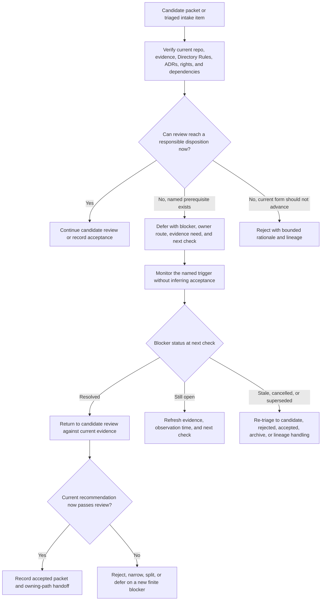

<a id="top"></a>

# Deferred Promotion Packets

`docs/intake/promotions/deferred/` retains human-reviewable promotion packets whose review is paused because a **named, checkable prerequisite** remains unresolved. The lane preserves the proposal, evidence boundary, blocker, responsible review route, next check, re-entry conditions, delivery-state links, correction path, and rollback without turning a temporary hold into acceptance, rejection, source admission, policy, release, or publication authority.

> [!IMPORTANT]
> **Deferral is an intake-packet disposition only.** It does not prove that a recommendation was accepted, that a source was admitted or denied, that policy allowed or prohibited use, that a pull request is blocked, that a release is held, or that KFM has published or rejected a public claim. Those states remain in their separately governed authorities.

## Current profile

| Field | Evidence-backed value |
|---|---|
| Repository path | `docs/intake/promotions/deferred/README.md` — **CONFIRMED** on `main@ce28bd501c593e668461b6ffc66bb1c8ef9d6e91` |
| Prior target blob | `016b5672f47ff12e137e4732bdee7069ba5b789d` |
| Primary responsibility | Explain how documentation-promotion packets are deferred, monitored, corrected, re-entered, rejected, or retained as lineage |
| Authority boundary | Documentation intake only; no contract, schema, policy, source, registry, evidence, receipt, proof, release, lifecycle, or publication authority |
| Placement outcome | `PLACE` — same-path modernization of an existing tracked README under the `docs/` responsibility root |
| Governing placement decision | [ADR-0029](../../../adr/ADR-0029-adopt-directory-governance-standard-v2.md) and the adopted [Directory Rules](../../../doctrine/directory-rules.md) |
| Parent lane contract | [`docs/intake/promotions/README.md`](../README.md) |
| Repository review route | `@bartytime4life` through the default [CODEOWNERS](../../../../.github/CODEOWNERS) rule; routing is not proof of review, approval, stewardship, or separation of duties |
| Exposure | Repository-facing and publicly readable; do not place secrets, private locators, restricted source text, personal data, protected precision, or unsafe blocker detail here |
| Packet inventory at evidence snapshot | Only this README was present — **CONFIRMED** at the snapshot above |
| Last evidence review | 2026-08-12 |

## Quick navigation

- [Scope](#scope)
- [Authority and state separation](#authority-and-state-separation)
- [What belongs here](#what-belongs-here)
- [What does not belong here](#what-does-not-belong-here)
- [Deferral blocker vocabulary](#deferral-blocker-vocabulary)
- [Required deferral record](#required-deferral-record)
- [Review and re-entry workflow](#review-and-re-entry-workflow)
- [Naming and stable identity](#naming-and-stable-identity)
- [Evidence, rights, and sensitive detail](#evidence-rights-and-sensitive-detail)
- [Monitoring, staleness, and closure](#monitoring-staleness-and-closure)
- [Retention, correction, and re-entry](#retention-correction-and-re-entry)
- [Directory map](#directory-map)
- [Validation](#validation)
- [Maintenance checklist](#maintenance-checklist)
- [Rollback](#rollback)
- [Open verification items](#open-verification-items)

## Scope

This lane is for a promotion recommendation that remains potentially admissible, but whose review cannot reach a responsible disposition until a specific prerequisite is satisfied. A deferred record should make eight things inspectable:

1. what proposal is being reviewed;
2. which current evidence and repository state were actually inspected;
3. which exact prerequisite blocks meaningful review;
4. which owner, reviewer class, source authority, dependency, or external decision can resolve it;
5. what evidence or event will establish resolution;
6. when or under what condition the next check occurs;
7. which packet state should be reconsidered after resolution; and
8. how the deferral can be corrected, superseded, rejected, archived, or rolled back.

A deferral is not a parking lot. Phrases such as “later,” “needs more thought,” “not a priority,” “waiting for resources,” or “blocked” are insufficient unless the packet also names the checkable condition, responsible route, expected evidence, and next review trigger.

Use [`../rejected/`](../rejected/README.md) when the proposal **as currently framed** should not advance because it is duplicate, unsupported, unsafe, authority-colliding, obsolete, incoherent, or outside the admitted scope. Use [`../candidates/`](../candidates/README.md) when active review can proceed with the evidence already available. Use [`../accepted/`](../accepted/README.md) when the recommendation itself has been accepted, even if later implementation is waiting on scheduling, an engineering dependency, or a separate release decision.

> [!NOTE]
> An accepted recommendation with blocked implementation normally remains `accepted`; its implementation status belongs in the owning issue, branch, pull request, project, or implementation record. Use `deferred` only when the **packet review or recommendation** itself cannot responsibly proceed.

## Authority and state separation

KFM uses independent state machines. Every deferred record must keep them separate.

| Decision axis | Example state | What a deferred packet proves |
|---|---|---|
| Intake packet review | `deferred` | Review of the submitted promotion recommendation is paused on a named prerequisite |
| Blocker observation | open, resolved, stale, cancelled | Only the blocker status explicitly supported by dated evidence; these are lane authoring terms unless a machine registry is separately adopted |
| Canonicalization or adoption | proposed document, accepted ADR, adopted doctrine, verified owning artifact | Nothing by itself; a deferred packet neither adopts nor rejects an authority-bearing destination |
| Repository delivery | no branch, draft PR, ready PR, closed PR, merged commit | Only the separately verified delivery state and observation time |
| Source admission and evidence | admitted, context-only, quarantined, denied, unresolved | Nothing unless the governing source or evidence authority separately records it |
| Policy and sensitivity | allow, restrict, redact, generalize, abstain, deny | Nothing unless a real policy decision exists in the policy authority |
| KFM release and publication | candidate, held, released, corrected, withdrawn, rolled back | Nothing; packet deferral is not release, correction, rollback, or publication state |

> [!CAUTION]
> Resolving a blocker does **not** automatically accept a packet. It normally returns the recommendation to `candidate-for-promotion` review, where distinctness, placement, evidence, rights, dependency closure, validation, and rollback must be checked again against current repository state.

Do not use `PolicyDecision`, `PromotionDecision`, `PromotionReceipt`, `ReleaseManifest`, `DENY`, or `PUBLISHED` as decorative synonyms for a deferred packet. Use those names only when the separately governed object actually exists and is cited.

## What belongs here

A packet belongs in `deferred/` only when its current recommendation remains reviewable in principle and at least one finite blocker is supported:

- an official source, current evidence snapshot, source-native identifier, or authoritative correction is still required;
- current repository, branch, issue, pull-request, workflow, ruleset, runtime, or artifact state must be inspected before the recommendation can be evaluated honestly;
- an owner, affected responsibility-root reviewer, independent reviewer, domain specialist, legal/privacy reviewer, sovereignty or cultural reviewer, security reviewer, or release reviewer must provide a decision;
- an accepted ADR, Directory Rules decision, vocabulary crosswalk, migration disposition, or authority clarification is required;
- rights, terms, attribution, redistribution, privacy, sovereignty, ecological, archaeological, infrastructure, living-person, genomic, land/title, or harmful-precision handling remains unresolved;
- one directly required dependency has a named owner, observable completion condition, and bounded relationship to the packet;
- material sources, doctrine, accepted ADRs, or implementation evidence conflict and a named authority must resolve the conflict;
- a fixture, validator, benchmark, replay, negative test, rollback drill, or other measured result is necessary to determine supportability;
- an external agency decision, publication, application window, standards decision, or scheduled review has an identifiable event and next-check condition;
- the proposal needs a bounded scope or ownership decision that can be answered without redesigning the packet from scratch.

Scheduling alone is not normally a deferral reason. A campaign sequence or capacity hold is appropriate here only when it is tied to a named review checkpoint, does not hide a safety or authority failure, and preserves a concrete re-entry trigger. Otherwise retain the item in the intake register or implementation backlog rather than creating a promotion packet solely to wait.

## What does not belong here

| Material or condition | Correct handling |
|---|---|
| An active packet whose review can continue with current evidence | [`../candidates/`](../candidates/README.md) |
| A recommendation already accepted but waiting for implementation | [`../accepted/`](../accepted/README.md) plus the owning implementation tracker |
| A proposal that should not advance in its current form | [`../rejected/`](../rejected/README.md) |
| A vague someday item with no owner, evidence need, next check, or exit condition | Parent intake register, exploratory retention, or rejection after review |
| Raw source payloads, snapshots, scraped content, binaries, private attachments, or evidence bytes | Governed source/data lifecycle; do not copy them into documentation intake |
| A source-admission, source-health, evidence-resolution, policy, or release decision | Its verified source, evidence, policy, review, accountability, or release authority |
| A pull request with failing or pending checks but no packet-review disposition | Preserve the GitHub delivery/check state; do not infer packet deferral |
| A policy restriction, redaction, generalization, abstention, or denial | `policy/` plus its accepted decision and review records |
| Release, correction, withdrawal, rollback, or cache-invalidation records | `release/` and accepted release/data accountability homes |
| A secret, credential, signed URL, private locator, protected coordinate, personal record, or unsafe blocker rationale | Redact, generalize, quarantine, stage, or route through approved restricted review |
| Arbitrary obsolete documentation with no promotion-packet identity | Verified archive, deprecation, supersession, or migration handling |
| An implementation TODO that does not evaluate a promotion recommendation | Owning issue, project, runbook, backlog, or code-adjacent documentation |

A deferred packet may link to a separate source, issue, branch, pull request, workflow run, ADR, validation report, or restricted review record. It must not duplicate those authority-bearing objects or copy protected content into this public documentation lane.

## Deferral blocker vocabulary

The labels below are a **human authoring vocabulary for this lane**, not a machine schema, policy code set, service-level agreement, or automatic routing engine. Use one primary blocker and as few secondary blockers as needed.

| Authoring label | Use when | Evidence required for re-entry |
|---|---|---|
| `OFFICIAL_EVIDENCE_REQUIRED` | A material claim needs an authoritative source, correction, identifier, snapshot, or source-native status | Dated source evidence or an explicit official unresolved state |
| `CURRENT_REPOSITORY_STATE_REQUIRED` | Current bytes, issues, branches, PRs, checks, settings, artifacts, or runtime behavior must be verified | Commit-pinned repository or platform evidence with observation time |
| `OWNER_OR_SPECIALIST_REVIEW_REQUIRED` | A verified owner or specialist class must decide a bounded question | Recorded review disposition from the applicable route |
| `DIRECTORY_AUTHORITY_OR_ADR_REQUIRED` | Placement, ownership, compatibility, migration, or authority needs an accepted decision | Accepted ADR, adopted rule, or verified path decision |
| `RIGHTS_TERMS_OR_SENSITIVITY_REQUIRED` | Rights, terms, privacy, sovereignty, cultural, ecological, archaeological, infrastructure, genomic, land/title, or precision risk is unresolved | Public-safe review result and required obligations or transform |
| `DEPENDENCY_OR_SEQUENCE_BLOCKED` | A direct prerequisite has a known owner and observable completion condition | Verified dependency completion or an accepted split that removes it |
| `CONFLICT_RESOLUTION_REQUIRED` | Material evidence or authorities conflict and cannot be reconciled by the packet author | Decision or correction from the authority that controls the disputed question |
| `VALIDATION_OR_FIXTURE_REQUIRED` | A test, fixture, benchmark, replay, negative case, or rollback drill is needed to evaluate the proposal | Reproducible result tied to exact candidate bytes or inputs |
| `EXTERNAL_DECISION_OR_WINDOW_PENDING` | A dated external event, publication, agency action, standards decision, or review window controls the next check | Official event outcome or documented continuing uncertainty |
| `SCOPE_BOUNDARY_DECISION_REQUIRED` | A finite scope, owner, geography, time range, object family, or review boundary must be selected | Recorded bounded scope and direct-dependency reassessment |

Do not stack labels to make a vague hold appear specific. The rationale, evidence needed, owner route, next check, and stale condition carry the deferral.

## Required deferral record

The example below is an authoring aid, not a machine schema. Preserve existing packet fields when moving a reviewed candidate, and add only values that are verified or explicitly marked `NEEDS VERIFICATION`.

```yaml
promotion_packet_id: kfm://intake/promotion/<stable-slug>
packet_state: deferred
summary: <the recommendation in one bounded sentence>
source_refs:
  - <repo-relative path, KFM identifier, or bounded source identity>
truth_posture: <CONFIRMED / PROPOSED / UNKNOWN / NEEDS VERIFICATION split>
review_snapshot:
  repository_ref: <commit or branch inspected, or NEEDS VERIFICATION>
  directory_rules: docs/doctrine/directory-rules.md
  applicable_adrs:
    - <accepted ADR or not applicable with reason>
deferral:
  primary_blocker: <one authoring label from this README>
  secondary_blockers: []
  rationale: <specific public-safe explanation>
  opened_at: <decision date or NEEDS VERIFICATION>
  blocker_owner_or_route: <verified owner or reviewer class; do not invent identity>
  evidence_needed:
    - <artifact, decision, review, test, source, or repository observation>
  dependencies:
    - <direct prerequisite or none with reason>
  next_check:
    trigger: <observable event or evidence condition>
    review_on_or_before: <date or NEEDS VERIFICATION with reason>
    stale_when: <condition requiring re-triage>
repository_delivery:
  state: <not started / branch / draft PR / ready PR / closed / merged / NEEDS VERIFICATION>
  refs: []
  observed_at: <timestamp or NEEDS VERIFICATION>
rights_sensitivity_handling: <constraints, restricted review, transform, or not applicable with reason>
re_entry:
  target_state: candidate-for-promotion
  required_evidence:
    - <what must be present before review resumes>
  automatic_transition_allowed: false
retention_and_correction:
  retention: retain blocker history, source lineage, and state transitions
  correction: append or link a correction; do not silently rewrite the hold
residual_unknowns:
  - <concrete remaining verification item>
```

### Minimum narrative requirements

Every retained deferred packet should answer:

- **Proposal:** What outcome remains under consideration?
- **Snapshot:** What evidence and repository state were actually reviewed?
- **Blocker:** Which exact prerequisite prevents responsible review?
- **Owner:** Who or what authority can resolve it?
- **Evidence needed:** What observable result closes or narrows the blocker?
- **Next check:** What event or date triggers re-evaluation?
- **Stale handling:** When must the deferral be re-triaged instead of carried forward?
- **Delivery state:** What issue, branch, PR, or check state is linked, and when was it observed?
- **Re-entry:** Which packet state will be reconsidered, and why is transition not automatic?
- **Correction:** How will an inaccurate or superseded deferral be corrected without erasing history?

## Review and re-entry workflow



The deferred lane does not run the monitor, fetch a live source, change an issue, or transition a packet automatically. It documents the review contract. Any automation requires its own accepted schema, registry, validator, permissions, receipts, tests, and rollback controls.

## Naming and stable identity

Use the parent-lane filename convention:

```text
<topic-or-source-family>.<short-purpose>.promotion.md
```

Rules:

- preserve the filename and `promotion_packet_id` when a reviewed candidate moves into `deferred/`;
- express `packet_state: deferred` inside the packet rather than creating an ungoverned `.deferred` filename dialect;
- keep one current writable packet copy; do not leave divergent copies in `candidates/` and `deferred/`;
- preserve the originating intake record, source map, issue, branch, PR, dependency, decision, and prior packet-state links;
- append or link state-transition evidence rather than rewriting the packet to imply it was always deferred;
- do not reuse an identifier for a materially different recommendation;
- use a new candidate identity when re-entry materially changes the outcome, owner, scope, source basis, or acceptance boundary;
- avoid encoding an arbitrary date in the filename; keep review dates and observation times in the packet.

`README.md` is the lane contract and is not a deferred packet.

## Evidence, rights, and sensitive detail

A deferral record must be useful without becoming an exposure channel.

- Cite current repository bytes, accepted ADRs, validators, tests, workflow evidence, or bounded source references when they support the blocker.
- Distinguish doctrine, current behavior, historical lineage, proposal, inference, and unverified facts.
- For external facts, preserve source identity, publication or observation time, retrieval time, authority, and currentness risk.
- For rights or sensitivity blockers, state the public-safe category and required reviewer class. Do not reproduce restricted terms text, private locators, protected coordinates, personal data, credentials, or harmful operational detail.
- If the complete rationale cannot be public, retain a public-safe summary and point to an approved restricted review route without exposing the restricted locator.
- Avoid accusatory or speculative language about people or organizations. Record the evidence gap, authority question, dependency, or safety condition.
- A deferral caused by missing evidence does not prove the proposed claim or its opposite.
- Repeated mentions, generated summaries, issue activity, test success, or a merged pull request do not substitute for the missing evidence or decision.

## Monitoring, staleness, and closure

Every deferral must have a next-check trigger and a stale condition. The following terms are authoring aids unless a machine registry is separately adopted.

| Blocker observation | Meaning | Required action |
|---|---|---|
| `OPEN` | The named prerequisite remains unresolved and the evidence snapshot is still relevant | Preserve the blocker, observation time, owner route, and next check |
| `RESOLVED` | The required evidence or decision is available | Return to current candidate review; do not auto-accept |
| `STALE` | The next-check condition passed, repository/source state changed materially, or the blocker statement is no longer trustworthy | Re-verify the packet and choose a current disposition |
| `CANCELLED` | The prerequisite or proposal was withdrawn, superseded, split away, or made irrelevant | Link the controlling disposition and retain lineage |

No universal review interval is invented here. Use a source-native event date, dependency milestone, accepted decision checkpoint, repository change trigger, or explicit review date appropriate to the blocker. When no credible trigger exists, the packet is not ready for this lane.

At each next check:

1. re-read the full packet and current source/intake record;
2. re-resolve repository, default branch, exact target bytes, issues, branches, PRs, and related authority surfaces;
3. verify whether the blocker is open, resolved, stale, cancelled, or replaced by a different blocker;
4. re-run distinctness, placement, evidence, rights, dependency, validation, and rollback review;
5. update the observation time, evidence links, and next check;
6. route the packet to candidate, accepted, rejected, archive, or lineage handling as supported.

A packet that repeats the same vague or unresolvable blocker without a credible owner or evidence path should not remain indefinitely deferred. Re-triage it to rejected, exploratory, archived, or lineage-only handling with a bounded reason.

## Retention, correction, and re-entry

### Retention

Deferred packets are retained because they explain why KFM paused a recommendation and help prevent repeated, contradictory, or premature work. Normal cleanup must not delete the blocker history merely because the packet is old or the decision is inconvenient.

Moving a deferred packet to a verified archive or retiring it requires:

- exact packet identity;
- inbound and outbound link review;
- preserved source, blocker, review, and transition lineage;
- a migration, supersession, or retirement note;
- a Git-recoverable rollback path; and
- confirmation that no active review or implementation process still depends on it.

### Correction

When a deferral contains a factual error, unsafe detail, broken link, stale repository claim, wrong blocker, or overclaim:

1. correct the defect through a reviewed change;
2. preserve the packet identity and original deferral date;
3. add a correction or supersession note explaining what changed;
4. update the observation time and current next check;
5. link any replacement candidate, accepted destination, rejection, archive record, issue, branch, or PR; and
6. do not rewrite history to imply the original review reached a different state.

Security, privacy, rights, or harmful-precision incidents may require immediate redaction. Preserve a bounded incident or correction record without retaining unsafe payloads in Git.

### Re-entry

Re-entry requires evidence that addresses the named blocker, such as:

- an official source snapshot or correction;
- commit-pinned repository, workflow, artifact, or runtime evidence;
- a completed specialist review;
- an accepted ADR or verified path decision;
- verified rights, terms, attribution, sensitivity handling, or public-safe transform;
- completion or accepted removal of a direct dependency;
- a reproducible fixture, validator, benchmark, replay, or rollback result;
- a resolved source or authority conflict; or
- a bounded scope decision.

Re-entry normally creates or restores a `candidate-for-promotion` review. The reviewer must cite the deferred predecessor, explain the material change, and inspect current evidence. A resolved blocker does not carry forward prior assumptions, approve the target path, or authorize implementation, merge, release, deployment, source activation, publication, or repository settings changes.

## Directory map

The current direct-child structure is **CONFIRMED** at the evidence snapshot:

```text
docs/intake/promotions/
├── README.md
├── candidates/
│   └── README.md
├── accepted/
│   └── README.md
├── deferred/
│   └── README.md
└── rejected/
    └── README.md
```

Only this README was present in `deferred/` at the snapshot. Do not add another child directory for blocker type, source family, domain, owner, or review year. Those are packet fields or relations, not new responsibility roots.

A machine packet index, deferral-reason registry, scheduler, watcher, or review queue would have a different responsibility and must not be created under this documentation lane without an accepted authority and dependency-closed implementation decision.

## Validation

Validation provides evidence about the Markdown change and its repository relationships; it does not prove that a packet should remain deferred, that a blocker is true, or that any source, policy, implementation, release, or public claim is authorized.

For changes to this README or a deferred packet, use the smallest repository-native set that covers the delta:

- full-file and full-diff review, with the existing H1 meaning, filename convention, stable packet identity, and known inbound anchors preserved;
- one H1, logical heading order, balanced and language-tagged fences, valid tables, supported GitHub alerts, and parseable Mermaid where used;
- local heading-fragment and repository-relative link checks, including parent and sibling lane links;
- `KFM_META_BLOCK_V2` validation when a changed document already carries a block or the verified profile later requires one;
- document-graph and stale-reference checks when navigation, identity, status, dates, related paths, or authority claims change;
- public-safe review for secrets, private locators, personal data, restricted terms, protected precision, and unsafe rationale;
- workflow-trigger preflight to exclude automatic release, deployment, publication, elevated secret exposure, or other out-of-scope effects;
- remote branch, commit, file bytes, diff, and pull-request-state read-back for claimed delivery.

Relevant changed-area workflows may include `link-check`, `docs-meta-block`, `docs-document-graph`, and `docs-stale-scan` when their path filters match. Historical warnings or inherited failures outside the changed area must be classified separately from introduced defects.

A parser pass, green workflow, moved packet, closed issue, or merged PR does not resolve the blocker or accept the recommendation.

## Maintenance checklist

Before placing or updating a deferred packet:

- [ ] The full current packet and its originating source or intake record were read.
- [ ] The repository, immutable base, exact target, and current target blob were verified.
- [ ] Open issues, branches, PRs, packets, and adjacent canonical surfaces were checked for overlap.
- [ ] The recommendation remains potentially admissible; otherwise it was routed to rejection or lineage handling.
- [ ] One primary blocker is named using bounded prose, with secondary blockers kept minimal.
- [ ] The evidence needed, responsible owner or review route, direct dependencies, and next check are explicit.
- [ ] A stale condition and re-triage path are recorded.
- [ ] The packet separates intake, blocker, adoption, delivery, source/evidence, policy, release, and publication states.
- [ ] Current delivery and check states include an observation time and are not treated as permanent facts.
- [ ] Rights, sensitivity, privacy, sovereignty, cultural, ecological, archaeological, infrastructure, living-person, genomic, land/title, and harmful-precision concerns are addressed.
- [ ] The packet keeps one writable copy and preserves predecessor, issue, branch, PR, dependency, and decision links.
- [ ] Re-entry targets candidate review and explicitly forbids automatic acceptance.
- [ ] Before-merge abandonment and after-merge revert or forward-fix paths are recorded.
- [ ] No merge, source activation, policy outcome, release, deployment, promotion, publication, or settings change is implied.

Re-review this README when:

- the parent promotion-lane contract, canonicalization guidance, packet-state vocabulary, or CODEOWNERS route changes;
- adopted Directory Rules, ADR-0029, or another placement decision changes;
- a machine packet index, blocker registry, scheduler, review queue, or required packet schema is proposed;
- validation workflows, document-registry requirements, or metadata profiles change materially;
- the first real deferred packet enters, exits, is corrected, is archived, or exposes a recurring blocker;
- a deferral remains open past its next check or repeatedly becomes stale;
- rights, sensitivity, repository-control, release, or rollback findings show that this lane's public documentation is insufficient.

## Rollback

Rollback preserves evidence and history while restoring the correct intake and authority boundary.

### Before merge

- Close or abandon the unmerged draft pull request and branch through separately authorized repository operations.
- Keep any existing packet in its prior lane unless a reviewed state transition is separately included.
- Do not delete branches, packets, comments, source maps, or blocker evidence merely to erase review history.

### After an authorized merge

- Revert or forward-fix the exact merged documentation commit through a new reviewed pull request; never rewrite shared history.
- Restore broken links, stable anchors, one-writable-copy discipline, and parent/sibling navigation.
- If the guidance caused a packet to be misclassified, correct that packet and its intake, issue, branch, or pull-request links through a separate reviewed change.
- Preserve correction and supersession lineage rather than silently restoring an older narrative.
- A Git revert does not alter source-admission, policy, release, deployment, publication, cache, map, search, or AI state; correct those surfaces separately only when they were actually affected by an authorized downstream transition.

Rollback triggers include wrong placement, loss of blocker history, duplicate writable packets, unsupported current-state claims, unsafe rationale, missing re-entry conditions, indefinite parking-lot behavior, authority collision, or wording that collapses packet deferral into policy, repository, release, or publication state.

## Open verification items

- [ ] Reconcile the parent [`../../README.md`](../../README.md), which still contains stale repository-presence and ownership claims.
- [ ] Replace or formally adopt the placeholder [`../../triage-rules.md`](../../triage-rules.md) and [`../../promotion-criteria.md`](../../promotion-criteria.md) content through a separately scoped review.
- [ ] Decide whether `candidate-for-promotion` and the canonicalization policy's `candidate-canonical` are intentional distinct terms or require a governed vocabulary crosswalk.
- [ ] Confirm an independent documentation/intake stewardship assignment beyond the verified GitHub review route.
- [ ] Confirm whether every promotion packet will require `KFM_META_BLOCK_V2` or continue the current changed-file `present` profile.
- [ ] Confirm whether the lane needs a machine packet index, blocker vocabulary registry, required packet schema, or validator; do not create one from this README alone.
- [ ] Adopt or explicitly decline a default review-cadence and stale-escalation profile for deferred packets.
- [ ] Confirm which hosted documentation checks are required for this path and whether their current-main or exact-head results establish a clean baseline.

---

`docs/intake/promotions/deferred/` makes the blocker, evidence need, next check, re-entry, correction, and lineage inspectable. Acceptance, implementation, source admission, policy, release, and public truth remain separate governed decisions.

[Back to top](#top)
