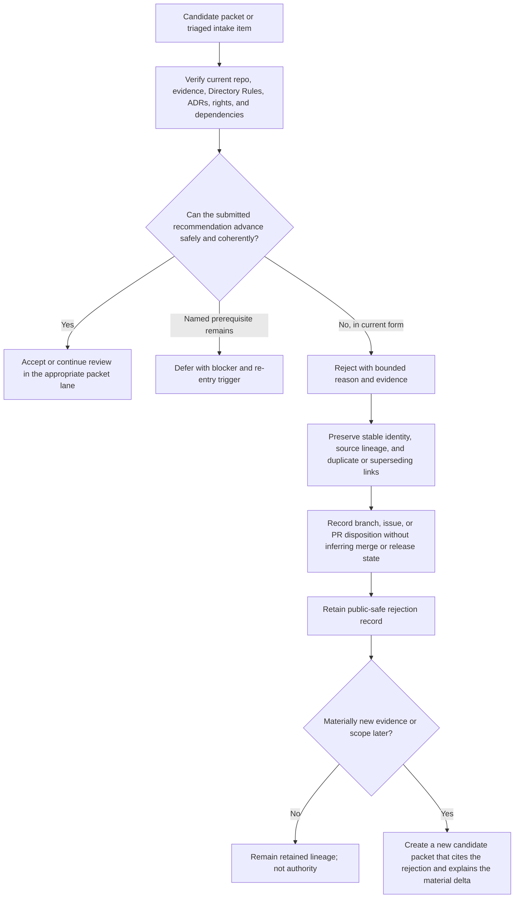

<a id="top"></a>

# Rejected Promotion Packets

`docs/intake/promotions/rejected/` retains human-reviewable records for promotion recommendations that KFM reviewed and chose **not** to advance in their submitted form. The lane preserves the proposal, evidence boundary, review rationale, duplicate or superseding links, correction path, and possible re-entry conditions without converting rejection into hidden deletion or a stronger authority claim.

> [!IMPORTANT]
> **Rejection is an intake-packet disposition only.** It is not proof that a source is false, not a `PolicyDecision`, not a source-admission denial, not a release decision, not a repository merge decision, and not KFM publication. Those decisions remain in their separately governed authorities.

## Current profile

| Field | Evidence-backed value |
|---|---|
| Repository path | `docs/intake/promotions/rejected/README.md` — **CONFIRMED** on `main@ac22f22911a85d980fdd755acd70efb301b3c08b` |
| Prior target blob | `fd1687f45b6a6caac5667616635e01b960ee7a58` |
| Primary responsibility | Explain how rejected documentation-promotion packets are classified, retained, corrected, linked, and reconsidered |
| Authority boundary | Documentation intake only; no contract, schema, policy, source, registry, evidence, receipt, proof, release, or publication authority |
| Placement outcome | `PLACE` — same-path modernization of an existing tracked README under the `docs/` responsibility root |
| Governing placement decision | [ADR-0029](../../../adr/ADR-0029-adopt-directory-governance-standard-v2.md) and the adopted [Directory Rules](../../../doctrine/directory-rules.md) |
| Parent lane contract | [`docs/intake/promotions/README.md`](../README.md) |
| Repository review route | `@bartytime4life` through the default [CODEOWNERS](../../../../.github/CODEOWNERS) rule; routing is not proof of review, approval, stewardship, or separation of duties |
| Exposure | Repository-facing and publicly readable; do not place secrets, private locators, restricted source text, personal data, protected precision, or unsafe rejection detail here |
| Packet inventory at evidence snapshot | Only this README was present — **CONFIRMED** at the snapshot above |
| Last evidence review | 2026-08-12 |

## Quick navigation

- [Scope](#scope)
- [Authority and state separation](#authority-and-state-separation)
- [What belongs here](#what-belongs-here)
- [What does not belong here](#what-does-not-belong-here)
- [Rejection reason vocabulary](#rejection-reason-vocabulary)
- [Required rejection record](#required-rejection-record)
- [Review and routing workflow](#review-and-routing-workflow)
- [Naming and stable identity](#naming-and-stable-identity)
- [Evidence, rights, and sensitive detail](#evidence-rights-and-sensitive-detail)
- [Retention, correction, and re-entry](#retention-correction-and-re-entry)
- [Directory map](#directory-map)
- [Validation](#validation)
- [Maintenance checklist](#maintenance-checklist)
- [Rollback](#rollback)
- [Open verification items](#open-verification-items)

## Scope

This lane is for promotion packets whose current recommendation should not proceed to an owning authority path. A rejection record should make five things inspectable:

1. what proposal was reviewed;
2. which evidence, repository state, Directory Rules, ADRs, or safety constraints were considered;
3. why the proposal should not advance in its submitted form;
4. which existing work, authority, or superseding artifact resolves or conflicts with it; and
5. what materially different evidence or scope could justify a later review.

The normal disposition is durable retention, not silent deletion. A rejected packet remains lineage and review evidence, but it does not become canon and must not be cited as implementation, source authority, policy, release state, or public truth.

Use [`../deferred/`](../deferred/README.md) instead when a named prerequisite is unresolved and the same proposal is expected to resume after that prerequisite is satisfied. Use this rejected lane when the proposal **as currently framed** should not advance because it is duplicate, unsupported, unsafe, authority-colliding, incoherent, obsolete, or outside the admitted scope.

## Authority and state separation

KFM uses several independent decision axes. Keep them distinct in every rejection record.

| Decision axis | Example state | What a rejected packet proves |
|---|---|---|
| Intake packet review | `rejected` | The submitted documentation-promotion recommendation was reviewed and should not advance in its current form |
| Canonicalization or adoption | proposed, accepted ADR, adopted doctrine, verified owning artifact | Nothing by itself; no authority-bearing destination is adopted merely because a packet is rejected |
| Repository delivery | branch abandoned, draft PR closed, PR superseded, no implementation started | Only the delivery state that is explicitly linked and verified |
| Source admission and evidence | admitted, context-only, quarantined, denied, unresolved | Nothing unless the governing source/evidence authority separately records it |
| Policy and sensitivity | allow, restrict, redact, generalize, abstain, deny | Nothing unless a real policy decision exists in the policy authority |
| KFM release and publication | candidate, held, released, corrected, withdrawn, rolled back | Nothing; packet rejection is not release or publication state |

> [!CAUTION]
> Do not use `DENY`, `PolicyDecision`, `PromotionDecision`, `PromotionReceipt`, or `ReleaseManifest` as decorative labels for a rejected intake packet. Use those names only when the separately governed object actually exists and is cited.

## What belongs here

A packet belongs in `rejected/` when its review record is useful and one or more of the following is supported:

- the proposal duplicates existing canonical work, an active issue, an open branch, a pull request, another packet, or an implemented surface;
- material claims lack sufficient evidence or cannot be bounded honestly;
- the proposed path would create a parallel authority or contradict adopted Directory Rules or an accepted ADR;
- rights, privacy, sovereignty, cultural, ecological, archaeological, infrastructure, living-person, genomic, land/title, or harmful-precision concerns make the submitted design unsafe;
- no coherent primary owner, acceptance boundary, dependency closure, validation story, or rollback path can be identified;
- the proposal is outside current KFM scope or would broaden the requested change without authority;
- the proposal relies on an unsafe public path, direct model access, canonical-store exposure, watcher-to-publication behavior, or another trust-membrane bypass;
- the recommendation is obsolete or has been superseded by stronger evidence or a later accepted decision;
- a conflict is real and the submitted packet does not provide a reviewable resolution path.

A record may be created directly from triage when retaining the rationale has lasting value. Do not create a promotion packet merely to reject low-value noise; a concise status and backlink in the verified intake register may be sufficient.

## What does not belong here

| Material or condition | Correct handling |
|---|---|
| A proposal waiting on a specific, realistically resolvable prerequisite | [`../deferred/`](../deferred/README.md) |
| An accepted recommendation whose implementation has not started or completed | [`../accepted/`](../accepted/README.md), with implementation status kept separate |
| An active recommendation still under review | [`../candidates/`](../candidates/README.md) |
| Raw source payloads, scraped content, binaries, private attachments, or evidence bytes | Governed source/data lifecycle; do not copy them into documentation intake |
| A source-admission denial, source-health result, or evidence-resolution result | The verified source, evidence, policy, and accountability authorities |
| A policy restriction, redaction, generalization, abstention, or denial | `policy/` plus its accepted decision and review records |
| A closed or unmerged pull request with no packet-review decision | Preserve the GitHub delivery state; do not infer rejection |
| Release, correction, withdrawal, or rollback records | `release/` and the accepted release/data accountability homes |
| Arbitrary obsolete documentation with no promotion-packet identity | A verified archive, deprecation, supersession, or migration lane |
| Sensitive rationale that would itself expose protected information | Record a public-safe reason and a restricted locator or steward route; do not disclose the payload |

## Rejection reason vocabulary

The labels below are a **human authoring vocabulary for this lane**, not a machine schema or policy code set. Use one primary reason and as few secondary reasons as needed.

| Authoring label | Use when | Minimum retained evidence |
|---|---|---|
| `DUPLICATE_OR_PARALLEL_WORK` | The same outcome already has a canonical artifact, active issue, branch, PR, or packet | Exact link or identifier and a short comparison |
| `EVIDENCE_INSUFFICIENT` | Material claims cannot be supported or bounded well enough to act | Missing evidence classes, failed resolution, or explicit uncertainty |
| `AUTHORITY_OR_PATH_COLLISION` | The proposal would create a second writable authority or violate adopted placement | Governing Directory Rules or ADR reference and conflicting surface |
| `RIGHTS_OR_SENSITIVITY_UNRESOLVED` | The submitted form cannot safely handle rights, privacy, sovereignty, cultural, ecological, archaeological, infrastructure, genomic, or precision risk | Public-safe risk statement and required specialist review or evidence |
| `OUT_OF_SCOPE` | The proposal exceeds current KFM, campaign, domain, or review scope | Scope boundary and the narrower admissible alternative, if any |
| `NO_COHERENT_OWNER_OR_BOUNDARY` | No single primary responsibility owner or observable acceptance boundary exists | Ownership/boundary gap and split or narrowing attempt |
| `DEPENDENCY_CLOSURE_INCOMPLETE` | Directly required docs, contracts, schemas, policy, fixtures, tests, validators, config, workflows, or migration support are missing | Named missing dependency set |
| `VALIDATION_OR_ROLLBACK_INADEQUATE` | The result cannot be validated, corrected, abandoned, reverted, or forward-fixed credibly | Missing checks, failure modes, or rollback requirements |
| `TRUST_MEMBRANE_VIOLATION` | The proposal bypasses governed APIs, evidence resolution, policy, review, release, or publication controls | Exact violated invariant and safe alternative |
| `CONFLICT_UNRESOLVED` | Material sources, doctrine, ADRs, or current implementation conflict and the packet does not resolve them | Both sides of the conflict and the authority needed to decide |
| `SUPERSEDED_OR_OBSOLETE` | A later artifact, decision, source, or implementation makes the recommendation unnecessary or stale | Superseding identifier and effective boundary |

Do not stack reason labels to make a weak rationale look complete. The prose explanation and evidence links carry the decision.

## Required rejection record

The example below is an authoring aid, not a machine schema. Preserve existing packet fields when moving a reviewed candidate, and add only values that are verified or explicitly marked `NEEDS VERIFICATION`.

```yaml
promotion_packet_id: kfm://intake/promotion/<stable-slug>
packet_state: rejected
summary: <the submitted recommendation in one bounded sentence>
source_refs:
  - <repo-relative path, KFM identifier, or bounded source identity>
truth_posture: <CONFIRMED / PROPOSED / UNKNOWN / NEEDS VERIFICATION split>
review_snapshot:
  repository_ref: <commit or branch inspected, or NEEDS VERIFICATION>
  directory_rules: docs/doctrine/directory-rules.md
  applicable_adrs:
    - <accepted ADR or not applicable with reason>
rejection:
  primary_reason: <one authoring label from this README>
  secondary_reasons: []
  rationale: <specific, public-safe explanation>
  evidence_refs:
    - <file, issue, PR, test, log, artifact, or bounded source locator>
  reviewed_at: <decision date or NEEDS VERIFICATION>
  review_route: <verified GitHub owner or reviewer class; do not invent identity>
duplicate_or_superseding_refs:
  - <canonical artifact, issue, branch, PR, packet, or decision>
rights_sensitivity_handling: <constraints, redaction, restricted review, or not applicable with reason>
implementation_or_pr_disposition: <not started / abandoned / closed / superseded / NEEDS VERIFICATION>
re_entry:
  allowed_when:
    - <materially new evidence, narrower scope, accepted decision, or resolved control>
  predecessor_link_required: true
retention_and_correction:
  retention: retain rejection rationale and source lineage
  correction: append or link a correction; do not silently rewrite the decision
residual_unknowns:
  - <concrete remaining verification item>
```

### Minimum narrative requirements

Every retained rejected packet should answer:

- **Proposal:** What outcome was requested?
- **Evidence:** What evidence and repository state were actually reviewed?
- **Reason:** Why should the submitted form not advance?
- **Relationship:** Is it duplicate, conflicting, superseded, unsafe, or merely outside scope?
- **Disposition:** Was related branch, issue, or PR work abandoned, closed, redirected, or never started?
- **Re-entry:** What must materially change before another review?
- **Correction:** How will an inaccurate or later-superseded rejection be corrected without erasing history?

## Review and routing workflow



A reviewer should not reject a packet solely because implementation is difficult. The reason must connect to evidence, scope, authority, safety, dependency closure, validation, or rollback.

## Naming and stable identity

Use the parent-lane filename convention:

```text
<topic-or-source-family>.<short-purpose>.promotion.md
```

Rules:

- preserve the filename and `promotion_packet_id` when a reviewed candidate is moved into `rejected/`;
- express `packet_state: rejected` inside the packet rather than creating an ungoverned `.rejected` filename dialect;
- keep one current writable packet copy; do not leave divergent copies in `candidates/` and `rejected/`;
- preserve links to the originating intake record, source map, issue, branch, PR, duplicate, or superseding artifact;
- give a later reconsideration its own candidate record or clearly versioned review attempt, and link it back to the retained rejection;
- do not reuse an identifier for a materially different proposal.

`README.md` is the lane contract and is not a rejected packet.

## Evidence, rights, and sensitive detail

A rejection record must be useful without becoming an exposure channel.

- Cite current repository bytes, accepted ADRs, validators, tests, workflow evidence, or bounded source references when they support the rationale.
- Distinguish current behavior from doctrine, historical lineage, proposal, and inference.
- For duplicate work, link the exact existing artifact and describe the overlap rather than asserting duplication from memory.
- For rights or sensitivity concerns, state the public-safe category and required review. Do not reproduce restricted text, private locators, protected coordinates, personal data, credentials, or harmful operational detail.
- Avoid accusatory or speculative language about people or organizations. Record the proposal defect, evidence gap, authority conflict, or safety condition.
- If the complete rationale cannot be public, retain a public-safe summary and point to an approved restricted review route without exposing the restricted locator.
- A rejection caused by insufficient evidence does not prove the opposite claim.

## Retention, correction, and re-entry

### Retention

Rejected packets are retained because they explain why KFM did **not** advance a recommendation and help prevent repeated duplicate or unsafe proposals. Normal cleanup must not delete the rationale merely because the decision is inconvenient or old.

A move to a verified archive or a later retirement requires:

- exact packet identity;
- inbound and outbound link review;
- preserved source and decision lineage;
- a migration, supersession, or retirement note;
- a Git-recoverable rollback path; and
- confirmation that no active review process still depends on the packet.

### Correction

When a rejection contains a factual error, unsafe detail, broken link, or overclaim:

1. correct the defect through a reviewed change;
2. preserve the original decision date and identity;
3. add a correction or supersession note explaining what changed;
4. link any replacement candidate or accepted destination; and
5. do not rewrite history to imply the original review reached a different outcome.

Security, privacy, rights, or harmful-precision incidents may require immediate redaction. Preserve a bounded incident/correction record without retaining the unsafe payload in Git.

### Re-entry

Re-entry requires a **material delta**, such as:

- newly resolved evidence;
- a narrower and dependency-closed scope;
- an accepted ADR or verified owning path;
- verified rights or sensitivity handling;
- removal of an authority collision;
- a credible validation and rollback plan;
- a changed current implementation that removes the original conflict; or
- proof that the duplicate or superseding work no longer covers the outcome.

Create or restore review in [`../candidates/`](../candidates/README.md) only through an explicit new candidate record that cites this retained rejection and explains the material delta. Repetition, urgency, or more persuasive prose is not a material delta.

## Directory map

```text
docs/intake/promotions/
├── README.md
├── candidates/
│   └── README.md
├── accepted/
│   └── README.md
├── deferred/
│   └── README.md
└── rejected/
    ├── README.md
    └── <topic-or-source-family>.<short-purpose>.promotion.md
```

**CONFIRMED at the evidence snapshot:** `rejected/` contained only this README. The packet example above does not claim that any rejected packet currently exists.

## Validation

Validation should be proportional to the changed Markdown and any packet records included in the same review boundary.

### Documentation checks

- UTF-8, final newline, one H1, valid heading order, balanced fenced blocks, and valid tables;
- GitHub Flavored Markdown structure, supported alert vocabulary, and stable local anchors;
- repo-relative links, path case, and fragment targets;
- no trailing whitespace, tabs, unresolved template debris, or accidental generated/mirror edits;
- bounded secret, private-locator, personal-data, rights, and protected-precision review;
- `KFM_META_BLOCK_V2` validation when a packet already has a block or the lane later adopts a required profile;
- documentation graph and stale-reference checks where triggered.

### Rejection-record checks

- `packet_state` is `rejected`;
- one primary reason and a specific evidence-backed rationale are present;
- source, duplicate, conflict, superseding, and related-work links resolve where accessible;
- the decision does not masquerade as policy, source admission, release, publication, or implementation proof;
- a public-safe rights/sensitivity posture is stated;
- branch, issue, or PR disposition is verified rather than inferred;
- re-entry conditions require a material delta;
- correction and retention paths are explicit;
- no divergent writable packet copy remains in another promotion-state directory.

Expected changed-area hosted checks include `link-check`, `docs-meta-block`, `docs-document-graph`, and `docs-stale-scan` when their workflow scopes match the change. A green documentation check is QA evidence only; it does not approve the rejection, merge a PR, release an artifact, or publish a claim.

## Maintenance checklist

Review this README and retained packet records when:

- the parent promotion-lane contract changes;
- packet state names, filename grammar, or metadata expectations change;
- Directory Rules or a governing ADR changes;
- a machine packet index, rejection-reason registry, or reviewer-assignment mechanism is adopted;
- CODEOWNERS or independent stewardship changes;
- a rejected proposal re-enters review;
- a duplicate, conflict, or superseding link changes state;
- rights, sensitivity, correction, archive, or retention handling changes;
- documentation validation coverage changes materially.

For each maintenance change:

1. inspect current repository bytes and applicable accepted decisions;
2. preserve packet identity and decision lineage;
3. update links, reasons, re-entry conditions, and correction notes together;
4. run the smallest strong changed-area validation;
5. verify remote branch bytes and PR state after delivery; and
6. keep merge, release, deployment, promotion, publication, and settings changes outside this lane's authority.

## Rollback

### Before merge

Close or abandon the draft pull request and delete the task branch through the normal repository process. The base file remains unchanged.

### After an authorized merge

Revert the exact documentation commit or open a forward-fix pull request. Preserve any rejection records created after the merge; do not erase later review history merely to restore an older README edition.

No source activation, lifecycle data migration, contract/schema/policy change, runtime rollback, release withdrawal, cache invalidation, deployment action, or public-artifact correction is implied by reverting this README alone.

## Open verification items

- **NEEDS VERIFICATION:** whether KFM will adopt a machine-readable promotion-packet and rejection-reason registry; this README does not create one.
- **NEEDS VERIFICATION:** independent documentation/intake stewardship and reviewer separation beyond the current CODEOWNERS route.
- **NEEDS VERIFICATION:** whether this lane will later require `KFM_META_BLOCK_V2` on every packet rather than validate blocks only when present.
- **NEEDS VERIFICATION:** the governed crosswalk between `candidate-for-promotion`, `candidate-canonical`, and any future packet-state vocabulary.
- **NEEDS VERIFICATION:** whether rejected packet retention will remain entirely in this lane or later gain an accepted archive/retirement profile.
- **CONFIRMED inherited documentation debt:** [`../../triage-rules.md`](../../triage-rules.md) and [`../../promotion-criteria.md`](../../promotion-criteria.md) remain placeholder scaffolds.
- **CONFIRMED inherited documentation drift:** [`../../README.md`](../../README.md) still contains stale repository-presence and ownership claims that require a separately scoped modernization.
- **NEEDS VERIFICATION:** exhaustive external consumers and historical inbound links before any future packet or lane migration.

## Status

**CONFIRMED:** same-path documentation-lane modernization; current target and empty packet inventory at the pinned evidence snapshot; adopted Directory Rules and ADR-0029 placement basis; current CODEOWNERS review route.

**PROPOSED:** the bounded human rejection-reason vocabulary and authoring record above, pending actual packet use and any later machine-contract decision.

**UNKNOWN / NEEDS VERIFICATION:** future packet inventory, independent stewardship, machine indexing, required metadata profile, and any structural migration.

[Back to top](#top)
