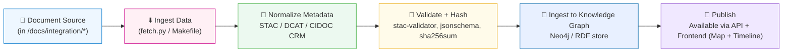

<div align="center">

# 🔗 Kansas Frontier Matrix — Integration Documentation

`docs/integration/README.md`

**Mission:** Provide authoritative, reproducible documentation for how
**external datasets, archives, and APIs** are integrated into the
**Kansas Frontier Matrix (KFM)** — ensuring provenance, semantic interoperability,
and reproducibility across every domain.

[](../../.github/workflows/site.yml)
[](../)
[](../../.github/workflows/stac-validate.yml)
[](metadata-standards.md)
[](../../docs/standards/documentation.md)

</div>

---

## 🎯 Purpose

The `/docs/integration/` directory defines **how every external source**
— from **historical archives** to **live APIs** — connects into the KFM ecosystem.
Each integration document provides a reproducible mapping between **data origins** and **knowledge graph entities**,
capturing exactly **how Kansas’s fragmented historical, cultural, and environmental data**
becomes an interoperable part of the Frontier Matrix.

This directory covers:

* 🌐 **External Data Ingestion** — archives, web APIs, and public GIS data.
* 🧩 **Metadata Alignment** — mappings to **STAC**, **DCAT**, **CIDOC CRM**, and **OWL-Time**.
* 🔄 **Cross-Domain Linking** — connecting natural and cultural datasets semantically.
* 🔗 **Dataset-to-Graph Mapping** — linking entities into **Neo4j** or RDF stores.
* 🧮 **Validation & Provenance** — ensuring datasets are verifiable, licensed, and auditable.

---

## 🗂 Directory Overview

```text
docs/integration/
├── README.md                 → Index (this file)
├── gis-archive.md            → Kansas GIS Archive & DASC integration
├── deeds.md                  → Register of Deeds & Homestead patents
├── climate-hazards.md        → NOAA, FEMA, drought, tornado, flood datasets
├── oral-histories.md         → Oral history ingestion (tribal, community)
├── treaties.md               → Indian land cessions, Royce polygons, treaty texts
├── metadata-standards.md     → STAC, DCAT, CIDOC CRM, OWL-Time mappings
├── workflows.md              → Integration SOPs (Makefile, ETL, validation)
└── reviews/                  → Integration ADRs, peer review notes, and audit logs
```

---

## 📖 Integration Principles (MCP-Aligned)

| MCP Principle           | Integration Implementation                                     |
| :---------------------- | :------------------------------------------------------------- |
| **Documentation-first** | Every integration is documented *before* execution.            |
| **Reproducibility**     | Pipelines are fully versioned via `Makefile` and Git history.  |
| **Provenance Tracking** | Each dataset has SHA-256 checksums and license metadata.       |
| **Open Standards**      | STAC 1.0, DCAT 3.0, CIDOC CRM, OWL-Time used for metadata.     |
| **Auditability**        | Logs stored in `data/work/logs/integration/` for verification. |

---

## 🧭 Integration Workflow

The integration workflow follows a **documentation → ingestion → validation → promotion** lifecycle.



<!-- END OF MERMAID -->

---

## 🧾 Integration SOP (Summary)

| Step | Action                        | Tool / Location                                   |
| :--- | :---------------------------- | :------------------------------------------------ |
| 1️⃣  | Create metadata manifest      | `data/sources/*.json`                             |
| 2️⃣  | Fetch data from API / archive | `make fetch` or `/tools/fetch_data.py`            |
| 3️⃣  | Convert to open formats       | GeoTIFF (raster), GeoJSON (vector), CSV (tabular) |
| 4️⃣  | Add to STAC catalog           | `make stac` → `data/stac/collections/*.json`      |
| 5️⃣  | Validate schema               | `make stac-validate` (runs JSON Schema tests)     |
| 6️⃣  | Ingest to graph DB            | `scripts/graph_ingest.py` (Neo4j Cypher loader)   |
| 7️⃣  | Link documentation            | Cross-reference in `/docs/integration/*`          |
| 8️⃣  | Peer review & commit          | PR + ADR entry under `/docs/integration/reviews/` |

---

## 📚 Key Integration Documents

| File                        | Purpose                                                                                   |
| :-------------------------- | :---------------------------------------------------------------------------------------- |
| **`gis-archive.md`**        | Procedures for integrating datasets from the Kansas GIS Archive Hub and DASC.             |
| **`deeds.md`**              | Integration of Kansas Register of Deeds and federal homestead patent records.             |
| **`climate-hazards.md`**    | NOAA, FEMA, drought, flood, and severe weather datasets with STAC metadata.               |
| **`oral-histories.md`**     | Guidelines for transcribing, encoding, and linking Indigenous & community oral histories. |
| **`treaties.md`**           | Framework for linking treaty documents to land cession polygons (Royce maps).             |
| **`metadata-standards.md`** | Defines alignment between STAC Items and CIDOC CRM/OWL-Time ontologies.                   |
| **`workflows.md`**          | Complete integration SOP (from metadata to graph ingestion).                              |

---

## 🧮 Metadata & Ontology Alignment

Integration documents are **cross-validated** against KFM’s ontology layer.

| Framework      | Use in KFM                                    | Example                                             |
| :------------- | :-------------------------------------------- | :-------------------------------------------------- |
| **STAC 1.0.0** | Geospatial dataset indexing                   | `data/stac/terrain/ks_1m_dem_2018_2020.json`        |
| **DCAT 3.0**   | Catalog-level interoperability                | `data/sources/catalog_dcat.json`                    |
| **CIDOC CRM**  | Semantic model for cultural-historical events | `E5_Event`, `E53_Place`, `E74_Group`                |
| **OWL-Time**   | Temporal representation of data intervals     | `time:Interval`, `time:hasBeginning`, `time:hasEnd` |

Each document references how its dataset maps into these standards to ensure that all
geospatial, historical, and temporal entities interoperate within the Neo4j graph.

---

## 🧠 CI/CD Validation Hooks

| Validation                | Tool / Workflow               | Description                                             |
| :------------------------ | :---------------------------- | :------------------------------------------------------ |
| **Metadata Syntax**       | `yamllint`                    | Ensures YAML headers in all `.md` files are valid.      |
| **STAC Compliance**       | `stac-validator`              | Validates all `data/stac/` items for schema conformity. |
| **JSON Schema Tests**     | `jsonschema`                  | Ensures datasets match required KFM schemas.            |
| **Checksum Verification** | `sha256sum`                   | Confirms file integrity post-ingestion.                 |
| **Graph Linkage**         | `scripts/graph_ingest.py`     | Syncs datasets into Neo4j knowledge graph.              |
| **Documentation Index**   | `scripts/docs_index_check.py` | Confirms every dataset has matching integration doc.    |

Run locally:

```bash
make docs-validate
```

---

## 🧩 Integration Governance

| Requirement            | Description                                                                                           |
| :--------------------- | :---------------------------------------------------------------------------------------------------- |
| **Before integration** | New data source must have an entry in `/docs/integration/*` documenting scope, format, and licensing. |
| **During ingestion**   | Provenance logs (`.sha256`, `.json`, `.log`) must be generated.                                       |
| **After ingestion**    | Peer review and ADR entry required for traceable decisions.                                           |
| **Archival**           | Deprecated integrations moved to `/docs/integration/reviews/archive/`.                                |
| **Licensing**          | All third-party data clearly marked (Public Domain, CC-BY, or custom).                                |

---

## 📎 Related Documentation

| File                                     | Description                                        |
| :--------------------------------------- | :------------------------------------------------- |
| `docs/architecture/data-architecture.md` | Data flow and repository structure.                |
| `docs/standards/metadata.md`             | Metadata fields and STAC validation schema.        |
| `docs/standards/ontologies.md`           | Ontological alignment and semantic mapping.        |
| `docs/notes/research.md`                 | Research findings linked to dataset integrations.  |
| `docs/templates/dataset.md`              | Template for documenting new dataset integrations. |

---

## 📅 Version History

| Version | Date       | Author                    | Summary                                                                                 |
| :------ | :--------- | :------------------------ | :-------------------------------------------------------------------------------------- |
| v1.1    | 2025-10-05 | KFM Data Integration Team | Upgraded for MCP compliance; added ontology + workflow alignment and validation matrix. |
| v1.0    | 2025-10-03 | KFM Documentation Team    | Initial release — integration index and directory layout.                               |

---

<div align="center">

**Kansas Frontier Matrix** — *“Where Data Meets Context, and Context Becomes Knowledge.”*
📍 [`docs/integration/README.md`](.) · Official MCP-compliant integration index for Kansas Frontier Matrix.

</div>
