<div align="center">

# 🔗 Kansas Frontier Matrix — **Integration Documentation**  
`docs/integration/README.md`

**Mission:** Provide authoritative, reproducible documentation for how
**external datasets, archives, and APIs** are integrated into the
**Kansas Frontier Matrix (KFM)** — ensuring provenance, semantic interoperability,
and reproducibility across every domain.

[](../../.github/workflows/site.yml)
[](../../.github/workflows/docs-validate.yml)
[](../../.github/workflows/policy-check.yml)
[](../../.github/workflows/stac-validate.yml)
[](metadata-standards.md)
[](../../LICENSE)

</div>

```yaml
---
title: "Kansas Frontier Matrix — Integration Documentation"
document_type: "Integration Index"
version: "v1.2.0"
last_updated: "2025-10-18"
created: "2025-10-03"
owners: ["@kfm-data","@kfm-architecture","@kfm-docs","@kfm-security","@kfm-ontology"]
status: "Stable"
maturity: "Production"
scope: "Docs/Integration"
license: "CC-BY 4.0"
semver_policy: "MAJOR.MINOR.PATCH"
tags: ["integration","ingestion","stac","provenance","ontology","workflow","governance","fair"]
audit_framework: "MCP-DL v6.3"
ci_required_checks:
  - docs-validate
  - policy-check
  - stac-validate
  - site-build
  - pre-commit
  - codeql
  - trivy
semantic_alignment:
  - STAC 1.0
  - DCAT 2.0
  - CIDOC CRM
  - PROV-O
  - OWL-Time
  - SKOS
  - JSON Schema
  - ISO 8601
preservation_policy:
  format_standards: ["GeoTIFF (COG)","GeoJSON","CSV/Parquet","RDF/Turtle","Markdown (GFM)","BagIt 1.0"]
  checksum_algorithm: "SHA-256"
  replication_targets: ["GitHub Repository","Zenodo Snapshot","OSF Backup"]
  metadata_standard: "PREMIS 3.0"
  revalidation_cycle: "annually"
ai_index:
  embed_in_graph: true
  model: "sentence-transformers/all-MiniLM-L6-v2"
  store: "Neo4j Vector Index"
  searchable_fields: ["title","summary","tags"]
provenance:
  workflow_pin_policy: "actions pinned by tag or commit SHA"
  artifact_retention_days: 180
---
```

---

## 🎯 Purpose

The `/docs/integration/` directory defines **how every external source**
— from **historical archives** to **live APIs** — connects into the KFM ecosystem.
Each integration doc provides a reproducible mapping between **data origins** and **knowledge graph entities**,
capturing exactly **how Kansas’s fragmented historical, cultural, and environmental data**
becomes an interoperable part of the Frontier Matrix.

This directory covers:

- 🌐 **External Data Ingestion** — archives, web APIs, and public GIS data  
- 🧩 **Metadata Alignment** — STAC · DCAT · CIDOC CRM · OWL-Time  
- 🔄 **Cross-Domain Linking** — semantics across natural & cultural data  
- 🔗 **Dataset→Graph Mapping** — Neo4j/RDF ingestion, JSON-LD exports  
- 🧮 **Validation & Provenance** — licenses, checksums, reproducible SOPs

---

## 🗂 Directory Overview

```text
docs/integration/
├── README.md                 → Index (this file)
├── gis-archive.md            → Kansas GIS Archive & DASC integration
├── deeds.md                  → Register of Deeds & Homestead patents
├── climate-hazards.md        → NOAA, FEMA, drought, tornado, flood datasets
├── oral-histories.md         → Oral history ingestion (tribal, community)
├── treaties.md               → Indian land cessions, Royce polygons, treaty texts
├── metadata-standards.md     → STAC, DCAT, CIDOC CRM, OWL-Time mappings
├── workflows.md              → Integration SOPs (Makefile, ETL, validation)
└── reviews/                  → Integration ADRs, peer review notes, audit logs
```

---

## 📖 Integration Principles (MCP-Aligned)

| MCP Principle           | Integration Implementation                                     |
| :---------------------- | :------------------------------------------------------------- |
| **Documentation-first** | Each integration is spec’d *before* execution.                 |
| **Reproducibility**     | Workflows versioned via `Makefile`, pinned actions & images.   |
| **Provenance**          | SHA-256 manifests, license metadata, PROV triples.             |
| **Open Standards**      | STAC, DCAT, CIDOC CRM, OWL-Time, SKOS, JSON Schema.            |
| **Auditability**        | Logs in `data/work/logs/integration/` with CI artifacts.       |

---

## 🧭 Integration Workflow

The lifecycle follows **document → ingest → validate → promote**.

```mermaid
flowchart LR
    A["🧾 Document Source<br/>(/docs/integration/*)"] --> B["⬇️ Ingest Data<br/>(fetch.py / Makefile)"]
    B --> C["🧩 Normalize Metadata<br/>STAC / DCAT / CIDOC CRM"]
    C --> D["🧮 Validate + Hash<br/>stac-validator · jsonschema · sha256sum"]
    D --> E["🔗 Graph Ingest<br/>Neo4j Cypher / RDF/TTL export"]
    E --> F["🚀 Publish<br/>API + Frontend (Map · Timeline)"]

    style A fill:#eef7ff,stroke:#0077cc
    style B fill:#fff0f5,stroke:#cc0088
    style C fill:#ecf9f0,stroke:#33aa33
    style D fill:#fffbea,stroke:#e8a500
    style E fill:#e8f0ff,stroke:#0066aa
    style F fill:#f0e8ff,stroke:#8844cc
%% END OF MERMAID
```



---

## 🧾 Integration SOP (Summary)

| Step | Action                        | Tool / Location                                   |
| :--- | :---------------------------- | :------------------------------------------------ |
| 1️⃣  | Create source manifest        | `data/sources/<domain>/*.json`                    |
| 2️⃣  | Fetch data                    | `make fetch` or `tools/fetch_data.py`             |
| 3️⃣  | Convert to open formats       | COG (raster), GeoJSON (vector), CSV/Parquet       |
| 4️⃣  | Register to STAC              | `make stac` → `data/stac/collections/*.json`      |
| 5️⃣  | Validate schemas              | `make stac-validate` + JSON Schema tests          |
| 6️⃣  | Ingest to graph               | `scripts/graph_ingest.py` (Neo4j/RDF)             |
| 7️⃣  | Link documentation            | Cross-reference under `/docs/integration/*`       |
| 8️⃣  | Peer review & ADR             | PR + ADR in `/docs/integration/reviews/`          |

---

## 🧮 Metadata & Ontology Alignment

Integration docs must declare **how data maps into KFM ontologies**.

| Framework     | Use in KFM                                    | Example                                             |
| :------------ | :-------------------------------------------- | :-------------------------------------------------- |
| **STAC 1.0**  | Geospatial index of Items/Collections/Assets  | `data/stac/terrain/ks_1m_dem_2018_2020.json`        |
| **DCAT 2.0**  | Catalog-level interoperability                | `data/sources/catalog_dcat.json`                    |
| **CIDOC CRM** | Cultural-historical semantics                 | `E5_Event`, `E53_Place`, `E74_Group`                |
| **OWL-Time**  | Interval/instant semantics for temporal logic | `time:Interval`, `time:hasBeginning`, `time:hasEnd` |

> Each integration doc includes a **mapping table** and a **RDF/TTL snippet** for ingestion tests.

---

## 🧪 Validation Hooks (CI/CD)

| Validation                | Workflow / Tool                | Description                                       |
| :------------------------ | :----------------------------- | :------------------------------------------------ |
| **Metadata Syntax**       | `yamllint`                     | Validates front-matter YAML in docs               |
| **STAC Compliance**       | `stac-validator`               | Ensures conformance for `data/stac/**`            |
| **JSON Schema**           | `jsonschema`                   | Enforces KFM schemas on configs/tables            |
| **Checksum Verification** | `sha256sum`                    | Confirms artifact integrity                       |
| **Graph Linkage**         | `scripts/graph_ingest.py`      | Syncs to Neo4j & exports RDF                      |
| **Docs Index Check**      | `scripts/docs_index_check.py`  | Every dataset has a matching integration record   |

**Local run**
```bash
make docs-validate
```

---

## 🔐 Licensing & Ethics

- Respect source licenses (Public Domain, CC-BY, or custom).  
- Carry forward **attribution** in STAC/DCAT fields.  
- For oral histories and sensitive cultural data, apply **access policies** and follow the *Archaeology MCP Module* guidelines (Indigenous data sovereignty, restricted coordinates, informed consent).

**Access Policy (example)**
```yaml
access_policy:
  level: "public"       # public | internal
  embargo_until: null
  license: "CC-BY 4.0"
classification:
  sensitivity: "low"    # low | medium | high
```

---

## 🧩 Integration Governance

| Requirement            | Description                                                                                           |
| :--------------------- | :---------------------------------------------------------------------------------------------------- |
| **Before integration** | Create a spec in `/docs/integration/*` outlining scope, format, and licensing.                        |
| **During ingestion**   | Generate provenance logs: `.sha256`, run logs, and STAC entries.                                      |
| **After ingestion**    | Peer review + ADR; link successors and publish to the site.                                           |
| **Archival**           | Move deprecated docs to `/docs/integration/reviews/archive/` with `reason:` + successor link(s).      |

---

## 📎 Related Documentation

| File                                     | Description                                        |
| :--------------------------------------- | :------------------------------------------------- |
| `../architecture/data-architecture.md`   | Data flow and repository structure                 |
| `../standards/metadata.md`               | STAC fields & validation schema                    |
| `../standards/ontologies.md`             | CIDOC CRM · PROV-O · OWL-Time · SKOS mapping       |
| `../notes/research.md`                   | Research findings tied to integrations             |
| `../templates/dataset.md`                | Dataset documentation template                      |
| `../notes/archive/README.md`             | Archival rules & preservation workflows            |

---

## 🧾 Change Log & Reviews

Integration changes should reference an ADR or review note under `docs/integration/reviews/`:

- Rationale & alternatives considered  
- Risk assessment & license review  
- Testing & validation evidence (links to CI logs)  

---

## 📅 Version History

| Version  | Date       | Author                    | Summary                                                                                 |
| :------- | :--------- | :------------------------ | :-------------------------------------------------------------------------------------- |
| **v1.2.0** | 2025-10-18 | KFM Data Integration Team | Aligned with policy checks; added preservation policy, CI matrices, and ethics section. |
| v1.1.0  | 2025-10-05 | KFM Data Integration Team | MCP compliance; ontology/workflow alignment; validation matrix.                         |
| v1.0.0  | 2025-10-03 | KFM Documentation Team    | Initial release — integration index and directory layout.                               |

---

<div align="center">

**Kansas Frontier Matrix** — *“Where Data Meets Context, and Context Becomes Knowledge.”*  
📍 `docs/integration/README.md` · Official MCP-compliant integration index for the Kansas Frontier Matrix.

</div>
