<div align="center">

# 🕊️ Kansas Frontier Matrix — **Treaty & Land Cession Integration**  
`docs/integration/treaties.md`

**Mission:** Integrate, document, and visualize **Kansas’s treaties and land cessions (1808–1876)** across  
**historical, cultural, and environmental contexts**, connecting archival treaty texts, Indigenous perspectives,  
and geospatial boundaries into the **interactive timeline · map · AI knowledge graph** of the  
**Kansas Frontier Matrix (KFM)**.

[](../../.github/workflows/site.yml)
[](../../.github/workflows/docs-validate.yml)
[](../../.github/workflows/policy-check.yml)
[](../../.github/workflows/stac-validate.yml)
[](metadata-standards.md)
[](../)
[](../../LICENSE)

</div>

```yaml
---
title: "Treaty & Land Cession Integration"
document_type: "Integration Spec"
version: "v2.4.0"
last_updated: "2025-10-18"
created: "2025-10-04"
owners: ["@kfm-data", "@kfm-research", "@kfm-tribal-partnerships", "@kfm-ontology"]
status: "Stable"
maturity: "Production"
scope: "Docs/Integration/Treaties"
license: "CC-BY 4.0"
semver_policy: "MAJOR.MINOR.PATCH"
tags: ["treaty","land-cession","tribal-history","geospatial","ontology","AI","provenance"]
audit_framework: "MCP-DL v6.3"
ci_required_checks:
  - docs-validate
  - policy-check
  - stac-validate
  - site-build
  - pre-commit
  - codeql
  - trivy
semantic_alignment:
  - STAC 1.0
  - DCAT 2.0
  - CIDOC CRM
  - PROV-O
  - OWL-Time
  - SKOS
  - JSON Schema
  - ISO 8601
preservation_policy:
  format_standards: ["GeoTIFF (COG)","GeoJSON","CSV/Parquet","RDF/Turtle","Markdown (GFM)","BagIt 1.0"]
  checksum_algorithm: "SHA-256"
  replication_targets: ["GitHub Repository","Zenodo Snapshot","OSF Backup"]
  metadata_standard: "PREMIS 3.0"
  revalidation_cycle: "annually"
ai_index:
  embed_in_graph: true
  model: "sentence-transformers/all-MiniLM-L6-v2"
  store: "Neo4j Vector Index"
  searchable_fields: ["title","summary","tribes","treaty_name","year","tags"]
provenance:
  workflow_pin_policy: "actions pinned by tag or commit SHA"
  artifact_retention_days: 180
---
````

---

## 🎯 Purpose

This specification documents the **complete, reproducible pathway** for bringing **treaty texts** and **land-cession boundaries**
(e.g., **Royce polygons**) into KFM’s **timeline · map · knowledge graph**, with **provenance, ontology mapping, and CI validation**.

This integration supports:

* 🌐 **Map overlays** of treaty/cession boundaries, with contextual layers (rivers, forts, trails).
* 🕰️ **Timeline filtering** by signing/ratification year, including multi-year intervals.
* 🤖 **AI Focus Mode** for tribe/event/place-centric exploration and narrative summaries.
* 🧠 **Knowledge graph** relations between treaties, tribes, places, documents, and dates.

---

## 🧭 Historical Context

From 1808 through the 1870s, over thirty treaties and federal actions redefined Kansas lands.

| Year | Treaty / Act                  | Involved Nations                           | Geographic Focus            | Notes                                             |
| :--: | :---------------------------- | :----------------------------------------- | :-------------------------- | :------------------------------------------------ |
| 1808 | Osage Treaty (Fort Clark)     | Great & Little Osage                       | SE Kansas / Missouri border | Early Missouri–Osage boundary.                    |
| 1825 | Treaty with the Kansa         | Kaw (Kansa) Nation                         | Kaw River Valley            | Cession; council grounds near Council Grove.      |
| 1825 | Treaty with the Osage         | Osage Nation                               | SE Kansas                   | Set boundaries with Cherokee lands.               |
| 1835 | Cherokee Outlet Agreement     | Cherokee Nation                            | Southern Kansas             | Defined Neutral Lands.                            |
| 1854 | Kansas–Nebraska Act           | —                                          | Statewide                   | Opened territory; reshaped treaty context.        |
| 1859 | Kickapoo Treaty               | Kickapoo Nation                            | NE Kansas                   | Reservation reduction; townsites.                 |
| 1867 | Medicine Lodge Creek Treaties | Kiowa, Comanche, Apache, Cheyenne, Arapaho | Central Plains              | Relocation to Indian Territory.                   |
| 1871 | Indian Appropriations Act     | —                                          | U.S. Policy                 | Ended recognition of tribes as sovereign nations. |

> *Ethics & Representation:* Coordinate with tribal partners to incorporate **oral histories**, cultural considerations, and data use preferences.

---

## 🧩 Ontology & Semantic Modeling

Treaties are modeled as **spatio-temporal activities** (CIDOC CRM) with explicit **time intervals** (OWL-Time) and cataloged via **DCAT/STAC**.

| Entity           | CIDOC CRM Class            | Example                              |
| :--------------- | :------------------------- | :----------------------------------- |
| Treaty           | E7 Activity / E65 Creation | “Treaty with the Kansa (1825)”       |
| Tribe            | E74 Group                  | “Osage Nation”, “Kaw People”         |
| Signatory        | E39 Actor                  | “William Clark”, “Chief White Plume” |
| Boundary Polygon | E53 Place                  | Royce polygon geometry               |
| Document         | E31 Document               | Kappler’s scan / OCR                 |
| Date / Interval  | E52 Time-Span              | signing & ratification               |
| Event Type       | E5 Event                   | cession, ratification, relocation    |
| AI Summary       | E73 Information Object     | generated narrative                  |
| Provenance       | E63 Provenance Statement   | source, method, hash                 |
| River/Fort/Trail | E53 Place                  | spatial context features             |

> Include **SKOS** concept schemes for treaty types and roles (signatory, negotiator), and **PROV-O** statements for processing steps.

---

## 🧭 Integration Principles (MCP-Aligned)

| MCP Principle           | Implementation for Treaties                                       |
| :---------------------- | :---------------------------------------------------------------- |
| **Documentation-first** | This spec precedes ingestion; updates within same PR.             |
| **Reproducibility**     | Makefile targets, pinned actions, deterministic ETL.              |
| **Provenance**          | SHA-256 manifests + PROV-O triples + STAC/DCAT fields.            |
| **Open Standards**      | GeoJSON, COG, STAC, DCAT, CIDOC, OWL-Time, JSON Schema.           |
| **Auditability**        | CI artifacts & logs under `data/work/logs/integration/treaties/`. |

---

## ⚙️ End-to-End Integration Workflow

```mermaid
flowchart TD
  A["🧾 Source Acquisition<br/>Kappler · Avalon · NARA · USFS · KHS · Native Land"] --> B["⬇️ Data Extraction<br/>OCR · NLP · Geospatial export"]
  B --> C["🧩 Normalize Metadata<br/>STAC / DCAT / CIDOC CRM / OWL-Time"]
  C --> D["🔗 Entity Linking<br/>Tribes ↔ Places ↔ Signatories ↔ Dates"]
  D --> E["🧠 Graph Ingest<br/>Neo4j (CIDOC/Time mappings) · RDF/TTL export"]
  E --> F["🧮 Validate + Hash<br/>stac-validator · jsonschema · sha256sum"]
  F --> G["🚀 Publish<br/>API · MapLibre layers · Timeline · Focus Mode"]

  style A fill:#eef7ff,stroke:#0077cc
  style B fill:#fff0f5,stroke:#cc0088
  style C fill:#ecf9f0,stroke:#33aa33
  style D fill:#fffbea,stroke:#e8a500
  style E fill:#e8f0ff,stroke:#0066aa
  style F fill:#f0e8ff,stroke:#8844cc
  style G fill:#eaf2ff,stroke:#5577ff
```



<!-- END OF MERMAID -->

---

## 🧾 Data Sources & Provenance

| Source                                     | Access           | Format        | License       | Notes                                               |
| :----------------------------------------- | :--------------- | :------------ | :------------ | :-------------------------------------------------- |
| Kappler, *Indian Affairs: Laws & Treaties* | LOC / Avalon     | PDF/TXT       | Public Domain | Primary treaty texts.                               |
| USFS *Indian Land Cessions* (Royce)        | ArcGIS / GeoJSON | Vector        | Public Domain | Core cession polygons for 1784–1894.                |
| Native Land Digital                        | REST / GeoJSON   | Vector        | CC0           | Modern Indigenous territories; comparative context. |
| LandMark Global Platform                   | Shapefile        | Vector        | CC BY-SA 4.0  | Community/Indigenous land data.                     |
| Kansas Historical Society                  | Image/OCR        | PDF, JPG, TXT | Public Access | Territorial docs, maps, diaries.                    |
| USGS / DASC Geoportal                      | GeoTIFF/GeoJSON  | Raster/Vector | Public Domain | Hydrology, terrain, basemaps.                       |

> Include `.sha256` for each retrieved artifact in `data/checksums/`.

---

## 🧮 Processing & Standardization

### 🗃 File Operations

```bash
# Convert Shapefile → GeoJSON (WGS84)
ogr2ogr -f GeoJSON -t_srs EPSG:4326 data/processed/treaties/royce_kansas.geojson royce_kansas.shp

# (Optional) Generate COG for scanned historical maps
rio cogeo create data/raw/treaties/scan_1825.tif data/processed/treaties/scan_1825_cog.tif --overview-level=5

# STAC validation
stac validate data/stac/treaties_royce.json
```

### 🤖 NLP & AI Enrichment

* **NER:** spaCy (custom labels for TRIBE, TREATY_NAME, SIGNATORY) + transformers for recall.
* **Linking:** lexical + temporal disambiguation (#year, #region) and graph lookup.
* **Summaries:** T5/BART for extractive → abstractive; stored as `E73 Information Object`.
* **Focus Index:** persist `entity_id` crosswalks Tribe ↔ Treaty ↔ Place for instant Focus Mode.

---

## 🧠 Graph & Database Integration

**Core relationships:**

```text
(Treaty)-[:INVOLVES]->(Tribe)
(Treaty)-[:SIGNED_AT]->(Place)
(Treaty)-[:CEDES]->(Boundary)
(Treaty)-[:MENTIONED_IN]->(Document)
(Tribe)-[:ASSOCIATED_WITH]->(Region)
(Place)-[:LOCATED_NEAR]->(River)
(Treaty)-[:OCCURRED_ON]->(TimeSpan)
(Document)-[:PROVIDES_CONTEXT_FOR]->(Treaty)
```

**Cypher example:**

```cypher
MATCH (t:Treaty)-[:INVOLVES]->(tribe:Tribe {name:'Kaw Nation'})
RETURN t.title AS treaty, t.year AS year
ORDER BY year ASC;
```

---

## 🗂 STAC / DCAT Metadata Examples

**STAC Item:** `data/stac/treaties_royce.json`

```json
{
  "id": "treaties_royce",
  "type": "FeatureCollection",
  "title": "Indian Land Cessions in Kansas (Royce Polygons)",
  "temporal": {"start": "1808-01-01", "end": "1876-12-31"},
  "assets": {
    "data": {
      "href": "data/processed/treaties/royce_kansas.geojson",
      "type": "application/geo+json"
    }
  },
  "keywords": ["treaty","cession","tribal","Kansas","Indigenous"],
  "provenance": "USFS · Kappler · Avalon · KFM ETL v6.3",
  "license": "Public Domain (U.S. Government)"
}
```

**Layer Config:** `web/config/layers.json`

```json
{
  "id": "treaties",
  "title": "Treaty & Land Cession Boundaries (1808–1876)",
  "type": "vector",
  "source": "data/processed/treaties/royce_kansas.geojson",
  "color": "#b36b00",
  "opacity": 0.6,
  "timeline": true,
  "focusable": true,
  "legend": "Tribal cessions, 1808–1876",
  "popup": "Treaty: {TREATY}<br>Year: {YEAR}<br>Tribe: {TRIBE}"
}
```

---

## 🗺️ Frontend Visualization & AI Focus Mode

* **Timeline-aware polygons**: features filter by `YEAR`/interval; multi-treaty playback supported.
* **AI side panel**: summary, signatories, tribes, documents, and links to related events/places.
* **Compare Mode**: split view (pre-cession vs post-cession extents) with opacity slider.
* **Oral History overlay**: narrative excerpts from `docs/integration/oral-histories.md`.
* **Confidence cues**: outline color/transparency encode NLP/geo certainty (H/M/L).

---

## 🧪 Validation Hooks (CI/CD)

| Validation                | Workflow / Tool               | Description                                    |
| :------------------------ | :---------------------------- | :--------------------------------------------- |
| **Metadata Syntax**       | `yamllint`                    | Validates front-matter YAML                    |
| **STAC Compliance**       | `stac-validator`              | Ensures STAC conformance for `data/stac/**`    |
| **JSON Schema**           | `jsonschema`                  | Enforces KFM schemas on configs/tables         |
| **Checksum Verification** | `sha256sum`                   | Confirms artifact integrity                    |
| **Graph Linkage**         | `scripts/graph_ingest.py`     | Syncs to Neo4j & exports RDF/TTL               |
| **Docs Index Check**      | `scripts/docs_index_check.py` | Treaty dataset has matching integration record |

**Local run**

```bash
make docs-validate && make stac-validate
```

---

## 🔐 Licensing & Ethics

* Respect licenses (Public Domain, CC-BY, CC0, CC BY-SA); propagate attribution in STAC/DCAT.
* For **oral histories / sensitive sites**, apply access controls and coordinate with tribal partners (see Archaeology MCP module).

**Access Policy (example)**

```yaml
access_policy:
  level: "public"       # public | internal
  embargo_until: null
  license: "CC-BY 4.0"
classification:
  sensitivity: "medium" # low | medium | high
```

---

## 🧾 Integration SOP (Treaties)

| Step | Action                  | Tool / Location                                 |
| :--- | :---------------------- | :---------------------------------------------- |
| 1️⃣  | Create source manifest  | `data/sources/treaties/*.json`                  |
| 2️⃣  | Fetch data              | `make fetch` or `tools/fetch_data.py`           |
| 3️⃣  | Convert to open formats | COG (raster), GeoJSON (vector), CSV/Parquet     |
| 4️⃣  | Register to STAC        | `make stac` → `data/stac/collections/*.json`    |
| 5️⃣  | Validate schemas        | `make stac-validate` + JSON Schema tests        |
| 6️⃣  | Ingest to graph         | `scripts/graph_ingest.py` (Neo4j/RDF)           |
| 7️⃣  | Link documentation      | Cross-ref under `/docs/integration/treaties.md` |
| 8️⃣  | Peer review & ADR       | PR + ADR in `/docs/integration/reviews/`        |

---

## 🔗 Related Documentation

| File                                   | Description                                 |
| :------------------------------------- | :------------------------------------------ |
| `./README.md`                          | Integration index (directory overview)      |
| `./gis-archive.md`                     | GIS Archive & DASC integration              |
| `./deeds.md`                           | Register of Deeds & Homestead patents       |
| `./climate-hazards.md`                 | NOAA/FEMA drought, tornado, flood datasets  |
| `./oral-histories.md`                  | Oral history ingestion & ethics             |
| `./metadata-standards.md`              | STAC · DCAT · CIDOC CRM · OWL-Time mappings |
| `../architecture/data-architecture.md` | Data flow and repository structure          |
| `../standards/metadata.md`             | STAC fields & validation schema             |
| `../standards/ontologies.md`           | CIDOC CRM · PROV-O · OWL-Time · SKOS        |

---

## 📅 Version History

| Version    | Date       | Author                    | Summary                                                                                   |
| :--------- | :--------- | :------------------------ | :---------------------------------------------------------------------------------------- |
| **v2.4.0** | 2025-10-18 | KFM Data Integration Team | Aligned with Integration Index: badges, YAML front-matter, CI matrices, SOP & governance. |
| v2.3.0     | 2025-10-18 | KFM Data & Research Teams | Ontology, Focus Mode hooks, validation tables, DCAT/STAC examples.                        |
| v2.2.0     | 2025-10-16 | KFM Documentation Team    | Added ethics section, oral history overlay, compare mode.                                 |
| v2.1.0     | 2025-10-15 | KFM Ontology & AI Team    | CIDOC/OWL-Time mapping; AI summary pipeline and graph relations.                          |
| v2.0.0     | 2025-10-14 | KFM Data Integration Team | Full rewrite to MCP-DL v6.3 style and monorepo standards.                                 |

---

<div align="center">

**Kansas Frontier Matrix** — *“Every boundary tells a story — every map remembers a promise.”*
📍 `docs/integration/treaties.md` · MCP-DL v6.3 · Semantically aligned & CI-validated.

</div>
