<div align="center">

# 🌦️ Kansas Frontier Matrix — **Climate & Hazard Data Integration**  
`docs/integration/climate-hazards.md`

**Purpose:** Define how **climate, weather, and natural hazard datasets**
(NOAA, FEMA, USGS, NASA) are integrated into the **Kansas Frontier Matrix (KFM)** system —
standardized for **reproducibility, interoperability, and semantic linkage** across history, geography, and ecology.

[](../../.github/workflows/site.yml)
[](../../.github/workflows/docs-validate.yml)
[](../../.github/workflows/policy-check.yml)
[](../../.github/workflows/stac-validate.yml)
[](../../docs/standards/metadata.md)
[](../../docs/standards/ontologies.md)
[](../../LICENSE)

</div>

```yaml
---
title: "Kansas Frontier Matrix — Climate & Hazard Data Integration"
document_type: "Integration Guide"
version: "v1.2.0"
last_updated: "2025-10-18"
created: "2025-10-03"
owners: ["@kfm-climate","@kfm-data","@kfm-architecture","@kfm-docs","@kfm-security"]
status: "Stable"
maturity: "Production"
scope: "Docs/Integration/Climate-Hazards"
license: "CC-BY 4.0"
semver_policy: "MAJOR.MINOR.PATCH"
tags: ["climate","hazards","noaa","nasa","fema","usgs","stac","provenance","ontology","fair"]
audit_framework: "MCP-DL v6.3"
ci_required_checks:
  - docs-validate
  - policy-check
  - stac-validate
  - site-build
  - pre-commit
  - codeql
  - trivy
semantic_alignment:
  - STAC 1.0
  - DCAT 2.0
  - CIDOC CRM
  - PROV-O
  - OWL-Time
  - SKOS
  - JSON Schema
  - ISO 8601
preservation_policy:
  format_standards: ["GeoJSON","COG GeoTIFF","NetCDF (CF-1.8)","CSV/Parquet","RDF/Turtle","Markdown (GFM)"]
  checksum_algorithm: "SHA-256"
  replication_targets: ["GitHub Repository","Zenodo Snapshot","OSF Backup"]
  metadata_standard: "PREMIS 3.0"
  revalidation_cycle: "annually"
ai_index:
  embed_in_graph: true
  model: "sentence-transformers/all-MiniLM-L6-v2"
  store: "Neo4j Vector Index"
  searchable_fields: ["title","summary","tags"]
provenance:
  workflow_pin_policy: "actions pinned by tag or commit SHA"
  artifact_retention_days: 180
---
```

---

## 🎯 Integration Objective

Integrate **historical and modern climate datasets** — including **temperature, precipitation, drought indices, floods, tornadoes, and disasters** — into KFM’s unified spatiotemporal knowledge system.
Each dataset becomes a **time-aware STAC item** and an **ontology-linked entity** within the Neo4j knowledge graph.

**Goals**

- 🧩 Standardize climate & hazard data into **STAC-compliant GeoJSON and NetCDF metadata**  
- 🌍 Link events to **spatial regions (counties, watersheds)** and **temporal intervals (OWL-Time)**  
- 🧠 Enable **cross-domain reasoning** (e.g., drought ↔ migration; tornado ↔ county losses)  
- 🧾 Maintain complete **provenance** (file hashes, lineage, licenses) under MCP

---

## 🗂 Primary Data Sources

| Source                         | Type                                      | Coverage      | Access                                                        | License       |
| :----------------------------- | :---------------------------------------- | :------------ | :------------------------------------------------------------ | :------------ |
| **NOAA NCEI GHCN-Daily**       | Station weather (precip, temp, snowfall)  | 1880s–present | CSV/API ([NCEI](https://www.ncei.noaa.gov))                   | Public Domain |
| **NASA Daymet V4**             | Gridded daily climate data (1 km)         | 1980–present  | NetCDF ([Daymet API](https://daac.ornl.gov/DAYMET/))          | Public Domain |
| **NOAA Storm Events Database** | Storms, tornadoes, hail, floods, droughts | 1950–present  | CSV ([StormEvents](https://www.ncei.noaa.gov/stormevents/))   | Public Domain |
| **FEMA Disaster Declarations** | County-level disaster records             | 1953–present  | OpenFEMA API ([data.fema.gov](https://www.fema.gov/openfema)) | Public Domain |
| **USGS Flood Data (NWIS)**     | River gauge & flood discharge             | 1900–present  | API ([waterdata.usgs.gov](https://waterdata.usgs.gov/nwis))   | Public Domain |

---

## 🔄 Integration Workflow

```mermaid
flowchart TD
    A["🌐 Download Data<br/>NOAA • NASA • FEMA • USGS"] --> B["🧮 Normalize & Reproject<br/>CSV → GeoJSON → STAC"]
    B --> C["🧾 Generate Metadata<br/>License · temporal extent · variables"]
    C --> D["🧠 Ingest to Graph<br/>CIDOC CRM + PROV-O + OWL-Time"]
    D --> E["🗺️ Publish<br/>Interactive layers (timeline + map)"]
%% END OF MERMAID
```



---

## 🧩 Dataset Integration Procedures

### 1️⃣ NOAA NCEI GHCN-Daily (Station Weather)

- **Access:** `https://www.ncei.noaa.gov/cdo-web/api/v2/data`  
- **Transform**
  ```bash
  curl -o ks_ghcn_1880_2025.csv "https://www.ncei.noaa.gov/access/services/data/v1?dataset=ghcn-daily&startDate=1880-01-01&endDate=2025-01-01&stations=USW00003928"
  csvjson ks_ghcn_1880_2025.csv > data/processed/climate/ks_ghcn_1880_2025.json
  ```
- **Output:** Station CSV → GeoJSON points
- **Ontology:** `crm:E7_Activity` (observation), `crm:E53_Place` (station), `time:Interval` (period)

---

### 2️⃣ NASA Daymet V4 (Gridded Climate)

- **Access:** ORNL DAAC API  
- **Transform**
  ```bash
  nccopy -d5 -c "time/1,lat/240,lon/240" daymet_v4_daily_na_1980.nc data/processed/climate/daymet_ks_1980.nc
  gdalwarp -t_srs EPSG:4326 daymet_ks_1980.nc daymet_ks_1980.tif
  ```
- **Output:** NetCDF → COG GeoTIFF
- **Ontology:** `crm:E73_Information_Object` (raster), `crm:E53_Place` (bbox), `time:Interval` (daily)

---

### 3️⃣ NOAA Storm Events Database

- **Transform**
  ```bash
  unzip StormEvents_1950_2025.zip -d data/raw/storms/
  csvcut -c BEGIN_YEARMONTH,STATE,EVENT_TYPE,INJURIES_DIRECT,DEATHS_DIRECT,BEGIN_LAT,BEGIN_LON \
  data/raw/storms/StormEvents_1950_2025.csv | csvjson > data/processed/hazards/storms_1950_2025.json
  ```
- **Graph:** Record → `crm:E5_Event`; location → `crm:E53_Place`; date → `time:Instant`; source → `prov:wasDerivedFrom`

---

### 4️⃣ FEMA Disaster Declarations

- **Access:** `https://www.fema.gov/api/open/v2/DisasterDeclarationsSummaries`  
- **Transform**
  ```bash
  jq '.DisasterDeclarationsSummaries[] | select(.state=="KS")' disasters.json > ks_disasters.json
  ```
- **Graph:** Disaster → `crm:E5_Event`; County → `crm:E53_Place`; Agency → `crm:E39_Actor` (FEMA)

---

### 5️⃣ USGS NWIS Flood Data

- **Access:** `https://waterservices.usgs.gov/nwis/peak`  
- **Output:** CSV → GeoJSON (stations/segments)  
- **Ontology:** `crm:E7_Activity` (measurement), `crm:E53_Place` (stream segment), `prov:wasGeneratedBy` (instrumentation)

---

## 🧾 Example STAC Item — Tornado Events (NOAA StormEvents)

```json
{
  "stac_version": "1.0.0",
  "id": "ks_tornado_1950_2025",
  "type": "Feature",
  "properties": {
    "datetime": "1950-01-01T00:00:00Z",
    "description": "NOAA Storm Events — Tornado occurrences in Kansas (1950–2025).",
    "license": "public-domain",
    "keywords": ["tornado","storm","NOAA","Kansas","hazard"],
    "providers": [{"name":"NOAA NCEI","roles":["producer","licensor"]}]
  },
  "assets": {
    "data": {
      "href": "data/processed/hazards/ks_tornado_1950_2025.json",
      "type": "application/geo+json",
      "roles": ["data"],
      "title": "Kansas Tornado Events",
      "checksum:multihash": "1220<sha256-hex>"
    }
  },
  "bbox": [-102.05,36.99,-94.59,40.00],
  "links": [
    {"rel": "collection", "href": "../collection.json"},
    {"rel": "documentation", "href": "../../../docs/integration/climate-hazards.md"}
  ]
}
```

Validate:

```bash
stac-validator data/stac/hazards/ks_tornado_1950_2025.json --links
```

---

## 🧮 Provenance (RDF/PROV-O Example)

```turtle
@prefix prov: <http://www.w3.org/ns/prov#> .
@prefix crm:  <http://www.cidoc-crm.org/cidoc-crm/> .
@prefix kfm:  <https://kfm.org/id/> .

kfm:event/ks_tornado_1955_001
    a crm:E5_Event ;
    crm:P4_has_time-span kfm:time/1955-05-25 ;
    crm:P7_took_place_at kfm:place/Sumner_County ;
    prov:wasDerivedFrom <https://www.ncei.noaa.gov/stormevents/> ;
    prov:wasAttributedTo kfm:agent/noaa_ncei ;
    prov:generatedAtTime "1955-05-25T19:20:00Z"^^xsd:dateTime .
```

---

## 🧠 Ontology Alignment Summary

| Entity Type                            | CIDOC CRM Class              | Example                     |
| :------------------------------------- | :--------------------------- | :-------------------------- |
| Weather Observation                    | `crm:E7_Activity`            | NOAA GHCN daily temp/precip |
| Hazard Event (Tornado, Flood, Drought) | `crm:E5_Event`               | 1955 Udall Tornado          |
| Dataset / Raster / Table               | `crm:E73_Information_Object` | Daymet V4 NetCDF            |
| Location                               | `crm:E53_Place`              | Sedgwick County             |
| Agency                                 | `crm:E39_Actor`              | NOAA / FEMA / USGS          |
| Time Period                            | `time:Interval`              | “1930–1940 Dust Bowl”       |

---

## 🔗 Cross-Domain Connections

| Linked Dataset               | Relationship         | Purpose                                          |
| :--------------------------- | :------------------- | :----------------------------------------------- |
| **Treaties & Land Cessions** | `prov:influencedBy`  | Correlate floods/droughts with settlement shifts |
| **Deeds & Homesteads**       | `crm:P70_documents`  | Link climate anomalies to agricultural expansion |
| **Oral Histories**           | `crm:P67_refers_to`  | Attach narratives about storms & droughts        |
| **GIS Archive (Hydrology)**  | `geo:hasGeometry`    | Link event footprints to river basins            |
| **Research Notes**           | `prov:wasInformedBy` | Feed datasets into climate reconstruction models |

---

## 🧩 CI Validation Hooks

| Validation                | Tool                              | Description                             |
| :------------------------ | :-------------------------------- | :-------------------------------------- |
| **STAC Schema Check**     | `stac-validator`                  | Confirms valid JSON schema and metadata |
| **Checksum Verification** | `sha256sum -c`                    | Verifies data integrity                 |
| **Geo Validation**        | `ogrinfo`                         | Ensures CRS and geometry validity       |
| **Ontology Mapping**      | `scripts/check_cidoc_links.py`    | Confirms proper entity mapping          |
| **Graph Ingestion**       | `scripts/graph_ingest_hazards.py` | Inserts hazard events into Neo4j        |

Run:

```bash
make stac-validate
make docs-validate
```

---

## 🧠 MCP Compliance Summary

| MCP Principle           | Implementation                                                   |
| :---------------------- | :--------------------------------------------------------------- |
| **Documentation-first** | Integration documented before ingestion.                         |
| **Reproducibility**     | ETL scripted and versioned (`Makefile`, pinned images/actions). |
| **Open Standards**      | STAC, GeoJSON, NetCDF-CF, PROV-O, CIDOC CRM, OWL-Time.          |
| **Provenance**          | SHA-256 manifests + RDF provenance for each dataset.             |
| **Auditability**        | `data/work/logs/hazards/` retains complete lineage.             |

---

## 📎 Related Documentation

| File                                     | Description                               |
| :--------------------------------------- | :---------------------------------------- |
| `docs/integration/gis-archive.md`        | GIS Archive & terrain integration guide   |
| `docs/integration/deeds.md`              | Homestead and deeds data integration      |
| `docs/standards/metadata.md`             | Metadata, checksum, and STAC standards    |
| `docs/architecture/data-architecture.md` | Pipeline, storage, and data catalog       |
| `docs/notes/research.md`                 | Research applications of climate datasets |

---

## 📅 Version History

| Version | Date       | Author                              | Summary                                                              |
| :------ | :--------- | :---------------------------------- | :------------------------------------------------------------------- |
| **v1.2.0** | 2025-10-18 | KFM Climate & Data Integration Team | Policy alignment, preservation policy, stronger STAC example + checksums. |
| v1.1.0  | 2025-10-05 | KFM Climate & Data Integration Team | Added FEMA + USGS workflows, RDF provenance, ontology mappings.      |
| v1.0.0  | 2025-10-04 | KFM Documentation Team              | Initial NOAA/NASA integrations under STAC + CIDOC schema.            |

---

<div align="center">

**Kansas Frontier Matrix** — *“Every Storm Recorded. Every Climate Proven.”*  
📍 `docs/integration/climate-hazards.md` · Official MCP-compliant integration guide for climate and hazard datasets.

</div>
