<div align="center">

# 🧾 Kansas Frontier Matrix — Land Deeds & Patents Integration

`docs/integration/deeds.md`

**Purpose:** Define procedures for integrating **Kansas land deeds**,
**Homestead Act patents**, and **General Land Office (GLO) records**
into the **Kansas Frontier Matrix (KFM)** — establishing a
traceable, semantic link between historical land ownership,
legal documentation, and the evolving Kansas landscape.

[](../)
[](../../.github/workflows/stac-validate.yml)
[](../../docs/standards/metadata.md)
[](../../docs/standards/ontologies.md)

</div>

---

## 🎯 Integration Objective

The goal of this integration is to connect **land ownership documents** —
federal patents, county deeds, and homestead claims — to their
spatial and historical context in Kansas. These sources document
the **transfer of land from public to private hands** and reveal
patterns of settlement, rail expansion, and indigenous land dispossession.

This integration ensures:

* 🗺️ **Geospatial alignment** between historical land tracts and modern coordinates.
* 🧾 **Document provenance** linking deeds to legal records and archives.
* 🔗 **Semantic enrichment** via CIDOC CRM (`E8_Acquisition`, `E53_Place`, `E39_Actor`).
* 🧩 **Cross-domain linkage** with treaties, parcels, and homestead maps.
* ✅ **Auditability** under the **Master Coder Protocol (MCP)** framework.

---

## 🧭 Data Sources

| Source                                    | Description                                       | Format                 | Access                                           | License                         |
| :---------------------------------------- | :------------------------------------------------ | :--------------------- | :----------------------------------------------- | :------------------------------ |
| **BLM General Land Office (GLO)**         | Federal patents, plats, and township land records | Web API / CSV / PDF    | [glorecords.blm.gov](https://glorecords.blm.gov) | Public Domain                   |
| **Kansas Register of Deeds**              | County-level deeds, transfers, plats              | Shapefile / TIFF / PDF | County GIS & ROD portals                         | Public Domain / County-specific |
| **Homestead Act Records (NARA)**          | Land entry case files, patents, affidavits        | PDF / CSV              | NARA & FamilySearch                              | Public Domain                   |
| **USGS PLSS (Public Land Survey System)** | Township-Range-Section grid for Kansas            | Shapefile / GeoJSON    | DASC GIS Hub                                     | Public Domain                   |

---

## 🧱 Integration Workflow

```mermaid
flowchart TD
    A["⬇️ Acquire Source Data<br/>BLM GLO • ROD • NARA • PLSS"] --> B["🧩 Normalize & Convert<br/>PDF → CSV → GeoJSON"]
    B --> C["📜 Generate Metadata<br/>STAC + YAML Provenance"]
    C --> D["🧮 Ingest & Link<br/>Neo4j → CIDOC CRM → Geo Layer"]
    D --> E["🚀 Publish<br/>Map + Timeline Layers"]
    style A fill:#eef7ff,stroke:#0077cc
    style B fill:#fff0f5,stroke:#cc0088
    style C fill:#ecf9f0,stroke:#33aa33
    style D fill:#fffbea,stroke:#e8a500
    style E fill:#f0e8ff,stroke:#8844cc
```



<!-- END OF MERMAID -->

---

## 🧩 Step-by-Step Integration Procedure

### 1️⃣ Download & Prepare Source Files

* Retrieve CSV export from the [BLM GLO API](https://glorecords.blm.gov/search/default.aspx).
* Convert scanned plats or PDFs using **OCR + regex parsing** to extract:

  * Patentee names
  * Patent dates
  * Legal description (T-R-S)
  * Acreage and document number
* Use **PLSS shapefiles** to spatially locate each claim.

### 2️⃣ Normalize & Convert

```bash
# Example: join tabular GLO data with PLSS polygons
ogr2ogr -f GeoJSON deeds_homestead_1862.json plss.shp -sql \
"SELECT p.Township, p.Range, p.Section, g.Patentee, g.IssueDate, g.DocNum \
 FROM plss p JOIN glo g ON p.TRS_ID = g.TRS_ID"
```

Reproject all outputs to `EPSG:4326` (WGS 84).

### 3️⃣ Generate STAC Metadata

Example: `data/stac/deeds/ks_homestead_1862.json`

```json
{
  "stac_version": "1.0.0",
  "id": "ks_homestead_1862",
  "type": "Feature",
  "properties": {
    "datetime": "1862-01-01T00:00:00Z",
    "description": "Homestead patents issued in Kansas under the 1862 Act.",
    "license": "Public Domain",
    "keywords": ["homestead","land grant","Kansas","settlement"],
    "providers": [{"name":"BLM GLO","roles":["producer"]}]
  },
  "assets": {
    "data": {
      "href": "data/processed/deeds/ks_homestead_1862.json",
      "type": "application/geo+json",
      "roles": ["data"]
    },
    "checksum": {
      "href": "data/checksums/deeds/ks_homestead_1862.json.sha256",
      "type": "text/plain",
      "roles": ["checksum"]
    }
  },
  "bbox": [-102.05,36.99,-94.59,40.00]
}
```

Validate:

```bash
stac-validator data/stac/deeds/ks_homestead_1862.json
```

### 4️⃣ Link to Knowledge Graph (Neo4j)

Each deed or patent becomes a **transaction event** (`crm:E8_Acquisition`)
linking an **Actor** (patentee) to a **Place** (section polygon).

**Cypher Example**

```cypher
MERGE (a:Actor {name:$Patentee})
MERGE (p:Place {trs:$TRS})
MERGE (d:Document {id:$DocNum, title:"Homestead Patent"})
MERGE (e:Acquisition {date:$IssueDate})
MERGE (a)-[:ACQUIRED]->(e)
MERGE (e)-[:ASSIGNED_TO]->(p)
MERGE (e)-[:DOCUMENTED_BY]->(d);
```

---

## 🧾 Provenance & Validation

Every integrated record includes:

* **SHA-256 hash** → `data/checksums/deeds/*.sha256`
* **Source manifest** → `data/sources/deeds_glo.json`
* **Metadata license** → stored in STAC `properties.license`
* **Neo4j Provenance** → linked via `prov:wasDerivedFrom`

**RDF Example**

```turtle
@prefix prov: <http://www.w3.org/ns/prov#> .
@prefix crm: <http://www.cidoc-crm.org/cidoc-crm/> .
@prefix kfm: <https://kfm.org/id/> .

kfm:deed/homestead_1862_001
    a crm:E8_Acquisition ;
    prov:wasDerivedFrom <https://glorecords.blm.gov/> ;
    prov:wasAttributedTo kfm:agent/blm_glo ;
    prov:generatedAtTime "1862-07-14T00:00:00Z"^^xsd:dateTime ;
    crm:P24_transferred_title_of kfm:place/TRS_T15_R8W_S22 ;
    crm:P22_transferred_title_to kfm:actor/John_Smith .
```

---

## 🗂 Example Outputs

| Artifact    | Path                                          | Description                      |
| :---------- | :-------------------------------------------- | :------------------------------- |
| STAC Item   | `data/stac/deeds/ks_homestead_1862.json`      | Metadata for dataset             |
| GeoJSON     | `data/processed/deeds/ks_homestead_1862.json` | Spatialized patents              |
| Manifest    | `data/sources/deeds_glo.json`                 | Source info (URL, date, license) |
| Checksums   | `data/checksums/deeds/*.sha256`               | File integrity verification      |
| Graph Nodes | Neo4j `:Acquisition` `:Place` `:Actor`        | Semantic data graph              |

---

## 🧠 Ontology Alignment

| Concept                | CIDOC CRM Class      | Example                  |
| :--------------------- | :------------------- | :----------------------- |
| Land Patent            | `crm:E31_Document`   | Patent #32478 (BLM GLO)  |
| Deed Transfer          | `crm:E8_Acquisition` | Ownership transfer event |
| Parcel / Section       | `crm:E53_Place`      | Township 15 R 8 W Sec 22 |
| Patentee / Owner       | `crm:E39_Actor`      | “John Smith”             |
| Survey / Plat Creation | `crm:E65_Creation`   | Map of T15 R8W (1873)    |
| Date of Issue          | `time:Instant`       | `1862-07-14`             |

---

## 🔍 Cross-Domain Linkages

| Linked Dataset         | Relationship          | Integration Purpose                           |
| :--------------------- | :-------------------- | :-------------------------------------------- |
| **Treaties**           | `prov:wasDerivedFrom` | Links patents to former tribal lands          |
| **GIS Archive / PLSS** | `geo:hasGeometry`     | Defines spatial grid reference                |
| **Climate Hazards**    | `prov:influencedBy`   | Connects settlement patterns to drought/flood |
| **Oral Histories**     | `crm:P70_documents`   | Local narratives of settlement                |

---

## 🧮 CI Validation Hooks

| Validation            | Tool                            | Description                          |
| :-------------------- | :------------------------------ | :----------------------------------- |
| **Schema Validation** | `stac-validator`                | Ensures metadata compliance          |
| **Checksum Test**     | `sha256sum -c`                  | Verifies data integrity              |
| **Graph Ingestion**   | `scripts/graph_ingest_deeds.py` | Inserts records into Neo4j           |
| **Ontology Audit**    | `scripts/check_cidoc_links.py`  | Confirms class/relationship accuracy |
| **Metadata Links**    | `remark-lint`                   | Checks relative paths & references   |

---

## 🧠 MCP Compliance Summary

| MCP Principle           | Implementation                                              |
| :---------------------- | :---------------------------------------------------------- |
| **Documentation-first** | Integration documented prior to code ingestion.             |
| **Reproducibility**     | Automated ETL and validation steps under Makefile targets.  |
| **Open Standards**      | Uses STAC 1.0, GeoJSON, PROV-O, CIDOC CRM, OWL-Time.        |
| **Provenance**          | Every document carries hash, license, and source chain.     |
| **Auditability**        | Versioned artifacts and CI logs in `data/work/logs/deeds/`. |

---

## 📎 Related Documentation

| File                                     | Description                                        |
| :--------------------------------------- | :------------------------------------------------- |
| `docs/integration/gis-archive.md`        | Integration of Kansas GIS and spatial datasets     |
| `docs/integration/treaties.md`           | Land cession and treaty data relationships         |
| `docs/standards/metadata.md`             | STAC + Provenance metadata schema                  |
| `docs/architecture/data-architecture.md` | ETL pipeline and file structure                    |
| `docs/notes/research.md`                 | Research on homesteading and land ownership trends |

---

## 📅 Version History

| Version | Date       | Author                   | Summary                                                                  |
| :------ | :--------- | :----------------------- | :----------------------------------------------------------------------- |
| v1.1    | 2025-10-05 | KFM Historical Data Team | Added CIDOC CRM mappings, workflow diagram, and RDF provenance examples. |
| v1.0    | 2025-10-04 | KFM Documentation Team   | Initial integration guide for deeds, homestead patents, and GLO records. |

---

<div align="center">

**Kansas Frontier Matrix** — *“Every Deed Recorded. Every Acre Proven.”*
📍 [`docs/integration/deeds.md`](.) · Official MCP-compliant land deeds integration guide
under the Kansas Frontier Matrix data governance framework.

</div>
