<div align="center">

# 🧾 Kansas Frontier Matrix — **Land Deeds & Patents Integration**  
`docs/integration/deeds.md`

**Purpose:** Define procedures for integrating **Kansas land deeds**,
**Homestead Act patents**, and **General Land Office (GLO) records**
into the **Kansas Frontier Matrix (KFM)** — establishing a
traceable, semantic link between historical land ownership,
legal documentation, and the evolving Kansas landscape.

[](../../.github/workflows/site.yml)
[](../../.github/workflows/docs-validate.yml)
[](../../.github/workflows/stac-validate.yml)
[](../../docs/standards/metadata.md)
[](../../docs/standards/ontologies.md)
[](../../LICENSE)

</div>

```yaml
---
title: "Kansas Frontier Matrix — Land Deeds & Patents Integration"
document_type: "Integration Guide"
version: "v1.2.0"
last_updated: "2025-10-18"
created: "2025-10-03"
owners: ["@kfm-history","@kfm-data","@kfm-architecture","@kfm-docs","@kfm-security"]
status: "Stable"
maturity: "Production"
scope: "Docs/Integration/Deeds"
license: "CC-BY 4.0"
semver_policy: "MAJOR.MINOR.PATCH"
tags: ["deeds","homestead","GLO","PLSS","provenance","ontology","stac","fair"]
audit_framework: "MCP-DL v6.3"
ci_required_checks:
  - docs-validate
  - stac-validate
  - policy-check
  - site-build
  - pre-commit
  - codeql
  - trivy
semantic_alignment:
  - STAC 1.0
  - DCAT 2.0
  - CIDOC CRM
  - PROV-O
  - OWL-Time
  - SKOS
  - JSON Schema
  - ISO 8601
preservation_policy:
  format_standards: ["GeoJSON","COG GeoTIFF","CSV/Parquet","RDF/Turtle","Markdown (GFM)","BagIt 1.0"]
  checksum_algorithm: "SHA-256"
  replication_targets: ["GitHub Repository","Zenodo Snapshot","OSF Backup"]
  metadata_standard: "PREMIS 3.0"
  revalidation_cycle: "annually"
ai_index:
  embed_in_graph: true
  model: "sentence-transformers/all-MiniLM-L6-v2"
  store: "Neo4j Vector Index"
  searchable_fields: ["title","summary","tags"]
provenance:
  workflow_pin_policy: "actions pinned by tag or commit SHA"
  artifact_retention_days: 180
---
```

---

## 🎯 Integration Objective

Connect **land ownership documents** — federal patents, county deeds, and homestead claims — to their
spatial and historical contexts in Kansas. These sources document the **transfer of land from public to private hands**
and reveal patterns of settlement, rail expansion, and Indigenous land dispossession.

**This integration ensures**

- 🗺️ **Geospatial alignment** between historical tracts and modern coordinates  
- 🧾 **Document provenance** linking deeds to legal records and archives  
- 🔗 **Semantic enrichment** via CIDOC CRM (`E8_Acquisition`, `E53_Place`, `E39_Actor`)  
- 🧩 **Cross-domain linkage** with treaties, parcels, homestead maps, climate, and oral histories  
- ✅ **Auditability** under the **Master Coder Protocol (MCP)** framework

---

## 🧭 Data Sources

| Source                                    | Description                                       | Format                 | Access                                           | License                         |
| :---------------------------------------- | :------------------------------------------------ | :--------------------- | :----------------------------------------------- | :------------------------------ |
| **BLM General Land Office (GLO)**         | Federal patents, plats, and township land records | Web API / CSV / PDF    | <https://glorecords.blm.gov>                     | Public Domain                   |
| **Kansas Register of Deeds**              | County-level deeds, transfers, plats              | Shapefile / TIFF / PDF | County GIS & ROD portals                         | Public Domain / County-specific |
| **Homestead Act Records (NARA)**          | Land entry case files, patents, affidavits        | PDF / CSV              | NARA & FamilySearch                              | Public Domain                   |
| **USGS PLSS (Public Land Survey System)** | Township-Range-Section grid for Kansas            | Shapefile / GeoJSON    | DASC GIS Hub                                     | Public Domain                   |

---

## 🧱 Integration Workflow

```mermaid
flowchart TD
    A["⬇️ Acquire Source Data<br/>BLM GLO • ROD • NARA • PLSS"] --> B["🧩 Normalize & Convert<br/>PDF → CSV → GeoJSON"]
    B --> C["📜 Generate Metadata<br/>STAC + YAML Provenance"]
    C --> D["🧮 Ingest & Link<br/>Neo4j → CIDOC CRM → Geo Layer"]
    D --> E["🚀 Publish<br/>Map + Timeline Layers"]
%% END OF MERMAID
```



---

## 🧩 Step-by-Step Integration Procedure

### 1️⃣ Download & Prepare Source Files

- Retrieve CSV export from the **BLM GLO API**.  
- OCR scanned plats/PDFs; parse with regex to extract:

  - Patentee names  
  - Patent dates  
  - Legal description (T–R–S)  
  - Acreage and document number  

- Use **PLSS shapefiles** to spatially locate each claim.

### 2️⃣ Normalize & Convert

```bash
# Join tabular GLO data with PLSS polygons
ogr2ogr -f GeoJSON deeds_homestead_1862.json plss.shp -sql \
"SELECT p.Township, p.Range, p.Section, g.Patentee, g.IssueDate, g.DocNum \
 FROM plss p JOIN glo g ON p.TRS_ID = g.TRS_ID"
```

Reproject outputs to **EPSG:4326** (WGS84).

### 3️⃣ Generate STAC Metadata

`data/stac/deeds/ks_homestead_1862.json`

```json
{
  "stac_version": "1.0.0",
  "id": "ks_homestead_1862",
  "type": "Feature",
  "properties": {
    "datetime": "1862-01-01T00:00:00Z",
    "description": "Homestead patents issued in Kansas under the 1862 Act.",
    "license": "public-domain",
    "keywords": ["homestead","land grant","Kansas","settlement"],
    "providers": [{"name":"BLM GLO","roles":["producer","licensor"]}]
  },
  "assets": {
    "data": {
      "href": "data/processed/deeds/ks_homestead_1862.json",
      "type": "application/geo+json",
      "roles": ["data"],
      "title": "Kansas Homestead Patents",
      "checksum:multihash": "1220<sha256-hex>"
    }
  },
  "bbox": [-102.05,36.99,-94.59,40.00],
  "links": [
    {"rel":"collection","href":"../collection.json"},
    {"rel":"documentation","href":"../../../docs/integration/deeds.md"}
  ]
}
```

Validate:

```bash
stac-validator data/stac/deeds/ks_homestead_1862.json --links
```

### 4️⃣ Link to Knowledge Graph (Neo4j)

Each deed/patent = **transaction event** (`crm:E8_Acquisition`) connecting an **Actor** (patentee) with a **Place** (section polygon) and a **Document**.

**Cypher**

```cypher
MERGE (a:Actor {name:$Patentee})
MERGE (p:Place {trs:$TRS})
MERGE (d:Document {id:$DocNum, title:"Homestead Patent"})
MERGE (e:Acquisition {date:$IssueDate})
MERGE (a)-[:ACQUIRED]->(e)
MERGE (e)-[:ASSIGNED_TO]->(p)
MERGE (e)-[:DOCUMENTED_BY]->(d);
```

---

## 🧾 Provenance & Validation

- **SHA-256** → `data/checksums/deeds/*.sha256`  
- **Source manifest** → `data/sources/deeds_glo.json`  
- **License** → STAC `properties.license`  
- **Neo4j provenance** → `prov:wasDerivedFrom` links

**RDF**

```turtle
@prefix prov: <http://www.w3.org/ns/prov#> .
@prefix crm:  <http://www.cidoc-crm.org/cidoc-crm/> .
@prefix kfm:  <https://kfm.org/id/> .

kfm:deed/homestead_1862_001
    a crm:E8_Acquisition ;
    prov:wasDerivedFrom <https://glorecords.blm.gov/> ;
    prov:wasAttributedTo kfm:agent/blm_glo ;
    prov:generatedAtTime "1862-07-14T00:00:00Z"^^xsd:dateTime ;
    crm:P24_transferred_title_of kfm:place/TRS_T15_R8W_S22 ;
    crm:P22_transferred_title_to kfm:actor/John_Smith .
```

---

## 🗂 Example Outputs

| Artifact    | Path                                          | Description                      |
| :---------- | :-------------------------------------------- | :------------------------------- |
| STAC Item   | `data/stac/deeds/ks_homestead_1862.json`      | Metadata for dataset             |
| GeoJSON     | `data/processed/deeds/ks_homestead_1862.json` | Spatialized patents              |
| Manifest    | `data/sources/deeds_glo.json`                 | Source info (URL, date, license) |
| Checksums   | `data/checksums/deeds/*.sha256`               | File integrity verification      |
| Graph Nodes | Neo4j `:Acquisition` `:Place` `:Actor`        | Semantic data graph              |

---

## 🧠 Ontology Alignment

| Concept                | CIDOC CRM Class      | Example                  |
| :--------------------- | :------------------- | :----------------------- |
| Land Patent            | `crm:E31_Document`   | Patent #32478 (BLM GLO)  |
| Deed Transfer          | `crm:E8_Acquisition` | Ownership transfer event |
| Parcel / Section       | `crm:E53_Place`      | Township 15 R 8 W Sec 22 |
| Patentee / Owner       | `crm:E39_Actor`      | “John Smith”             |
| Survey / Plat Creation | `crm:E65_Creation`   | Map of T15 R8W (1873)    |
| Date of Issue          | `time:Instant`       | `1862-07-14`             |

---

## 🔍 Cross-Domain Linkages

| Linked Dataset         | Relationship          | Purpose                                       |
| :--------------------- | :-------------------- | :-------------------------------------------- |
| **Treaties**           | `prov:wasDerivedFrom` | Connect patents to former tribal lands        |
| **GIS Archive / PLSS** | `geo:hasGeometry`     | Defines spatial grid reference                |
| **Climate Hazards**    | `prov:influencedBy`   | Settlement patterns vs. drought/flood         |
| **Oral Histories**     | `crm:P70_documents`   | Local narratives of settlement                |

---

## 🧮 CI Validation Hooks

| Validation            | Tool                            | Description                          |
| :-------------------- | :------------------------------ | :----------------------------------- |
| **STAC Schema**       | `stac-validator`                | Ensures metadata compliance          |
| **Checksums**         | `sha256sum -c`                  | Verifies data integrity              |
| **Graph Ingestion**   | `scripts/graph_ingest_deeds.py` | Inserts records into Neo4j           |
| **Ontology Audit**    | `scripts/check_cidoc_links.py`  | Confirms class/relationship accuracy |
| **Metadata Links**    | `remark-lint`                   | Checks relative paths & references   |

---

## 🧠 MCP Compliance Summary

| MCP Principle           | Implementation                                              |
| :---------------------- | :---------------------------------------------------------- |
| **Documentation-first** | Integration documented before ingestion.                    |
| **Reproducibility**     | ETL and validation scripted under Makefile targets.         |
| **Open Standards**      | STAC 1.0, GeoJSON, PROV-O, CIDOC CRM, OWL-Time.             |
| **Provenance**          | Hash + license + source chain for every record.             |
| **Auditability**        | Versioned artifacts & CI logs in `data/work/logs/deeds/`.   |

---

## 📎 Related Documentation

| File                                     | Description                                        |
| :--------------------------------------- | :------------------------------------------------- |
| `docs/integration/gis-archive.md`        | Kansas GIS & spatial datasets                      |
| `docs/integration/treaties.md`           | Land cession and treaty relationships              |
| `docs/standards/metadata.md`             | STAC + provenance schema                           |
| `docs/architecture/data-architecture.md` | ETL pipeline & file structure                      |
| `docs/notes/research.md`                 | Research on homesteading & land ownership trends   |

---

## 📅 Version History

| Version  | Date       | Author                   | Summary                                                                  |
| :------- | :--------- | :----------------------- | :----------------------------------------------------------------------- |
| **v1.2.0** | 2025-10-18 | KFM Historical Data Team | Added preservation policy, updated STAC example with checksum, and policy alignment. |
| v1.1.0  | 2025-10-05 | KFM Historical Data Team | CIDOC CRM mappings, workflow diagram, RDF provenance examples.           |
| v1.0.0  | 2025-10-04 | KFM Documentation Team   | Initial integration guide for deeds, homestead patents, and GLO records. |

---

<div align="center">

**Kansas Frontier Matrix** — *“Every Deed Recorded. Every Acre Proven.”*  
📍 `docs/integration/deeds.md` · Official MCP-compliant land deeds integration guide under the Kansas Frontier Matrix data governance framework.

</div>
