<div align="center">

# 🗺️ Kansas Frontier Matrix — **GIS Archive Integration**  
`docs/integration/gis-archive.md`

**Purpose:** Define how **Kansas GIS Archive Hub** and **DASC** datasets are
discovered, processed, and ingested into the **Kansas Frontier Matrix (KFM)** system
as reproducible, provenance-tracked spatial layers.

[](../../.github/workflows/site.yml)
[](../../.github/workflows/docs-validate.yml)
[](../../.github/workflows/policy-check.yml)
[](../../.github/workflows/stac-validate.yml)
[](../../docs/standards/data-formats.md)
[](../../docs/standards/ontologies.md)
[](../../LICENSE)

</div>

```yaml
---
title: "Kansas Frontier Matrix — GIS Archive Integration"
document_type: "Integration Guide"
version: "v1.2.0"
last_updated: "2025-10-18"
created: "2025-10-03"
owners: ["@kfm-gis","@kfm-data","@kfm-architecture","@kfm-docs","@kfm-security"]
status: "Stable"
maturity: "Production"
scope: "Docs/Integration/GIS-Archive"
license: "CC-BY 4.0"
semver_policy: "MAJOR.MINOR.PATCH"
tags: ["gis","archive","dasc","provenance","stac","cog","geojson","ontology","fair"]
audit_framework: "MCP-DL v6.3"
ci_required_checks:
  - docs-validate
  - policy-check
  - stac-validate
  - site-build
  - pre-commit
  - codeql
  - trivy
semantic_alignment:
  - STAC 1.0
  - DCAT 2.0
  - CIDOC CRM
  - PROV-O
  - OWL-Time
  - SKOS
  - JSON Schema
  - ISO 8601
preservation_policy:
  format_standards: ["COG GeoTIFF","GeoJSON","CSV/Parquet","RDF/Turtle","Markdown (GFM)","BagIt 1.0"]
  checksum_algorithm: "SHA-256"
  replication_targets: ["GitHub Repository","Zenodo Snapshot","OSF Backup"]
  metadata_standard: "PREMIS 3.0"
  revalidation_cycle: "annually"
ai_index:
  embed_in_graph: true
  model: "sentence-transformers/all-MiniLM-L6-v2"
  store: "Neo4j Vector Index"
  searchable_fields: ["title","summary","tags"]
provenance:
  workflow_pin_policy: "actions pinned by tag or commit SHA"
  artifact_retention_days: 180
---
```

---

## 🎯 Integration Objective

The **Kansas GIS Archive Hub** (ArcGIS Hub, maintained by the Kansas Data Access & Support Center — DASC)
contains the **official historical geospatial archive** of Kansas: topographic maps, soils, hydrology, land parcels,
PLSS, aerial imagery, and other legacy datasets.

This guide documents a **step-by-step, reproducible procedure** for ingesting archival raster/vector layers into KFM’s catalog so that every dataset becomes:

- 🌎 **Spatially interoperable** — standardized to WGS 84 / EPSG:4326  
- 🧩 **Semantically aligned** — mapped to STAC 1.0 and CIDOC CRM concepts  
- 🔐 **Provenance-tracked** — each file hashed and logged with source manifests  
- 🧾 **Discoverable** — indexed in `data/stac/` with metadata, temporal coverage, and license

---

## 🧭 Data Sources

| Source                                         | Description                                                                 | Access                    | License                |
| :--------------------------------------------- | :-------------------------------------------------------------------------- | :------------------------ | :--------------------- |
| **Kansas GIS Archive Hub**                     | ArcGIS Hub portal for archived datasets (`archivehub.kansasgis.org`)        | Download, ArcGIS REST API | Public domain / CC BY  |
| **Kansas DASC (Data Access & Support Center)** | Official GIS clearinghouse: parcels, elevation, soils, PLSS, aerial imagery | HTTPS / FTP / REST        | Public domain          |
| **USGS Historical Topographic Maps**           | Scanned topo quads and historical DEMs                                      | USGS Topo Viewer / API    | Public domain (US Gov) |

**Every integrated dataset MUST include:**

- A **source manifest** → `data/sources/<domain>/<source>.json`  
- A **STAC Item/Collection** → `data/stac/<domain>/<layer>.json`  
- A README or cross-link back to this guide

---

## 🧱 File Types & Preferred Formats

| Data Type                     | Native Format   | Converted Format                  | Processing Tool         |
| :---------------------------- | :-------------- | :-------------------------------- | :---------------------- |
| Raster (scanned maps, DEMs)   | GeoTIFF / MrSID | **COG (Cloud-Optimized GeoTIFF)** | `rio-cogeo`, `gdalwarp` |
| Vector (parcels, PLSS, soils) | Shapefile / GDB | **GeoJSON** (EPSG:4326)           | `ogr2ogr`               |
| Tabular / attributes          | CSV             | **CSV / Parquet**                 | `pandas`, `csvkit`      |

**Examples**

```bash
# MrSID → COG GeoTIFF
rio cogeo create input.sid output.tif --web-optimized --overview-level=6

# Reproject Shapefile → GeoJSON
ogr2ogr -f GeoJSON -t_srs EPSG:4326 plss_1930s.json plss_1930s.shp
```

All conversions preserve CRS; outputs are stored under `data/processed/<domain>/` with `.sha256` integrity sidecars.

---

## 🔄 Integration Workflow

```mermaid
flowchart TD
  A["🔍 Discover Dataset<br/>Kansas GIS Archive / DASC"] --> B["⬇️ Download<br/>GeoTIFF / Shapefile / CSV"]
  B --> C["⚙️ Convert & Reproject<br/>→ COG / GeoJSON (EPSG:4326)"]
  C --> D["🧮 Generate Metadata<br/>STAC Item + checksum:multihash"]
  D --> E["🧩 Graph Ingest<br/>CIDOC CRM Place/Event + provenance links"]
  E --> F["🚀 Publish<br/>Frontend Map + Timeline via layers.json"]
%% END OF MERMAID
```



---

## 🧩 Example Integration — Historical Topographic Maps

**Dataset** — *USGS Historical Topographic Maps — Kansas Series (1890–1975)*  
**Source** — USGS Historical Topo Map Collection (via DASC Archive)  
**Coverage** — Kansas statewide, multi-decadal  
**Format** — GeoTIFF → COG

### Steps

1. Download TIFF or MrSID images from ArcGIS Hub (`Historical Topographic Maps` group).  
2. Convert to Cloud-Optimized GeoTIFF with `rio cogeo`.  
3. Reproject to EPSG:4326 using `gdalwarp`.  
4. Create STAC Item:

```json
{
  "stac_version": "1.0.0",
  "id": "ks_usgs_topo_1894",
  "type": "Feature",
  "properties": {
    "datetime": "1894-01-01T00:00:00Z",
    "license": "public-domain",
    "description": "Scanned historical topo map of Kansas (Larned, 1894).",
    "providers": [{"name": "USGS","roles": ["producer","licensor"]}],
    "keywords": ["topographic","historic","map","Kansas"]
  },
  "assets": {
    "data": {
      "href": "data/processed/topo/ks_usgs_topo_1894.tif",
      "type": "image/tiff; application=geotiff; profile=cloud-optimized",
      "roles": ["data"],
      "title": "USGS Larned 1894 Topographic Map",
      "checksum:multihash": "1220<sha256-hex>"
    }
  },
  "links": [
    {"rel": "collection","href":"../collection.json"},
    {"rel": "documentation","href":"../../../docs/integration/gis-archive.md"}
  ],
  "bbox": [-102.05,36.99,-94.59,40.00]
}
```

5. Validate:

```bash
stac-validator data/stac/topo/ks_usgs_topo_1894.json --links
```

6. Ingest to graph: link to `crm:E53_Place` (Larned, KS) and `crm:E73_Information_Object` (Map artifact).

---

## 🧮 Provenance Tracking

Each integrated file includes:

- **SHA-256** sidecar (`*.sha256`)  
- **Source manifest** (`data/sources/**.json`)  
- **RDF provenance** in Neo4j/RDF exports (`prov:wasDerivedFrom` original ArcGIS URL)

**RDF Example**

```turtle
@prefix prov: <http://www.w3.org/ns/prov#> .
@prefix dc:   <http://purl.org/dc/terms/> .
@prefix kfm:  <https://kfm.org/id/> .

kfm:dataset/ks_usgs_topo_1894
    a prov:Entity ;
    dc:title "USGS Historical Topographic Map — Larned, 1894" ;
    prov:wasDerivedFrom <https://archivehub.kansasgis.org/datasets/larned1894> ;
    prov:wasAttributedTo kfm:agent/usgs ;
    prov:generatedAtTime "2025-10-05T00:00:00Z"^^xsd:dateTime ;
    prov:wasUsedBy kfm:process/gis_ingest_pipeline_v2 .
```

---

## 🧱 Data Domains Integrated

| Domain                  | Example Dataset                   | Status         | Output Format |
| :---------------------- | :-------------------------------- | :------------- | :------------ |
| **Elevation / Terrain** | Kansas LiDAR 1 m DEM              | ✅ Complete     | COG GeoTIFF   |
| **Hydrology**           | Watersheds, rivers, stream gauges | ✅ Complete     | GeoJSON       |
| **Soils & Landcover**   | SSURGO / STATSGO archives         | 🟡 In Progress | COG / GeoJSON |
| **Cadastral / PLSS**    | Township-Range-Section shapefiles | ✅ Complete     | GeoJSON       |
| **Historic Maps**       | 1890–1970 topo quads              | ✅ Complete     | COG           |
| **Aerial Imagery**      | 1938, 1954, 1970 scans            | 🟡 Planned     | COG           |

---

## 🔗 Knowledge-Graph Alignment

GIS datasets map into **CIDOC CRM** and **OWL-Time**:

| KFM Entity         | CIDOC CRM Class              | Example                 |
| :----------------- | :--------------------------- | :---------------------- |
| Raster Map         | `crm:E73_Information_Object` | USGS Larned 1894       |
| Geographic Area    | `crm:E53_Place`              | Pawnee County polygon  |
| Map Creation Event | `crm:E65_Creation`           | USGS mapping survey    |
| Surveyor / Agency  | `crm:E39_Actor`              | USGS                   |
| Time Span          | `time:Interval`              | 1894-01-01 → 1894-12-31 |

These alignments link GIS layers to events, treaties, or environmental data through shared spatial/temporal references.

---

## 🧩 CI Validation Hooks

| Validation                | Tool                          | Purpose                               |
| :------------------------ | :---------------------------- | :------------------------------------ |
| **Format Check**          | `gdalinfo`, `ogrinfo`         | Validate CRS & integrity              |
| **STAC Validation**       | `stac-validator`              | Ensure schema compliance              |
| **Checksum Verification** | `sha256sum -c`                | Confirm data integrity                |
| **Graph Sync**            | `scripts/graph_ingest_gis.py` | Insert into Neo4j with CIDOC mappings |
| **Metadata Link Check**   | `remark-lint`                 | Confirm cross-references              |

Run:

```bash
make stac-validate
make docs-validate
```

---

## 🧠 MCP Compliance Summary

| MCP Principle           | Implementation                                                    |
| :---------------------- | :---------------------------------------------------------------- |
| **Documentation-first** | Integration documented here before ingestion.                     |
| **Reproducibility**     | Makefile targets automate conversions and validations.            |
| **Open Standards**      | STAC, GeoTIFF, GeoJSON, CIDOC CRM, OWL-Time adopted.              |
| **Provenance**          | All datasets traced to original URLs + SHA-256 logs.              |
| **Auditability**        | Metadata + CI artifacts archived in `data/work/logs/gis/`.       |

---

## 📎 Related Documentation

| File                                     | Description                                   |
| :--------------------------------------- | :-------------------------------------------- |
| `docs/integration/deeds.md`              | Land deeds & Register of Deeds integration    |
| `docs/integration/metadata-standards.md` | STAC ↔ CIDOC CRM mapping specification        |
| `docs/architecture/data-architecture.md` | Data processing and storage flow              |
| `docs/standards/metadata.md`             | STAC validation & schema reference            |
| `docs/notes/research.md`                 | GIS provenance & mapping research notes       |

---

## 📅 Version History

| Version  | Date       | Author                          | Summary                                                        |
| :------- | :--------- | :------------------------------ | :------------------------------------------------------------- |
| **v1.2.0** | 2025-10-18 | KFM GIS & Data Integration Team | Preservation policy, stronger STAC example with checksum, and CI alignment. |
| v1.1.0  | 2025-10-05 | KFM GIS & Data Integration Team | Added CIDOC mappings, workflow diagram, and RDF provenance.    |
| v1.0.0  | 2025-10-04 | KFM Documentation Team          | Initial integration guide for Kansas GIS Archive Hub datasets. |

---

<div align="center">

**Kansas Frontier Matrix** — *“Every Map Tells a Story. Every Layer is Proven.”*  
📍 `docs/integration/gis-archive.md` · Official GIS archive integration guide under MCP governance.

</div>
