<div align="center">

# 🗺️ Kansas Frontier Matrix — GIS Archive Integration

`docs/integration/gis-archive.md`

**Purpose:** Define how **Kansas GIS Archive Hub** and **DASC** datasets are
discovered, processed, and ingested into the **Kansas Frontier Matrix (KFM)** system
as reproducible, provenance-tracked spatial layers.

[](../)
[](../../.github/workflows/stac-validate.yml)
[](../../docs/standards/data-formats.md)
[](../../docs/standards/ontologies.md)

</div>

---

## 🎯 Integration Objective

The **Kansas GIS Archive Hub** (ArcGIS Hub, maintained by the Kansas Data Access & Support Center — DASC)
contains the **official historical geospatial archive** of Kansas:
topographic maps, soils, hydrology, land parcels, and other legacy datasets.

This document provides a **step-by-step, reproducible integration procedure** for ingesting archival
raster and vector layers into KFM’s geospatial catalog, ensuring every dataset becomes:

* 🌎 **Spatially interoperable** — standardized to WGS 84 / EPSG:4326.
* 🧩 **Semantically aligned** — mapped to STAC 1.0.0 and CIDOC CRM concepts.
* 🔐 **Provenance-tracked** — each file hashed and logged.
* 🧾 **Discoverable** — indexed in `data/stac/` with metadata, temporal coverage, and license.

---

## 🧭 Data Sources

| Source                                         | Description                                                                 | Access                    | License                |
| :--------------------------------------------- | :-------------------------------------------------------------------------- | :------------------------ | :--------------------- |
| **Kansas GIS Archive Hub**                     | ArcGIS Hub portal for archived datasets (`archivehub.kansasgis.org`)        | Download, ArcGIS REST API | Public domain / CC BY  |
| **Kansas DASC (Data Access & Support Center)** | Official GIS clearinghouse: parcels, elevation, soils, PLSS, aerial imagery | HTTPS / FTP / REST        | Public domain          |
| **USGS Historical Topographic Maps**           | Scanned topo quads and historical DEMs                                      | USGS Topo Viewer / API    | Public domain (US Gov) |

Each dataset integrated from these sources must have:

* A **source manifest** (`data/sources/*.json`)
* A **STAC item** (`data/stac/<domain>/<layer>.json`)
* A **README cross-link** to this document

---

## 🧱 File Types & Preferred Formats

| Data Type                     | Native Format   | Converted Format                  | Processing Tool         |
| :---------------------------- | :-------------- | :-------------------------------- | :---------------------- |
| Raster (scanned maps, DEMs)   | GeoTIFF / MrSID | **COG (Cloud-Optimized GeoTIFF)** | `rio-cogeo`, `gdalwarp` |
| Vector (parcels, PLSS, soils) | Shapefile / GDB | **GeoJSON** (EPSG:4326)           | `ogr2ogr`               |
| Tabular / attribute           | CSV             | **CSV / Parquet**                 | `pandas`, `csvkit`      |

**Example conversions**

```bash
# Convert MrSID → COG GeoTIFF
rio cogeo create input.sid output.tif --web-optimized --overview-level=6

# Reproject shapefile → GeoJSON
ogr2ogr -f GeoJSON -t_srs EPSG:4326 plss_1930s.json plss_1930s.shp
```

All conversions preserve coordinate reference systems, and outputs are stored under
`data/processed/<domain>/` with `.sha256` integrity sidecars.

---

## 🔄 Integration Workflow

```mermaid
flowchart TD
  A["🔍 Discover Dataset<br/>Kansas GIS Archive / DASC"] --> B["⬇️ Download<br/>GeoTIFF / Shapefile"]
  B --> C["⚙️ Convert & Reproject<br/>→ COG / GeoJSON (EPSG:4326)"]
  C --> D["🧮 Generate Metadata<br/>STAC Item + .sha256 checksum"]
  D --> E["🧩 Ingest to Graph<br/>Link to CIDOC CRM Place / Event nodes"]
  E --> F["🚀 Publish<br/>Frontend Map + Timeline via layers.json"]
  style A fill:#eef7ff,stroke:#0077cc
  style B fill:#fff0f5,stroke:#cc0088
  style C fill:#ecf9f0,stroke:#33aa33
  style D fill:#fffbea,stroke:#e8a500
  style E fill:#e8f0ff,stroke:#0066aa
  style F fill:#f0e8ff,stroke:#8844cc
```



<!-- END OF MERMAID -->

---

## 🧩 Example Integration: Historical Topographic Maps

### Dataset

**Title:** *USGS Historical Topographic Maps — Kansas Series (1890–1975)*
**Source:** USGS Historical Topo Map Collection (via DASC Archive)
**Coverage:** Kansas statewide; multi-decadal
**Format:** GeoTIFF → COG

### Integration Steps

1. Download TIFF or MrSID images from ArcGIS Hub (`Historical Topographic Maps` group).
2. Convert to Cloud-Optimized GeoTIFF using `rio cogeo`.
3. Reproject to EPSG:4326 with `gdalwarp`.
4. Create STAC item:

```json
{
  "stac_version": "1.0.0",
  "id": "ks_usgs_topo_1894",
  "type": "Feature",
  "properties": {
    "datetime": "1894-01-01T00:00:00Z",
    "license": "Public Domain",
    "description": "Scanned historical topo map of Kansas (Larned, 1894).",
    "providers": [{"name": "USGS", "roles": ["producer", "licensor"]}],
    "keywords": ["topographic", "historic", "map", "Kansas"]
  },
  "assets": {
    "data": {
      "href": "data/processed/topo/ks_usgs_topo_1894.tif",
      "type": "image/tiff; application=geotiff; profile=cloud-optimized",
      "roles": ["data"],
      "title": "USGS Larned 1894 Topographic Map"
    },
    "checksum": {
      "href": "data/checksums/topo/ks_usgs_topo_1894.tif.sha256",
      "type": "text/plain",
      "roles": ["checksum"]
    }
  },
  "links": [
    {"rel": "collection", "href": "../collection.json"},
    {"rel": "documentation", "href": "../../../docs/integration/gis-archive.md"}
  ],
  "bbox": [-102.05, 36.99, -94.59, 40.00]
}
```

5. Validate with:

```bash
stac-validator data/stac/topo/ks_usgs_topo_1894.json
```

6. Graph ingestion:
   Link to ontology nodes `crm:E53_Place` (`Larned, KS`) and
   `crm:E73_Information_Object` (Map artifact).

---

## 🧮 Provenance Tracking

Each file integrated includes:

* `*.sha256` hash (SHA-256 checksum)
* Metadata manifest (`data/sources/*.json`)
* Provenance entry in Neo4j (`prov:wasDerivedFrom` → ArcGIS URL)

**Example RDF Provenance**

```turtle
@prefix prov: <http://www.w3.org/ns/prov#> .
@prefix dc:   <http://purl.org/dc/terms/> .
@prefix kfm:  <https://kfm.org/id/> .

kfm:dataset/ks_usgs_topo_1894
    a prov:Entity ;
    dc:title "USGS Historical Topographic Map — Larned, 1894" ;
    prov:wasDerivedFrom <https://archivehub.kansasgis.org/datasets/larned1894> ;
    prov:wasAttributedTo kfm:agent/usgs ;
    prov:generatedAtTime "2025-10-05T00:00:00Z"^^xsd:dateTime ;
    prov:wasUsedBy kfm:process/gis_ingest_pipeline_v2 .
```

---

## 🧱 Data Domains Integrated

| Domain                  | Example Dataset                   | Status         | Output Format |
| :---------------------- | :-------------------------------- | :------------- | :------------ |
| **Elevation / Terrain** | Kansas LiDAR 1 m DEM              | ✅ Complete     | COG GeoTIFF   |
| **Hydrology**           | Watersheds, rivers, stream gauges | ✅ Complete     | GeoJSON       |
| **Soils & Landcover**   | SSURGO / STATSGO archives         | 🟡 In Progress | COG / GeoJSON |
| **Cadastral / PLSS**    | Township-Range-Section shapefiles | ✅ Complete     | GeoJSON       |
| **Historic Maps**       | 1890–1970 topo quads              | ✅ Complete     | COG           |
| **Aerial Imagery**      | 1938, 1954, 1970 scans            | 🟡 Planned     | COG           |

---

## 🔗 Knowledge-Graph Alignment

Each integrated GIS dataset maps into the **CIDOC CRM ontology**:

| KFM Entity         | CIDOC CRM Class              | Example                 |
| :----------------- | :--------------------------- | :---------------------- |
| Raster Map         | `crm:E73_Information_Object` | 1894 Larned Topo        |
| Geographic Area    | `crm:E53_Place`              | Pawnee County polygon   |
| Map Creation Event | `crm:E65_Creation`           | USGS mapping survey     |
| Surveyor / Agency  | `crm:E39_Actor`              | USGS                    |
| Time Span          | `time:Interval`              | 1894-01-01 → 1894-12-31 |

These alignments allow linking GIS datasets to historical events, treaties, or environmental data through shared spatial and temporal references.

---

## 🧩 CI Validation Hooks

| Validation                | Tool                          | Purpose                               |
| :------------------------ | :---------------------------- | :------------------------------------ |
| **Format Check**          | `gdalinfo`, `ogrinfo`         | Validate CRS & integrity              |
| **STAC Validation**       | `stac-validator`              | Ensure schema compliance              |
| **Checksum Verification** | `sha256sum -c`                | Confirm data integrity                |
| **Graph Sync**            | `scripts/graph_ingest_gis.py` | Insert into Neo4j with CIDOC mappings |
| **Metadata Link Check**   | `remark-lint`                 | Confirm cross-references              |

Run all:

```bash
make stac-validate
make docs-validate
```

---

## 🧠 MCP Compliance Summary

| MCP Principle           | Implementation                                                    |
| :---------------------- | :---------------------------------------------------------------- |
| **Documentation-first** | Each integration documented here prior to ingestion.              |
| **Reproducibility**     | Makefile targets automate ETL steps and validations.              |
| **Open Standards**      | STAC, GeoTIFF, GeoJSON, CIDOC CRM, OWL-Time adopted.              |
| **Provenance**          | All datasets traced to original URLs and SHA-256 logs.            |
| **Auditability**        | Metadata + CI validation artifacts archived in `data/work/logs/`. |

---

## 📎 Related Documentation

| File                                     | Description                                   |
| :--------------------------------------- | :-------------------------------------------- |
| `docs/integration/deeds.md`              | Land deeds and Register of Deeds integration. |
| `docs/integration/metadata-standards.md` | STAC ↔ CIDOC CRM mapping specification.       |
| `docs/architecture/data-architecture.md` | Data processing and storage flow.             |
| `docs/standards/metadata.md`             | STAC validation and schema reference.         |
| `docs/notes/research.md`                 | Research notes on GIS provenance and mapping. |

---

## 📅 Version History

| Version | Date       | Author                          | Summary                                                        |
| :------ | :--------- | :------------------------------ | :------------------------------------------------------------- |
| v1.1    | 2025-10-05 | KFM GIS & Data Integration Team | Added CIDOC mappings, workflow diagram, and RDF provenance.    |
| v1.0    | 2025-10-04 | KFM Documentation Team          | Initial integration guide for Kansas GIS Archive Hub datasets. |

---

<div align="center">

**Kansas Frontier Matrix** — *“Every Map Tells a Story. Every Layer is Proven.”*
📍 [`docs/integration/gis-archive.md`](.) · Official GIS archive integration guide under MCP governance.

</div>

