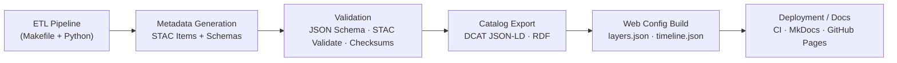

<div align="center">

# 🧾 Kansas Frontier Matrix — Metadata & Standards Integration  
`docs/integration/metadata-standards.md`

**Mission:** Establish a consistent, interoperable **metadata framework** across all Kansas Frontier Matrix (KFM) data layers — ensuring that every dataset, document, and AI-derived artifact is fully described, traceable, and reproducible.

[](../../.github/workflows/site.yml)
[](../../.github/workflows/stac-validate.yml)
[](../../.github/workflows/codeql.yml)
[](../../.github/workflows/trivy.yml)
[](../)
[](../../LICENSE)

</div>

---

## 📚 Overview

Metadata is the **nervous system** of the Kansas Frontier Matrix — linking every raster, vector, document, and knowledge-graph entity to its origin, context, and meaning.  
This guide defines the **standards, formats, and validation procedures** that govern metadata integration throughout the project, ensuring interoperability with global schemas such as **STAC 1.0.0**, **DCAT 2.0**, **schema.org**, and **CIDOC CRM**.

---

## 🧩 Core Principles

| Principle | Description |
|:--|:--|
| **Open Standards** | All metadata follows open, machine-readable specifications (STAC JSON, DCAT JSON-LD, CSVW). |
| **Provenance & Attribution** | Every item records source URL, license, creator, and processing history. |
| **Temporal & Spatial Awareness** | Each dataset carries standardized spatial bbox and temporal extent fields. |
| **Validation & Reproducibility** | JSON Schema + CI validation guarantee compliance before merge. |
| **Interoperability** | Cross-mapped fields between STAC, DCAT, schema.org, and CIDOC CRM enable external federation. |

---

## 🧱 Metadata Architecture

```mermaid
flowchart TD
    A["Raw Source Files\n(scans · rasters · vectors · texts)"] --> B["STAC Item JSON\n(data/sources/*.json)"]
    B --> C["Processed Layer Metadata\n(data/stac/*.json)"]
    C --> D["DCAT Catalog Export\n(JSON-LD / TTL)"]
    D --> E["Knowledge Graph Nodes\n(CIDOC CRM · OWL-Time)"]
    E --> F["Frontend Config\n(layers.json · timeline.json)"]
````

<!-- END OF MERMAID -->

**Flow Explanation**

1. **Raw Source Files** — Original datasets and documents, referenced but not stored directly in Git.
2. **STAC Item JSON** — Defines each dataset’s identity, geometry, time range, license, and asset links.
3. **Processed Layer Metadata** — Generated by ETL scripts after conversion / reprojection / cleanup.
4. **DCAT Catalog Export** — Aggregated for interoperability with portals (e.g., data.gov, Zenodo).
5. **Knowledge Graph Nodes** — Semantic mapping into Neo4j / RDF for queries across time + space.
6. **Frontend Config** — Derived layer descriptors powering the MapLibre + timeline UI.

---

## 🧠 STAC 1.0.0 Compliance

| Field                                                     | Type                                       | Purpose                                          |
| :-------------------------------------------------------- | :----------------------------------------- | :----------------------------------------------- |
| `id`                                                      | string                                     | Unique identifier (slugified dataset name).      |
| `type`                                                    | string                                     | `"Feature"` or `"Collection"`.                   |
| `bbox`                                                    | array[4]                                   | `[west, south, east, north]` in WGS-84.          |
| `geometry`                                                | GeoJSON object                             | Spatial footprint.                               |
| `properties.datetime` / `start_datetime` / `end_datetime` | ISO 8601 timestamps for temporal coverage. |                                                  |
| `assets`                                                  | object                                     | Links to files (COG GeoTIFF, GeoJSON, PDF, CSV). |
| `license`                                                 | string / URL                               | e.g., `CC-BY-4.0`, `Public Domain`.              |
| `providers`                                               | array                                      | Source agencies or contributors.                 |
| `links`                                                   | array                                      | Relations to parent collections or docs.         |

**Validation**

```bash
stac validate data/stac/*.json
```

The CI workflow (`.github/workflows/stac-validate.yml`) automatically performs this validation on every PR.

---

## 🌐 DCAT & JSON-LD Crosswalk

| KFM Field          | STAC Key                                 | DCAT Equivalent                  | schema.org         | Example                                        |
| :----------------- | :--------------------------------------- | :------------------------------- | :----------------- | :--------------------------------------------- |
| Dataset ID         | `id`                                     | `dct:identifier`                 | `@id`              | `ks_dem_2018`                                  |
| Title              | `title`                                  | `dct:title`                      | `name`             | “Kansas LiDAR 1 m DEM (2018)”                  |
| Description        | `description`                            | `dct:description`                | `description`      | Text summary                                   |
| Temporal           | `properties.start_datetime/end_datetime` | `dct:temporal` + `time:Interval` | `temporalCoverage` | 2018-01-01 → 2020-12-31                        |
| Spatial Extent     | `bbox` / `geometry`                      | `dct:spatial` + `locn:geometry`  | `spatialCoverage`  | Polygon coords                                 |
| License            | `license`                                | `dct:license`                    | `license`          | `https://creativecommons.org/licenses/by/4.0/` |
| Keywords           | `keywords`                               | `dcat:keyword`                   | `about`            | `[“Kansas”, “hydrology”]`                      |
| Creator / Provider | `providers.name`                         | `dct:creator` / `dct:publisher`  | `creator`          | “Kansas Geological Survey”                     |

---

## 🔗 Semantic Alignment (CIDOC CRM + OWL-Time)

* **Entities** → mapped to CIDOC CRM classes:
  `Place (E53)`, `Event (E5)`, `Document (E31)`, `Actor (E39)`, `Time-Span (E52)`.
* **Temporal Relations** → expressed via OWL-Time (`time:hasBeginning`, `time:hasEnd`).
* **Period Context** → annotated using PeriodO URIs for standardized historical epochs.

Example Triple (Neo4j Cypher notation):

```cypher
CREATE (d:Document {title:'Treaty with the Kansa (1825)', source:'Kappler'})
CREATE (e:Event {type:'TreatySigning', date:'1825-06-03'})
CREATE (p:Place {name:'Council Grove, KS'})
MERGE (e)-[:DOCUMENTED_IN]->(d)
MERGE (e)-[:TOOK_PLACE_AT]->(p);
```

---

## 🧮 Validation & Quality Assurance

| Layer           | Validation Tool                       | Output                      |
| :-------------- | :------------------------------------ | :-------------------------- |
| **STAC JSON**   | `stac-validator` CLI                  | Pass/fail report in CI log  |
| **JSON Schema** | `ajv validate` or `jsonschema` Python | Schema conformance          |
| **GeoJSON**     | `geojsonlint`                         | Geometry validity check     |
| **Checksums**   | `sha256sum -c`                        | File integrity verification |

All validation runs automatically in GitHub Actions via pre-commit hooks and the **STAC Validate** workflow.

---

## 🧭 Reproducibility Workflow



<!-- END OF MERMAID -->

---

## 🧰 Practical Example

**Example STAC Item:**

```json
{
  "id": "ks_rivers_1900",
  "type": "Feature",
  "title": "Kansas River Network (1900 Survey)",
  "description": "Digitized hydrography from USGS maps 1900–1902.",
  "properties": {
    "start_datetime": "1900-01-01",
    "end_datetime": "1902-12-31"
  },
  "bbox": [-102.05, 36.99, -94.59, 40.00],
  "assets": {
    "data": {
      "href": "data/processed/hydro/ks_rivers_1900.geojson",
      "type": "application/geo+json"
    }
  },
  "license": "Public Domain (US Government)",
  "keywords": ["Kansas", "rivers", "hydrology", "1900"]
}
```

**Validation Command:**

```bash
make validate-stac
```

---

## 🧭 Summary & Best Practices

1. ✅ Use **STAC 1.0.0** for all geospatial datasets.
2. ✅ Ensure **ISO 8601** dates and **EPSG:4326 (WGS-84)** coordinates.
3. ✅ Include **license**, **source**, **checksum**, and **temporal range** fields.
4. ✅ Validate before merge via CI.
5. ✅ Document each dataset in `docs/experiment/` with MCP metadata template.

---

<div align="center">

### 🧠 “Metadata is the DNA of reproducibility — structure it well, and the whole project lives on.”

**— Kansas Frontier Matrix Documentation Team**

</div>
