<div align="center">

# 🧾 Kansas Frontier Matrix — **Metadata & Standards Integration**  
`docs/integration/metadata-standards.md`

**Mission:** Establish a consistent, interoperable **metadata framework** across all Kansas Frontier Matrix (KFM) data layers — ensuring that every dataset, document, and AI-derived artifact is fully described, traceable, and reproducible.

[](../../.github/workflows/site.yml)
[](../../.github/workflows/docs-validate.yml)
[](../../.github/workflows/policy-check.yml)
[](../../.github/workflows/stac-validate.yml)
[](../../.github/workflows/codeql.yml)
[](../../.github/workflows/trivy.yml)
[](../)
[](../../LICENSE)

</div>

```yaml
---
title: "Kansas Frontier Matrix — Metadata & Standards Integration"
document_type: "Integration Guide"
version: "v1.2.0"
last_updated: "2025-10-18"
created: "2025-10-03"
owners: ["@kfm-data","@kfm-architecture","@kfm-docs","@kfm-security","@kfm-ontology"]
status: "Stable"
maturity: "Production"
scope: "Docs/Integration/Metadata-Standards"
license: "CC-BY 4.0"
semver_policy: "MAJOR.MINOR.PATCH"
tags: ["metadata","stac","dcat","schema.org","cidoc","owl-time","provenance","json-schema","fair"]
audit_framework: "MCP-DL v6.3"
ci_required_checks:
  - docs-validate
  - policy-check
  - stac-validate
  - site-build
  - pre-commit
  - codeql
  - trivy
semantic_alignment:
  - STAC 1.0
  - DCAT 2.0
  - schema.org
  - CIDOC CRM
  - PROV-O
  - OWL-Time
  - SKOS
  - JSON Schema
  - ISO 8601
preservation_policy:
  format_standards: ["STAC JSON","DCAT JSON-LD/Turtle","CSVW","RDF/Turtle","Markdown (GFM)"]
  checksum_algorithm: "SHA-256"
  replication_targets: ["GitHub Repository","Zenodo Snapshot","OSF Backup"]
  metadata_standard: "PREMIS 3.0"
  revalidation_cycle: "annually"
ai_index:
  embed_in_graph: true
  model: "sentence-transformers/all-MiniLM-L6-v2"
  store: "Neo4j Vector Index"
  searchable_fields: ["title","summary","tags"]
provenance:
  workflow_pin_policy: "actions pinned by tag or commit SHA"
  artifact_retention_days: 180
---
```

---

## 📚 Overview

Metadata is the **nervous system** of KFM — linking every raster, vector, document, and knowledge-graph entity to its origin, context, and meaning.  
This guide defines the **standards, formats, and validation procedures** that govern metadata integration throughout the project, ensuring interoperability with **STAC 1.0**, **DCAT 2.0**, **schema.org**, and **CIDOC CRM**.

---

## 🧩 Core Principles

| Principle | Description |
|:--|:--|
| **Open Standards** | All metadata follows open, machine-readable specifications (STAC JSON, DCAT JSON-LD, CSVW). |
| **Provenance & Attribution** | Each item records source URL, license, creator, and processing history. |
| **Temporal & Spatial Awareness** | Datasets carry standardized `bbox` and temporal extent fields (ISO 8601). |
| **Validation & Reproducibility** | JSON Schema + CI validation guarantee compliance before merge. |
| **Interoperability** | Field crosswalks between STAC, DCAT, schema.org, and CIDOC CRM enable federation. |

---

## 🧱 Metadata Architecture

```mermaid
flowchart TD
    A["Raw Source Files\n(scans · rasters · vectors · texts)"] --> B["STAC Item JSON\n(data/sources/*.json)"]
    B --> C["Processed Layer Metadata\n(data/stac/*.json)"]
    C --> D["DCAT Catalog Export\n(JSON-LD / TTL)"]
    D --> E["Knowledge Graph Nodes\n(CIDOC CRM · OWL-Time)"]
    E --> F["Frontend Config\n(layers.json · timeline.json)"]
%% END OF MERMAID
```



**Flow**

1. **Raw Sources** — Original datasets, referenced by manifests (not stored wholesale in Git).  
2. **STAC Items** — Identity, geometry, temporal extent, license, and asset links.  
3. **Processed Metadata** — Emitted by ETL after reprojection/conversion.  
4. **DCAT Export** — Catalog-level export for portals (data.gov, Zenodo).  
5. **Knowledge Graph** — Semantic mapping in Neo4j/RDF for time/space queries.  
6. **Frontend** — Derived layer descriptors for MapLibre + timeline.

---

## 🧠 STAC 1.0 Compliance

| Field                                                     | Type        | Purpose                                   |
| :-------------------------------------------------------- | :---------- | :---------------------------------------- |
| `id`                                                      | string      | Unique identifier (slug).                 |
| `type`                                                    | string      | `"Feature"` or `"Collection"`.            |
| `bbox`                                                    | array[4]    | `[W,S,E,N]` (WGS-84).                     |
| `geometry`                                                | GeoJSON     | Spatial footprint.                        |
| `properties.datetime` / `start_datetime` / `end_datetime` | ISO 8601    | Temporal coverage.                        |
| `assets`                                                  | object      | File links (COG, GeoJSON, NetCDF, CSV).   |
| `license`                                                 | string/URL  | SPDX/URL (e.g., `CC-BY-4.0`).             |
| `providers`                                               | array       | Source agencies or contributors.          |
| `links`                                                   | array       | Relations to collections, docs, tiles.    |

**Validation**

```bash
stac-validator data/stac/**/*.json --links
```

CI (`.github/workflows/stac-validate.yml`) runs this on every PR.

---

## 🌐 DCAT & JSON-LD Crosswalk

| KFM Field          | STAC Key                                 | DCAT Equivalent          | schema.org         | Example                                        |
| :----------------- | :--------------------------------------- | :----------------------- | :----------------- | :--------------------------------------------- |
| Dataset ID         | `id`                                     | `dct:identifier`         | `@id`              | `ks_dem_2018`                                  |
| Title              | `title`                                  | `dct:title`              | `name`             | “Kansas LiDAR 1 m DEM (2018)”                  |
| Description        | `description`                            | `dct:description`        | `description`      | Text summary                                   |
| Temporal           | `start_datetime/end_datetime`            | `dct:temporal` + `time:Interval` | `temporalCoverage` | 2018–2020                                      |
| Spatial Extent     | `bbox` / `geometry`                      | `dct:spatial` + `locn:geometry`  | `spatialCoverage`  | Polygon coords                                 |
| License            | `license`                                | `dct:license`            | `license`          | CC-BY-4.0 URL                                  |
| Keywords           | `keywords`                               | `dcat:keyword`           | `about`            | `["Kansas","hydrology"]`                       |
| Creator/Provider   | `providers[].name`                       | `dct:creator/publisher`  | `creator`          | “Kansas Geological Survey”                     |

---

## 🔗 Semantic Alignment (CIDOC CRM + OWL-Time)

- **Entities** → `E53_Place`, `E5_Event`, `E31_Document`, `E39_Actor`  
- **Temporal** → `time:hasBeginning`, `time:hasEnd`  
- **Periods** → PeriodO URIs for named historical epochs

**Neo4j / Cypher Example**

```cypher
CREATE (d:Document {title:'Treaty with the Kansa (1825)', source:'Kappler'})
CREATE (e:Event {type:'TreatySigning', date:'1825-06-03'})
CREATE (p:Place {name:'Council Grove, KS'})
MERGE (e)-[:DOCUMENTED_IN]->(d)
MERGE (e)-[:TOOK_PLACE_AT]->(p);
```

---

## 🧮 Validation & QA

| Layer            | Tool                          | Output                     |
| :--------------- | :---------------------------- | :------------------------- |
| **STAC JSON**    | `stac-validator`              | Pass/fail in CI            |
| **JSON Schema**  | `jsonschema` / `ajv`          | Schema conformance         |
| **GeoJSON**      | `geojsonlint`                 | Geometry validity          |
| **Checksums**    | `sha256sum -c`                | File integrity verification|

All validations are executed automatically via GitHub Actions and pre-commit hooks.

---

## 🧭 Reproducibility Workflow

```mermaid
flowchart LR
    A["ETL Pipeline\n(Makefile + Python)"] --> B["Metadata Generation\nSTAC Items + Schemas"]
    B --> C["Validation\nJSON Schema · STAC Validate · Checksums"]
    C --> D["Catalog Export\nDCAT JSON-LD · RDF"]
    D --> E["Web Config Build\nlayers.json · timeline.json"]
    E --> F["Deployment / Docs\nCI · MkDocs · GitHub Pages"]
%% END OF MERMAID
```



---

## 🧰 Practical Example

**Example STAC Item**

```json
{
  "stac_version": "1.0.0",
  "id": "ks_rivers_1900",
  "type": "Feature",
  "title": "Kansas River Network (1900 Survey)",
  "description": "Digitized hydrography from USGS maps 1900–1902.",
  "properties": {
    "start_datetime": "1900-01-01T00:00:00Z",
    "end_datetime": "1902-12-31T23:59:59Z"
  },
  "bbox": [-102.05, 36.99, -94.59, 40.00],
  "assets": {
    "data": {
      "href": "data/processed/hydro/ks_rivers_1900.geojson",
      "type": "application/geo+json",
      "checksum:multihash": "1220<sha256-hex>"
    }
  },
  "license": "public-domain",
  "keywords": ["Kansas","rivers","hydrology","1900"]
}
```

**Validate**

```bash
stac-validator data/stac/hydro/ks_rivers_1900.json --links
```

---

## 🧭 Summary & Best Practices

1. ✅ Use **STAC 1.0** for all geospatial datasets.  
2. ✅ Encode **ISO 8601** dates and **EPSG:4326** coordinates.  
3. ✅ Include **license**, **providers**, **checksum**, and **temporal range**.  
4. ✅ Validate via CI before merge.  
5. ✅ Document dataset integration under `/docs/integration/*` and reference STAC ID.

---

<div align="center">

**Kansas Frontier Matrix** — *“Metadata is the DNA of reproducibility — structure it well, and the whole project lives on.”*

</div>
