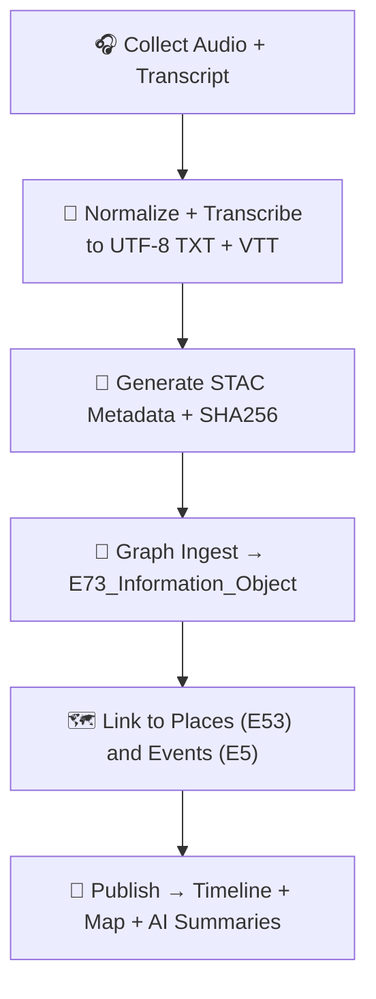

<div align="center">

# 🗣️ Kansas Frontier Matrix — **Oral Histories Integration**  
`docs/integration/oral-histories.md`

**Purpose:** Document the reproducible integration of **Indigenous and community oral histories**
into the **Kansas Frontier Matrix (KFM)** — preserving narrative context, ensuring
ethical handling, and linking testimonies semantically to **places, events, and time periods**.

[](../../.github/workflows/site.yml)
[](../../.github/workflows/docs-validate.yml)
[](../../.github/workflows/policy-check.yml)
[](../../docs/standards/metadata.md)
[](../../docs/standards/ontologies.md)
[](../../docs/standards/data-formats.md)
[](../../LICENSE)

</div>

```yaml
---
title: "Kansas Frontier Matrix — Oral Histories Integration"
document_type: "Integration Guide"
version: "v1.2.0"
last_updated: "2025-10-18"
created: "2025-10-03"
owners: ["@kfm-cultural","@kfm-data","@kfm-ontology","@kfm-docs","@kfm-security"]
status: "Stable"
maturity: "Production"
scope: "Docs/Integration/Oral-Histories"
license: "CC-BY 4.0"
semver_policy: "MAJOR.MINOR.PATCH"
tags: ["oral-history","indigenous","ethics","audio","transcript","provenance","ontology","stac","fair"]
audit_framework: "MCP-DL v6.3"
ci_required_checks:
  - docs-validate
  - policy-check
  - stac-validate
  - site-build
  - pre-commit
  - codeql
  - trivy
semantic_alignment:
  - STAC 1.0
  - CIDOC CRM
  - PROV-O
  - OWL-Time
  - SKOS
  - JSON Schema
  - ISO 8601
preservation_policy:
  format_standards: ["FLAC","UTF-8 TXT/VTT","WebP","STAC JSON","RDF/Turtle","Markdown (GFM)","BagIt 1.0"]
  checksum_algorithm: "SHA-256"
  replication_targets: ["GitHub Repository","Zenodo Snapshot","Institutional Archive/OSF"]
  metadata_standard: "PREMIS 3.0"
  revalidation_cycle: "annually"
ai_index:
  embed_in_graph: true
  model: "sentence-transformers/all-MiniLM-L6-v2"
  store: "Neo4j Vector Index"
  searchable_fields: ["title","summary","tags"]
provenance:
  workflow_pin_policy: "actions pinned by tag or commit SHA"
  artifact_retention_days: 365
---
```

---

## 🎯 Integration Objective

Integrate **recorded oral histories**—Indigenous narratives, community testimonies, and settler recollections—
into KFM’s knowledge graph as verifiable, time-aware entities. Each record becomes both a digital artifact (audio, text, or video) and a structured semantic node linked to historical events, people, and locations.

**Goals**

- 🎧 Preserve voices as `crm:E73_Information_Object` with transcripts and metadata  
- 🌎 Link narratives to `crm:E53_Place` and `crm:E5_Event` nodes in Neo4j  
- 🧠 Represent temporal context (`time:Interval`, `prov:atTime`)  
- 🧩 Index audio and text under **STAC 1.0** for discoverability  
- 🔐 Ensure ethical handling (permissions, cultural sensitivity tags)

---

## 🧭 Primary Sources and Partners

| Partner / Archive                               | Format              | Coverage              | Access                                                 | License              |
| :---------------------------------------------- | :------------------ | :-------------------- | :----------------------------------------------------- | :------------------- |
| **Kansas Oral History Project (KOHP)**          | MP3, PDF Transcript | 1970–present          | <https://kansasoralhistory.org>                        | CC BY-NC 4.0         |
| **Tribal Historic Preservation Offices (THPO)** | WAV, TXT            | Pre-contact → present | Partnership / permission                               | Community agreements |
| **Library of Congress — Voices of the Plains**  | MP3, JSON           | 1930s–1960s           | <https://www.loc.gov/audio/>                           | Public Domain        |
| **Local Museums & Historical Societies**        | MP3, PDF            | 1880–2025             | Institutional exports                                  | Mixed (CC BY, PD)    |

---

## 🧩 File Structure and Preferred Formats

| Type             | Native Input | Converted Format         | Tool                  |
| :--------------- | :----------- | :----------------------- | :-------------------- |
| Audio Recordings | MP3/WAV      | **FLAC** + SHA256        | `ffmpeg`, `sha256sum` |
| Transcripts      | PDF/DOCX     | **UTF-8 TXT + VTT**      | `pandoc`, `whisperx`  |
| Metadata         | CSV/JSON     | **STAC Item (JSON)**     | `jq`, `python-stac`   |
| Speaker photos   | JPEG         | **WebP** (optimized)     | `cwebp`               |

**Example**

```bash
ffmpeg -i oral_history_01.mp3 -ar 44100 -ac 1 -c:a flac data/processed/oral/01.flac
pandoc sarah_brown_transcript.pdf -t plain -o data/processed/oral/01.txt
sha256sum data/processed/oral/01.flac > data/checksums/oral/01.flac.sha256
```

---

## 🔄 Integration Workflow



---

## 🧾 Example STAC Item — Oral History Record

```json
{
  "stac_version": "1.0.0",
  "id": "oral_history_sarah_brown_1978",
  "type": "Feature",
  "properties": {
    "datetime": "1978-04-12T00:00:00Z",
    "description": "Interview with Sarah Brown of Cowley County on Dust Bowl life and farming migration.",
    "license": "cc-by-nc-4.0",
    "keywords": ["oral history","Dust Bowl","Kansas","migration"],
    "providers": [{"name":"Kansas Oral History Project","roles":["producer","licensor"]}]
  },
  "assets": {
    "audio": {
      "href": "data/processed/oral/1978_sarah_brown.flac",
      "type": "audio/flac",
      "roles": ["data"],
      "title": "Oral History Audio",
      "checksum:multihash": "1220<sha256-hex>"
    },
    "transcript": {
      "href": "data/processed/oral/1978_sarah_brown.txt",
      "type": "text/plain",
      "roles": ["metadata"]
    }
  },
  "bbox": [-97.02, 37.24, -97.02, 37.24],
  "links": [
    {"rel":"collection","href":"../collection.json"},
    {"rel":"documentation","href":"../../../docs/integration/oral-histories.md"}
  ]
}
```

Validate:

```bash
stac-validator data/stac/oral/oral_history_sarah_brown_1978.json --links
```

---

## 🧠 Ontology Mapping (CIDOC CRM + OWL-Time)

| Entity                | Class                        | Description                                   |
| :-------------------- | :--------------------------- | :-------------------------------------------- |
| Audio recording       | `crm:E73_Information_Object` | Digital file containing spoken testimony      |
| Interview event       | `crm:E7_Activity`            | Recording session (time, place, participants) |
| Speaker / interviewee | `crm:E21_Person`             | Voice source, identified actor                |
| Interviewer           | `crm:E39_Actor`              | Collector / recorder                          |
| Topic / Theme         | `skos:Concept`               | Dust Bowl, farming, tribal sovereignty, etc.  |
| Location              | `crm:E53_Place`              | County or settlement referenced               |
| Time Span             | `time:Interval`              | Recording and historical reference period     |

---

## 🔗 Cross-Domain Connections

| Linked Dataset         | Relation              | Purpose                                |
| :--------------------- | :-------------------- | :------------------------------------- |
| **Climate Hazards**    | `prov:wasInformedBy`  | Narratives describing Dust Bowl storms |
| **Deeds & Homesteads** | `crm:P70_documents`   | Recollections of land transfers        |
| **Treaties**           | `crm:P67_refers_to`   | Accounts of tribal lands and migration |
| **GIS Archive**        | `geo:hasGeometry`     | Spatial mapping of story locations     |
| **Research Notes**     | `prov:wasGeneratedBy` | Used in historical interpretation      |

---

## 🧮 Provenance (RDF/PROV-O)

```turtle
@prefix prov: <http://www.w3.org/ns/prov#> .
@prefix crm:  <http://www.cidoc-crm.org/cidoc-crm/> .
@prefix kfm:  <https://kfm.org/id/> .

kfm:oral/1978_sarah_brown
  a crm:E73_Information_Object ;
  prov:wasGeneratedBy kfm:event/interview_1978_cowley ;
  prov:wasAttributedTo kfm:actor/sarah_brown ;
  crm:P7_took_place_at kfm:place/Cowley_County ;
  crm:P4_has_time-span kfm:time/1978 ;
  prov:wasDerivedFrom <https://kansasoralhistory.org/interviews/sarah-brown> .
```

---

## 🧩 Ethical & Access Guidelines

| Aspect                          | Policy                                                                  |
| :------------------------------ | :---------------------------------------------------------------------- |
| **Consent & Usage Rights**      | Verify license (CC BY-NC, PD, or community MOU) before distribution     |
| **Sensitive Content**           | Tag entries with `mcp:sensitive: true`; restrict AI summaries           |
| **Indigenous Data Sovereignty** | Follow Tribal NAGPRA & CARE Principles for Indigenous Data Governance   |
| **Attribution**                 | Always credit speaker and source archive                                |
| **Preservation**                | Audio stored lossless (FLAC) + checksum for fixity                      |

---

## 🧩 CI Validation Hooks

| Check            | Tool                             | Purpose                   |
| :--------------- | :------------------------------- | :------------------------ |
| Metadata Syntax  | `stac-validator`                 | Ensures valid STAC fields |
| Checksum         | `sha256sum -c`                   | Verifies audio integrity  |
| Ontology Mapping | `scripts/check_cidoc_links.py`   | Confirms semantic classes |
| Graph Ingestion  | `scripts/graph_ingest_oral.py`   | Loads records into Neo4j  |
| License Audit    | `scripts/check_license_flags.py` | Confirms usage rights     |

Run:

```bash
make stac-validate
make docs-validate
```

---

## 🧠 MCP Compliance Summary

| Principle               | Implementation                                        |
| :---------------------- | :---------------------------------------------------- |
| **Documentation-first** | Integration logged here before pipeline execution     |
| **Reproducibility**     | Automated transcription + metadata generation scripts |
| **Open Standards**      | STAC 1.0 · CIDOC CRM · OWL-Time · PROV-O              |
| **Provenance**          | SHA256 + RDF chains link audio → transcript → graph   |
| **Auditability**        | CI logs under `data/work/logs/oral/`                  |

---

## 📎 Related Documentation

| File                                   | Purpose                                    |
| :------------------------------------- | :----------------------------------------- |
| `docs/integration/climate-hazards.md`  | Links narratives about storms and droughts |
| `docs/integration/deeds.md`            | Ties land stories to ownership records     |
| `docs/standards/ontologies.md`         | CIDOC/OWL-Time class reference             |
| `docs/notes/research.md`               | Research findings based on oral histories  |
| `docs/architecture/knowledge-graph.md` | Graph schema for audio + text entities     |

---

## 📅 Version History

| Version  | Date       | Author                 | Summary                                                       |
| :------- | :--------- | :--------------------- | :------------------------------------------------------------ |
| **v1.2.0** | 2025-10-18 | KFM Cultural Data Team | Policy alignment, preservation policy, and stronger STAC example with checksums. |
| v1.1.0  | 2025-10-05 | KFM Cultural Data Team | Added ethical framework, ontology table, and RDF examples.    |
| v1.0.0  | 2025-10-04 | KFM Documentation Team | Initial oral history integration guide (STAC + CRM alignment). |

---

<div align="center">

**Kansas Frontier Matrix** — *“Every Voice Preserved. Every Story Proven.”*  
📍 `docs/integration/oral-histories.md` · Official MCP-compliant oral history integration guide for the Kansas Frontier Matrix.

</div>
