<div align="center">

# 🧮 Kansas Frontier Matrix — **Integration Reviews**  
`docs/integration/reviews/README.md`

**Mission:** Establish transparent, repeatable **review and validation workflows** for all  
data, documentation, and AI/ML components integrated into the Kansas Frontier Matrix (KFM).  
Every commit, dataset, and model must undergo reproducible peer verification in alignment  
with the **Master Coder Protocol (MCP)**.

[](../../../.github/workflows/site.yml)
[](../../../.github/workflows/docs-validate.yml)
[](../../../.github/workflows/policy-check.yml)
[](../../../.github/workflows/stac-validate.yml)
[](../../../.github/workflows/codeql.yml)
[](../../../.github/workflows/trivy.yml)
[](../metadata-standards.md)
[](../../../LICENSE)

</div>

```yaml
---
title: "Integration Reviews"
document_type: "Governance · Reviews & Validation"
version: "v1.3.0"
last_updated: "2025-10-18"
created: "2025-10-04"
owners: ["@kfm-architecture","@kfm-data","@kfm-security","@kfm-ontology","@kfm-docs"]
status: "Stable"
maturity: "Production"
scope: "Docs/Integration/Reviews"
license: "CC-BY 4.0"
semver_policy: "MAJOR.MINOR.PATCH"
tags: ["governance","review","validation","stac","provenance","model-card","security"]
audit_framework: "MCP-DL v6.3"
ci_required_checks:
  - docs-validate
  - policy-check
  - stac-validate
  - site-build
  - pre-commit
  - codeql
  - trivy
semantic_alignment:
  - STAC 1.0
  - DCAT 2.0
  - CIDOC CRM
  - PROV-O
  - OWL-Time
  - SKOS
  - JSON Schema
  - ISO 8601
preservation_policy:
  format_standards: ["GeoTIFF (COG)","GeoJSON","CSV/Parquet","RDF/Turtle","Markdown (GFM)","BagIt 1.0"]
  checksum_algorithm: "SHA-256"
  replication_targets: ["GitHub Repository","Zenodo Snapshot","OSF Backup"]
  metadata_standard: "PREMIS 3.0"
  revalidation_cycle: "quarterly"
ai_index:
  embed_in_graph: true
  model: "sentence-transformers/all-MiniLM-L6-v2"
  store: "Neo4j Vector Index"
  searchable_fields: ["title","summary","tags","dataset","component"]
provenance:
  workflow_pin_policy: "actions pinned by tag or commit SHA"
  artifact_retention_days: 365
---
````

---

## 📘 Purpose

The **Integration Review System** ensures that:

* All new datasets, scripts, and documents meet **technical**, **semantic**, and **reproducibility** standards.
* Reviews follow a **consistent, auditable path** — from initial submission to public deployment.
* Every approved integration contributes to a **verifiable scientific record** of Kansas data history.

> **Scope:** Applies to **data integrations**, **ETL/AI code**, **model artifacts**, **docs**, and **security posture**.

---

## 🧭 Principles (MCP-Aligned)

| MCP Principle           | Review Implementation                                                                |
| :---------------------- | :----------------------------------------------------------------------------------- |
| **Documentation-first** | A review spec & checklist are required *before* ingestion/merge.                     |
| **Reproducibility**     | Deterministic Makefile targets, pinned actions/containers, scripted validations.     |
| **Provenance**          | SHA-256 manifests, PROV-O statements, STAC/DCAT metadata carried forward.            |
| **Open Standards**      | GeoJSON/COG, STAC/DCAT, CIDOC CRM, OWL-Time, JSON Schema, SKOS.                      |
| **Auditability**        | Immutable logs + artifacts stored under `docs/reviews/logs/` and CI build artifacts. |

---

## 🧩 Review Lifecycle

```mermaid
flowchart TD
    A["Contributor\n(submits PR / dataset)"] --> B["Automated Checks\nCI · STAC Validate · Pre-commit"]
    B --> C["Peer Review\nDomain + Technical Maintainers"]
    C --> D["Integration Review Board\n(MCP compliance · provenance · ethics)"]
    D --> E["Merge & Deploy\nmain branch + Docs update"]
    E --> F["Post-Integration Audit\nchecksum · schema validation · release notes"]
```



<!-- END OF MERMAID -->

### Stages & Outputs

| Stage                        | Reviewer                        | Validation Focus                                          | Output                            |
| :--------------------------- | :------------------------------ | :-------------------------------------------------------- | :-------------------------------- |
| **Automated Checks**         | GitHub Actions                  | Linting, STAC validation, schema conformance              | CI logs & artifacts               |
| **Peer Review**              | Domain maintainers              | Data quality, correctness, structure                      | PR review notes                   |
| **Integration Board Review** | MCP Review Team                 | Provenance, reproducibility, ethical + license compliance | Board approval record             |
| **Merge & Deploy**           | Maintainer                      | Merge to `main`, trigger site build                       | Updated docs & website            |
| **Post-Integration Audit**   | Automation or external reviewer | Verify metadata, run checksums, snapshot release notes    | Audit log in `docs/reviews/logs/` |

---

## 🧾 Review Types

| Type                        | Scope                                           | Required Artifacts                                                               |
| :-------------------------- | :---------------------------------------------- | :------------------------------------------------------------------------------- |
| **Data Integration Review** | New/updated dataset (GeoTIFF/COG, GeoJSON, CSV) | `data/sources/*.json`, STAC/DCAT metadata, `.sha256`, sample map preview         |
| **Code Review**             | ETL scripts, AI modules, utilities              | Unit tests (`pytest`/Jest), docstrings/typed APIs, changelog, perf notes         |
| **Model Review**            | AI/ML models & card verification                | `docs/model_card.md`, training provenance, metrics + seed, model hash            |
| **Documentation Review**    | README, SOPs, experiment logs                   | MCP-DL style, front-matter YAML, links/anchors, mermaid with `%% END OF MERMAID` |
| **Security Review**         | Containers & dependencies                       | Trivy SBOM/SCA, CodeQL SARIF, policy exceptions with expiry                      |

---

## 🧠 Reviewer Roles & Permissions

| Role                  | Responsibility                                            | Tools / Access                                 |
| :-------------------- | :-------------------------------------------------------- | :--------------------------------------------- |
| **Contributor**       | Creates PR, documents provenance, runs local validations. | Makefile targets, pre-commit hooks.            |
| **Maintainer**        | Reviews PRs, enforces schema standards.                   | GitHub review + workflow triggers.             |
| **Integration Board** | Final approval for MCP compliance.                        | Board checklist (`docs/reviews/checklist.md`). |
| **Automation Bot**    | Executes CI/CD and emits artifacts.                       | GitHub Actions + artifact store.               |

---

## 🧰 Review Checklists

<details>
<summary>📂 Data Review Checklist (click to expand)</summary>

* [ ] Source manifest at `data/sources/*.json` created and complete.
* [ ] License and attribution fields filled (STAC/DCAT).
* [ ] CRS standardized to **EPSG:4326**; bbox + temporal range defined.
* [ ] `.sha256` checksum verified; artifact pinned in logs.
* [ ] STAC validation `stac validate` passes; JSON Schema OK.
* [ ] Visual test in web UI (`make serve`) with timeline filter.
* [ ] Provenance narrative (PROV-O) linked in doc.

</details>

<details>
<summary>💻 Code Review Checklist</summary>

* [ ] Clear module docstrings + type hints; no hard-coded paths/creds.
* [ ] Tests added/updated (`pytest`/Jest); coverage threshold met.
* [ ] PEP-8 / ESLint; no lints; deterministic paths & seeds.
* [ ] Performance notes; no N+1 queries; data locality OK.
* [ ] CHANGELOG updated; docs synchronized in same PR.

</details>

<details>
<summary>🤖 AI/ML Model Review Checklist</summary>

* [ ] `docs/model_card.md` complete (intended use, data, metrics, ethics).
* [ ] Training data licensed; seed & hyperparameters recorded.
* [ ] Reproducible eval (script + fixed seed); metrics within tolerance.
* [ ] Bias & fairness discussion; mitigations documented.
* [ ] Model hash + file size logged; storage location pinned.

</details>

<details>
<summary>📚 Documentation Review Checklist</summary>

* [ ] MCP-DL header, badges, YAML front matter present.
* [ ] ToC anchors verified; diagrams end with `<!-- END OF MERMAID -->`.
* [ ] Cross-links to architecture/standards; style per Markdown Guide.
* [ ] Example snippets runnable; paths exist; images compress to web.
* [ ] Version history table updated.

</details>

<details>
<summary>🔐 Security Review Checklist</summary>

* [ ] Trivy scan: no CRITICAL; HIGH items triaged with due date.
* [ ] CodeQL: no blocker queries; SARIF stored; exceptions documented.
* [ ] Supply chain pins (images/actions) by tag or SHA.
* [ ] Secrets: none committed; CI uses OIDC or masked secrets.
* [ ] Access policy & data sensitivity tagged.

</details>

---

## 🧮 Automated Validation Matrix

| Validation Layer   | Tool / Workflow        | Trigger              | Output                        |
| :----------------- | :--------------------- | :------------------- | :---------------------------- |
| **Metadata**       | `stac-validator`       | Pre-commit / CI      | JSON validation log           |
| **Data Integrity** | `sha256sum`            | Post-fetch / Pre-PR  | Checksum file                 |
| **Schema**         | JSON Schema / `ajv`    | CI job               | Report artifact               |
| **Security**       | Trivy / CodeQL         | Scheduled + on PR    | SBOM, SCA & SARIF             |
| **Docs Quality**   | Markdownlint, yamllint | Pre-commit / CI      | Style + YAML validation       |
| **Model Card**     | MCP card parser        | Manual / CI optional | Rendered PDF + checks summary |

**Local run**

```bash
make docs-validate && make stac-validate && make security-scan
```

---

## 🧭 Audit Trail & Provenance

Each approved integration produces an **immutable review record** stored in:

```
docs/reviews/logs/
 ├── YYYY-MM-DD_dataset_name.md
 ├── YYYY-MM-DD_script_update.md
 └── audit-index.json
```

**Example entry (`2025-10-05_kansas_treaties.md`):**

```yaml
dataset: kansas_treaties
reviewers: [historian_a, geospatial_b]
status: approved
validation:
  stac: pass
  checksum: verified
  license: CC-BY-4.0
notes: "All treaty polygons and metadata verified against USFS sources."
timestamp: 2025-10-05T17:00:00Z
```

> **Tip:** Add a short “decision rationale” block for contested changes and link to sources (PROV-O).

---

## 🧭 Review Workflow Lifecycle (Detailed)


<!-- END OF MERMAID -->

---

## 🧾 Example PR Template Snippet

```markdown
### 🧩 Summary
Describe what this integration adds or updates.

### 📦 Datasets / Components
- [ ] `data/sources/<name>.json`
- [ ] `data/stac/<name>.json`
- [ ] `docs/integration/<doc>.md`

### ✅ Validation
- [ ] STAC validation passed
- [ ] Checksums verified
- [ ] License & attribution included

### 🧠 Reviewers
Tag 2+ maintainers for domain and technical review.
```

---

## 🧰 Integration Board Checklist (MCP)

* [ ] Documentation-first: spec & SOP present, paths correct.
* [ ] Reproducibility: deterministic Makefile, pinned actions/containers.
* [ ] Provenance: checksums, PROV-O entries, STAC/DCAT complete.
* [ ] Ontology: CIDOC/OWL-Time mapping correct; SKOS roles defined.
* [ ] Security: CodeQL/Trivy clean or triaged with timeline.
* [ ] Ethics: licenses honored; sensitive data policy applied.

---

## 🧮 Versioning & Recordkeeping

| Artifact | Versioning Method     | Retention             |
| :------- | :-------------------- | :-------------------- |
| Datasets | Git + DVC             | Permanent             |
| Docs     | Git                   | Permanent             |
| Graph DB | Snapshot Export       | Monthly               |
| Models   | Hash-tracked artifact | Each release          |
| Reviews  | YAML + JSON index     | Permanent (immutable) |

---

## 🔗 Related Documentation

| File                                      | Description                                 |
| :---------------------------------------- | :------------------------------------------ |
| `../README.md`                            | Integration index & directory overview      |
| `../metadata-standards.md`                | STAC · DCAT · CIDOC CRM · OWL-Time mappings |
| `../../architecture/data-architecture.md` | Data flow & repository structure            |
| `../../standards/markdown_guide.md`       | KFM Markdown style & features               |
| `../../standards/markdown_rules.md`       | KFM Markdown rules & governance             |
| `../../templates/dataset.md`              | Dataset documentation template              |
| `../../notes/research.md`                 | Research notes linked to integrations       |

---

## 📅 Version History

| Version    | Date       | Author                 | Summary                                                                                 |
| :--------- | :--------- | :--------------------- | :-------------------------------------------------------------------------------------- |
| **v1.3.0** | 2025-10-18 | KFM Review Council     | Added full YAML front matter, CI matrices, Board checklist, security hooks, references. |
| v1.2.0     | 2025-10-15 | KFM Governance Team    | Introduced policy-as-code and docs-validate checks; expanded checklists.                |
| v1.1.0     | 2025-10-10 | KFM Documentation Team | Initial lifecycle diagrams and audit trail patterns.                                    |
| v1.0.0     | 2025-10-04 | KFM Architecture Team  | Initial release — review workflow scaffold.                                             |

---

<div align="center">

### 🧩 “Review is research in motion — verification is the bridge between data and truth.”

**— Kansas Frontier Matrix Review Council** · MCP-DL v6.3

</div>
