<div align="center">

# 🧮 Kansas Frontier Matrix — **Integration Reviews**  
`docs/integration/reviews/README.md`

**Mission:** Establish transparent, repeatable **review and validation workflows** for all  
data, documentation, and AI/ML components integrated into the Kansas Frontier Matrix (KFM).  
Every commit, dataset, and model must undergo reproducible peer verification in alignment  
with the **Master Coder Protocol (MCP)** and **MCP-DL v6.3 documentation-first governance.**

[](../../../.github/workflows/site.yml)
[](../../../.github/workflows/docs-validate.yml)
[](../../../.github/workflows/policy-check.yml)
[](../../../.github/workflows/stac-validate.yml)
[](../../../.github/workflows/codeql.yml)
[](../../../.github/workflows/trivy.yml)
[](../metadata-standards.md)
[](../../../LICENSE)

</div>

```yaml
---
title: "Integration Reviews"
document_type: "Governance · Reviews & Validation"
version: "v1.3.1"
last_updated: "2025-10-18"
created: "2025-10-04"
owners: ["@kfm-architecture","@kfm-data","@kfm-security","@kfm-ontology","@kfm-docs"]
status: "Stable"
maturity: "Production"
scope: "Docs/Integration/Reviews"
license: "CC-BY 4.0"
semver_policy: "MAJOR.MINOR.PATCH"
tags: ["governance","review","validation","audit","workflow","mcp","security","stac"]
audit_framework: "MCP-DL v6.3"
ci_required_checks:
  - docs-validate
  - policy-check
  - stac-validate
  - site-build
  - pre-commit
  - codeql
  - trivy
semantic_alignment:
  - STAC 1.0
  - DCAT 2.0
  - CIDOC CRM
  - PROV-O
  - OWL-Time
  - SKOS
  - JSON Schema
preservation_policy:
  format_standards: ["GeoTIFF (COG)","GeoJSON","CSV/Parquet","RDF/Turtle","Markdown (GFM)","BagIt 1.0"]
  checksum_algorithm: "SHA-256"
  replication_targets: ["GitHub Repository","Zenodo Snapshot","OSF Backup"]
  metadata_standard: "PREMIS 3.0"
  revalidation_cycle: "quarterly"
---
````

---

## 🗂 Directory Layout

```text
docs/integration/reviews/
├── README.md                   → Index & governance overview (this file)
├── checklist.md                → Integration Board review checklist
├── templates/                  → Markdown + YAML templates for reviews
│   ├── data_review_template.md → Template for dataset/ETL integration review
│   ├── code_review_template.md → Template for code/ETL/AI script review
│   ├── model_review_template.md→ Template for AI/ML model review
│   ├── doc_review_template.md  → Template for documentation review
│   └── security_review_template.md → Template for container/dependency audits
├── logs/                       → Immutable review and audit records
│   ├── 2025-10-05_kansas_treaties.md → Example audit record
│   ├── 2025-10-06_ai_pipeline_update.md
│   └── audit-index.json        → Machine-readable index of all reviews
├── archive/                    → Archived or superseded reviews
│   ├── 2024-legacy_datasets.md
│   └── 2023_ai_model_review.md
├── reviewers/                  → Governance rosters and responsibilities
│   ├── integration_board.yaml  → Integration Review Board members + roles
│   └── maintainers.yaml        → Domain maintainers + permissions
└── ADRs/                       → Architecture Decision Records related to reviews
    ├── ADR-001_review_policy.md
    └── ADR-002_ethics_protocol.md
```

> This directory serves as the **compliance and provenance ledger** of KFM’s integrations — each entry representing
> a peer-reviewed, reproducible decision trace for datasets, code, or models.

---

## 📘 Purpose

The **Integration Review System** guarantees that every dataset, script, and model entering KFM meets **technical**,
**semantic**, **security**, and **reproducibility** standards. The process formalizes peer review as a scientific audit trail,
ensuring all integrations strengthen the **verifiable digital heritage** of Kansas’s frontier history.

> **Outcome:** Each review record serves as a verifiable artifact connecting documentation, source data, and CI results.

---

## 🧩 Review Lifecycle

```mermaid
flowchart TD
    A["Contributor<br/>(submits PR / dataset)"] --> B["Automated Checks<br/>CI · STAC Validate · Pre-commit"]
    B --> C["Peer Review<br/>Domain & Technical Maintainers"]
    C --> D["Integration Review Board<br/>MCP Compliance · Ethics · Provenance"]
    D --> E["Merge & Deploy<br/>main branch + Docs update"]
    E --> F["Post-Integration Audit<br/>Checksum · Schema · License Verification"]
    F --> G["Archive & Log<br/>docs/integration/reviews/logs/"]
```



<!-- END OF MERMAID -->

---

## 🧭 Review Roles

| Role                  | Responsibility                                          | Tools / Access                          |
| :-------------------- | :------------------------------------------------------ | :-------------------------------------- |
| **Contributor**       | Prepares PR; validates locally; documents provenance.   | Makefile, pre-commit, STAC validator.   |
| **Maintainer**        | Performs technical + schema review; triggers workflows. | GitHub PR reviews, CI dashboards.       |
| **Integration Board** | Approves final MCP compliance & provenance record.      | `docs/integration/reviews/checklist.md` |
| **Automation Bot**    | Executes validations, generates logs, appends index.    | GitHub Actions, OPA, logging API.       |

---

## 🧰 Review Artifacts

| Artifact             | Location                | Format           | Description                                                       |
| :------------------- | :---------------------- | :--------------- | :---------------------------------------------------------------- |
| **Review Checklist** | `checklist.md`          | Markdown         | Core review requirements and signoff criteria.                    |
| **Templates**        | `templates/*.md`        | Markdown/YAML    | Review forms for each domain (data, code, model, docs, security). |
| **Audit Logs**       | `logs/*.md`             | YAML-in-Markdown | Immutable results of each review.                                 |
| **Reviewer Rosters** | `reviewers/*.yaml`      | YAML             | List of maintainers, Integration Board members, and roles.        |
| **Audit Index**      | `logs/audit-index.json` | JSON             | Machine-readable index for CI pipelines and dashboards.           |
| **ADRs**             | `ADRs/*.md`             | Markdown         | Decisions shaping the review system (policy, ethics, automation). |

---

## 🧮 Automated Validation Matrix

| Validation Layer | Tool / Workflow             | Trigger         | Output                      |
| :--------------- | :-------------------------- | :-------------- | :-------------------------- |
| **Metadata**     | `stac-validator`            | Pre-commit / CI | JSON validation log         |
| **Integrity**    | `sha256sum`                 | Post-fetch / CI | Checksum artifact           |
| **Schema**       | JSON Schema / `ajv`         | CI job          | Schema report               |
| **Docs Quality** | `markdownlint` / `yamllint` | Pre-commit / CI | Style and syntax log        |
| **Security**     | Trivy / CodeQL              | Scheduled       | SBOM and SARIF reports      |
| **Provenance**   | PROV-O graph export         | Post-review     | RDF triple file             |
| **Graph Sync**   | Neo4j ingestion             | Merge           | Entity linkage verification |

---

## 🧾 Review Template Examples

**Data Review (`templates/data_review_template.md`)**

```markdown
### Dataset Review Summary
- **Dataset:** ks_treaties.geojson
- **Reviewer:** geospatial_a
- **Checks:** ✅ STAC valid, ✅ CRS EPSG:4326, ✅ Checksums verified
- **License:** Public Domain
- **Outcome:** Approved — ready for ingestion to Neo4j and frontend.
```

**Code Review (`templates/code_review_template.md`)**

```markdown
### Code Review Summary
- **Module:** src/pipelines/terrain_pipeline.py
- **Reviewer:** dev_ops_b
- **Checks:** ✅ Unit tests passed, ✅ Docstrings, ✅ Security scan clean
- **Outcome:** Approved — merged with new test coverage.
```

**Model Review (`templates/model_review_template.md`)**

```markdown
### Model Review Summary
- **Model:** frontier_ner_v3
- **Reviewer:** ai_team
- **Metrics:** F1 = 0.91, reproducible within ±0.5%
- **Outcome:** Approved — model card and checksum logged.
```

---

## 🧭 Governance & Archival Policy

* **Logs are immutable.** Once published, reviews cannot be altered — only superseded.
* **Archived Reviews:** moved to `archive/` with reference to replacement entry.
* **Reviewer roster updates** are PR-based and require Integration Board approval.
* **Quarterly audit cycles:** ensure metadata and checksums remain valid.

**Preservation Targets**

* GitHub Repository (canonical record)
* Zenodo DOI snapshot (archival)
* OSF Backup (redundant copy)

---

## 📎 Related Documentation

| File                                      | Description                                  |
| :---------------------------------------- | :------------------------------------------- |
| `../README.md`                            | Integration index & directory overview       |
| `../metadata-standards.md`                | STAC · DCAT · CIDOC CRM · OWL-Time mappings  |
| `../../standards/markdown_guide.md`       | KFM Markdown style & features                |
| `../../standards/markdown_rules.md`       | Markdown governance and compliance rules     |
| `../../architecture/data-architecture.md` | Repository & ETL data flow                   |
| `../../templates/dataset.md`              | Dataset integration template                 |
| `../../notes/research.md`                 | Research notes linked to integration history |

---

## 📅 Version History

| Version    | Date       | Author              | Summary                                                          |
| :--------- | :--------- | :------------------ | :--------------------------------------------------------------- |
| **v1.3.1** | 2025-10-18 | KFM Review Council  | Added directory layout, artifact index, preservation policy.     |
| v1.3.0     | 2025-10-18 | KFM Governance Team | Expanded automation matrix, templates, and CI hooks.             |
| v1.2.0     | 2025-10-15 | KFM Documentation   | Added lifecycle diagrams, YAML front matter, and audit examples. |
| v1.1.0     | 2025-10-10 | KFM Data Team       | Initial governance table + provenance definitions.               |
| v1.0.0     | 2025-10-04 | KFM Architecture    | Original Integration Review specification draft.                 |

---

<div align="center">

### 🧩 “Review is research in motion — verification is the bridge between data and truth.”

**Kansas Frontier Matrix Review Council · MCP-DL v6.3**

</div>
