<div align="center">

# 🧮 Kansas Frontier Matrix — Integration Reviews  
`docs/integration/reviews/README.md`

**Mission:** Establish transparent, repeatable **review and validation workflows** for all  
data, documentation, and AI/ML components integrated into the Kansas Frontier Matrix (KFM).  
Every commit, dataset, and model must undergo reproducible peer verification in alignment  
with the **Master Coder Protocol (MCP)**.

[](../../../.github/workflows/site.yml)
[](../../../.github/workflows/stac-validate.yml)
[](../../../.github/workflows/codeql.yml)
[](../../../.github/workflows/trivy.yml)
[](../../)
[](../../../LICENSE)

</div>

---

## 📘 Purpose

The **Integration Review System** ensures that:
- All new datasets, scripts, and documents meet **technical**, **semantic**, and **reproducibility** standards.
- Reviews follow a **consistent, auditable path** — from initial submission to public deployment.
- Every approved integration contributes to a **verifiable scientific record** of Kansas data history.

---

## 🧩 Review Lifecycle

```mermaid
flowchart TD
    A["Contributor\n(submits PR / dataset)"] --> B["Automated Checks\nCI · STAC Validate · Pre-commit"]
    B --> C["Peer Review\nDomain + Technical Maintainers"]
    C --> D["Integration Review Board\n(MCP compliance · provenance)"]
    D --> E["Merge & Deploy\nmain branch + Docs update"]
    E --> F["Post-Integration Audit\nchecksum · schema validation"]
````

<!-- END OF MERMAID -->

### Stages

| Stage                        | Reviewer                        | Validation Focus                                          | Output                            |
| :--------------------------- | :------------------------------ | :-------------------------------------------------------- | :-------------------------------- |
| **Automated Checks**         | GitHub Actions                  | Linting, STAC validation, schema conformance              | CI log reports                    |
| **Peer Review**              | Domain maintainers              | Data quality, correctness, structure                      | PR review comments                |
| **Integration Board Review** | MCP Review Team                 | Provenance, reproducibility, ethical + license compliance | Approval record                   |
| **Merge & Deploy**           | Maintainer                      | Merge to `main`, trigger site build                       | Updated docs + site               |
| **Post-Integration Audit**   | Automation or external reviewer | Verify metadata, run checksums                            | Audit log in `docs/reviews/logs/` |

---

## 🧾 Review Types

| Type                        | Scope                                          | Required Artifacts                             |
| :-------------------------- | :--------------------------------------------- | :--------------------------------------------- |
| **Data Integration Review** | New or updated dataset (GeoTIFF, GeoJSON, CSV) | `data/sources/*.json`, STAC metadata, checksum |
| **Code Review**             | ETL scripts, AI modules, utilities             | Unit tests, code comments, docstrings          |
| **Model Review**            | AI/ML model card verification                  | `docs/model_card.md`, training provenance      |
| **Documentation Review**    | README, SOPs, experiment logs                  | Markdown formatting, MCP compliance            |
| **Security Review**         | Docker & dependency audit                      | Trivy, CodeQL scan reports                     |

---

## 🧠 Reviewer Roles & Permissions

| Role                  | Responsibility                                            | Tools / Access                                        |
| :-------------------- | :-------------------------------------------------------- | :---------------------------------------------------- |
| **Contributor**       | Creates PR, documents provenance, runs local validations. | Makefile targets, pre-commit hooks.                   |
| **Maintainer**        | Reviews PRs, enforces schema standards.                   | GitHub review + workflow triggers.                    |
| **Integration Board** | Final approval for MCP compliance.                        | Board review checklist (`docs/reviews/checklist.md`). |
| **Automation Bot**    | Executes CI/CD pipelines and creates review artifacts.    | GitHub Actions + logging APIs.                        |

---

## 🧰 Review Checklists

<details>
<summary>📂 Data Review Checklist (click to expand)</summary>

* [ ] Dataset described in `data/sources/*.json` with valid STAC schema.
* [ ] License and source attribution included.
* [ ] CRS standardized to **EPSG:4326**.
* [ ] Bounding box and temporal range defined.
* [ ] `.sha256` checksum verified.
* [ ] Metadata validated with `stac validate`.
* [ ] Visualization tested in web UI (`make serve`).

</details>

<details>
<summary>💻 Code Review Checklist</summary>

* [ ] Clear docstrings (Google or reST style).
* [ ] Type hints and function annotations present.
* [ ] Unit tests added or updated (`pytest`).
* [ ] No hard-coded file paths or credentials.
* [ ] Conforms to PEP-8 / ESLint rules.
* [ ] Includes changelog entry or doc update.

</details>

<details>
<summary>🤖 AI/ML Model Review Checklist</summary>

* [ ] Model card present (`docs/model_card.md`).
* [ ] Training data described and licensed.
* [ ] Hyperparameters logged.
* [ ] Metrics reproducible on validation set.
* [ ] Ethical and bias evaluation performed.
* [ ] Saved model hash verified.

</details>

---

## 🧮 Automated Validation Matrix

| Validation Layer   | Tool              | Trigger         | Output              |
| :----------------- | :---------------- | :-------------- | :------------------ |
| **Metadata**       | STAC Validator    | Pre-commit / CI | JSON validation log |
| **Data Integrity** | `sha256sum`       | Post-fetch      | Checksum file       |
| **Schema**         | JSON Schema / ajv | CI job          | Report artifact     |
| **Security**       | Trivy / CodeQL    | Scheduled       | Scan summary        |
| **Docs Quality**   | Markdownlint      | Pre-commit      | Style & structure   |
| **AI Model Card**  | MCP Parser        | Manual trigger  | Model review PDF    |

---

## 🧭 Audit Trail & Provenance

Each approved integration produces an **immutable review record** stored in:

```
docs/reviews/logs/
 ├── YYYY-MM-DD_dataset_name.md
 ├── YYYY-MM-DD_script_update.md
 └── audit-index.json
```

**Example entry (`2025-10-05_kansas_treaties.md`):**

```yaml
dataset: kansas_treaties
reviewers:
  - historian_a
  - geospatial_b
status: approved
validation:
  stac: pass
  checksum: verified
  license: CC-BY-4.0
notes: "All treaty polygons and metadata verified against USFS sources."
timestamp: 2025-10-05T17:00:00Z
```

---

## 🧭 Review Workflow Lifecycle (Detailed)

```mermaid
flowchart LR
    A["Pull Request Opened\n(new data or code)"] --> B["Automatic CI Checks\n(lint · schema · STAC)"]
    B --> C{"Pass?"}
    C -- "No" --> D["Contributor Fixes\nand Updates PR"]
    C -- "Yes" --> E["Peer Review\n2+ Approvals Required"]
    E --> F["Integration Board Review\nMCP Compliance & Provenance"]
    F --> G["Merge & Deploy\n→ site.yml build triggers"]
    G --> H["Audit Log Entry\nStored in docs/reviews/logs/"]
```



<!-- END OF MERMAID -->

---

## 🧾 Example PR Template Snippet

```markdown
### 🧩 Summary
Describe what this integration adds or updates.

### 📦 Datasets / Components
- [ ] `data/sources/ks_treaties.json`
- [ ] `data/stac/ks_treaties.json`
- [ ] `docs/integration/treaties.md`

### ✅ Validation
- [ ] STAC validation passed
- [ ] Checksums verified
- [ ] License & attribution included

### 🧠 Reviewers
Tag 2+ maintainers for domain and technical review.
```

---

## 🧮 Versioning & Recordkeeping

| Artifact | Versioning Method     | Retention             |
| :------- | :-------------------- | :-------------------- |
| Datasets | Git + DVC             | Permanent             |
| Docs     | Git                   | Permanent             |
| Graph DB | Snapshot Export       | Monthly               |
| Models   | Hash-tracked artifact | Every release         |
| Reviews  | YAML + JSON index     | Permanent (immutable) |

---

<div align="center">

### 🧩 “Review is research in motion — verification is the bridge between data and truth.”

**— Kansas Frontier Matrix Review Council**

</div>
