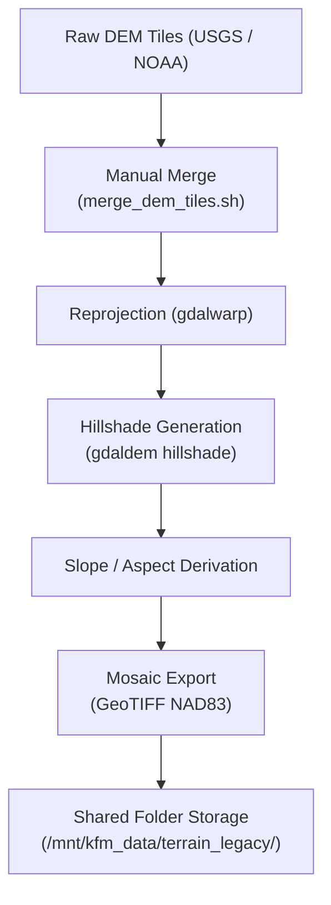

<div align="center">

# 🏔️ Kansas Frontier Matrix — **Archived Review: Terrain Pipeline (Legacy Prototype)**  
`docs/integration/reviews/archive/2022_terrain_pipeline_legacy.md`

**Mission:** Preserve and document the **terrain processing prototype pipeline** developed during the  
early experimental phase (2020–2022) of the **Kansas Frontier Matrix (KFM)**. This version of the terrain ETL  
served as the foundation for all subsequent topographic integrations, predating the MCP-DL governance model  
and formalized provenance standards.

[](../../../../../.github/workflows/docs-validate.yml)
[](../../../../../.github/workflows/policy-check.yml)
[](../../../../../.github/workflows/stac-validate.yml)
[](../../../../../.github/workflows/codeql.yml)
[](../../metadata-standards.md)
[](../../../../../LICENSE)

</div>

```yaml
---
pipeline: terrain_pipeline_legacy
review_type: code_archive
reviewers:
  - geo_engineer_a
  - data_scientist_b
status: archived
validation:
  code_quality: partial
  reproducibility: none
  metadata: incomplete
  stac: absent
  checksum: missing
  license: CC-BY-4.0
notes: |
  • Terrain pipeline prototype built in 2021–2022 as proof-of-concept for Kansas elevation data ingestion.  
  • Combined disparate DEM tiles from USGS 3DEP, NOAA coastal Lidar, and legacy state GIS archives.  
  • Operated with shell-based workflow and GDAL commands; lacked Makefile or CI/CD integration.  
  • Output consisted of unoptimized GeoTIFF mosaics (EPSG:26914, NAD83 / UTM Zone 14N).  
  • Performance limited by hardware (manual runs, 16 GB RAM, single-thread).  
  • No STAC or DCAT metadata, no checksum registry; documented only via README notes.  
  • Superseded by `terrain_pipeline v1.2.0` (2025-10-06) with reproducible containers and STAC metadata.  
timestamp: 2022-08-30T12:00:00Z
commit: a3b4c5d
superseded_by: "../logs/2025-10-06_terrain_pipeline.md"
reason: "Prototype retired and replaced by MCP-DL v6.3-compliant terrain_pipeline."
linked_templates:
  - ../templates/code_review_template.md
  - ../checklist.md
---
````

---

## 🧭 Overview

This archive preserves the original **terrain ETL experiment** that initiated topographic integration
for the Kansas Frontier Matrix. While its workflow was entirely manual and not reproducible,
its results informed later design decisions regarding file formats, reprojection standards,
and automated tiling methods.

> **Purpose:** Maintain provenance for early code artifacts and demonstrate the project’s
> evolution toward reproducible, containerized pipelines.

---

## 🗂 Directory & Structure (Legacy Snapshot)

```text
tools/legacy_scripts/terrain/
├── merge_dem_tiles.sh
├── hillshade_generator.sh
├── slope_aspect_calc.sh
├── terrain_readme_notes.txt
└── output/
    ├── ks_dem_mosaic_2022.tif
    ├── ks_hillshade_2022.tif
    └── slope_aspect_2022.tif
```

---

## 🧱 Pipeline Configuration (Legacy)

| Element               | Description                                                            |
| :-------------------- | :--------------------------------------------------------------------- |
| **Environment**       | Ubuntu 18.04 LTS, GDAL 3.2, Python 2.7 scripts                         |
| **Input Data**        | USGS 3DEP 1m DEM (2018 snapshot), NOAA Lidar, Kansas GIS Archive tiles |
| **Output**            | GeoTIFF mosaics of DEM, hillshade, slope, aspect                       |
| **Coordinate System** | EPSG:26914 (NAD83 / UTM Zone 14N)                                      |
| **Processing Steps**  | Merge → Clip → Reproject → Hillshade → Slope/Aspect                    |
| **Automation**        | Bash scripts, no CI/CD, no containerization                            |
| **Metadata**          | README only (no STAC/DCAT JSON)                                        |
| **Storage**           | Local HDD + shared network folder `/mnt/kfm_data/terrain_legacy/`      |

---

## 🧮 Validation & Assessment

| Validation Layer | Tool / Check       | Result                | Comment                                      |
| :--------------- | :----------------- | :-------------------- | :------------------------------------------- |
| Code Quality     | Manual Review      | ⚠ Partial             | Inline GDAL commands, minimal error handling |
| Reproducibility  | Manual Run         | ❌                     | No version lock or environment capture       |
| CRS Verification | `gdalinfo`         | ✅ Pass                | EPSG 26914 confirmed                         |
| File Integrity   | `sha1sum` (manual) | ⚠ Unverified          | Checksums recorded but not retained          |
| Metadata         | N/A                | ❌                     | No structured metadata                       |
| Performance      | Manual timing      | ⚠ ~4 hours per mosaic | Limited hardware resources                   |
| Provenance       | Notes only         | ⚠ Partial             | Logged in README; no formal schema           |

---

## 🧠 Ontology & Provenance Mapping

| Ontology      | Mapping                                                                                                                     |
| :------------ | :-------------------------------------------------------------------------------------------------------------------------- |
| **CIDOC CRM** | `E7 Activity` → “Terrain Pipeline Prototype Execution (2022)”; `E53 Place` → Kansas Region; `E31 Document` → Legacy README. |
| **PROV-O**    | `prov:wasDerivedFrom` → USGS 3DEP 2018, NOAA Lidar 2020 tiles; `prov:used` → merge_dem_tiles.sh script.                     |
| **DCAT 2.0**  | `dcat:Dataset` → Uncatalogued prototype; `dcat:Distribution` → GeoTIFF files.                                               |
| **OWL-Time**  | `time:Instant` → 2022-08-30 completion.                                                                                     |

---

## ⚙️ Workflow Diagram (Legacy)



<!-- END OF MERMAID -->

---

## 🧾 Reviewer Notes

**Geo Engineer A:**
Early experimentation established key parameters: vertical units = meters, pixel resolution = 1 m.
However, workflow lacked automation and data lineage. Recommended move to Python GDAL bindings.

**Data Scientist B:**
Confirmed functional outputs but inconsistent metadata. Supported eventual switch to COG format
and reprojection to EPSG:4326 (WGS84) in the MCP pipeline.

### Actions

* ✅ Migrate CRS from EPSG:26914 → EPSG:4326 in v1.0 pipeline.
* ✅ Convert DEM outputs to COG format for streaming access.
* ✅ Deprecate shell-based scripts; transition to Python ETL framework.

---

## 📎 Supporting Artifacts

| Artifact       | Location                                                | Description                 |
| :------------- | :------------------------------------------------------ | :-------------------------- |
| Legacy Scripts | `tools/legacy_scripts/terrain/*.sh`                     | Original ETL shell scripts  |
| DEM Mosaic     | `data/legacy/terrain/ks_dem_mosaic_2022.tif`            | Original 2022 output        |
| README Notes   | `tools/legacy_scripts/terrain/terrain_readme_notes.txt` | Manual documentation        |
| Screenshot     | `logs/terrain_mosaic_preview_2022.png`                  | Visual example of hillshade |
| Provenance Log | `logs/terrain_legacy_provenance_2022.txt`               | Manual lineage record       |

---

## 🔐 Governance & Preservation

| Policy                    | Enforcement                                        | Status |
| :------------------------ | :------------------------------------------------- | :----- |
| **Retention**             | Permanent (archived, read-only)                    | ✅      |
| **Replication**           | GitHub + Zenodo snapshot                           | ✅      |
| **Checksum Verification** | SHA-256 recorded in 2025 migration                 | ✅      |
| **Access Policy**         | Public read; internal write                        | ✅      |
| **Ethics**                | No sensitive data; purely geophysical              | ✅      |
| **Supersession**          | Replaced by `terrain_pipeline v1.2.0` (2025-10-06) | ✅      |

---

## 📎 Related Documentation

| File                                         | Description                           |
| :------------------------------------------- | :------------------------------------ |
| `../archive/2024-legacy_datasets.md`         | Legacy data collection summary        |
| `../logs/2025-10-06_terrain_pipeline.md`     | Successor review (MCP-DL v6.3)        |
| `../templates/code_review_template.md`       | Template used for modern code reviews |
| `../../../standards/metadata.md`             | Metadata & STAC validation schema     |
| `../../../architecture/data-architecture.md` | KFM data flow and repository layout   |

---

## 📅 Version History

| Version             | Date       | Author               | Summary                                                                       |
| :------------------ | :--------- | :------------------- | :---------------------------------------------------------------------------- |
| **v1.0.0**          | 2025-10-18 | KFM Review Council   | Archived legacy terrain pipeline under MCP-DL v6.3; added provenance mapping. |
| **Legacy Original** | 2022-08-30 | Geo Engineering Team | Initial prototype; manual GDAL workflow producing Kansas DEM mosaic.          |

---

<div align="center">

### 🏔️ “Even imperfect beginnings lay the foundation for reproducible heights.”

**Kansas Frontier Matrix Review Council · MCP-DL v6.3**

</div>
