<div align="center">

# 📜 Kansas Frontier Matrix — **Archived Review: Treaty Data Ingestion (Beta Prototype)**  
`docs/integration/reviews/archive/2022_treaty_data_ingest_beta.md`

**Mission:** Preserve the original **Treaty Data Ingestion Beta Pipeline** developed in 2022  
as a pre-MCP proof-of-concept for parsing, geocoding, and integrating historical treaties into  
the **Kansas Frontier Matrix (KFM)**. This early version laid the foundation for modern NLP-ETL pipelines  
used in the current **treaties_pipeline** but lacked full reproducibility, metadata alignment, and semantic governance.

[](../../../../../.github/workflows/docs-validate.yml)
[](../../../../../.github/workflows/policy-check.yml)
[](../../../../../.github/workflows/stac-validate.yml)
[](../../../../../.github/workflows/codeql.yml)
[](../../../../../.github/workflows/trivy.yml)
[](../../../metadata-standards.md)
[](../../../../../LICENSE)

</div>

```yaml
---
pipeline: treaty_data_ingest_beta
review_type: data_archive
reviewers:
  - historian_a
  - data_engineer_b
  - ai_specialist_c
status: archived
validation:
  code_quality: partial
  reproducibility: none
  nlp_accuracy: 0.72
  metadata: incomplete
  stac_schema: absent
  checksum: missing
  license: Public Domain / CC-BY-4.0
notes: |
  • The 2022 beta version of the treaty ingestion pipeline was the first attempt to merge treaty texts, 
    geospatial boundaries, and metadata into a unified dataset for Kansas history.  
  • Implemented using spaCy v3.2 and GeoPy for entity extraction and geocoding.  
  • Treated treaty text as unstructured OCR input; no CIDOC mapping or timeline association existed.  
  • Output produced CSV + GeoJSON layers, manually annotated by historians.  
  • Data included 17 treaties (1820–1870) covering Kaw, Osage, and Cherokee lands.  
  • Served as precursor to the MCP-DL v6.3-compliant `treaties_pipeline` (2025-10-05_kansas_treaties.md).  
  • Known issues: inconsistent CRS, missing bounding boxes, and missing validation checks.  
timestamp: 2022-07-11T10:00:00Z
commit: e9f3b5d
superseded_by: "../logs/2025-10-05_kansas_treaties.md"
reason: "Pipeline superseded by MCP-DL-compliant ingestion with provenance, AI/NLP alignment, and CIDOC CRM mapping."
linked_templates:
  - ../templates/data_review_template.md
  - ../checklist.md
---
````

---

## 🧭 Overview

The **Treaty Data Ingest Beta** pipeline was the **first digital unification** of treaty documents,
spatial boundaries, and tribal metadata for Kansas’s frontier history. Although created before KFM’s
governance protocols and standardization efforts, its experimental success directly shaped modern
architecture for **semantic ingestion**, **NER tagging**, and **timeline mapping**.

> **Purpose:** Maintain a traceable record of the first treaty ingestion prototype to support historical reproducibility
> and show KFM’s methodological evolution from exploratory scripting to MCP-DL rigor.

---

## 🗂 Directory Structure (Legacy Snapshot)

```text
tools/legacy_scripts/treaty_ingest_beta/
├── ingest_treaties.py
├── extract_entities.py
├── parse_treaty_texts.py
├── normalize_coordinates.py
├── treaty_ingest_notes.txt
└── outputs/
    ├── treaties_kansas_beta.csv
    ├── treaties_kansas_beta.geojson
    └── treaty_text_entities.json
```

---

## ⚙️ Pipeline Configuration

| Component            | Description                                                              |
| :------------------- | :----------------------------------------------------------------------- |
| **Language Stack**   | Python 3.8, spaCy 3.2, GeoPy 2.2, Pandas 1.3                             |
| **Input Data**       | Kappler’s *Indian Affairs: Laws and Treaties*, OCR text from LOC archive |
| **Processing Flow**  | Text extraction → NER tagging → Geo-referencing → CSV + GeoJSON export   |
| **Output Schema**    | Treaty name, year, tribes, lat/lon, bounding box, OCR text excerpt       |
| **CRS**              | EPSG:3857 (Web Mercator) – inconsistent projection between layers        |
| **Validation Tools** | None (manual inspection only)                                            |
| **Result Count**     | 17 treaties (1820–1870)                                                  |
| **Runtime**          | ~2.4 hours (single-thread execution)                                     |

---

## 🧠 Ontology & Semantic Alignment (Post-Migration)

| Framework     | Mapping                                                      | Implementation Notes                      |
| :------------ | :----------------------------------------------------------- | :---------------------------------------- |
| **CIDOC CRM** | E31 Document → Treaty Texts; E74 Group → Tribes              | Added retroactively in 2025 migration     |
| **PROV-O**    | prov:wasDerivedFrom → Kappler Vol. II treaty corpus          | Provenance mapping reconstructed post-hoc |
| **OWL-Time**  | time:Interval → 1820–1870                                    | Used to group temporal events             |
| **DCAT 2.0**  | dcat:Dataset → "treaties_kansas_beta"                        | Dataset catalog entry created in archive  |
| **STAC 1.0**  | stac:item → Created in `data/stac/legacy_treaties_2022.json` | Retrofitted schema in 2025 migration      |

---

## 🧩 Workflow Diagram (Legacy)

```mermaid
flowchart TD
    A["Treaty Texts (Kappler / OCR)"] --> B["spaCy NER Model\n(Entity Extraction)"]
    B --> C["GeoPy Geocoder\n(Convert Place → Lat/Lon)"]
    C --> D["Manual Review\n(Historian corrections)"]
    D --> E["Export to CSV + GeoJSON"]
    E --> F["Archive Outputs\n(treaties_kansas_beta.*)"]
```



<!-- END OF MERMAID -->

---

## 🧾 Reviewer Notes

**Historian A:**
This was the first project milestone linking treaties, tribes, and geography.
Data integrity incomplete but pioneering in linking text to map for Kansas history.

**Data Engineer B:**
Pipeline lacked reproducibility (no pinned dependencies, no virtual environment).
Strong foundation for later ETL modularization.

**AI Specialist C:**
spaCy model struggled with OCR noise; entity accuracy averaged ~0.72 F1.
Future models required better training data and cleaning pipeline (achieved in v3).

### Actions

* ✅ Migrate OCR cleaning logic into new NLP preprocessor.
* ✅ Deprecate GeoPy single-thread geocoder; switch to async service in MCP pipeline.
* ✅ Integrate historical name resolution table for tribal and geographic variants.

---

## 📎 Supporting Artifacts

| Artifact               | Location                                       | Description                   |
| :--------------------- | :--------------------------------------------- | :---------------------------- |
| Treaty Output CSV      | `data/legacy/treaties_kansas_beta.csv`         | Prototype dataset output      |
| GeoJSON Polygons       | `data/legacy/treaties_kansas_beta.geojson`     | Boundaries with lat/lon       |
| Entity Extraction Logs | `logs/entity_extract_treaty_beta_2022.txt`     | NER output diagnostics        |
| OCR Text Corpus        | `data/legacy/treaty_texts_ocr/`                | Source documents              |
| Notes                  | `tools/legacy_scripts/treaty_ingest_notes.txt` | Developer and historian notes |

---

## 🔐 Governance & Preservation

| Policy                  | Status                                     | Comment                                |
| :---------------------- | :----------------------------------------- | :------------------------------------- |
| **Retention**           | ✅ Permanent archive                        | Historical significance                |
| **Replication**         | ✅ GitHub + Zenodo snapshot                 | DOI assigned (10.5281/zenodo.10000003) |
| **Checksum Validation** | ⚠ Retrofitted in 2025 migration            | Added via archive STAC index           |
| **Access Policy**       | ✅ Public (research only)                   | Open data under CC-BY 4.0              |
| **Ethics Compliance**   | ✅ Approved                                 | No personal or sensitive data used     |
| **Supersession**        | ✅ Replaced by `treaties_pipeline v1.1.0`   | MCP-DL compliant                       |
| **Preservation Policy** | ✅ Retained under MCP-DL v6.3 archive rules | Reviewed annually                      |

---

## 📎 Related Documentation

| File                                         | Description                             |
| :------------------------------------------- | :-------------------------------------- |
| `../archive/2024-legacy_datasets.md`         | Legacy dataset collection summary       |
| `../logs/2025-10-05_kansas_treaties.md`      | Successor ingestion review              |
| `../templates/data_review_template.md`       | Template used for modern treaty reviews |
| `../../../standards/metadata.md`             | STAC & metadata schema                  |
| `../../../architecture/data-architecture.md` | Repository structure and data flow      |
| `../../../standards/markdown_rules.md`       | Markdown style & compliance guide       |

---

## 📅 Version History

| Version               | Date       | Author                | Summary                                                                                 |
| :-------------------- | :--------- | :-------------------- | :-------------------------------------------------------------------------------------- |
| **v1.0.0 (Archived)** | 2025-10-18 | KFM Review Council    | Archived and migrated to MCP-DL v6.3 schema; provenance and semantic mappings restored. |
| **Legacy Original**   | 2022-07-11 | Data Integration Team | Beta pipeline completed; 17 treaty records generated; limited validation.               |

---

<div align="center">

### 📜 “Even the roughest drafts of history become the foundation for its preservation.”

**Kansas Frontier Matrix Review Council · MCP-DL v6.3**

</div>
