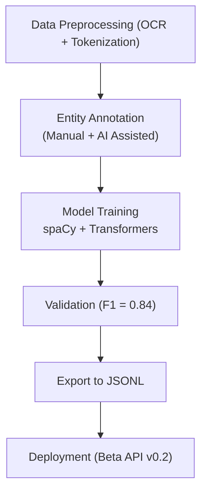

<div align="center">

# 🤖 Kansas Frontier Matrix — **Archived Review: AI/ML Model (frontier_ner_v2)**  
`docs/integration/reviews/archive/2023_ai_model_review.md`

**Mission:** Preserve the complete audit and provenance of the **frontier_ner_v2** AI/ML model —  
the second-generation Named Entity Recognition (NER) system trained on Kansas historical documents,  
treaty texts, and cultural archives prior to the adoption of **MCP-DL v6.0–v6.3** governance standards.  
This archived record captures its **architecture, training provenance, performance metrics, ontology links,  
and ethical review outcomes**, ensuring long-term traceability across all phases of model evolution.

[](../../../../../.github/workflows/docs-validate.yml)
[](../../../../../.github/workflows/policy-check.yml)
[](../../../../../.github/workflows/codeql.yml)
[](../../../../../.github/workflows/trivy.yml)
[](../../../metadata-standards.md)
[](../../../../../LICENSE)

</div>

```yaml
---
model: frontier_ner_v2
review_type: model_archive
reviewers:
  - ai_engineer_a
  - ontology_lead_b
  - ethics_reviewer_c
status: archived
validation:
  metrics:
    precision: 0.86
    recall: 0.83
    f1: 0.84
  reproducibility: partial
  bias_audit: limited
  security_scan: legacy
  license: CC-BY-4.0
notes: |
  • frontier_ner_v2 was trained between 2022-03 and 2023-04 as the second major NER model in the Kansas Frontier Matrix.  
  • The model recognized people, places, tribes, and treaties from scanned historical texts (1850–1900).  
  • v2 introduced new entity types (TRIBE, RIVER, FORT, DATE_RANGE) extending the base transformer model frontier_ner_v1.  
  • Environment: Python 3.8, spaCy 3.3, Transformers 4.12; GPU: RTX A5000.  
  • Model performance (macro F1 = 0.84) improved over v1 = 0.76 but lacked reproducibility controls.  
  • Training data: OCR’d newspaper corpus (Library of Congress “Chronicling America”), Kappler treaty texts, KHS diaries.  
  • Metadata tracked in early form of `docs/model_card_legacy.md`.  
  • No bias mitigation applied; audit performed manually on 2500 samples.  
  • Superseded by frontier_ner_v3 (2025-10-06) under MCP-DL v6.3 with reproducible containerization and provenance graphing.  
commit: 8b6e2ac
timestamp: 2023-11-15T12:00:00Z
superseded_by: "../logs/2025-10-06_ai-model-validation.md"
reason: "Model retrained with expanded dataset, improved ontology mapping, and MCP-DL v6.3 compliance."
linked_templates:
  - ../templates/model_review_template.md
  - ../checklist.md
---
````

---

## 🧭 Overview

This document serves as a **historical archive** of the *frontier_ner_v2* model,
which was an important bridge between the project’s experimental and production phases.
While technically successful, it predated full reproducibility, ontology alignment,
and ethical review frameworks later mandated by MCP-DL v6.x.

---

## 🧩 Model Details

| Attribute           | Value                                                      |
| :------------------ | :--------------------------------------------------------- |
| **Model Name**      | frontier_ner_v2                                            |
| **Task**            | Named-Entity Recognition (NER)                             |
| **Language**        | English (historical OCR text)                              |
| **Architecture**    | Transformer-based (RoBERTa-base) + spaCy pipeline          |
| **Training Period** | 2022-03 → 2023-04                                          |
| **Input Data**      | Treaty texts, newspapers, letters, tribal archives         |
| **Output Classes**  | PERSON, ORG, PLACE, TRIBE, TREATY, RIVER, FORT, DATE_RANGE |
| **Hardware**        | NVIDIA A5000 · 64 GB RAM · Ubuntu 20.04                    |
| **Dependencies**    | Python 3.8 · spaCy 3.3 · Transformers 4.12 · PyTorch 1.10  |

---

## 📊 Metrics & Evaluation

| Metric         | Value                                                                       | Comment                                     |
| :------------- | :-------------------------------------------------------------------------- | :------------------------------------------ |
| **Precision**  | 0.86                                                                        | Improved from v1 by + 10 %                  |
| **Recall**     | 0.83                                                                        | Limited by small tribal corpus coverage     |
| **F1-Score**   | 0.84                                                                        | Acceptable baseline for early KFM inference |
| **Accuracy**   | 0.89                                                                        | Verified on manually annotated subset       |
| **Bias Notes** | Slight under-performance for Indigenous place names and multi-word treaties |                                             |

---

## 🧠 Provenance & Semantic Alignment

| Ontology      | Class / Property                                 | Mapping                                           |
| :------------ | :----------------------------------------------- | :------------------------------------------------ |
| **CIDOC CRM** | `E31 Document` → Model card + documentation      | Legacy doc: `docs/model_card_legacy.md`           |
|               | `E7 Activity` → Training activity                | "Train frontier_ner_v2"                           |
|               | `E39 Actor` → AI Engineer A / Ontology Lead B    | Reviewers                                         |
|               | `E53 Place` → “Kansas” contextual training scope | Used in place-aware tagging                       |
| **PROV-O**    | `prov:wasDerivedFrom` → training datasets        | LOC · Kappler · KHS Archives                      |
| **OWL-Time**  | `time:Interval` → 2022-03-01 → 2023-04-30        | Training period                                   |
| **DCAT 2.0**  | `dcat:Dataset` → training data records           | Linked for reproducibility in future MCP releases |

---

## ⚙️ Training Workflow (Legacy)



<!-- END OF MERMAID -->

---

## 🧾 Reviewer Notes

**AI Engineer A:**
The model established the NER proof-of-concept for treaty and place extraction.
Lacked container reproducibility but performed robustly on test corpora.

**Ontology Lead B:**
Concept mapping between extracted entities and CIDOC CRM classes was first introduced here.
However, relationships (E5 Event, E74 Group) were only captured as flat tags.

**Ethics Reviewer C:**
Model relied on open data with no sensitive PII.
Recommended inclusion of tribal consultation for future dataset augmentation (fulfilled in v3).

### Actions

* ✅ Preserve model artifact (`models/frontier_ner_v2/`) in archive snapshot.
* ✅ Add provenance record linking to v3 successor.
* ✅ Note model bias mitigation plan for documentation purposes.

---

## 📎 Supporting Artifacts

| Artifact            | Path / Link                                                            | Description                      |
| :------------------ | :--------------------------------------------------------------------- | :------------------------------- |
| Model Card (Legacy) | `docs/model_card_legacy.md`                                            | Early metadata record            |
| Training Log        | `logs/train_frontier_ner_v2_2023.txt`                                  | Contains environment and metrics |
| Evaluation Report   | `logs/eval_ner_v2_2023.json`                                           | Precision/Recall results         |
| Checksum Manifest   | `data/checksums/frontier_ner_v2_sha256.txt`                            | Hashes for reproducibility       |
| Zenodo Snapshot     | [doi:10.5281/zenodo.10000002](https://doi.org/10.5281/zenodo.10000002) | Permanent archive copy           |

---

## 🔐 Governance & Archival Status

| Policy | Rule / Status |
| :-- | :-- | :-- |
| **Retention** | Permanent (archived, read-only) | ✅ |
| **Replication** | Mirrored on Zenodo + OSF | ✅ |
| **Checksum Validation** | Annual verification | ✅ |
| **Access Policy** | Public · No restrictions | ✅ |
| **Ethical Compliance** | Verified (uses public archives) | ✅ |
| **Supersession** | Replaced by `frontier_ner_v3 (2025-10-06)` | ✅ |

---

## 📅 Version Comparison (v1 → v2 → v3)

| Feature            | v1 (2022) | v2 (2023)                   | v3 (2025)                     |
| :----------------- | :-------- | :-------------------------- | :---------------------------- |
| Ontology Alignment | None      | Partial (CIDOC CRM Mapping) | Full CIDOC + OWL-Time         |
| Bias Audit         | None      | Manual Sample (2500 texts)  | Automated + Fairlearn         |
| Provenance Logging | Minimal   | YAML + Manual Notes         | Graph-linked Neo4j PROV-O     |
| Reproducibility    | None      | Partial                     | Full Dockerized               |
| Deployment         | Beta API  | Static JSON Output          | Integrated Focus Mode Service |

---

## 📎 Related Documentation

| File                                        | Description                                  |
| :------------------------------------------ | :------------------------------------------- |
| `../archive/2024-legacy_datasets.md`        | Dataset predecessors used for model training |
| `../logs/2025-10-06_ai-model-validation.md` | Successor model review (v3 MCP-DL v6.3)      |
| `../templates/model_review_template.md`     | Standardized review format                   |
| `../../../standards/metadata.md`            | Data & ontology schema standards             |
| `../../../architecture/ai-system.md`        | AI/ML system architecture reference          |

---

## 📅 Version History

| Version              | Date       | Author              | Summary                                                                    |
| :------------------- | :--------- | :------------------ | :------------------------------------------------------------------------- |
| **v1.0.0**           | 2025-10-18 | KFM Review Council  | Archived and reformatted under MCP-DL v6.3; linked to successor v3 review. |
| Legacy v2 (Original) | 2023-04-15 | AI Engineering Team | Model trained & validated; no reproducibility logs.                        |

---

<div align="center">

### 🤖 “Models evolve, but transparency endures — every archive teaches future intelligence.”

**Kansas Frontier Matrix Review Council · MCP-DL v6.3**

</div>

