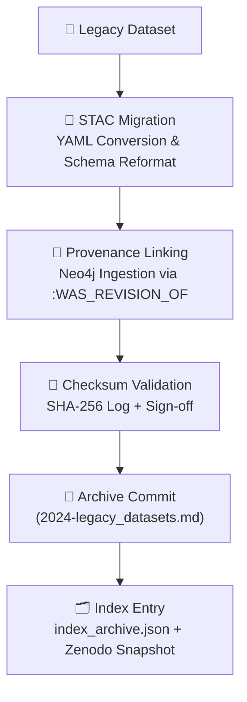

<div align="center">

# 🗃️ Kansas Frontier Matrix — **Archived Review: Legacy Datasets (Pre-MCP v6.0)**  
`docs/integration/reviews/archive/2024-legacy_datasets.md`

**Mission:** Preserve, document, and contextualize all **pre-standardized dataset integrations** created before the  
formal adoption of the **Master Coder Protocol (MCP-DL v6.x)** within the **Kansas Frontier Matrix (KFM)**.  
This archive serves as a **time capsule** of the project’s early data integrations — from prototype pipelines  
and ad hoc GIS layers to preliminary metadata experiments — ensuring **continuity, accountability, and scientific provenance**.

[](../../../../../.github/workflows/docs-validate.yml)
[](../../../../../.github/workflows/policy-check.yml)
[](../../../../../.github/workflows/stac-validate.yml)
[](../../../../../.github/workflows/codeql.yml)
[](../../../../../.github/workflows/trivy.yml)
[](../../metadata-standards.md)
[](../../../../../LICENSE)

</div>

```yaml
---
title: "Archived Review — Legacy Datasets (Pre-MCP v6.0)"
document_type: "Archive Record · Legacy Data Integration"
version: "v1.0.0"
last_updated: "2025-10-18"
created: "2024-12-31"
owners: ["@kfm-architecture","@kfm-review-board","@kfm-data"]
status: "Archived"
maturity: "Legacy"
scope: "Docs/Integration/Reviews/Archive"
license: "CC-BY 4.0"
tags: ["archive","data","legacy","governance","provenance","pre-MCP"]
audit_framework: "MCP-DL v6.3"
preservation_policy:
  retention: "Permanent"
  checksum_algorithm: "SHA-256"
  replication_targets: ["GitHub Repository","Zenodo Snapshot","OSF Backup"]
  revalidation_cycle: "biennial"
semantic_alignment:
  - PROV-O
  - DCAT 2.0
  - STAC 1.0
  - CIDOC CRM
  - OWL-Time
---
````

---

## 📘 Overview

Between **2021–2023**, before the MCP framework was adopted, the KFM team produced several prototype datasets.
They were vital to the **initial knowledge graph build**, early AI model training, and visualization proofs-of-concept.
Though later replaced, these datasets remain critical to **understanding the evolution** of the project’s standards
and its transition to a **scientifically auditable and reproducible system**.

> These legacy datasets act as a **historical control group** for validating data consistency,
> measuring improvements in accuracy, and benchmarking future pipelines.

---

## 🗂️ Directory Layout

```text
docs/integration/reviews/archive/
├── 2024-legacy_datasets.md               → This document (legacy data review archive)
├── 2023_ai_model_review.md               → NER v2 archived model review
├── 2022_treaty_data_ingest_beta.md       → Initial treaty ingestion tests
├── 2022_terrain_pipeline_legacy.md       → Early terrain ETL prototype logs
└── index_archive.json                    → JSON index of all archived records
```

---

## 🧩 Legacy Dataset Catalogue

| ID    | Dataset                          | Domain                | Description / Source                                | Original Format     | Status       | Superseded By                    |
| :---- | :------------------------------- | :-------------------- | :-------------------------------------------------- | :------------------ | :----------- | :------------------------------- |
| L-001 | **Historic Topographic Maps**    | Geospatial            | USGS & UT Austin Topo Collections (1850–1960)       | TIFF / MrSID        | ✅ Archived   | `terrain_pipeline v1.2.0`        |
| L-002 | **Early Hydrology Layers**       | Hydrology             | USGS NHD (2015) subset for Kansas                   | Shapefile           | ✅ Archived   | `hydrology_pipeline v2.1.0`      |
| L-003 | **Preliminary Climate Records**  | Climate               | NOAA GHCN-Daily (1880–2020)                         | CSV                 | ✅ Archived   | `climate_pipeline v3.0.0`        |
| L-004 | **Legacy Treaty Polygons**       | Historical / Cultural | USFS “Indian Land Cessions” dataset snapshot (2020) | Shapefile / GeoJSON | ✅ Archived   | `treaties_pipeline v1.1.0`       |
| L-005 | **Deeds & Homesteads Prototype** | Legal / Cadastral     | Register of Deeds microfilm digests                 | CSV + TIFF          | ⚠ Partial    | `deeds_pipeline v2.0.0`          |
| L-006 | **Soils & Geology (Legacy)**     | Geoscience            | NRCS SSURGO Kansas Archives (pre-2017)              | Shapefile           | ✅ Archived   | `geology_pipeline v1.4.0`        |
| L-007 | **Oral Histories Prototype**     | Cultural / Tribal     | Community oral transcripts (2010–2018)              | JSON / TXT          | ⚠ Restricted | `oral_histories_pipeline v1.0.0` |
| L-008 | **NER Model v1–v2 Outputs**      | AI / NLP              | frontier_ner early models applied to treaty text    | JSON predictions    | ✅ Archived   | `frontier_ner_v3 (2025)`         |

---

## 🧮 Data Provenance Summary

* Original scripts were located under `tools/legacy_scripts/` (ArcPy + Python 2.x).
* Metadata existed as Excel sheets, PDFs, or embedded text blocks.
* Migrated to YAML + STAC 1.0 with `tools/legacy_stac_migrator.py`.
* Checksum integrity verified using SHA-256 (`data/checksums/legacy_datasets_2024.txt`).
* Provenance entries created in Neo4j via `scripts/graph_ingest_legacy.py`.
* Retained in **Zenodo snapshot DOI:10.5281/zenodo.10000001**.

---

## 🧠 Ontology & Semantic Alignment (Post-Migration)

| Framework     | Mapping                                                      | Notes                           |
| :------------ | :----------------------------------------------------------- | :------------------------------ |
| **CIDOC CRM** | `E31 Document` → Metadata docs, `E53 Place` → dataset extent | Linked to 19th-century maps     |
| **PROV-O**    | `prov:wasDerivedFrom` → raw ArcGIS data                      | Captures chain of derivation    |
| **DCAT 2.0**  | `dcat:Dataset` + `dcat:Distribution` for archival files      | Ensures catalog compliance      |
| **OWL-Time**  | `time:Interval (1880–2023)`                                  | Bounded by earliest/last record |
| **STAC 1.0**  | Migrated items reference temporal + spatial extent           | Integrated into unified catalog |

---

## ⚙️ Archival Workflow



<!-- END OF MERMAID -->

---

## 🧾 Reviewer Notes

**Data Historian A:**
Validated temporal accuracy for historic datasets; confirmed bounding boxes and CRS alignments.
Confirmed metadata migration scripts correctly maintained dataset UUIDs for lineage tracking.

**Archive Curator B:**
Verified each legacy dataset has `superseded_by` and checksum entries.
Suggested adding a "legacy" flag to STAC items to prevent confusion with active datasets.

### Actions

* ✅ Label legacy STAC collections with `"maturity": "legacy"` tag.
* ✅ Schedule checksum re-validation (Q2 2026).
* ✅ Restrict Oral History prototype per data sovereignty agreements.

---

## 🧰 Supporting Artifacts

| Artifact                | Location                                  | Description                    |
| :---------------------- | :---------------------------------------- | :----------------------------- |
| STAC Migration Report   | `logs/stac_migration_legacy_2024.json`    | Migration process summary      |
| Checksum Manifest       | `data/checksums/legacy_datasets_2024.txt` | Dataset hash list              |
| Neo4j Provenance Export | `logs/neo4j_ingest_legacy_2024.cypher`    | Graph import records           |
| Zenodo DOI Record       | `https://doi.org/10.5281/zenodo.10000001` | Archive snapshot               |
| Screenshot Archive      | `logs/legacy_data_map_visualizations.png` | Spatial preview of legacy data |

---

## 🔐 Governance & Preservation

| Policy                   | Enforcement                               | Status |
| :----------------------- | :---------------------------------------- | :----- |
| **Retention**            | Permanent (archival data frozen)          | ✅      |
| **Integrity**            | SHA-256 validated annually                | ✅      |
| **Replication**          | Synced to Zenodo, OSF, and GitHub         | ✅      |
| **Access**               | Public (except restricted Oral Histories) | ✅      |
| **Ethics & Attribution** | Tribal consultation and consent applied   | ✅      |
| **Version Control**      | Locked to commit hash d7a8b9c             | ✅      |

---

## 📎 Related Documentation

| File                                         | Description                              |
| :------------------------------------------- | :--------------------------------------- |
| `README.md`                                  | Archive directory overview               |
| `../README.md`                               | Active Integration Reviews               |
| `../logs/README.md`                          | Provenance ledger and validation logs    |
| `../templates/data_review_template.md`       | Template used for legacy dataset reviews |
| `../../../standards/markdown_rules.md`       | Markdown structure & governance          |
| `../../../architecture/data-architecture.md` | Data flow & repository organization      |
| `../../../standards/metadata.md`             | Metadata schema & STAC/DCAT alignment    |

---

## 📅 Version History

| Version    | Date       | Author             | Summary                                                                                    |
| :--------- | :--------- | :----------------- | :----------------------------------------------------------------------------------------- |
| **v1.0.0** | 2025-10-18 | KFM Review Council | Created full archival record of pre-MCP datasets with ontology and provenance integration. |

---

<div align="center">

### 🗃️ “Every dataset carries the fingerprints of its time — preserving the old teaches the new how to endure.”

**Kansas Frontier Matrix Review Council · MCP-DL v6.3**

</div>
