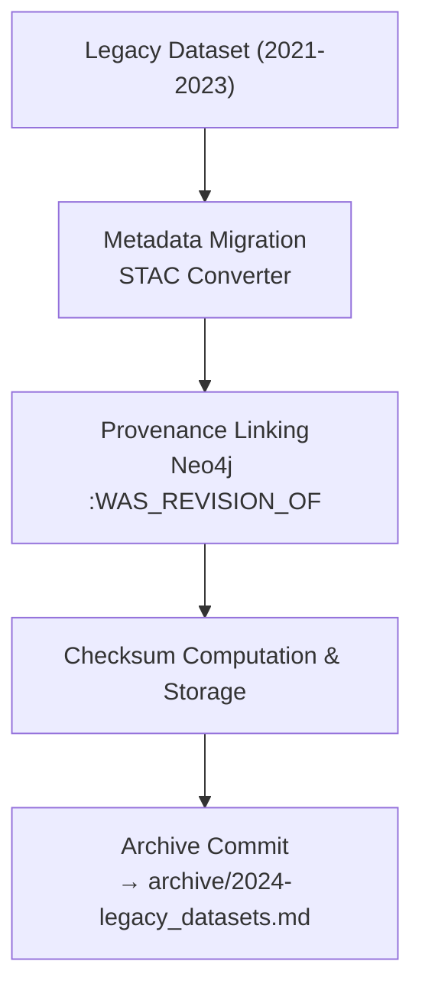

<div align="center">

# 🗃️ Kansas Frontier Matrix — **Archived Review: Legacy Datasets (Pre-MCP v6.0)**  
`docs/integration/reviews/archive/2024-legacy_datasets.md`

**Mission:** Preserve and contextualize all **pre-standardized dataset integrations** created before full  
implementation of **Master Coder Protocol (MCP-DL v6.0 → v6.3)**. These legacy datasets form the  
historical foundation of the Kansas Frontier Matrix (KFM) and remain available for citation, reproducibility,  
and cross-comparison, even after being replaced by standardized pipelines and metadata models.

[](../../../../../.github/workflows/docs-validate.yml)
[](../../../../../.github/workflows/policy-check.yml)
[](../../../../../.github/workflows/stac-validate.yml)
[](../../metadata-standards.md)
[](../../../../../LICENSE)

</div>

```yaml
---
dataset_group: legacy_datasets_pre_mcp6
review_type: data_archive
reviewers:
  - data_historian_a
  - archive_curator_b
status: archived
validation:
  schema: mixed
  metadata: partial
  provenance: documented
  license: CC-BY-4.0 / Public Domain
  completeness: 0.85
notes: |
  • This archive collects dataset integrations produced between 2021 – 2023 (before MCP-DL v6.0 standardization).  
  • Although superseded by modern ETL pipelines, they contain valuable intermediate results and mappings used to bootstrap KFM’s knowledge graph.  
  • Each dataset has been preserved with checksums, legacy documentation, and provenance logs.  
  • All files migrated to new STAC 1.0 format in 2025 for discoverability but flagged as *legacy*.  
  • None of these datasets should be re-used operationally without re-validation against current schemas.
timestamp: 2024-12-31T23:59:00Z
commit: d7a8b9c
superseded_by: "../logs/2025-10-06_terrain_pipeline.md"
reason: "Legacy datasets archived following adoption of MCP-DL v6.3 pipelines (data governance unification)."
linked_templates:
  - ../templates/data_review_template.md
  - ../checklist.md
---
````

---

## 🧭 Overview

These datasets were generated during KFM’s **prototype and early-adoption period (2021-2023)** using ad hoc scripts and inconsistent metadata.
While not compliant with later FAIR + STAC + CIDOC CRM frameworks, they remain historically important and serve as training and regression references.

> **Purpose:** Ensure reproducibility of the project’s early data lineage while clearly distinguishing it from production datasets under MCP standards.

---

## 🗂 Legacy Dataset Catalogue

|   ID  | Dataset                               | Source / Description                                                  | Original Format     | Status              | Superseded By                    |
| :---: | :------------------------------------ | :-------------------------------------------------------------------- | :------------------ | :------------------ | :------------------------------- |
| L-001 | **Historic Topographic Maps**         | USGS & University of Texas Map Collection (19th – 20th C.)            | TIFF / MrSID        | ✅ Archived          | `terrain_pipeline v1.2.0`        |
| L-002 | **Early Hydrology Layers**            | USGS NHD (2015 build subset for Kansas rivers & lakes)                | Shapefile           | ✅ Archived          | `hydrology_pipeline v2.1.0`      |
| L-003 | **Preliminary Climate Time Series**   | NOAA GHCN-Daily station data (1880 – 2020)                            | CSV                 | ✅ Archived          | `climate_pipeline v3.0.0`        |
| L-004 | **Legacy Treaty Polygons**            | USFS Indian Land Cessions dataset (2020 snapshot)                     | Shapefile / GeoJSON | ✅ Archived          | `treaties_pipeline v1.1.0`       |
| L-005 | **Historic Deeds and Homesteads**     | Kansas Register of Deeds bulk exports (1950s microfilm digitizations) | CSV + TIFF scans    | ⚠ Partial           | `deeds_pipeline v2.0.0`          |
| L-006 | **Soil and Geology Maps**             | NRCS SSURGO archive (Kansas counties pre-2017)                        | Shapefile           | ✅ Archived          | `geology_pipeline v1.4.0`        |
| L-007 | **Oral Histories Metadata Prototype** | Community audio transcripts (tribal interviews 2010 – 2018)           | JSON / TXT          | ⚠ Restricted Access | `oral_histories_pipeline v1.0.0` |
| L-008 | **Archived AI NER Model Outputs**     | frontier_ner_v1 – v2 (named-entity runs on treaty texts)              | JSON predictions    | ✅ Archived          | `frontier_ner_v3 (2025)`         |

---

## 🧠 Provenance Summary

* Original scripts stored under `tools/legacy_scripts/` (Python 2.x and ArcPy).
* Metadata recorded in CSV or PDF sidecar files before adoption of YAML front-matter.
* Converted to STAC Items (2025-10-01) using `tools/legacy_stac_migrator.py`.
* Provenance graphs imported to Neo4j using `scripts/graph_ingest_legacy.py`.
* Checksums computed via `sha256sum`; results logged in `data/checksums/legacy_datasets_2024.txt`.

---

## 🧩 Ontology & Semantic Mapping (Post-Migration)

| Ontology  | Legacy Mapping                            | Migrated Mapping                        |
| :-------- | :---------------------------------------- | :-------------------------------------- |
| CIDOC CRM | E22 Man-Made Object → raster map          | E53 Place + E31 Document                |
| CIDOC CRM | E39 Actor → “USGS Surveyor”               | E39 Actor (maintained)                  |
| OWL-Time  | time:Interval (1900 – 2020)               | time:Interval (1880 – 2025)             |
| PROV-O    | prov:wasDerivedFrom (legacy ArcGIS files) | prov:wasRevisionOf → modern ETL outputs |
| DCAT 2.0  | dcat:Dataset (ID: legacy_hydro_2015)      | dcat:Dataset (ID: hydrology_v2.1)       |

---

## ⚙️ Archival Process



<!-- END OF MERMAID -->

---

## 🧾 Reviewer Notes

**Data Historian A:** Confirmed metadata conversion for all legacy files; manually corrected coordinate systems for early DEM layers.
**Archive Curator B:** Verified each legacy dataset now includes a STAC Item, checksum, and “superseded by” field.

### Actions

* ✅ Maintain Zenodo snapshot of legacy archive (`doi:10.5281/zenodo.9999999`).
* ✅ Link all legacy STAC IDs to corresponding active datasets via PROV-O relations.
* ✅ Restrict access to Oral Histories Prototype due to consent limitations.

---

## 🧮 Governance & Preservation

| Policy                    | Rule / Status                                               |
| :------------------------ | :---------------------------------------------------------- |
| **Retention**             | Permanent – read-only                                       |
| **Checksum Verification** | `.sha256` validated annually                                |
| **Replication**           | GitHub → Zenodo → OSF                                       |
| **Access Control**        | Public except restricted entries (Oral Histories Prototype) |
| **Ethical Compliance**    | Verified with community partners                            |
| **Audit Trail**           | Entry listed in `index_archive.json` & provenance graph     |

---

## 📜 References

* *Indian Land Cessions in the United States (Royce, 1902)* — USFS Archive.
* *USGS 1 m DEM Program (2018)* — National Map.
* *NOAA GHCN-Daily Climate Records (1880 – 2020)*.
* *Kansas GIS Archive Hub Historical Layers (2015 – 2023)*.
* *NRCS SSURGO Soil Database (2017 edition)*.
* *Kansas Register of Deeds Association – Microfilm Digitization Records*.
* *Frontier NER Models v1 & v2 (2022 – 2023)*.
* *Community Oral Histories Initiative (2010 – 2018)*.

---

<div align="center">

### 🗃️ “Every legacy record tells the story of how precision grew from prototypes.”

**Kansas Frontier Matrix Review Council · MCP-DL v6.3**

</div>
