<div align="center">

# 🗃️ Kansas Frontier Matrix — **Archived Integration Reviews**  
`docs/integration/reviews/archive/README.md`

**Mission:** Preserve, contextualize, and provide access to all **superseded or legacy review records**  
within the **Kansas Frontier Matrix (KFM)**. This archive ensures that older versions of datasets, models,  
and documentation reviews remain **traceable, citable, and verifiable**, maintaining full continuity  
of the project’s scientific and governance history under **Master Coder Protocol (MCP-DL v6.3)**.

[](../../../../.github/workflows/docs-validate.yml)
[](../../../../.github/workflows/policy-check.yml)
[](../logs/README.md)
[](../../metadata-standards.md)
[](../../../../LICENSE)

</div>

```yaml
---
title: "Archived Integration Reviews"
document_type: "Governance · Archive"
version: "v1.0.0"
last_updated: "2025-10-18"
created: "2025-10-10"
owners: ["@kfm-architecture","@kfm-review-board","@kfm-docs"]
status: "Stable"
maturity: "Production"
scope: "Docs/Integration/Reviews/Archive"
license: "CC-BY 4.0"
tags: ["archive","audit","governance","review","legacy","provenance"]
audit_framework: "MCP-DL v6.3"
preservation_policy:
  retention: "Permanent"
  revalidation_cycle: "every 24 months"
  checksum_algorithm: "SHA-256"
  replication_targets: ["GitHub Repository","Zenodo Snapshot","OSF Backup"]
semantic_alignment:
  - PROV-O
  - DCAT 2.0
  - STAC 1.0
  - CIDOC CRM
  - OWL-Time
---
````

---

## 📘 Overview

This directory contains **historical integration review files** that have been superseded, replaced, or deprecated.
Each archived review log remains **permanently preserved** for reproducibility, provenance verification, and academic citation.

Archived entries retain their **original structure, YAML metadata, reviewer notes, and validation evidence**
and are tagged with a `superseded_by` reference pointing to their current version.

> **Purpose:** To provide long-term transparency into the evolution of the Kansas Frontier Matrix, ensuring that
> no validation, review, or scientific decision is lost as the project advances.

---

## 🗂️ Directory Layout

```text
docs/integration/reviews/archive/
├── README.md                               → This file (directory overview)
├── 2024-legacy_datasets.md                 → Superseded dataset integration reviews (pre-v1.0)
├── 2023_ai_model_review.md                 → Outdated AI/ML model validation record (frontier_ner_v2)
├── 2022_terrain_pipeline_legacy.md         → Early prototype pipeline log (terrain_pipeline v0.8)
├── 2022_treaty_data_ingest_beta.md         → Initial treaty ingest proof-of-concept review
└── index_archive.json                      → Machine-readable index of archived reviews
```

---

## 🧩 Archive Record Schema

Each archived file follows the same YAML metadata structure as active reviews but adds two additional fields:

```yaml
superseded_by: "../logs/2025-10-06_terrain_pipeline.md"
reason: "Pipeline restructured for v1.2.0 release; old methodology retained for historical traceability."
```

Archived logs remain read-only and are not altered after archival.

---

## 🧮 Governance & Provenance Model

```mermaid
flowchart LR
    A["🧩 Active Review Log"] --> B["📦 Superseded (Archived)"]
    B --> C["🔗 Linked in index_archive.json"]
    C --> D["🧠 Cited in Provenance Graph (Neo4j · PROV-O)"]
    D --> E["🏛️ Accessible via Docs site / Zenodo snapshot"]
```



<!-- END OF MERMAID -->

Each archived record remains discoverable and queryable within:

* **GitHub repository (`docs/integration/reviews/archive/`)**
* **Neo4j Knowledge Graph** (via `:ARCHIVED_VERSION_OF` relationships)
* **Zenodo & OSF snapshots** for long-term digital preservation

---

## 🧠 Semantic & Metadata Mapping

| Ontology      | Entity / Property                    | Implementation                          |
| :------------ | :----------------------------------- | :-------------------------------------- |
| **CIDOC CRM** | `E78 Curated Holding`                | Archived reviews directory              |
|               | `E7 Activity` → Review/Audit process | Review instance recorded                |
| **PROV-O**    | `prov:wasRevisionOf`                 | Links archived record to active version |
|               | `prov:wasAttributedTo`               | Reviewer names preserved                |
| **DCAT 2.0**  | `dcat:Dataset`                       | Archive dataset collection              |
| **STAC 1.0**  | `stac:collection`                    | Archived validation artifacts           |
| **OWL-Time**  | `time:Instant`                       | Timestamp of archival event             |

---

## 🧾 Validation & Index Maintenance

| Step | Description                                            | Tool / Workflow                                            |
| :--- | :----------------------------------------------------- | :--------------------------------------------------------- |
| 1️⃣  | Archive event triggered (on merge/close of new review) | GitHub Action `archive_review.yml`                         |
| 2️⃣  | Move old log to `/archive/`                            | Python automation script `tools/archive_log.py`            |
| 3️⃣  | Append entry to `index_archive.json`                   | CI workflow with schema validation                         |
| 4️⃣  | Validate YAML and JSON syntax                          | `yamllint` / `jq`                                          |
| 5️⃣  | Generate Zenodo snapshot                               | `make archive-snapshot`                                    |
| 6️⃣  | Update provenance graph                                | `scripts/graph_ingest.py` (adds :ARCHIVED_VERSION_OF link) |

---

## 🧮 Example Archive Entry

**File:** `2023_ai_model_review.md`

```yaml
model: frontier_ner_v2
review_type: model
reviewers: ["@kfm-ai","@kfm-ontology"]
status: superseded
validation:
  metrics:
    precision: 0.86
    recall: 0.83
    f1: 0.84
superseded_by: "../logs/2025-10-06_ai-model-validation.md"
reason: "Replaced by frontier_ner_v3 using improved dataset and ontology mapping."
timestamp: 2023-11-15T12:00:00Z
commit: 4fa27b1
linked_templates:
  - "../templates/model_review_template.md"
  - "../checklist.md"
```

---

## 🔐 Preservation & Access

| Policy                | Rule / Status                                                 |
| :-------------------- | :------------------------------------------------------------ |
| **Retention**         | Permanent; archived logs cannot be deleted                    |
| **Integrity**         | Each file has SHA-256 checksum stored in `index_archive.json` |
| **Replication**       | Mirror stored in Zenodo (DOI-assigned) & OSF                  |
| **Access Level**      | Public read / restricted write (Integration Board only)       |
| **Ethics Compliance** | All logs reviewed for sensitive content before release        |
| **Audit Trail**       | Archive changes captured in Git history & CI metadata         |

---

## 📎 Related Documentation

| File                                         | Description                                  |
| :------------------------------------------- | :------------------------------------------- |
| `../README.md`                               | Active Integration Reviews overview          |
| `../logs/README.md`                          | Active review logs and audit ledger          |
| `../checklist.md`                            | Integration Board compliance checklist       |
| `../templates/`                              | Templates for new review logs                |
| `../../metadata-standards.md`                | Metadata, ontology, and governance standards |
| `../../../architecture/data-architecture.md` | Repository and data flow overview            |
| `../../../standards/markdown_rules.md`       | Markdown structure and compliance rules      |

---

## 📅 Version History

| Version    | Date       | Author                 | Summary                                                            |
| :--------- | :--------- | :--------------------- | :----------------------------------------------------------------- |
| **v1.0.0** | 2025-10-18 | KFM Documentation Team | Initial creation of archive index and structure under MCP-DL v6.3. |

---

<div align="center">

### 🗃️ “To preserve our progress is to preserve our proof — every archive is a footprint of truth.”

**Kansas Frontier Matrix Review Council · MCP-DL v6.3**

</div>
