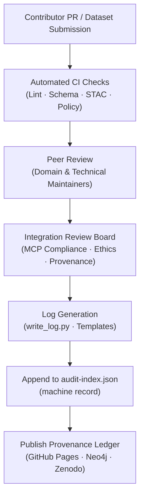

<div align="center">

# 🧾 Kansas Frontier Matrix — **Review Logs & Provenance Records**  
`docs/integration/reviews/logs/README.md`

**Mission:** Maintain a complete, immutable, and machine-readable trail of all **dataset, code, model, and documentation reviews**  
conducted under the **Kansas Frontier Matrix (KFM)**. These logs form the **provenance ledger** of the project,  
providing verifiable evidence of compliance, validation, and peer review according to **Master Coder Protocol (MCP-DL v6.3)**.

[](../../../../.github/workflows/site.yml)
[](../../../../.github/workflows/docs-validate.yml)
[](../../../../.github/workflows/policy-check.yml)
[](../../../../.github/workflows/stac-validate.yml)
[](../../../../.github/workflows/codeql.yml)
[](../../../../.github/workflows/trivy.yml)
[](../../../metadata-standards.md)
[](../../../../LICENSE)

</div>

```yaml
---
title: "Review Logs & Provenance Records"
document_type: "Governance · Audit Ledger"
version: "v2.0.0"
last_updated: "2025-10-18"
created: "2025-10-05"
owners: ["@kfm-review-board","@kfm-security","@kfm-data","@kfm-architecture"]
status: "Stable"
maturity: "Production"
scope: "Docs/Integration/Reviews/Logs"
license: "CC-BY 4.0"
tags: ["review","audit","provenance","logs","validation","mcp"]
audit_framework: "MCP-DL v6.3"
preservation_policy:
  checksum_algorithm: "SHA-256"
  replication_targets: ["GitHub Repository","Zenodo Snapshot","OSF Backup"]
  metadata_standard: "PREMIS 3.0"
  revalidation_cycle: "annually"
semantic_alignment:
  - PROV-O
  - DCAT 2.0
  - STAC 1.0
  - CIDOC CRM
  - OWL-Time
---
````

---

## 📘 Purpose

The `logs/` directory records the **lifespan of validation and approval events**
across all domains — **data, code, models, and documentation** — in the Kansas Frontier Matrix.

Each log is:

* **Immutable**: Once created, never modified (new entries supersede old ones).
* **Provenanced**: Linked to dataset IDs, review templates, and commit hashes.
* **Machine-readable**: Parsed by CI/CD and audit tools.
* **Reproducible**: Contains enough metadata to independently verify review results.

> In essence, this directory serves as the **living memory** of the KFM peer review system.

---

## 🗂 Directory Layout

```text
docs/integration/reviews/logs/
├── 2025-10-05_kansas_treaties.md        → Data integration review log
├── 2025-10-06_ai-model-validation.md    → Model evaluation record
├── 2025-10-06_terrain_pipeline.md       → Code integration review
├── 2025-10-07_documentation_audit.md    → Documentation compliance log
├── audit-index.json                     → Machine-readable summary of all review logs
└── README.md                            → You are here
```

**Contents:**

* **Individual Logs** — One Markdown file per reviewed component (`YYYY-MM-DD_<name>.md`).
* **`audit-index.json`** — Aggregated metadata index consumed by CI/CD validation pipelines.
* **`README.md`** — Governance file describing structure, policies, and schema.

---

## 🧩 Log Schema

Every log follows a uniform **YAML front matter** schema for automated parsing and provenance tracing.

```yaml
dataset: kansas_treaties
review_type: data
reviewers:
  - historian_a
  - geospatial_b
status: approved
validation:
  stac: pass
  checksum: verified
  schema: valid
  license: CC-BY-4.0
notes: "Boundary geometries validated; metadata verified against USFS Royce dataset."
timestamp: 2025-10-05T17:30:00Z
commit: a1b2c3d
linked_templates:
  - "../templates/data_review_template.md"
  - "../checklist.md"
```

> After the YAML section, reviewers may include contextual commentary, validation screenshots,
> CLI output, or supporting attachments as Markdown.

---

## 🧭 Logging Lifecycle



<!-- END OF MERMAID -->

---

## 🧮 Logging & Automation Process

| Step | Action                     | Tool / Location                                      |
| :--- | :------------------------- | :--------------------------------------------------- |
| 1️⃣  | **Trigger on Merge**       | GitHub Action executes `tools/write_log.py`.         |
| 2️⃣  | **Pull PR Metadata**       | Extract reviewers, CI results, commit SHA.           |
| 3️⃣  | **Render Markdown Log**    | `YYYY-MM-DD_<component>.md` generated under `logs/`. |
| 4️⃣  | **Append Index Entry**     | Added to `audit-index.json` with unique ID.          |
| 5️⃣  | **Schema Validation**      | Validated via `yamllint` and `jq`.                   |
| 6️⃣  | **Publish to Main Branch** | `[bot] MCP Review Logger` commits validated log.     |

---

## 🧰 Audit Index Specification

**File:** `docs/integration/reviews/logs/audit-index.json`

```json
{
  "reviews": [
    {
      "id": "kansas_treaties_2025-10-05",
      "type": "data",
      "dataset": "kansas_treaties",
      "reviewers": ["historian_a", "geospatial_b"],
      "status": "approved",
      "timestamp": "2025-10-05T17:30:00Z",
      "commit": "a1b2c3d",
      "path": "docs/integration/reviews/logs/2025-10-05_kansas_treaties.md"
    },
    {
      "id": "terrain_pipeline_2025-10-06",
      "type": "code",
      "dataset": "terrain_pipeline",
      "reviewers": ["dev_ops_a"],
      "status": "approved",
      "timestamp": "2025-10-06T10:00:00Z",
      "commit": "c9d2e1f",
      "path": "docs/integration/reviews/logs/2025-10-06_terrain_pipeline.md"
    }
  ]
}
```

**Key Features:**

* Uses **ISO 8601** timestamps.
* All paths are **relative** to repo root.
* Validation schema enforces uniqueness of `id`.
* Consumed by CI for provenance dashboards & Neo4j imports.

---

## 🧾 Manual Log Creation

Manual entries can be created using the `write_log.py` helper:

```bash
python tools/write_log.py \
  --dataset kansas_treaties \
  --reviewers historian_a,geospatial_b \
  --status approved \
  --notes "Boundary polygons and metadata verified."
```

This script generates a new Markdown log and updates the index automatically.

---

## 🧮 Validation & CI/CD Hooks

| Validation Layer      | Tool / Workflow                         | Purpose                                  |
| :-------------------- | :-------------------------------------- | :--------------------------------------- |
| **YAML Front Matter** | `yamllint`                              | Validate syntax and required fields.     |
| **JSON Index**        | `jq` / `jsonschema`                     | Verify structure and uniqueness.         |
| **Cross-Reference**   | `scripts/docs_index_check.py`           | Ensure all logs listed in index exist.   |
| **Checksum**          | `sha256sum`                             | Validate file integrity.                 |
| **CI Workflow**       | `.github/workflows/review-validate.yml` | Run all checks automatically pre-deploy. |

---

## 🧠 Best Practices

| Principle            | Implementation                                                  |
| :------------------- | :-------------------------------------------------------------- |
| **Immutable**        | Old logs remain frozen; new corrections logged separately.      |
| **Timestamped**      | Always UTC format (`YYYY-MM-DDTHH:MM:SSZ`).                     |
| **Cross-Linked**     | Include relative links to review templates and source datasets. |
| **Transparent**      | Document reviewer handles and CI results clearly.               |
| **Machine-Readable** | Maintain proper YAML indentation and JSON validity.             |
| **Auditable**        | Each entry linked to a PR, commit hash, or GitHub Actions run.  |

---

## 🧩 Example Complete Review Log

**File:** `2025-10-05_kansas_treaties.md`

```yaml
dataset: kansas_treaties
review_type: data
reviewers:
  - historian_a
  - geospatial_b
status: approved
validation:
  stac: pass
  checksum: verified
  schema: valid
  license: CC-BY-4.0
notes: |
  Treaty boundary geometries validated against the USFS Royce dataset.
  STAC metadata conforms to v1.0.0; ontology mappings checked.
timestamp: 2025-10-05T17:30:00Z
commit: a1b2c3d
linked_templates:
  - "../templates/data_review_template.md"
  - "../checklist.md"
```

**Reviewer Notes:**

> ✔ Validated via AI-assisted NLP for treaty name cross-references.
> ✔ Confidence Score: **0.98** (AI correlation with source metadata).
> ✔ GeoJSON coordinates verified within Kansas bounding box.

---

## 🧮 Governance & Retention Policy

| Policy               | Description                                                |
| :------------------- | :--------------------------------------------------------- |
| **Retention Period** | Permanent (no deletion).                                   |
| **Versioning**       | Each file tied to commit hash in Git history.              |
| **Archival Targets** | GitHub, Zenodo, OSF, Neo4j (provenance graph).             |
| **Access Control**   | Public read; write restricted to CI automation.            |
| **Quarterly Audit**  | Integration Review Board revalidates 5% of logs quarterly. |

---

## 🔗 Related Documentation

| File                                         | Description                                            |
| :------------------------------------------- | :----------------------------------------------------- |
| `../README.md`                               | Integration Reviews overview                           |
| `../checklist.md`                            | Review Board checklist                                 |
| `../templates/`                              | Review templates for data, code, model, docs, security |
| `../../metadata-standards.md`                | STAC/DCAT/CIDOC/OWL-Time mappings                      |
| `../../../architecture/data-architecture.md` | Data flow and repository structure                     |
| `../../../standards/metadata.md`             | Metadata validation schema                             |

---

## 📅 Version History

| Version    | Date       | Author                    | Summary                                                                                     |
| :--------- | :--------- | :------------------------ | :------------------------------------------------------------------------------------------ |
| **v2.0.0** | 2025-10-18 | KFM Review Council        | Upgraded to MCP-DL v6.3; added YAML header, schema, lifecycle diagram, and index structure. |
| v1.2.0     | 2025-10-10 | KFM Governance Team       | Expanded CI/CD hooks and cross-reference validation.                                        |
| v1.1.0     | 2025-10-06 | KFM Data Integration Team | Added example log schema and audit-index.json illustration.                                 |
| v1.0.0     | 2025-10-05 | KFM Architecture Team     | Initial version — established log format and structure.                                     |

---

<div align="center">

### 🧩 “Logs are memory; provenance is proof — every review is a timestamp of trust.”

**Kansas Frontier Matrix Review Council · MCP-DL v6.3**

</div>
