<div align="center">

# 🧾 Kansas Frontier Matrix — Review Logs & Provenance Records  
`docs/integration/reviews/logs/README.md`

**Mission:** Maintain a complete, auditable trail of all dataset, code, and document reviews  
within the **Kansas Frontier Matrix (KFM)** — preserving validation evidence, provenance links,  
and contributor accountability according to **Master Coder Protocol (MCP)** standards.

[](../../../../.github/workflows/site.yml)
[](../../../../.github/workflows/stac-validate.yml)
[](../../../../.github/workflows/codeql.yml)
[](../../../../.github/workflows/trivy.yml)
[](../../../)
[](../../../../LICENSE)

</div>

---

## 📜 Overview

This directory holds **immutable review records** documenting how every integration  
(datasets, code modules, AI models, or documentation) was validated and approved.

Each record functions like a **scientific lab notebook entry** — detailing reviewers, validation results,  
license compliance, checksums, and timestamps. These logs collectively form the **project’s provenance ledger**,  
enabling full traceability for every artifact integrated into the Kansas Frontier Matrix.

---

## 🧭 Directory Structure

```

docs/integration/reviews/logs/
├── 2025-10-05_kansas_treaties.md
├── 2025-10-05_metadata-standards.md
├── 2025-10-06_ai-model-validation.md
├── audit-index.json
└── README.md  ← (you are here)

````

- **Individual Review Logs (`YYYY-MM-DD_name.md`)**  
  Contain detailed verification reports for a single dataset, document, or feature.  
- **`audit-index.json`**  
  Machine-readable summary of all reviews (used in CI validation and for provenance exports).  
- **`README.md`**  
  This document — explains how logs are created, structured, and maintained.

---

## 🧩 Log Schema

Each log follows a consistent YAML-front-matter structure for easy parsing.

```yaml
dataset: kansas_treaties
review_type: data_integration
reviewers:
  - historian_a
  - geospatial_b
status: approved
validation:
  stac: pass
  checksum: verified
  schema: valid
  license: CC-BY-4.0
notes: "Boundary geometries validated against USFS Royce dataset; metadata verified."
timestamp: 2025-10-05T17:30:00Z
commit: a1b2c3d
````

After the YAML header, reviewers can include optional commentary or linked artifacts
(such as screenshots, JSON snippets, or console logs) in Markdown.

---

## ⚙️ Review Workflow Overview

```mermaid
flowchart TD
    A["New Pull Request / Dataset"] --> B["Automated CI Checks\n(Lint · STAC · Schema)"]
    B --> C["Peer Review\n(Domain + Technical Maintainers)"]
    C --> D["Integration Review Board\nMCP Validation & Provenance"]
    D --> E["Log Generation\n(templates/write_log.py)"]
    E --> F["Commit to logs/\n+ Update audit-index.json"]
    F --> G["Public Provenance Record\n(GitHub + Docs site)"]
```



<!-- END OF MERMAID -->

---

## 🧮 Logging Process

1. **Trigger:**
   When a PR is approved and merged, a post-merge GitHub Action runs the `write_log.py` script.
2. **Template Fill:**
   The action pulls PR metadata (title, authors, reviewers, commit hash, CI results).
3. **Render Markdown:**
   Generates a new `YYYY-MM-DD_<component>.md` file under `logs/`.
4. **Append to Index:**
   Adds a new entry in `audit-index.json`.
5. **Validate:**
   Ensures unique IDs and valid JSON syntax via CI.
6. **Commit:**
   Pushes the generated files back to the `main` branch with `[bot] MCP Review Logger`.

---

## 🧰 Audit Index Format

Example: `docs/integration/reviews/logs/audit-index.json`

```json
{
  "reviews": [
    {
      "id": "kansas_treaties_2025-10-05",
      "type": "data_integration",
      "dataset": "kansas_treaties",
      "reviewers": ["historian_a", "geospatial_b"],
      "status": "approved",
      "timestamp": "2025-10-05T17:30:00Z",
      "commit": "a1b2c3d",
      "path": "docs/integration/reviews/logs/2025-10-05_kansas_treaties.md"
    },
    {
      "id": "metadata_standards_2025-10-05",
      "type": "documentation",
      "dataset": "metadata_standards",
      "reviewers": ["dev_ops", "doc_team"],
      "status": "approved",
      "timestamp": "2025-10-05T18:20:00Z",
      "commit": "b4c5d6e",
      "path": "docs/integration/reviews/logs/2025-10-05_metadata-standards.md"
    }
  ]
}
```

---

## 🧾 Creating a Manual Review Log

Contributors may also manually create or append reviews using the helper template.

```bash
python tools/write_log.py --dataset ks_hydro --reviewers user1,user2 \
  --status approved --notes "Validated against NWIS station data"
```

This command automatically timestamps the log and updates the JSON index.

---

## 🧮 Validation & CI Checks

| Layer                     | Tool                                    | Output                                  |
| :------------------------ | :-------------------------------------- | :-------------------------------------- |
| **YAML Header**           | `yamllint`                              | Syntax check                            |
| **JSON Index**            | `jq`                                    | Valid JSON schema                       |
| **Cross-reference**       | Python script                           | Confirms all logs listed in index exist |
| **Checksum Verification** | `sha256sum`                             | Ensures no tampering with logs          |
| **CI Workflow**           | `.github/workflows/review-validate.yml` | Automated validation before deployment  |

Logs failing validation trigger a CI warning and block deployment until fixed.

---

## 🧠 Best Practices

* **Immutable:** Never modify old logs; append a new correction entry instead.
* **Timestamped:** Always use UTC (`YYYY-MM-DDTHH:MM:SSZ`).
* **Consistent naming:** `YYYY-MM-DD_<component>.md`.
* **Cross-linked:** Reference related datasets or docs via relative paths.
* **Transparent:** Include reviewer handles and automated tool results.

---

## 🧭 Example Full Review Log

`2025-10-05_kansas_treaties.md`

```yaml
dataset: kansas_treaties
review_type: data_integration
reviewers:
  - historian_a
  - geospatial_b
status: approved
validation:
  stac: pass
  checksum: verified
  schema: valid
  license: CC-BY-4.0
notes: |
  Treaty layer polygons and metadata verified.
  AI summaries reviewed for factual accuracy.
timestamp: 2025-10-05T17:30:00Z
commit: a1b2c3d
```

**Reviewer Notes:**

> Verified against USFS *Indian Land Cessions* dataset.
> STAC metadata conforms to v1.0.0.
> Confidence score: **0.98** (cross-validated via AI correlation).

---

## 🗂️ Governance & Retention

| Policy               | Rule                                                    |
| :------------------- | :------------------------------------------------------ |
| **Retention Period** | Permanent (no deletion).                                |
| **Versioning**       | Each file locked to commit hash.                        |
| **Backup**           | Included in repository snapshot + GitHub Pages export.  |
| **Access**           | Public read, contributor write (via review automation). |
| **Audits**           | Annual MCP compliance check by the Integration Board.   |

---

<div align="center">

### 🧩 “Logs are memory; provenance is proof — every review is a timestamp of trust.”

**— Kansas Frontier Matrix Review Council**

</div>
