<div align="center">

# 🕊️ Kansas Frontier Matrix — Treaty & Land Cession Integration  
`docs/integration/treaties.md`

**Mission:** Integrate, document, and visualize **Kansas’s treaties and land cessions (1808–1876)** across  
**historical, cultural, and environmental contexts**, connecting archival treaty texts, Indigenous perspectives,  
and geospatial boundaries into the **interactive timeline · map · AI knowledge graph** of the  
**Kansas Frontier Matrix (KFM)**.

[](../../.github/workflows/site.yml)
[](../../.github/workflows/stac-validate.yml)
[](../../.github/workflows/codeql.yml)
[](../../.github/workflows/trivy.yml)
[](../)
[](../../docs/standards/ontologies.md)
[](../../LICENSE)

</div>

---

```yaml
---
title: "Treaty & Land Cession Integration"
version: "v2.3.0"
last_updated: "2025-10-18"
owners: ["@kfm-data", "@kfm-research", "@kfm-tribal-partnerships"]
status: "Stable"
tags: ["treaty","land-cession","tribal-history","geospatial","ontology","AI"]
dependencies: ["AI Focus Mode","Knowledge Graph (Neo4j)","STAC Catalog","GeoJSON Layers"]
alignment:
  - CIDOC CRM (E7 Activity · E65 Creation)
  - OWL-Time (interval / instant)
  - DCAT 2.0 (metadata)
  - FAIR Data Principles
license: "CC-BY 4.0"
---
````

---

## 📚 Overview

This document defines the **complete workflow** for integrating **treaty, cession, and reservation boundary data**
into the Kansas Frontier Matrix (KFM). It merges **textual records, geospatial datasets, tribal knowledge, and AI inference**
to chronologically reconstruct the territorial evolution of Kansas.

The resulting dataset powers:

* **Interactive map overlays** for treaty polygons and boundaries.
* **Timeline visualizations** of each agreement’s effective date range.
* **AI-assisted Focus Mode** that centers KFM’s interface on a tribe, event, or location.
* **Knowledge graph relationships** linking treaties, people, places, and historical impacts.

---

## 🧭 Historical Context

From 1808 through the 1870s, more than 30 treaties and executive actions transformed Indigenous homelands
into U.S. territorial holdings. The Kansas plains became a crucible of **treaty-making, displacement, and reform**.

| Year | Treaty / Act                  | Involved Nations                           | Geographic Focus            | Notes                                                                   |
| :--: | :---------------------------- | :----------------------------------------- | :-------------------------- | :---------------------------------------------------------------------- |
| 1808 | Osage Treaty (Fort Clark)     | Great & Little Osage                       | SE Kansas / Missouri border | Early Missouri–Osage boundary.                                          |
| 1825 | Treaty with the Kansa         | Kaw (Kansa) Nation                         | Kaw River Valley            | Ceded ancestral Kaw lands; reserved council grounds near Council Grove. |
| 1825 | Treaty with the Osage         | Osage Nation                               | SE Kansas                   | Established border between Osage and Cherokee lands.                    |
| 1835 | Cherokee Outlet Agreement     | Cherokee Nation                            | Southern Kansas             | Defined Neutral Lands (future Crawford, Cherokee counties).             |
| 1854 | Kansas–Nebraska Act           | —                                          | Statewide                   | Repealed Missouri Compromise; opened Kansas to settlement.              |
| 1859 | Kickapoo Treaty               | Kickapoo Nation                            | NE Kansas                   | Reduced reservation; established townsites (Horton area).               |
| 1867 | Medicine Lodge Creek Treaties | Kiowa, Comanche, Apache, Cheyenne, Arapaho | Central Plains              | Relocated Plains tribes to Indian Territory.                            |
| 1871 | Indian Appropriations Act     | —                                          | Federal Policy              | Ended recognition of tribes as independent nations.                     |

---

## 🧩 Ontology & Semantic Modeling

Treaties are modeled as **spatio-temporal activities** within KFM’s **CIDOC CRM + OWL-Time + DCAT** hybrid schema.

| Entity           | CIDOC CRM Class            | Description / Example                |
| :--------------- | :------------------------- | :----------------------------------- |
| Treaty           | E7 Activity / E65 Creation | “Treaty with the Kansa (1825)”       |
| Tribe            | E74 Group                  | “Osage Nation”, “Kaw People”         |
| Signatory        | E39 Actor                  | “William Clark”, “Chief White Plume” |
| Boundary Polygon | E53 Place                  | Royce polygon geometry               |
| Document         | E31 Document               | Kappler’s treaty scan / OCR text     |
| Date             | E52 Time-Span              | Signing + ratification dates         |
| Event Type       | E5 Event                   | Cession, relocation, ratification    |
| AI Summary       | E73 Information Object     | Generated narrative description      |
| Provenance       | E63 Provenance Statement   | Links to sources and validation      |
| Region / River   | E53 Place                  | Arkansas River, Kansas River         |

Each node is **timestamped and provenance-linked** for transparency and reproducibility.

---

## ⚙️ End-to-End Integration Workflow

```mermaid
flowchart TD
  A["Source Acquisition\nKappler / Avalon / NARA / USFS / Native Land API"] --> B["Data Extraction\nOCR · NLP · Geospatial"]
  B --> C["Transformation\nNormalize attributes → GeoJSON · STAC"]
  C --> D["Entity Linking\nTribes ↔ Places ↔ Signatories ↔ Dates"]
  D --> E["Graph Ingestion\nNeo4j · CIDOC CRM · OWL-Time"]
  E --> F["Catalog & Metadata\nSTAC · DCAT 2.0 · JSON Schema Validation"]
  F --> G["Frontend Delivery\nMapLibreGL · Timeline · AI Focus Mode"]
  G --> H["User Interaction\nCompare · Filter · Narrate · Share"]
```



<!-- END OF MERMAID -->

---

## 🧾 Data Sources & Provenance

| Source                                                          | Access              | Format        | License       | Notes                                      |
| :-------------------------------------------------------------- | :------------------ | :------------ | :------------ | :----------------------------------------- |
| **Kappler, Indian Affairs: Laws & Treaties**                    | LOC, Avalon Project | PDF/TXT       | Public Domain | Primary treaty texts.                      |
| **U.S. Forest Service – Indian Land Cessions (Royce Polygons)** | ArcGIS / GeoJSON    | Vector        | Public Domain | Base spatial layer for cession boundaries. |
| **Native Land Digital API**                                     | GeoJSON / REST      | Polygon       | CC0           | Modern Indigenous territorial overlay.     |
| **LandMark Global Platform**                                    | Shapefile           | Polygon       | CC BY-SA 4.0  | Community and Indigenous land data.        |
| **Kansas Historical Society / KHS Archives**                    | Image / OCR         | PDF, TXT      | Public access | Local treaty-related manuscripts.          |
| **USGS / DASC Geoportal**                                       | GeoTIFF, GeoJSON    | Raster/Vector | Public Domain | Hydrology & terrain for context.           |

Each dataset is versioned in STAC and includes `.sha256` integrity checks under `data/checksums/`.

---

## 🧮 Processing & Standardization

### 🗃 File Operations

```bash
# Convert shapefile to GeoJSON
ogr2ogr -f GeoJSON -t_srs EPSG:4326 data/processed/treaties/royce_kansas.geojson royce_kansas.shp

# Validate schema
stac validate data/stac/treaties_royce.json

# Run NLP entity extraction on treaty text
python src/nlp/extract_treaty_entities.py --input data/raw/treaties/treaty_1825.txt --output data/processed/treaties/entities_1825.json
```

### 🧠 NLP and AI Enrichment

* **NER Models:** spaCy + HuggingFace fine-tuned on Kappler corpus.
* **Entity Linking:** fuzzy string match + contextual date validation.
* **AI Summaries:** T5/BART summarization + GPT-5 post-processing for clarity and context.
* **Focus Mode Hooks:** Pre-index entities for `entity_id` cross-reference (Tribe → Treaty → Place).

---

## 🧠 Graph & Database Integration

**Relationships:**

```text
(Treaty)-[:INVOLVES]->(Tribe)
(Treaty)-[:SIGNED_AT]->(Place)
(Treaty)-[:CEDES]->(Boundary)
(Treaty)-[:MENTIONED_IN]->(Document)
(Tribe)-[:ASSOCIATED_WITH]->(Region)
(Place)-[:LOCATED_NEAR]->(River)
(Treaty)-[:OCCURRED_ON]->(Date)
(Document)-[:PROVIDES_CONTEXT_FOR]->(Treaty)
```

**Storage:** Neo4j (graph.db) with ontology alignment via CIDOC CRM mappings.
**Temporal Model:** OWL-Time intervals mark signing and ratification durations.
**Query Example:**

```cypher
MATCH (t:Treaty)-[:INVOLVES]->(tribe:Tribe {name:'Kaw Nation'})
RETURN t.title, t.year, COUNT(tribe)
```

---

## 🧮 STAC / DCAT Metadata Example

**STAC Item:** `data/stac/treaties_royce.json`

```json
{
  "id": "treaties_royce",
  "type": "FeatureCollection",
  "title": "Indian Land Cessions in Kansas (Royce Polygons)",
  "temporal": {"start": "1808-01-01", "end": "1876-12-31"},
  "assets": {
    "data": {
      "href": "data/processed/treaties/royce_kansas.geojson",
      "type": "application/geo+json"
    },
    "thumbnail": {"href": "web/public/thumbnails/treaties_royce.jpg"}
  },
  "keywords": ["treaty","cession","tribal","Kansas","Indigenous"],
  "provenance": "USFS, Kappler, Avalon, KFM ETL v6.3",
  "license": "Public Domain (U.S. Government)"
}
```

**Layer Config:** `web/config/layers.json`

```json
{
  "id": "treaties",
  "title": "Treaty & Land Cession Boundaries (1808–1876)",
  "type": "vector",
  "source": "data/processed/treaties/royce_kansas.geojson",
  "color": "#b36b00",
  "opacity": 0.6,
  "timeline": true,
  "focusable": true,
  "legend": "Tribal cessions, 1808–1876",
  "popup": "Treaty: {TREATY}<br>Year: {YEAR}<br>Tribe: {TRIBE}"
}
```

---

## 🗺️ Frontend Visualization & AI Focus Mode

* **Dynamic Layers:** Polygons fade in/out by year on the timeline.
* **AI Narratives:** Auto-generated summaries appear in the sidebar (“Fort Larned Treaty: signed under duress, 1825”).
* **Semantic Focus:** Selecting a tribe centers map + timeline to all related treaties.
* **Compare Mode:** Split-screen showing before/after land extents.
* **Oral History Overlay:** Integrated from `docs/integration/oral-histories.md` with narrative popups.
* **Confidence Indicators:** Transparency or outline color reflects AI certainty (high/medium/low).

---

## ✅ Validation, Testing, & Reproducibility

| Step            | Tool                               | Purpose                                       |
| :-------------- | :--------------------------------- | :-------------------------------------------- |
| File integrity  | `sha256sum`                        | Verify download authenticity.                 |
| Metadata schema | JSON Schema + STAC Validator       | Validate attributes and structure.            |
| Ontology logic  | RDF reasoner (Protégé / GraphDB)   | Ensure valid CIDOC/OWL-Time relationships.    |
| NLP accuracy    | Unit tests + annotated samples     | Maintain 90%+ precision on entity extraction. |
| CI/CD checks    | GitHub Actions (stac-validate.yml) | Auto-validation of new datasets.              |

Documentation-first reproducibility: every ingestion process logged in
`docs/experiment/treaty_ingest.md` and cross-referenced in `docs/sop/treaty_pipeline.md`.

---

## 🔮 Future Directions

* **Community Collaboration:** Work with tribal historians to add oral accounts and interpretations.
* **Ethical AI Layer:** Introduce explainable AI summaries with citations.
* **Animated Treaty Atlas:** WebGL playback of boundaries morphing over time.
* **Environmental Context:** Overlay ecological layers (prairie loss, watershed shifts).
* **Policy Crosslink:** Link treaties to corresponding acts (e.g., Indian Removal Act, Homestead Act).

---

## 🔗 References

1. Kappler, *Indian Affairs: Laws and Treaties*, Vol. II–VII, U.S. Government Printing Office.
2. U.S. Forest Service (1995). *Indian Land Cessions in the United States, 1784–1894*.
3. Yale Law School, *Avalon Project – Treaties between the U.S. and Native Nations*.
4. Native Land Digital, CC0 Database of Indigenous Territories.
5. LandMark Global Platform – Indigenous & Community Land Data (CC BY-SA 4.0).
6. Kansas Historical Society – Digital archives and territorial documents.
7. MCP-DL v6.3 Documentation Standards – Kansas Frontier Matrix (2025).

---

<div align="center">

### 🕰️ “Every boundary tells a story — every map remembers a promise.”

**Kansas Frontier Matrix — MCP-DL v6.3 | Treaty Integration Hub**
[](../../docs/architecture/knowledge-graph.md)
[](../../docs/standards/metadata.md)

</div>
