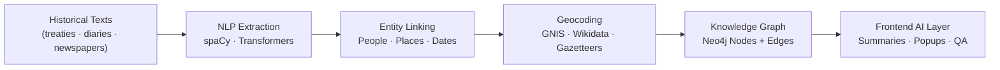
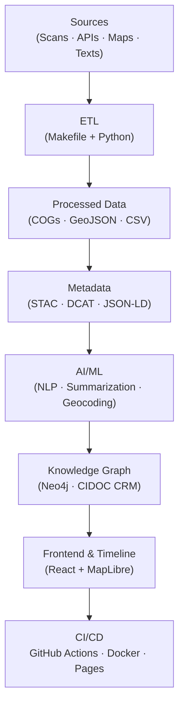

<div align="center">

# ⚙️ Kansas Frontier Matrix — Data & AI Workflows  
`docs/integration/workflows.md`

**Mission:** Define and document the **end-to-end data workflows** powering the Kansas Frontier Matrix —  
from ingestion and transformation to AI enrichment, cataloging, and deployment — ensuring full  
**reproducibility**, **traceability**, and **Master Coder Protocol (MCP)** compliance across the project.

[](../../.github/workflows/site.yml)
[](../../.github/workflows/stac-validate.yml)
[](../../.github/workflows/codeql.yml)
[](../../.github/workflows/trivy.yml)
[](../)
[](../../LICENSE)

</div>

---

## 📜 Overview

The **Kansas Frontier Matrix (KFM)** integrates data, AI, and visualization into a unified open-source ecosystem.  
This document outlines the **workflows** that sustain this integration — automating the ingestion, processing,  
enrichment, cataloging, and publication of Kansas’s spatiotemporal datasets.

Each workflow adheres to the **Master Coder Protocol (MCP)** principle of *“docs first, data second, automation third.”*  
That means every step is fully logged, validated, and reproducible — from Makefile targets to GitHub Actions CI runs.

---

## 🧭 High-Level Workflow Overview

```mermaid
flowchart TD
    A["External Data Sources\n(USGS · NOAA · FEMA · Archives)"] --> B["ETL Pipeline\n(Makefile · Python)"]
    B --> C["Processing & Normalization\nGeoTIFF · GeoJSON · CSV"]
    C --> D["STAC Cataloging\nMetadata Validation · Provenance"]
    D --> E["AI/ML Enrichment\nNER · Geocoding · Summarization"]
    E --> F["Knowledge Graph\nNeo4j · CIDOC CRM · OWL-Time"]
    F --> G["API & Frontend Build\nFastAPI · React · MapLibre"]
    G --> H["Deployment & CI/CD\nGitHub Actions · Docker · Pages"]
````

<!-- END OF MERMAID -->

---

## 🧩 Workflow Categories

| Category                        | Description                                        | Tools / Tech                  | Outputs                          |
| :------------------------------ | :------------------------------------------------- | :---------------------------- | :------------------------------- |
| **Data Ingestion (ETL)**        | Fetch and prepare data from official sources.      | Makefile, Python, GDAL        | Raw → Processed (COG, GeoJSON)   |
| **Metadata & Cataloging**       | Generate STAC & JSON-LD records.                   | Python, STAC Validator        | `data/stac/*.json`               |
| **AI/ML Enrichment**            | NLP, geocoding, and summarization of text sources. | spaCy, Transformers           | Entities, summaries, graph edges |
| **Knowledge Graph Integration** | Build Neo4j graph and CIDOC CRM mappings.          | Neo4j, Cypher, RDF            | `graph.db`                       |
| **Visualization Build**         | Assemble web app configs and map layers.           | React, MapLibre, Webpack      | `/web/config/layers.json`        |
| **Deployment & Validation**     | CI/CD automation and security scanning.            | GitHub Actions, Trivy, CodeQL | Build artifacts + live site      |

---

## 🧮 Data Pipeline Stages

### 1. Extraction (E)

Fetch datasets from external APIs or portals.
**Examples:**

* NOAA Storm Events (CSV API)
* USGS 3DEP DEM (ArcGIS REST)
* Kansas GIS Archive (downloaded shapefiles)

### 2. Transformation (T)

Standardize formats to open standards:

```bash
# Raster: Convert to Cloud-Optimized GeoTIFF
rio cogeo create input.tif output_cog.tif --overview-level=5 --web-optimized

# Vector: Reproject shapefile to GeoJSON
ogr2ogr -f GeoJSON -t_srs EPSG:4326 output.geojson input.shp
```

Normalize field names and add metadata.

### 3. Loading (L)

Load processed layers into:

* **STAC Catalog** (`data/stac/*.json`)
* **Knowledge Graph** (Neo4j via Cypher or GraphQL)
* **Frontend config** (linked in `web/config/layers.json`)

---

## 🤖 AI / ML Workflow

The AI workflow adds semantic meaning to raw data and text documents.



<!-- END OF MERMAID -->

### Components

* **NER (Named Entity Recognition):** Finds references to people, places, events, and dates.
* **Geocoding:** Resolves place names to coordinates (using GNIS or custom gazetteers).
* **Summarization:** Uses Transformer models (BART/T5) for generating human-readable summaries.
* **Linking:** Aligns extracted entities with canonical graph nodes (Fort Larned, Kaw Nation, etc.).

**Output:**
Structured nodes and relationships, AI summaries, and provenance logs.

---

## 🔗 Knowledge Graph Integration

| Node Type      | Description                                  | Example                              |
| :------------- | :------------------------------------------- | :----------------------------------- |
| `Person`       | Historical or modern individual.             | “William Clark”                      |
| `Place`        | Geographic feature or boundary.              | “Council Grove, KS”                  |
| `Event`        | Treaty, battle, or environmental occurrence. | “Medicine Lodge Creek Treaty (1867)” |
| `Document`     | Archival or scanned source.                  | “Kappler’s Indian Affairs Vol. II”   |
| `Organization` | Tribe, agency, or company.                   | “Osage Nation”                       |

All entities are linked via CIDOC CRM relationships (e.g., `P7 took_place_at`, `P94 has_created`)
and stored in Neo4j with **provenance**, **confidence**, and **temporal attributes**.

---

## 🧰 CI/CD Workflow (GitHub Actions)

| Stage                | Workflow File                         | Description                                      |
| :------------------- | :------------------------------------ | :----------------------------------------------- |
| **Build & Deploy**   | `.github/workflows/site.yml`          | Builds web app & deploys to Pages.               |
| **STAC Validate**    | `.github/workflows/stac-validate.yml` | Validates STAC metadata & schema compliance.     |
| **CodeQL**           | `.github/workflows/codeql.yml`        | Static analysis for Python & JS.                 |
| **Trivy Security**   | `.github/workflows/trivy.yml`         | Vulnerability scanning for Docker images.        |
| **Pre-Commit Hooks** | `.pre-commit-config.yaml`             | Linting, format checks, and checksum validation. |

Each GitHub Action corresponds to a step in the pipeline.
They are triggered automatically on **push**, **pull request**, or **scheduled runs**.

---

## 🧭 Makefile Targets

```makefile
fetch:          ## Download all raw datasets
	python tools/fetch_data.py

process:        ## Transform raw → processed (COG, GeoJSON)
	python tools/process_data.py

stac:           ## Generate STAC metadata
	python tools/generate_stac.py

graph:          ## Build or update Neo4j knowledge graph
	python tools/load_graph.py

validate:       ## Run JSON + STAC validation
	stac validate data/stac/*.json

serve:          ## Run local web development server
	cd web && npm run dev
```

Run a full rebuild of all data and metadata:

```bash
make fetch process stac graph validate
```

---

## 🧩 Reproducibility Practices

* Each dataset has a `.sha256` checksum and `LICENSE` field.
* All pipelines are containerized with Docker Compose.
* Validation is mandatory before merging.
* All workflows are described in `docs/experiment/*.md` templates.

---

## 🗺️ Summary Diagram — End-to-End Data Ecosystem



<!-- END OF MERMAID -->

---

<div align="center">

### ⚙️ “Automation is accountability — every workflow is a documented experiment.”

**— Kansas Frontier Matrix Engineering Team**

</div>
