<div align="center">

# ⚙️ Kansas Frontier Matrix — **Data & AI Workflows**  
`docs/integration/workflows.md`

**Mission:** Define, document, and automate the **end-to-end data and AI workflows** powering the  
**Kansas Frontier Matrix (KFM)** — from ingestion and transformation to AI enrichment,  
cataloging, provenance linking, and deployment — ensuring **reproducibility**, **traceability**,  
and full **MCP-DL v6.3 compliance** across every technical layer.

[](../../.github/workflows/docs-validate.yml)
[](../../.github/workflows/site.yml)
[](../../.github/workflows/policy-check.yml)
[](../../.github/workflows/stac-validate.yml)
[](../../.github/workflows/codeql.yml)
[](../../.github/workflows/trivy.yml)
[](../metadata-standards.md)
[](../../LICENSE)

</div>

```yaml
---
title: "Data & AI Workflows"
document_type: "Integration Workflow Specification"
version: "v2.1.0"
last_updated: "2025-10-18"
created: "2023-09-12"
owners: ["@kfm-data","@kfm-ai","@kfm-architecture"]
status: "Stable"
maturity: "Production"
license: "CC-BY 4.0"
tags: ["workflow","ai","etl","stac","graph","mcp","automation","reproducibility"]
audit_framework: "MCP-DL v6.3"
semantic_alignment:
  - STAC 1.0
  - DCAT 2.0
  - CIDOC CRM
  - PROV-O
  - OWL-Time
  - FAIR Principles
preservation_policy:
  replication_targets: ["GitHub Repository","Zenodo Snapshot","OSF Backup"]
  checksum_algorithm: "SHA-256"
  revalidation_cycle: "quarterly"
---
````

---

## 📘 Overview

The **Kansas Frontier Matrix (KFM)** integrates **data pipelines**, **AI services**, and **visual systems**
into a single, open, reproducible ecosystem.
This document defines the **canonical workflows** governing the ingestion, transformation, AI enrichment,
cataloging, and publication of spatiotemporal datasets — ensuring every operation is transparent, auditable, and traceable
in accordance with the **Master Coder Protocol (MCP-DL v6.3)**.

> Each workflow = a reproducible experiment. Every script, transformation, and model is tracked by commit, checksum, and STAC ID.

---

## 🧭 System Workflow Map

```mermaid
flowchart TD
    A["External Sources\n(USGS · NOAA · FEMA · KHS Archives)"] --> B["ETL Pipelines\n(Makefile · Python · GDAL)"]
    B --> C["Processing & Normalization\n→ GeoTIFF · GeoJSON · CSV · JSON-LD"]
    C --> D["Metadata Cataloging\nSTAC 1.0 + DCAT 2.0 Validation"]
    D --> E["AI/ML Enrichment\nNER · Geocoding · Summarization"]
    E --> F["Knowledge Graph\nNeo4j · CIDOC CRM · OWL-Time"]
    F --> G["Frontend Build\nReact · MapLibre · Timeline · Focus Mode"]
    G --> H["CI/CD Deployment\nGitHub Actions · Docker · Pages · Zenodo"]
```



<!-- END OF MERMAID -->

---

## 🧩 Workflow Categories

| Category                  | Description                                           | Core Tools / Tech                                   | Outputs                         |
| :------------------------ | :---------------------------------------------------- | :-------------------------------------------------- | :------------------------------ |
| **ETL & Data Ingestion**  | Fetch + transform external sources (NOAA, USGS, etc.) | Python, Makefile, GDAL, OGR                         | COGs, GeoJSON, CSV              |
| **Metadata & Cataloging** | Generate STAC + DCAT + JSON-LD records                | `stac-generator.py`, `stac-validator`, `jsonschema` | `data/stac/*.json`              |
| **AI/ML Enrichment**      | NLP, NER, summarization, geocoding                    | spaCy, HuggingFace Transformers, GeoPy              | AI summaries, linked entities   |
| **Graph Integration**     | Link all entities into Neo4j + RDF triple store       | Cypher, RDFLib, GraphQL                             | Graph database (`graph.db`)     |
| **Visualization Layer**   | Prepare map & timeline configs                        | React, MapLibre, Webpack                            | `/web/config/layers.json`       |
| **CI/CD Automation**      | Validate, deploy, replicate                           | GitHub Actions, OPA, CodeQL, Trivy                  | Validated site + data artifacts |

---

## 🧮 Data Lifecycle — From Raw to Published

| Stage         | Description                                     | Output                | Validation                           |
| :------------ | :---------------------------------------------- | :-------------------- | :----------------------------------- |
| **Extract**   | Fetch raw files from APIs, FTP, archives        | `data/raw/`           | Checksum verification                |
| **Transform** | Standardize to open formats (COG, GeoJSON, CSV) | `data/processed/`     | CRS check, metadata injection        |
| **Catalog**   | Register datasets via STAC/DCAT schema          | `data/stac/*.json`    | JSON Schema + STAC Validator         |
| **Enrich**    | AI/NLP entity extraction, geocoding, summaries  | `data/derivatives/`   | AI output logs + precision scores    |
| **Graph**     | Ingest semantic data into Neo4j                 | `graph.db`            | CIDOC CRM integrity checks           |
| **Publish**   | Build + deploy web frontend & metadata site     | `/web/`, GitHub Pages | CI verification, Zenodo DOI snapshot |

---

## 🤖 AI / ML Enrichment Workflow

```mermaid
flowchart LR
    A["Historical Texts\n(Treaties · Diaries · Newspapers)"] --> B["NLP Preprocessing\nOCR · Tokenization · Normalization"]
    B --> C["Named Entity Recognition\nspaCy + Transformers"]
    C --> D["Entity Linking\nTribes · Persons · Places · Dates"]
    D --> E["Geocoding\nGNIS · Wikidata · Gazetteers"]
    E --> F["Summarization\nBART / T5 · Context-Aware"]
    F --> G["Knowledge Graph Integration\nCIDOC CRM · PROV-O"]
```



<!-- END OF MERMAID -->

### 🧠 Core Components

| Component                  | Purpose                                                              | Toolchain              |
| :------------------------- | :------------------------------------------------------------------- | :--------------------- |
| **NER**                    | Identify entities in unstructured text (treaties, diaries, letters). | spaCy, HuggingFace     |
| **Geocoding**              | Convert textual place references → coordinates.                      | GeoPy, Wikidata, GNIS  |
| **Summarization**          | Generate contextual summaries for archives.                          | T5, BART, Pegasus      |
| **Entity Linking**         | Connect recognized entities to canonical graph nodes.                | Neo4j, RDFLib          |
| **Focus Mode Integration** | Surface entities dynamically in frontend timeline/map.               | React Hooks, Graph API |

---

## 🧩 Knowledge Graph Integration

| Node Type  | Description                        | CIDOC CRM Class        | Example                            |
| :--------- | :--------------------------------- | :--------------------- | :--------------------------------- |
| `Person`   | Historical or contemporary actor   | E21 Person             | “William Clark”                    |
| `Tribe`    | Indigenous group or nation         | E74 Group              | “Osage Nation”                     |
| `Place`    | Geospatial region or feature       | E53 Place              | “Council Grove, KS”                |
| `Event`    | Historical occurrence or agreement | E5 Event               | “Treaty of Medicine Lodge (1867)”  |
| `Document` | Archival source or transcription   | E31 Document           | “Kappler Vol. II – Indian Affairs” |
| `Model`    | AI/ML artifact producing insights  | E73 Information Object | “frontier_ner_v3 (F1=0.91)”        |

**All relationships** are CIDOC-aligned (e.g., `P7 took_place_at`, `P67 refers_to`, `P94 has_created`)
and are timestamped and versioned under **OWL-Time** and **PROV-O** for inference and temporal queries.

---

## 🧰 CI/CD Governance Workflows

| Stage                    | Workflow                              | Purpose                                          |
| :----------------------- | :------------------------------------ | :----------------------------------------------- |
| **Build & Deploy**       | `.github/workflows/site.yml`          | Builds documentation + site deployment.          |
| **STAC Validation**      | `.github/workflows/stac-validate.yml` | Validates metadata schemas.                      |
| **Security Scanning**    | `.github/workflows/trivy.yml`         | Scans dependencies for vulnerabilities.          |
| **Static Analysis**      | `.github/workflows/codeql.yml`        | Detects security or logic issues in Python/JS.   |
| **Policy Enforcement**   | `.github/workflows/policy-check.yml`  | Validates compliance with OPA/Conftest policies. |
| **Docs & Review Checks** | `.github/workflows/docs-validate.yml` | Lints, link-checks, and validates docs.          |

All workflows log to `data/work/logs/integration/` with timestamped artifacts and SHA-256 digests.

---

## 🧭 Makefile — Local Workflow Automation

```makefile
fetch:          ## Download raw data sources
	python tools/fetch_data.py

process:        ## Transform raw to open-standard processed formats
	python tools/process_data.py

stac:           ## Generate & validate STAC metadata
	python tools/generate_stac.py && stac validate data/stac/*.json

graph:          ## Rebuild or update Neo4j knowledge graph
	python tools/load_graph.py

ai:             ## Run AI enrichment tasks
	python tools/run_ai_enrichment.py

validate:       ## Schema + integrity checks
	make stac && python tools/validate_json.py

serve:          ## Launch local web dev server
	cd web && npm run dev
```

Run a complete clean build:

```bash
make fetch process stac ai graph validate
```

---

## 🧮 Reproducibility & Provenance Practices

| Principle                 | Implementation                                                |
| :------------------------ | :------------------------------------------------------------ |
| **Deterministic Outputs** | Pipelines parameterized with static seeds + config YAML.      |
| **Checksums**             | SHA-256 computed for every artifact (`data/checksums/*.txt`). |
| **Containerization**      | All ETL & AI runs executed via pinned Docker images.          |
| **Provenance Graph**      | Neo4j + PROV-O records each dataset’s lineage.                |
| **Documentation-First**   | Each pipeline has corresponding `docs/experiment/*.md`.       |
| **Auditability**          | Automated CI logs + version-controlled outputs stored.        |

---

## 🧠 Advanced Enhancements (MCP-DL v6.3+)

* **Temporal AI Indexing:** Embeddings stored in Neo4j vector index for semantic Focus Mode queries.
* **Federated Ontology Linking:** Auto-links STAC/DCAT metadata to external catalogs via persistent URIs.
* **Ethical AI Hooks:** Bias and fairness checks automatically run during `make ai`.
* **Data Diff & Replay:** Previous ETL runs reproducible via `make replay --date=<timestamp>`.
* **Zenodo Auto-Snapshot:** DOI-assigned dataset versioning post-deploy.
* **AI-Driven Provenance Summaries:** GPT-assisted audit trail narratives for every build artifact.

---

## 🗺️ Unified End-to-End System Diagram

```mermaid
flowchart TD
    A["Data Sources\n(Scans · APIs · GIS Layers · Text Archives)"] --> B["ETL Pipelines\nPython · GDAL · Makefile"]
    B --> C["Processed Data\n(COGs · GeoJSON · CSV)"]
    C --> D["STAC / DCAT Metadata\nValidated JSON-LD"]
    D --> E["AI Enrichment\nNER · Summaries · Geocoding"]
    E --> F["Knowledge Graph\nNeo4j · RDF · CIDOC CRM"]
    F --> G["Visualization Layer\nReact · MapLibre · D3 Timeline"]
    G --> H["CI/CD Deployment\nGitHub Actions · Docker · Zenodo"]
```



<!-- END OF MERMAID -->

---

## 📎 Related Documentation

| File                                   | Description                                 |
| :------------------------------------- | :------------------------------------------ |
| `README.md`                            | Integration index overview                  |
| `treaties.md`                          | Treaty and land cession integration process |
| `gis-archive.md`                       | GIS archive workflow specification          |
| `deeds.md`                             | Register of Deeds ingestion pipeline        |
| `oral-histories.md`                    | Oral history ingestion and ethics           |
| `reviews/README.md`                    | Review governance and validation logs       |
| `../standards/metadata.md`             | Metadata & schema standards                 |
| `../architecture/data-architecture.md` | Repository structure and pipeline layout    |

---

## 📅 Version History

| Version    | Date       | Author                | Summary                                                                |
| :--------- | :--------- | :-------------------- | :--------------------------------------------------------------------- |
| **v2.1.0** | 2025-10-18 | KFM Engineering Team  | Upgraded to MCP-DL v6.3; added AI vector index + federated provenance. |
| v2.0.0     | 2025-08-05 | KFM Data Architecture | Added full AI integration & CIDOC CRM cross-links.                     |
| v1.0.0     | 2023-09-12 | KFM Founding Dev Team | Initial publication of workflows documentation.                        |

---

<div align="center">

### ⚙️ “Automation is accountability — every workflow is a documented experiment.”

**Kansas Frontier Matrix Engineering Council · MCP-DL v6.3**

</div>
