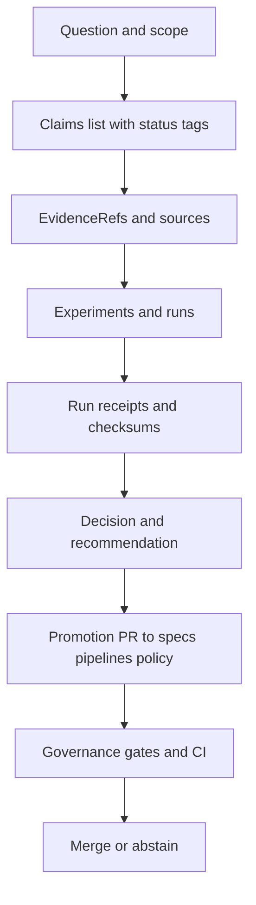

<!-- [KFM_META_BLOCK_V2]
doc_id: kfm://doc/b2d7e2fb-0d90-4f5a-8f2a-7f1d5ac7d62d
title: Investigations 2026
type: standard
version: v1
status: draft
owners: KFM Core Team
created: 2026-03-04
updated: 2026-03-04
policy_label: restricted
related: [docs/investigations/, docs/governance/, data/, policy/, contracts/]
tags: [kfm, investigations, evidence, governance, 2026]
notes: [Default-deny, evidence-first. Designed for PR-based promotion to specs/pipelines.]
[/KFM_META_BLOCK_V2] -->

<!--
IMPACT
Status: active (2026 working area)
Owners: @kfm-core-team (TODO: set CODEOWNERS)
Badges: TODO • CI • Policy • Linkcheck • Markdown
Quick links: #scope • #where-it-fits • #quickstart • #templates • #promotion-gates • #index • #appendix
-->

# Investigations 2026
One place to run **evidence-first, time-aware** investigations in 2026 and promote outcomes into governed specs, pipelines, and UI behavior.

---

## Quick navigation
- [Scope](#scope)
- [Where it fits](#where-it-fits)
- [Acceptable inputs](#acceptable-inputs)
- [Exclusions](#exclusions)
- [Directory tree](#directory-tree)
- [Quickstart](#quickstart)
- [How to write claims](#how-to-write-claims)
- [Templates](#templates)
- [Promotion gates](#promotion-gates)
- [Investigation index](#investigation-index)
- [FAQ](#faq)
- [Appendix](#appendix)

---

## Scope
- **CONFIRMED:** This directory is for **investigations**: questions, hypotheses, tests, receipts, and decisions that must be traceable to evidence and policy constraints.
- **PROPOSED:** This directory is the “workbench” layer for documentation: exploratory work is allowed, but promotion to production artifacts must pass governance gates.
- **UNKNOWN:** Whether 2026 investigations are intended to be public-facing (default is **restricted**). If publication is needed, add a redaction plan and update `policy_label`.

### What counts as an “investigation”
An investigation is any structured effort to answer a question like:
- “What’s the minimal schema and gate set for dataset promotion?”
- “Does this pipeline produce deterministic artifacts across rebuilds?”
- “Which UI pattern best expresses evidence and uncertainty on a timeline map?”
- “Which data source is license-clear and suitable for RAW ingestion?”

---

## Where it fits
- **CONFIRMED:** KFM’s “truth path” lifecycle is **Upstream → RAW → WORK → PROCESSED → CATALOG → PUBLISHED** and investigations should *not* bypass it. Investigations can propose changes to any stage, but promotion is gated.
- **CONFIRMED:** Clients (UI/tools) must not access storage/databases directly; access crosses the governed API/policy boundary (“trust membrane” posture).
- **PROPOSED:** Investigations are upstream of:
  - `docs/specs/` (standards + contracts)
  - ADRs (`docs/adr/` or equivalent)
  - pipeline implementation (`src/pipelines/` / `packages/`)
  - policy (`policy/` / `policies/`)
  - contracts (`contracts/` OpenAPI/JSON Schema)
  - test gates (`tests/`, `.github/workflows/`)

### Investigation flow overview


[Back to top](#quick-navigation)

---

## Acceptable inputs
- **CONFIRMED:** Anything here must be **evidence-first** and structured so it can be cited or rejected.
- **PROPOSED:** Recommended artifacts per investigation folder:
  - `README.md` (executive summary + current status)
  - `INVESTIGATION.md` (full plan + methods)
  - `EVIDENCE.md` (source inventory + EvidenceRefs)
  - `CLAIMS.md` (claim list with CONFIRMED/PROPOSED/UNKNOWN labels)
  - `RUNS/` (run receipts, logs, manifests; no secrets)
  - `ARTIFACTS/` (small, versionable outputs; large blobs must live in governed storage)

### Modes
- **CONFIRMED (policy posture):**  
  - **SANDBOX:** exploration allowed; no publish/promotion; record assumptions.  
  - **GOVERNED:** promotion gates apply; only mode allowed to merge/publish to protected branches.

---

## Exclusions
- **CONFIRMED:** No secrets (tokens, credentials, private keys) anywhere in investigations.
- **CONFIRMED:** No raw bulk datasets here (GeoTIFF stacks, point clouds, large parquet partitions).
- **PROPOSED:** No “shadow production” configs (anything that would deploy or publish without going through governed PRs).

Where things go instead:
- Raw/large data → `data/` zones (RAW/WORK/PROCESSED) under the promotion contract.
- Schemas/contracts → `contracts/`
- Policy logic → `policy/` (or `policies/`)
- Implementation code → `src/` / `apps/` / `packages/`
- Long-term standards/specs → `docs/specs/`
- Decisions meant to be permanent → ADRs (e.g., `docs/adr/`)

[Back to top](#quick-navigation)

---

## Directory tree
> **PROPOSED:** Adjust to match the repo’s actual conventions.

```text
docs/investigations/2026/
├── README.md
├── _templates/
│   ├── INVESTIGATION.template.md
│   ├── EVIDENCE.template.md
│   ├── CLAIMS.template.md
│   └── DECISION.template.md
├── 2026-01__index.md
├── 2026-02__index.md
├── 2026-03__index.md
└── YYYY-MM-DD__short-slug/
    ├── README.md
    ├── INVESTIGATION.md
    ├── EVIDENCE.md
    ├── CLAIMS.md
    ├── DECISION.md
    ├── RUNS/
    │   ├── run_receipt.2026-03-04T120000Z.json
    │   └── checksums.sha256
    └── ARTIFACTS/
        └── small-output.json
```

---

## Quickstart

### 1) Create a new investigation folder
```bash
INV_DATE="2026-03-04"
SLUG="short-topic-slug"
mkdir -p "docs/investigations/2026/${INV_DATE}__${SLUG}"/{RUNS,ARTIFACTS}

# If templates exist:
cp -n docs/investigations/2026/_templates/INVESTIGATION.template.md \
  "docs/investigations/2026/${INV_DATE}__${SLUG}/INVESTIGATION.md" || true
cp -n docs/investigations/2026/_templates/EVIDENCE.template.md \
  "docs/investigations/2026/${INV_DATE}__${SLUG}/EVIDENCE.md" || true
cp -n docs/investigations/2026/_templates/CLAIMS.template.md \
  "docs/investigations/2026/${INV_DATE}__${SLUG}/CLAIMS.md" || true
cp -n docs/investigations/2026/_templates/DECISION.template.md \
  "docs/investigations/2026/${INV_DATE}__${SLUG}/DECISION.md" || true
```

### 2) Commit with a tight message
```bash
git add "docs/investigations/2026/${INV_DATE}__${SLUG}"
git commit -m "docs(investigations): start ${INV_DATE} ${SLUG}"
```

### 3) Run the minimum local checks
> **UNKNOWN:** Exact commands depend on repo tooling; keep this list aligned to CI.

```bash
# Markdown sanity (example)
# npx markdownlint-cli2 "**/*.md"

# Policy sanity (example; if OPA is present and policies exist)
# opa check --v0-v1 --strict policy

# Link check (example)
# python tools/linkcheck.py docs/investigations/2026
```

[Back to top](#quick-navigation)

---

## How to write claims
**Rule:** every meaningful claim must be labeled **CONFIRMED / PROPOSED / UNKNOWN**.

### Claim statuses
- **CONFIRMED:** backed by cited evidence (EvidenceRefs) and (when applicable) reproducible run receipts.
- **PROPOSED:** a plan, recommendation, or design choice not yet validated.
- **UNKNOWN:** not verified; include the smallest steps to make it CONFIRMED.

### Minimal claim record
```yaml
id: claim-001
status: UNKNOWN
statement: "Dataset X is license-clear for commercial reuse."
why_it_matters: "Determines whether we can publish to PUBLISHED zone."
evidence_refs:
  - "evid:source:vendor-license-page"
verification_steps:
  - "Fetch license text snapshot and checksum it"
  - "Confirm SPDX mapping"
  - "Add policy label and redaction obligations"
```

---

## Templates

### Investigation header
Use a consistent header so investigations are searchable and chunkable.

```yaml
title: "Investigation — <short title>"
id: "inv-2026-03-04-<slug>"
status: "draft|in_progress|blocked|complete|abstained"
owners: ["@handle"]
created: "2026-03-04"
updated: "2026-03-04"
mode: "SANDBOX|GOVERNED"
policy_label: "restricted|public"
tags: ["kfm", "investigation", "2026"]
related:
  - "docs/specs/<...>"
  - "policy/<...>"
```

### Evidence inventory expectations
- **CONFIRMED:** Evidence should be referenceable and stable (snapshot + checksum).
- **PROPOSED:** Prefer `EvidenceRef`-style IDs that can be resolved by tooling later.

---

## Promotion gates
> Promotion = turning an investigation outcome into something that changes system behavior: a spec, a schema, a policy, a pipeline, or a UI rule.

- **CONFIRMED:** Promotion must be PR-based and fail-closed on missing provenance.
- **PROPOSED:** Use the gates below as the Definition of Done for promotion PRs.

### Promotion Contract checklist
- [ ] **Identity/versioning**: stable IDs for investigation + produced artifacts
- [ ] **License/rights**: explicit license for any dataset or artifact used
- [ ] **Sensitivity**: policy label + redaction obligations documented
- [ ] **Catalog triplet (if data involved)**: STAC/DCAT/PROV present and validates
- [ ] **Run receipt**: who/what/when/why + tool versions + checksums
- [ ] **Policy tests**: OPA/Rego gates (or equivalent) updated and passing
- [ ] **Contract tests**: schema/API contracts updated and passing (if applicable)
- [ ] **Rollback plan**: how to revert if promoted change is wrong

### Gate matrix
Blank line required before table.

| Gate | Applies when | Evidence required | Fail behavior |
|---|---|---|---|
| A Identity | Always | Investigation ID + artifact IDs | Fail closed |
| B License | Any external input | SPDX or equivalent + snapshot | Fail closed |
| C Sensitivity | Any geo/human data | Policy label + redaction plan | Fail closed |
| D Catalog triplet | Data promotion | Valid STAC/DCAT/PROV | Fail closed |
| E Receipt | Always | Run receipt + checksums | Fail closed |
| F Policy tests | Any governed change | Policy test results | Fail closed |
| G Repro | Any build artifact | Rebuild equals hash | Fail closed |

[Back to top](#quick-navigation)

---

## Investigation index
> **UNKNOWN:** This index can be auto-generated. For now, keep it curated.

Blank line required before table.

| Date | Folder | Status | One-line intent |
|---|---|---|---|
| 2026-__-__ | `YYYY-MM-DD__slug/` | `draft` | TODO |

---

## FAQ

### Is this a place to dump notes?
- **PROPOSED:** No. Notes are fine, but they must be structured enough to (a) cite, (b) reproduce, or (c) explicitly abstain.

### Can I include screenshots or PDFs?
- **PROPOSED:** Yes, if small and versionable. Otherwise store in governed artifacts storage and link via a stable digest reference.

### What if I can’t verify something?
- **CONFIRMED:** Mark it **UNKNOWN** and list the smallest verification steps. If verification is blocked, document why and **abstain** from promotion.

---

## Appendix

<details>
<summary>Full INVESTIGATION.md template</summary>

```markdown
# Investigation — <Title>

## Summary
- **Status:** draft
- **Owners:** @handle
- **Mode:** SANDBOX
- **Policy label:** restricted

## Question
- **UNKNOWN:** <single sentence question>

## Scope
- In scope:
- Out of scope:

## Claims
- claim-001 — UNKNOWN — <statement>
- claim-002 — PROPOSED — <statement>

## Evidence inventory
- evid-001 — <source> — <snapshot location> — <checksum>
- evid-002 — <source> — <snapshot location> — <checksum>

## Methods
- What tests/runs will be executed?
- What constitutes success/failure?

## Runs and receipts
- `RUNS/run_receipt.<ts>.json`
- `RUNS/checksums.sha256`

## Risks and sensitivity
- What could expose sensitive information?
- Redaction/masking plan

## Decision log
- YYYY-MM-DD: <decision>
```

</details>

<details>
<summary>Claim wording tips</summary>

- Prefer “X is true because Y” over “X seems true”.
- Include units, coordinate reference systems, and time ranges explicitly when relevant.
- Avoid “latest/current” without a date and a snapshot reference.
</details>

[Back to top](#quick-navigation)
