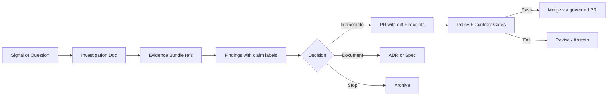

<!-- [KFM_META_BLOCK_V2]
doc_id: kfm://doc/2c4c6c92-0e60-4ad0-9c70-6e8a0a2fa2d0
title: Investigations Index
type: standard
version: v1
status: draft
owners: [kfm-core, kfm-governance]
created: 2026-03-04
updated: 2026-03-04
policy_label: public
related: [docs/investigations/]
tags: [kfm, investigations, governance, evidence, provenance]
notes: [Index + operating rules for investigations; keep additive and PR-governed.]
[/KFM_META_BLOCK_V2] -->

# Investigations Index
A governed index of ongoing and archived investigations (data, pipelines, policy, UX, and research) for Kansas Frontier Matrix.

---

## Impact
**Status:** active (draft index)  
**Owners:** `kfm-core`, `kfm-governance`  
**Policy label:** public (content must remain non-sensitive; link out to restricted artifacts as needed)  
**Change discipline:** small, reversible, additive (prefer new investigation docs over rewrites)

**Badges (TODO)**  
  
  


**Quick links:**  
- [Scope](#scope) · [Where it fits](#where-it-fits) · [How investigations work](#how-investigations-work) · [Active investigations](#active-investigations) · [Archived investigations](#archived-investigations) · [Definition of done](#definition-of-done) · [FAQ](#faq)

---

## Scope
Investigations are **time-bounded, evidence-first** work items used to:
- validate a hypothesis about data quality, provenance, licensing, policy, or UX behavior
- capture reproducible findings (with receipts/links) **before** we promote anything to PROCESSED/PUBLISHED
- record decisions and next steps (often resulting in an ADR, spec, ticket, or pipeline change)

Investigations are **not**:
- product announcements
- final narratives (Story Nodes)
- production “truth” unless explicitly promoted through governance gates

---

## Where it fits
This directory sits in the documentation surface that supports KFM’s governed lifecycle:

- Investigations produce **findings + evidence bundles + proposed changes**
- Promoted outcomes typically flow into one of:
  - `docs/adrs/` (architecture decisions)
  - `docs/specs/` (contracts, schemas, invariants)
  - `data/registry/` + pipeline code (dataset onboarding)
  - `docs/stories/` (Story Nodes, after evidence and policy checks)
  - `policy/` (OPA/Rego rules, obligations, redaction)

**Invariant reminder (must hold):** UI/clients do **not** access storage directly; all access crosses governed APIs + policy boundary.

---

## Acceptable inputs
What belongs here:
- investigation writeups (Markdown) with explicit **question → method → evidence → findings → decisions**
- links/refs to evidence bundles (STAC/DCAT/PROV artifacts, run receipts, checksums, screenshots)
- PR links (or planned diffs) that implement remediation

Preferred supporting artifacts (store elsewhere, link from here):
- `data/prov/…` run receipts, manifests, checksums
- `data/catalog/…` STAC/DCAT/PROV triplets
- `artifacts/…` validation outputs (stac-validator reports, schema lint, policy gate logs)
- `policy/…` Conftest outputs, OPA decision logs

---

## Exclusions
What must **not** go here:
- secrets, tokens, credentials, API keys
- raw sensitive coordinates or location targeting (redact/generalize; link to restricted storage if needed)
- unlicensed or unclear-rights source dumps
- “final” published claims without citations/receipts

If permissions/sensitivity are unclear: **redact/generalize, mark “needs governance review,” and fail closed.**

---

## Directory tree
> If your repo differs, update this tree to match reality (keep it small and scannable).

```text
docs/investigations/
├── INDEX.md                              # 👈 this file
├── templates/
│   ├── INVESTIGATION_TEMPLATE.md         # investigation writeup skeleton
│   ├── EVIDENCE_BUNDLE_TEMPLATE.md       # checklist for receipts + citations
│   └── REDACTION_CHECKLIST.md            # optional
├── active/
│   └── (INV-*.md and/or INV-*/README.md)
└── archived/
    └── (INV-*.md and/or INV-*/README.md)
```

---

## Quickstart
### Create a new investigation
```bash
# from repo root
mkdir -p docs/investigations/active
cp docs/investigations/templates/INVESTIGATION_TEMPLATE.md \
  docs/investigations/active/INV-YYYY-MM-DD-short-slug.md
```

1. Fill in the template (especially: **claim labels**, **evidence refs**, and **verification steps**).
2. Add a row to [Active investigations](#active-investigations).
3. Open a PR with:
   - the investigation doc
   - links to any run receipts / artifacts
   - a minimal patch plan (if remediation is known)

### Archive an investigation
Move it from `active/` → `archived/` and update the tables below with:
- final disposition (accepted/rejected/rolled into ADR/spec)
- links to the outcome PR(s)

---

## How investigations work
### Evidence discipline
Every meaningful claim must be labeled:
- **CONFIRMED:** backed by a direct reference (receipt, validated artifact, reproducible query, or cited source)
- **PROPOSED:** plausible but not yet verified; includes a concrete plan to verify
- **UNKNOWN:** not determined; includes the smallest steps to make it CONFIRMED

### Minimum structure (recommended)
Each investigation should include:
1. **Question / Hypothesis**
2. **Scope & constraints** (time window, geography, policy label)
3. **Method** (reproducible steps)
4. **Evidence** (links to receipts/artifacts)
5. **Findings** (claim-labeled)
6. **Decision** (what we will do / not do)
7. **Next actions** (tickets/PRs, owners, gates)

### Promotion guidance
An investigation becomes “real” in KFM when:
- it produces deterministic artifacts (or a deterministic remediation plan)
- it passes required policy + contract gates
- it is reviewed and merged via governed PRs

---

## Active investigations
> **Tip:** keep rows short; link out to the investigation doc for details.

| ID | Title | Domain | Opened | Status | Policy | Evidence bundle | Outcome / next step | Owner |
|---|---|---|---:|---|---|---|---|---|
| INV-YYYY-MM-DD-… | _TBD_ | data/pipeline/policy/ui | YYYY-MM-DD | triage | public/restricted | (link) | (ADR/spec/PR link) | @handle |

**Status vocabulary (suggested):** `triage` · `in-progress` · `blocked` · `needs-review` · `complete` · `archiving`

---

## Archived investigations
| ID | Title | Domain | Closed | Disposition | Key artifacts | Owner |
|---|---|---:|---:|---|---|---|
| INV-YYYY-MM-DD-… | _TBD_ | _TBD_ | YYYY-MM-DD | accepted/rejected/merged | (links) | @handle |

---

## Conventions
### Naming
Prefer one of:
- `INV-YYYY-MM-DD-short-slug.md` (single file)
- `INV-YYYY-MM-DD-short-slug/README.md` (folder with supporting notes/assets)

### Claim labels
Use inline tags in headings or bullets, for example:
- `**CONFIRMED:** …`
- `**PROPOSED:** …`
- `**UNKNOWN:** …`

### “Smallest verification steps”
When something is PROPOSED/UNKNOWN, include a 1–5 step plan that is:
- deterministic
- policy-compliant
- produces receipts/checksums where relevant

---

## Diagram


---

## Definition of Done
An investigation can be marked **complete** when:

- [ ] The question is explicitly stated and scoped (time + geography + policy label).
- [ ] Findings are claim-labeled (CONFIRMED / PROPOSED / UNKNOWN).
- [ ] CONFIRMED findings include direct evidence refs (receipts, hashes, validated artifacts).
- [ ] Any PROPOSED/UNKNOWN item includes the smallest verification steps.
- [ ] Sensitive content is redacted/generalized as required (and flagged for governance review if unclear).
- [ ] Outcome is recorded:
  - [ ] PR link and/or ADR/spec link and/or explicit “no action” disposition.
- [ ] If the investigation touched datasets/pipelines:
  - [ ] Promotion gates are identified (identity, license, sensitivity, validation, provenance, checksums, policy tests).
  - [ ] Rollback path is documented (even if “revert PR”).
- [ ] INDEX tables updated (active → archived when appropriate).

---

## FAQ
### What’s the difference between an investigation and an ADR?
An investigation **discovers and verifies**; an ADR **decides**. Investigations often feed ADRs.

### Can investigations include implementation code?
Yes, but prefer:
- a minimal patch plan in the investigation
- code changes in a dedicated PR (with CI/policy gates)

### Where do I put large artifacts?
Do **not** bloat docs. Store artifacts in the governed artifact locations (catalog/prov/artifacts) and link them here.

---

## Appendix
<details>
<summary>Recommended investigation template outline</summary>

1. Title + policy label + owner
2. Question / hypothesis
3. Context (what triggered this)
4. Method (commands, queries, parameters)
5. Evidence refs (run receipts, checksums, STAC/DCAT/PROV links)
6. Findings (claim-labeled)
7. Decision + next actions
8. Risks / governance notes
9. Rollback plan

</details>
