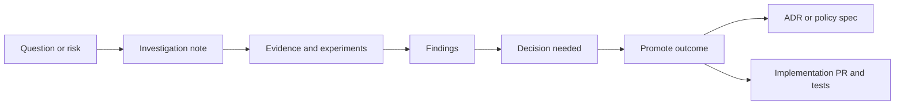

<!-- [KFM_META_BLOCK_V2]
doc_id: kfm://doc/656e8d6e-0e66-4802-99b8-ee963673cd08
title: docs/investigations/README.md
type: standard
version: v1
status: draft
owners: TBD
created: 2026-02-24
updated: 2026-02-24
policy_label: public
related: []
tags: [kfm, investigations]
notes:
  - Directory contract for investigation artifacts (spikes, research notes, experiments).
  - This folder is *not* a decision record; promote outcomes to an ADR/policy when needed.
[/KFM_META_BLOCK_V2] -->

# docs/investigations
Short-lived research notes and reproducible experiments that reduce uncertainty *before* we change governed interfaces, pipelines, or narratives.


> **NOTE**
> This directory is for *learning + de-risking* work. Anything that changes behavior (data promotion, APIs, UI narratives, access rules) must be **promoted** to the appropriate governed artifact (ADR/policy/spec) before shipping.

## Quick navigation
- [What belongs here](#what-belongs-here)
- [What must NOT go here](#what-must-not-go-here)
- [Directory conventions](#directory-conventions)
- [Investigation template](#investigation-template)
- [Promotion path](#promotion-path)
- [Safety and governance](#safety-and-governance)
- [FAQ](#faq)

---

## Where this fits in the repo
`docs/investigations/` sits **upstream** of decisions and implementations:



### Primary outcomes
An investigation should produce at least one of:
- A **reproducible** experiment (commands, inputs, outputs)
- A **bounded** recommendation with assumptions/risks/tradeoffs
- A **decision request** (what decision is needed, by whom, by when)
- A **promotion target** (where this result must land if acted upon)

---

## What belongs here
Acceptable inputs for `docs/investigations/` include:

- **Spikes / feasibility checks**  
  “Can we do X with our constraints?” “What breaks if we do Y?”

- **Comparative evaluations**  
  e.g., library/tool options, schema approaches, indexing strategies, map rendering approaches.

- **Reproduction notes**  
  How to reproduce a bug, perf regression, validation failure, or data anomaly.

- **Evidence-bound explorations**  
  Small studies that support or refute a claim *without* asserting it as a shipped truth.

- **Prototypes with clear scope**  
  Proof-of-concepts that are explicitly labeled as non-production.

- **Threat modeling / risk discovery**  
  What could go wrong; what controls/gates we need; what to test.

---

## What must NOT go here
Exclusions (default-deny):

- **Final decisions**  
  Use an ADR / decision log / policy doc (path varies by repo — link it here once known).

- **Production-facing user narratives**  
  Anything that will be shown in UI/story mode must be promoted to a governed story/spec.

- **Secrets or sensitive credentials**  
  No API keys, tokens, internal URLs with credentials, private keys, or customer data.

- **Vulnerable location targeting**  
  No precise coordinates or step-by-step instructions that could increase harm. Use coarse geography and mark “needs governance review”.

- **Unlicensed datasets / unclear provenance**  
  If the source/license is unknown, do not promote beyond this folder; flag for governance review.

---

## Directory conventions

### Recommended structure
This is a suggested layout. Create only what you need.

```text
docs/investigations/                              # Investigation records (time-boxed, reproducible, auditable)
├─ README.md                                      # This file: purpose, governance rules, and how to add a new record
│
├─ _templates/                                    # Optional starters (kept aligned with current practice)
│  └─ investigation.md                            # Copy/paste template (scope → method → findings → next steps)
│
└─ YYYY-MM-DD_short-slug/                         # One investigation per folder (date + kebab slug)
   ├─ README.md                                   # Preferred record (problem, hypotheses, evidence, conclusions)
   ├─ artifacts/                                  # Small outputs (charts, logs, CSV excerpts; no secrets)
   └─ code/                                       # Minimal repro code (scripts/notebooks; deterministic where possible)
```

### Naming
- Prefer folder-per-investigation: `YYYY-MM-DD_short-slug/`
- Keep slugs lowercase and hyphenated.
- If a folder is too heavy, you may use a single file:
  - `YYYY-MM-DD_short-slug.md`

### Reproducibility contract
Every investigation should include:
- **Inputs:** links/paths, versions, hashes when available
- **Environment:** tool versions (runtime, OS/container, library versions)
- **Steps:** commands or pseudocode sufficient to reproduce
- **Outputs:** expected outputs + where to find them
- **Conclusion:** what we learned + what we still don’t know

> **TIP**
> If you can’t make it reproducible, make it *auditable*: record enough detail that someone else can re-run it later.

---

## Investigation template

<details>
<summary><strong>Click to expand: Investigation README template</strong></summary>

```markdown
<!-- [KFM_META_BLOCK_V2]
doc_id: kfm://doc/<uuid>
title: docs/investigations/YYYY-MM-DD_short-slug/README.md
type: standard
version: v1
status: draft
owners: <name/team>
created: YYYY-MM-DD
updated: YYYY-MM-DD
policy_label: public|restricted|...
related:
  - <link to issue/ticket>
  - <link to relevant ADR/policy/spec if it exists>
tags: [kfm, investigation]
notes:
  - One-line: what uncertainty this reduces
[/KFM_META_BLOCK_V2] -->

# <Investigation title>
One sentence: what we are trying to learn and why it matters.

## Question
- What is the exact question?
- What decision will this inform?

## Context
- Background, constraints, and why now.

## Assumptions
- List assumptions explicitly.
- Mark anything that needs verification.

## Method
- Steps taken, tools used, and what was measured.
- Include commands or pseudocode.

## Evidence ledger
| Artifact | Source | Version / hash | Sensitivity | Notes |
|---|---|---|---|---|
| <file/link> | <origin> | <sha/version> | public|restricted|... | <why it matters> |

## Findings
- Bullet findings with supporting evidence links.
- Be explicit about uncertainty.

## Risks and tradeoffs
- What could go wrong if we act on this?
- What do we lose by not acting?

## Recommendation
- Proposed next step(s)
- Minimum verification steps to convert Unknown → Confirmed

## Promotion target
If we act on this investigation, where does it land?
- [ ] ADR / decision record: <path/link>
- [ ] Spec / contract: <path/link>
- [ ] Policy / governance: <path/link>
- [ ] Implementation PR: <link>
- [ ] Test plan / gate update: <link>

## Open questions
- What remains unknown?
- What would change our mind?

## Appendix
- Extra charts, logs, scratch notes.
```

</details>

---

## Promotion path

### Promote when…
Promote an investigation outcome when it:
- Changes a **governed interface** (API, schema, contract)
- Changes **promotion gates** (Raw → Work → Processed → Published)
- Changes a **user-facing claim** (maps/stories/reporting)
- Changes **access control / redaction rules**
- Commits the team to a **new dependency** or architectural invariant

### Minimal promotion checklist
- [ ] Clear decision statement (“We will … because …”)
- [ ] Evidence links preserved (inputs/outputs/hashes if available)
- [ ] Risks/tradeoffs captured
- [ ] Tests or validation gates defined (or updated)
- [ ] Rollback plan is possible (or explicit exception documented)

---

## Safety and governance
- Treat investigations as **default-deny** for sensitive content.
- If sensitivity is unclear: **redact/generalize** and mark “needs governance review”.
- Don’t bypass the trust membrane (clients → governed API → policy boundary → storage).
- Prefer **additive glue** (registries, indexes, ADRs, small diffs) over sweeping rewrites.

---

## FAQ

### Can investigations be messy?
Yes—*but bounded*. Put scratch notes in an Appendix, and keep the top sections readable.

### Where do big artifacts go?
Prefer links to durable storage and record hashes/versions here. Avoid committing huge binaries unless the repo explicitly allows it.

### Do I have to use the template?
No, but every investigation must still meet the reproducibility contract.

---

**Back to top:** [docs/investigations](#docsinvestigations)
