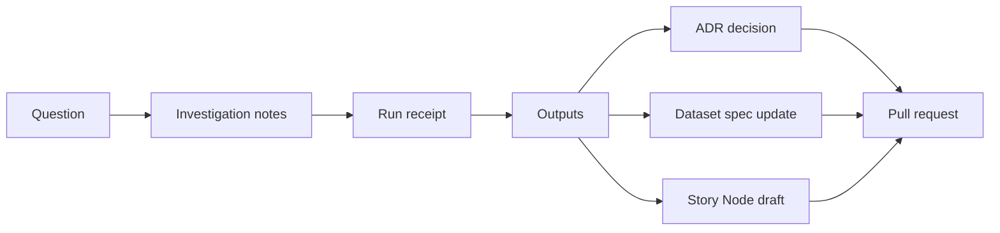

<!--
[KFM_META_BLOCK_V2]
doc_id: kfm://doc/3955ec11-5a21-4b52-8e88-217cec6041ac
title: docs/investigations/README.md
type: guide
version: v1
status: draft
owners: KFM Maintainers
created: 2026-02-22
updated: 2026-02-22
policy_label: public
related:
  - kfm://doc/docs/adr/<id>@v1
  - kfm://doc/docs/story/<id>@v1
tags:
  - kfm
  - investigations
  - reproducibility
  - governance
notes:
  - Directory contract for investigations (question → evidence → method → result → next-step).
[/KFM_META_BLOCK_V2]
-->

# Investigations
Working notes + reproducible analysis artifacts that feed governed decisions (ADRs), datasets, and Story Nodes.

`status: draft` `policy: public` `owners: KFM Maintainers`

**Jump to:** [What goes here](#what-goes-here) · [Start a new investigation](#start-a-new-investigation) · [Recommended layout](#recommended-layout) · [Rules](#rules-of-the-road) · [Promotion paths](#promotion-paths) · [Definition of Done](#definition-of-done) · [Templates](#templates)

---

## What goes here

Use `docs/investigations/` for **exploratory, evidence-led work** that is not yet an ADR or Story Node:

- **Questions/hypotheses** (what we’re trying to learn; what decision this informs)
- **Inputs pinned to versions** (dataset_version IDs + EvidenceRefs)
- **Methods that can be rerun** (notebooks/scripts, ideally referenced by digest)
- **Outputs with traceability** (maps/charts/tables + digests + run receipts)
- **Findings + uncertainty** (what’s true vs what’s inferred; gaps; competing explanations)
- **Next steps** (convert to ADR, dataset spec update, Story Node draft, PR link)

Do **not** use this folder for:

- Final decisions → put those in `docs/adr/`
- Publishable narratives bound to map state → put those in `docs/story/`
- Large raw/processed data blobs → keep those in the governed data zones; reference by `dataset_version_id` / digest

> **NOTE**
> If an investigation touches sensitive locations, private individuals, culturally restricted sites, or protected infrastructure: default to **generalized geometry**, minimal exposure, and mark the work for governance review.

---

## Investigation artifact contract

An investigation is treated as a **first-class artifact** with a minimal set of traceable fields.

**Minimum fields (conceptual):**
- `investigation_id`
- `title` / `description`
- `inputs`: dataset_version IDs + EvidenceRefs
- `methods`: scripts/notebooks (prefer “by digest”)
- `outputs`: tables/maps/charts (with digests)
- `run_receipts` + environment info
- `policy_label` + `review_state`

### Minimal sidecar (recommended)

Create a small sidecar file next to the investigation README:

- `investigation.json` (or `investigation.sidecar.json`)

```json
{
  "kfm_investigation_version": "v1",
  "investigation_id": "kfm://investigation/<uuid>",
  "title": "<short title>",
  "description": "<what question and why>",
  "inputs": {
    "datasets": [
      "kfm://dataset/<slug>@<dataset_version_id>"
    ],
    "evidence_refs": [
      "<EvidenceRef>",
      "<EvidenceRef>"
    ]
  },
  "methods": [
    { "path": "03_methods/<notebook_or_script>", "digest": "sha256:<...>" }
  ],
  "outputs": [
    { "path": "04_results/<artifact>", "digest": "sha256:<...>", "media_type": "image/png" }
  ],
  "run_receipts": [
    { "path": "run_receipt.json", "digest": "sha256:<...>" }
  ],
  "policy": {
    "policy_label": "public",
    "review_state": "needs_review",
    "obligations": []
  }
}
```

---

## Start a new investigation

1) Create a new folder:

- `docs/investigations/YYYY-MM-DD__short-slug/`

2) Add:
- `README.md` (use the template below)
- `investigation.json` (optional but recommended)
- `sources.md` (or a `02_sources/` folder)

3) Pin inputs:
- Always record dataset inputs as `dataset_version_id` (not “latest”)
- Always include EvidenceRefs (or a stable evidence pointer) for claims

4) Export results:
- Prefer small, reviewable artifacts (PNG/SVG/CSV summary tables)
- Reference any larger artifacts by digest/path in governed storage

---

## Recommended layout

### Folder naming
- Use `YYYY-MM-DD__short-slug` to make investigations **time-aware** and easily sortable.
- Keep slugs short and stable (lowercase, hyphenated).

### Layout map (one investigation)

```text
┌─ docs/investigations/YYYY-MM-DD__short-slug/ ───────────────────────────────────────────┐
│                                                                                        │
│  README.md                       ← one-screen overview + decision question             │
│  investigation.json              ← sidecar (inputs/methods/outputs/policy), optional   │
│                                                                                        │
│  00_context.md                   ← background + constraints + scope                     │
│  01_questions.md                 ← hypotheses + success criteria                        │
│                                                                                        │
│  02_sources/                     ← sources + citations                                 │
│  │  sources.md                   ← annotated bibliography / EvidenceRefs               │
│  │  terms_snapshot/              ← license/terms snapshots (when needed)               │
│                                                                                        │
│  03_methods/                     ← how the work was done                               │
│  │  notebook.ipynb               ← reproducible notebook (pin dataset_version_id)      │
│  │  scripts/                     ← small scripts (include run commands)                │
│                                                                                        │
│  04_results/                     ← what came out                                       │
│  │  figures/                     ← charts/maps (exported)                              │
│  │  tables/                      ← summary tables (small, reviewable)                  │
│                                                                                        │
│  05_findings.md                  ← findings + uncertainty + alternatives               │
│  06_next_steps.md                ← ADR links / PR links / Story Node draft links       │
│                                                                                        │
│  _attachments/                   ← last resort for small files only (keep tidy)        │
│                                                                                        │
└────────────────────────────────────────────────────────────────────────────────────────┘
```

### Minimal layout (if you’re moving fast)

```text
docs/investigations/YYYY-MM-DD__short-slug/
├── README.md
├── sources.md
├── methods.md
└── results/
    ├── figures/
    └── tables/
```

---

## Rules of the road

### 1) Pin “what you used”
- Every dataset input must be referenced by **dataset slug + dataset_version_id**
- Every external source should be recorded as an EvidenceRef or stable reference

### 2) Make reruns possible
- If you used a notebook or script, include:
  - exact command line
  - parameters
  - expected outputs
  - runtime environment notes (container image/digest when available)

### 3) Keep artifacts reviewable
- Prefer:
  - small figures (PNG/SVG)
  - small tables (CSV)
  - short summaries
- Avoid committing giant binaries. If needed:
  - store them in governed storage
  - reference them by digest/path in the sidecar

### 4) Label uncertainty
- Separate:
  - **observations** (what evidence directly supports)
  - **inferences** (what you conclude from evidence)
  - **unknowns** (what you can’t verify yet)

---

## Promotion paths

Investigations are *work-in-progress* by default; they become “production” when promoted into other governed artifacts.



**Common outcomes:**
- **Decision needed** → write an ADR in `docs/adr/` and link it from the investigation.
- **Dataset change needed** → update dataset specs/contracts/pipeline + include receipts/QA.
- **Publishable story** → draft a Story Node and ensure citations + map state + review gates.

---

## Definition of Done

An investigation is “done enough” when:

- [ ] The decision/question is written in the first screen of `README.md`
- [ ] Inputs are pinned (dataset_version IDs + EvidenceRefs)
- [ ] Methods are reproducible (commands, parameters, environment notes)
- [ ] Outputs are present and traceable (with digests if applicable)
- [ ] Findings include uncertainty and alternatives
- [ ] Policy label + review state are declared
- [ ] Next step is explicit (ADR link / PR link / Story Node link / “stop here” rationale)

---

## Templates

<details>
<summary><strong>Template: Investigation README.md</strong></summary>

```markdown
# <Investigation title>

## Decision question
What decision will this inform?

## Scope
- Geography:
- Time window:
- Out of scope:

## Inputs
- Datasets:
  - kfm://dataset/<slug>@<dataset_version_id>
- EvidenceRefs:
  - <EvidenceRef>

## Method
- Steps to reproduce:
- Parameters:
- Environment:

## Results
- Key figures/tables:
- Links to artifacts (with digests if available):

## Findings
- Observations:
- Inferences:
- Uncertainty / conflicts:

## Risks + governance notes
- Sensitivity:
- Policy label:
- Review triggers:

## Next steps
- ADR:
- Dataset spec change:
- Story Node:
```

</details>

<details>
<summary><strong>Template: sources.md</strong></summary>

```markdown
# Sources

| Ref | Type | Why it matters | EvidenceRef / Location | Notes |
|---:|------|-----------------|------------------------|-------|
| 1 | Dataset | <reason> | kfm://dataset/<slug>@<dataset_version_id> | |
| 2 | Document | <reason> | <EvidenceRef> | |
| 3 | Map | <reason> | <EvidenceRef> | |
```

</details>

<details>
<summary><strong>Template: investigation.json (sidecar)</strong></summary>

```json
{
  "kfm_investigation_version": "v1",
  "investigation_id": "kfm://investigation/<uuid>",
  "title": "<title>",
  "description": "<description>",
  "inputs": { "datasets": [], "evidence_refs": [] },
  "methods": [],
  "outputs": [],
  "run_receipts": [],
  "policy": { "policy_label": "public", "review_state": "needs_review", "obligations": [] }
}
```

</details>

---

<a id="back-to-top"></a>
**Back to top:** [Investigations](#investigations)
