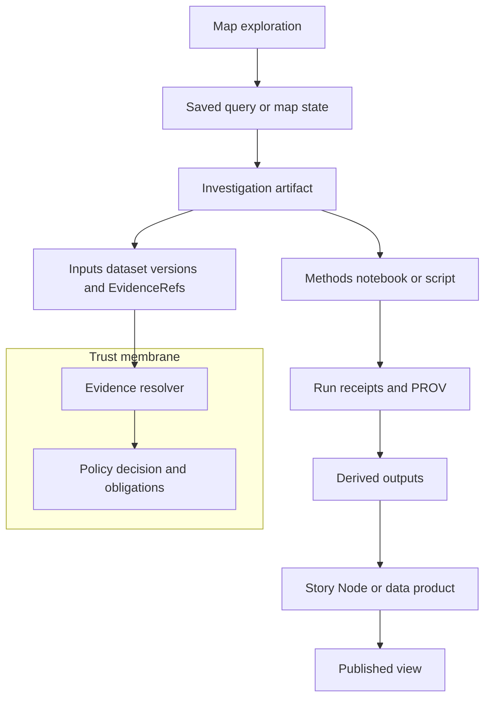

[KFM_META_BLOCK_V2]
doc_id: kfm://doc/64db296c-37d3-42f5-a65d-e96f7d979ed8
title: Investigations
type: guide
version: v1
status: draft
owners:
  - TBD
created: 2026-02-22
updated: 2026-02-22
policy_label: public
tags:
  - kfm
  - investigations
  - discover
  - provenance
  - governance
notes:
  - Landing page for reproducible investigation artifacts (docs-only; no raw data storage).
[/KFM_META_BLOCK_V2]

# Investigations

Reproducible, governed analysis artifacts that connect map exploration → evidence → results → publishable outputs.

**Status:** `draft` · **Policy:** `public` · **Owners:** `TBD` · **Artifact:** `Investigation (docs + sidecars + receipts)`

**Quick nav:**  
- [What belongs here](#what-belongs-here)  
- [Non-negotiables](#non-negotiables)  
- [Folder conventions](#folder-conventions)  
- [Investigation definition](#investigation-definition)  
- [Reproducibility requirements](#reproducibility-requirements)  
- [Compute governance](#compute-governance)  
- [Publishing and promotion](#publishing-and-promotion)  
- [Templates](#templates)  
- [FAQ](#faq)  

---

## What belongs here

This directory holds **investigations as first-class artifacts**: versioned, reviewable “units of analysis” that are traceable to inputs, methods, outputs, and policy decisions.

An investigation should be understandable *and* reproducible from its committed record:
- what question we asked,
- what data (dataset versions + evidence refs) we used,
- what method we ran (scripts/notebooks by digest),
- what outputs we produced (tables/maps/charts by digest),
- what receipts/provenance exist,
- and what policy label / review state governs sharing.

> [!NOTE]
> “Investigation” in KFM is not just a notebook. It is an **artifact type** that can be shared internally and, when safe, published as Story Nodes or data products.

---

## Non-negotiables

### Governance and safety

> [!WARNING]
> **Default deny** for restricted/sensitive-location datasets unless policy explicitly allows use.  
> Do **not** embed precise coordinates in Investigation writeups, Story Nodes, or Focus Mode outputs unless policy explicitly allows.  
> If a public representation is allowed, prefer creating a **separate generalized output** and record the generalization transform in provenance.

### Trust membrane

- Investigations must treat the platform boundary as a **policy + provenance membrane**:
  - UI is allowed to display policy badges/notices.
  - **UI never makes policy decisions**.
  - Analysis should use **governed APIs** / approved exports rather than bypassing controls.

### Cite-or-abstain discipline

- If a result or claim cannot be traced to an evidence bundle / dataset version / run receipt, treat it as **not publishable** (and often not shareable).

---

## Folder conventions

> [!TIP]
> Keep this folder **docs-only**. Store raw/processed datasets in the KFM truth path (data/… + catalogs + provenance). Store *references* here: IDs, digests, queries, receipts, and summaries.

### Recommended layout (PROPOSED)

```text
docs/
  investigations/
    README.md                     # you are here
    _templates/
      investigation.md            # markdown skeleton (copy for new work)
      investigation.sidecar.json  # optional machine metadata skeleton
    inv-YYYYMMDD-<slug>/          # one investigation
      README.md                   # the investigation writeup (MetaBlock v2)
      scope.json                  # bbox/time window/map-state reference (optional)
      methods/
        notebook.ipynb            # or a pointer/digest if notebooks are stored elsewhere
        script.py
      inputs/
        inputs.json               # dataset_version_ids + EvidenceRefs (machine-readable)
      outputs/
        outputs.json              # output artifact digests + locations (machine-readable)
      receipts/
        run_receipt.json          # run receipts for analysis steps (if applicable)
        prov_bundle.json          # provenance bundle or pointer/digest
```

### Naming guidance (PROPOSED)

- Investigation folder name: `inv-YYYYMMDD-<short-slug>`
- Investigation identifier: `investigation_id = kfm://investigation/<uuid>` (stable)
- Use **content digests** for methods/outputs when possible (`sha256:…`).

---

## Investigation definition

### Minimum fields (must exist)

| Field | Meaning | Notes |
|---|---|---|
| `investigation_id` | Stable identifier | Don’t regenerate on edits. |
| `title` + `description` | Human entrypoint | Keep description 1–3 paragraphs. |
| `inputs` | Dataset version IDs + EvidenceRefs | Must be resolvable. |
| `methods` | Notebooks/scripts (by digest) | Capture environment if runnable. |
| `outputs` | Result artifacts (tables/maps/charts) | Include digests + where stored. |
| `run receipts` | Proof of execution | Include params + environment when possible. |
| `policy_label` + `review_state` | Sharing controls | Required for any internal/public sharing. |

### How it fits the truth path



---

## Reproducibility requirements

### Notebooks and scripts

At minimum:
- Every notebook/script must declare the **dataset_version_id** for every input.
- Every chart/map/table must link to an **evidence bundle** or dataset version.
- Methods should be stored by digest (or referenced by digest) and linked in provenance.
- Notebook exports (HTML/PDF) must include citations and policy notices.

### Run receipts

If you execute any analysis step that produces outputs used in decisions or publishing, capture a run receipt that includes:
- inputs (artifact IDs + digests),
- outputs (artifact IDs + digests),
- validation status (if applicable),
- policy decision ID + obligations,
- environment (git commit, container image digest, parameters),
- timestamps.

> [!NOTE]
> KFM run receipts are emitted for pipeline runs and Focus Mode queries; investigations should follow the same “receipt-first” discipline where feasible.

---

## Compute governance

Two-mode posture (recommended default):

- **Public datasets**: offline notebooks are acceptable (but must still record dataset versions + digests + citations).
- **Restricted / partner-controlled datasets**: use a **controlled analysis environment** (JupyterHub-like or equivalent) so policy enforcement and auditing remain intact.

> [!WARNING]
> If a dataset is restricted, do not rely on “export a copy to analyze locally” unless policy explicitly allows redistribution.

---

## Publishing and promotion

### Internal sharing

An investigation can be shared internally when:
- `policy_label` allows it,
- inputs are all resolvable (dataset versions + EvidenceRefs),
- outputs do not leak restricted fields/locations,
- receipts/provenance exist for key outputs.

### Public publishing

Investigations can become:
- a **Story Node** (narrative + map state + citations), or
- a **public data product** (aggregations/models) derived from safe inputs.

Minimum publish gate (conceptual):
- all citations resolve via the evidence resolver,
- rights/licensing is clear for included media,
- policy label is `public` (or a public-safe generalized derivative),
- review state is approved.

---

## Templates

<details>
<summary><strong>Investigation markdown skeleton (copy/paste)</strong></summary>

```markdown
[KFM_META_BLOCK_V2]
doc_id: kfm://investigation/<uuid>@v1
title: <Investigation title>
type: guide
version: v1
status: draft
owners:
  - <team or names>
created: YYYY-MM-DD
updated: YYYY-MM-DD
policy_label: public|restricted|...
related:
  - kfm://dataset/<slug>@<dataset_version_id>
tags:
  - investigation
  - kfm
notes:
  - <short notes>
[/KFM_META_BLOCK_V2]

# <Investigation title>

## Summary
<What this investigation is about, in 5–10 lines.>

## Question and scope
- Question:
- Scope:
  - Geography (bbox or named area):
  - Time window (valid time / transaction time if relevant):

## Inputs
- Dataset versions:
  - <dataset_slug>@<dataset_version_id>
- EvidenceRefs:
  - <scheme://...> (include enough detail to resolve)

## Methods
- Notebook/script digests:
  - sha256:...
- Environment:
  - git commit:
  - container image digest (if applicable):
  - key parameters:

## Outputs
- Artifacts:
  - type: <table|map|chart|model>
  - digest: sha256:...
  - location: <path or URL if allowed>

## Findings
- Observation claims (with citations):
- Interpretive claims (clearly labeled):

## Uncertainty and limits
- Data gaps:
- Conflicts between sources:
- Sensitivity considerations:

## Run receipts and provenance
- Run receipt IDs/paths:
- PROV bundle ID/path:

## Policy and review
- policy_label:
- review_state:
- obligations (if any):
```
</details>

<details>
<summary><strong>Investigation sidecar JSON (optional; PROPOSED)</strong></summary>

```json
{
  "kfm_investigation_version": "v1",
  "investigation_id": "kfm://investigation/<uuid>",
  "title": "<title>",
  "description": "<short description>",
  "scope": {
    "bbox": [-102.0, 36.9, -94.6, 40.0],
    "time_window": { "start": "YYYY-MM-DD", "end": "YYYY-MM-DD" }
  },
  "inputs": {
    "dataset_versions": [
      { "dataset_slug": "<slug>", "dataset_version_id": "<version>" }
    ],
    "evidence_refs": ["dcat://...", "stac://...", "prov://..."]
  },
  "methods": {
    "artifacts": [
      { "kind": "notebook", "digest": "sha256:..." },
      { "kind": "script", "digest": "sha256:..." }
    ],
    "environment": {
      "git_commit": "<commit>",
      "container_image": "sha256:<image_digest>",
      "parameters": {}
    }
  },
  "outputs": [
    { "kind": "table", "digest": "sha256:...", "policy_label": "public" }
  ],
  "receipts": [
    { "kind": "run_receipt", "ref": "kfm://run/..." },
    { "kind": "prov_bundle", "ref": "prov://..." }
  ],
  "policy": {
    "policy_label": "public",
    "review_state": "needs_review",
    "obligations": []
  }
}
```
</details>

---

## FAQ

### Can I put datasets in this folder?
Prefer **no**. Put datasets in the truth path (data/raw → work → processed → catalog), and reference them here by `dataset_version_id`, EvidenceRefs, and digests.

### Can investigations be messy?
Draft investigations can be messy, but *must* still:
- declare inputs (dataset versions),
- avoid leaking restricted data,
- and keep a path to reproducibility (even if incomplete).

### When do I create a Story Node instead?
If you are ready to publish a narrative, map state, and citations through the publishing gate, create a Story Node. If you are still iterating, keep it as an investigation.

---

<a href="#investigations">Back to top</a>
