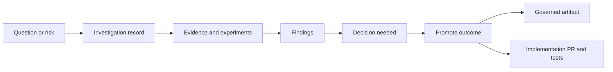

<!-- [KFM_META_BLOCK_V2]
doc_id: kfm://doc/656e8d6e-0e66-4802-99b8-ee963673cd08
title: docs/investigations/README.md
type: standard
version: v3
status: draft
owners: TBD
created: 2026-02-24
updated: 2026-03-05
policy_label: public
related: []
tags: [kfm, investigations]
notes:
  - Directory contract for investigation artifacts (spikes, research notes, experiments).
  - This folder is *not* a decision record; promote outcomes to an ADR/policy/spec when needed.
  - Layout includes optional indexing, templates, run receipts, and evidence scaffolding (create as needed).
[/KFM_META_BLOCK_V2] -->

# docs/investigations
Short-lived research notes and reproducible experiments that reduce uncertainty *before* we change governed interfaces, pipelines, or user-facing narratives.

> **Status:** draft  
> **Owners:** TBD  
> **Policy label:** public  
> **Lifecycle:** pre-decision → promote (if acted upon)


> **IMPORTANT**
> Investigations are for *learning + de-risking*. They may contain incomplete thinking.
> Anything that changes shipped behavior (promotion gates, APIs/contracts, UI narrative, access rules) must be **promoted** to a governed artifact (ADR / policy / spec) before shipping.

---

## Quick navigation
- [Where this fits in the repo](#where-this-fits-in-the-repo)
- [Definitions](#definitions)
- [What belongs here](#what-belongs-here)
- [What must NOT go here](#what-must-not-go-here)
- [Directory layout](#directory-layout)
  - [Top-level layout](#top-level-layout)
  - [Per-investigation layout](#per-investigation-layout)
  - [Folder semantics table](#folder-semantics-table)
- [Indexing and discoverability](#indexing-and-discoverability)
- [Naming and lifecycle](#naming-and-lifecycle)
- [Evidence discipline and hallucination checks](#evidence-discipline-and-hallucination-checks)
- [Reproducibility contract](#reproducibility-contract)
- [Quickstart](#quickstart)
- [Investigation template](#investigation-template)
- [Promotion path](#promotion-path)
- [Safety and governance](#safety-and-governance)
- [FAQ](#faq)

---

## Where this fits in the repo
`docs/investigations/` sits **upstream** of decisions and implementations:


```mermaid
flowchart LR
  Q[Question or risk] --> I[Investigation record]
  I --> E[Evidence and experiments]
  E --> F[Findings]
  F --> D[Decision needed]
  D --> P[Promote outcome]
  P --> G[Governed artifact]
  P --> PR[Implementation PR and tests]
```

### Primary outcomes
An investigation should produce at least one of:
- A **reproducible** experiment (commands, inputs, outputs, environment)
- A **bounded** recommendation with assumptions/risks/tradeoffs
- A **decision request** (what decision is needed, by whom, by when)
- A **promotion target** (where the result must land if acted upon)

---

## Definitions
These are working definitions for this directory. If a governed spec defines these terms elsewhere, that spec wins.

- **Investigation**: a time-boxed spike/study whose job is to reduce uncertainty, not to ship.
- **Claim label**: a required tag on meaningful statements:
  - **CONFIRMED**: supported by evidence in this folder (or linked durable evidence) and consistent with policy.
  - **PROPOSED**: a recommendation/design option; not yet shipped truth.
  - **UNKNOWN**: not supported yet; must list the smallest steps to verify.
- **Run receipt**: a structured record of an experiment run (inputs + environment + commands + output digests).
- **Evidence artifact**: a file (table/plot/report) that supports a claim. Evidence must be rights-cleared before promotion.
- **Promotion packet**: a small handoff bundle that lets a reviewer turn an investigation into a governed ADR/spec/PR.

---

## What belongs here
Acceptable inputs for `docs/investigations/` include:

- **Spikes / feasibility checks**  
  “Can we do X with our constraints?” “What breaks if we do Y?”

- **Comparative evaluations**  
  e.g., library/tool options, schema approaches, indexing strategies, map rendering approaches.

- **Reproduction notes**  
  How to reproduce a bug, perf regression, validation failure, or data anomaly.

- **Evidence-bound explorations**  
  Small studies that support or refute a claim *without* asserting it as a shipped truth.

- **Prototypes with clear scope**  
  Proof-of-concepts explicitly labeled as non-production.

- **Threat modeling / risk discovery**  
  What could go wrong; what controls/gates we need; what to test.

---

## What must NOT go here
Exclusions (default-deny):

- **Final decisions**  
  Use an ADR / decision log / policy doc (path varies by repo). Link the promoted artifact *back* from the investigation.

- **Production-facing user narratives**  
  Anything that will be shown in UI/story mode must be promoted to a governed story/spec (and must be citation-valid).

- **Secrets or sensitive credentials**  
  No API keys, tokens, private keys, internal URLs with embedded creds, customer data, or “pastebin style” dumps.

- **Vulnerable location targeting**  
  No precise coordinates or step-by-step instructions that could increase harm. Use coarse geography and mark:
  **“needs governance review”**.

- **Unlicensed datasets / unclear provenance**  
  If source/license is unknown, you may *analyze locally* in this folder, but you must not promote the result until cleared.

---

## Directory layout
The goal of this layout is: **discoverable + reproducible + promotion-ready** without forcing every investigation to be heavyweight.

> **NOTE**
> Some subfolders below may not exist yet in your repo. Treat this as a **recommended** layout and create pieces as needed.

### Top-level layout
```text
docs/investigations/                                  # Pre-decision research + experiments (bounded, auditable)
├─ README.md                                          # This file (directory contract)
│
├─ INDEX.md                                           # Optional: human-friendly list of investigations
├─ index.yml                                          # Optional: machine index (status/tags/links)
│
├─ _templates/                                        # Optional: starters aligned with KFM practices (copy/paste)
│  ├─ investigation.README.template.md
│  ├─ status.template.yml
│  ├─ run-receipt.template.json
│  └─ promotion-packet.template.md
│
├─ _shared/                                           # Optional: shared helpers for investigations
│  ├─ scripts/                                        # Tiny helper scripts (safe; no secrets)
│  ├─ env/                                            # Shared environment notes (tool versions, base images)
│  └─ assets/                                         # Reusable diagrams/images used across investigations
│
├─ 2026/                                              # Optional year partition (recommended once > ~20 items)
│  ├─ 2026-02-24_short-slug/                           # Investigation folder (date + slug)
│  └─ 2026-03-05_another-slug/
│
└─ _archive/                                          # Optional: closed/superseded investigations (no longer active)
   └─ 2025/...
```

### Per-investigation layout
One investigation = one folder. Keep the folder `README.md` readable; push scratch into `appendix/`.

```text
docs/investigations/YYYY/YYYY-MM-DD_short-slug/
├─ README.md                                          # Canonical record (question → method → findings → recommendation)
├─ status.yml                                         # Lightweight metadata (owners, status, links, policy label)
│
├─ plan/                                              # Optional: pre-work planning (helps time-boxing)
│  ├─ question.md
│  ├─ hypotheses.md
│  └─ method.md
│
├─ inputs/                                            # What was used (pointers first, samples when needed)
│  ├─ sources.yml                                     # Source list (URLs/paths), versions, licenses, hashes (if available)
│  ├─ samples/                                        # Small excerpts only (never full sensitive datasets)
│  └─ checksums.txt                                   # Optional: digests for any local sample artifacts
│
├─ env/                                               # Repro environment (prefer lockfiles + container digest)
│  ├─ README.md
│  ├─ container/                                      # Optional
│  │  ├─ Dockerfile
│  │  └─ image.digest
│  ├─ requirements.txt / poetry.lock / package-lock.json
│  └─ tool-versions.txt
│
├─ code/                                              # Minimal repro code only (no production code here)
│  ├─ README.md
│  ├─ scripts/
│  └─ notebooks/
│
├─ runs/                                              # Optional: per-run working folders
│  ├─ 2026-03-05T120000Z_run-01/
│  │  ├─ command.txt
│  │  ├─ stdout.log / stderr.log
│  │  └─ notes.md
│  └─ ...
│
├─ receipts/                                          # Recommended if code runs (structured provenance)
│  ├─ run_2026-03-05T120000Z.abcd.json
│  └─ ...
│
├─ qa/                                                # Validation outputs (if you validated anything)
│  ├─ report_2026-03-05T120000Z.abcd.json
│  └─ notes.md
│
├─ outputs/                                           # Results (small + reviewable)
│  ├─ figures/
│  ├─ tables/
│  └─ excerpts/
│
├─ evidence/                                          # Only if outputs might become citeable later
│  ├─ evidence_refs.md
│  ├─ bundles/                                        # Optional: evidence bundle docs
│  └─ rights.md
│
├─ promotion/                                         # “Handoff packet” if we act on this investigation
│  ├─ decision_request.md
│  ├─ promotion_checklist.md
│  └─ links.md
│
└─ appendix/                                          # Scratch notes that should not distract from the top record
   ├─ scratch.md
   └─ misc/
```

> **WARNING**
> If anything in `outputs/` or `evidence/` includes sensitive location info, **generalize** it and mark “needs governance review”. Do not store precise coordinates here.

### Folder semantics table

| Path | Required | What goes here | What must NOT go here |
|---|---:|---|---|
| `README.md` | ✅ | Canonical write-up + links + claim labels | Final decisions (ADR/policy/spec), secrets |
| `status.yml` | ✅ (recommended) | Owners, status, tags, links, next decision | Sensitive content; credentials |
| `plan/` | ⬜ | Question, hypotheses, method, DoD | Results (those go in `outputs/`) |
| `inputs/` | ⬜ | Source pointers, tiny samples, hashes | Full datasets; unlicensed exports |
| `env/` | ⬜ | Lockfiles, container digest, tool versions | Hidden “it works on my machine” assumptions |
| `code/` | ⬜ | Minimal repro scripts/notebooks | Production code; secrets |
| `runs/` | ⬜ | Run-by-run logs + commands | Credentials; large raw dumps |
| `receipts/` | ⬜ (recommended if code runs) | Structured run receipts | Ad-hoc-only provenance (put logs in `runs/`) |
| `qa/` | ⬜ | QA reports + interpretation | Unvalidated claims presented as **CONFIRMED** |
| `outputs/` | ⬜ | Charts/tables/excerpts (small) | Huge binaries; sensitive raw dumps |
| `evidence/` | ⬜ | Rights notes + evidence refs for later promotion | Anything not rights-cleared |
| `promotion/` | ⬜ | Decision request + checklist + links to ADR/PR | The ADR itself (promote it out) |
| `appendix/` | ⬜ | Scratch | Anything that should be in the main README |

---

## Indexing and discoverability
When investigations grow, add one (or both):

- `INDEX.md`: human-friendly list (group by year, tag, and status).
- `index.yml`: machine index for automation/search.

Recommended minimum fields for `index.yml`:

```yaml
investigations:
  - id: "2026-03-05_example-slug"
    path: "docs/investigations/2026/2026-03-05_example-slug/"
    title: "Example investigation title"
    status: "active|paused|done|promoted|superseded|archived"
    owners: ["@team-or-handle"]
    tags: ["kfm", "investigation", "topic"]
    policy_label: "public|restricted|internal"
    promotion:
      target: "ADR|policy|spec|PR|none"
      links: []
    updated: "2026-03-05"
```

---

## Naming and lifecycle

### Folder naming
- Prefer: `YYYY-MM-DD_short-slug/`
- Slug: lowercase, hyphenated, short, descriptive.
- Optional partition: `YYYY/` folder to keep the root tidy.

### Status lifecycle
Recommended `status.yml` values:
- `active` (in progress)
- `paused` (blocked; list what’s missing)
- `done` (completed; may or may not be promoted)
- `promoted` (outcome landed in ADR/policy/spec/PR)
- `superseded` (replaced by a newer investigation)
- `archived` (kept for history; no longer relevant)

Minimal `status.yml` template:

```yaml
id: "2026-03-05_short-slug"
title: "Short title"
status: "active"
owners: ["TBD"]
policy_label: "public"
created: "2026-03-05"
updated: "2026-03-05"
tags: ["kfm", "investigation"]
decision_needed:
  needed: false
  by: null
promotion:
  target: "none"   # ADR|policy|spec|PR|none
  links: []
sensitivity:
  classification: "public"  # public|restricted|internal|TBD
  notes: ""
```

---

## Evidence discipline and hallucination checks
Investigations are allowed to be exploratory, but they must still be **truth-aware**.

### Claim labels are required
In every investigation `README.md`, label meaningful claims as:

- **CONFIRMED**: backed by evidence artifacts or authoritative sources referenced in the investigation.
- **PROPOSED**: design recommendation, hypothesis, or option under consideration.
- **UNKNOWN**: explicitly not yet verified; must list the minimum verification steps.

Suggested pattern (use bullets, keep it compact):

```text
- CONFIRMED: <claim> (evidence: outputs/tables/foo.csv, inputs/sources.yml#ref-3)
- PROPOSED: <claim> (rationale: ...)
- UNKNOWN: <claim> (verify: run X; fetch Y; compare to Z)
```

### “Hallucination sweep” before marking `done`
Before you mark an investigation `done`, do a quick sweep:

- [ ] Every **CONFIRMED** claim has an evidence pointer (file/link/hash).
- [ ] Anything not backed is **PROPOSED** or **UNKNOWN** (not accidentally stated as fact).
- [ ] Any repo-specific path/tool mention is either:
  - linked to an existing file in-repo, **or**
  - clearly marked as an example/proposal.

---

## Reproducibility contract
Every investigation should include enough detail to **re-run** or **audit**:

- **Inputs:** links/paths, versions, hashes when available  
- **Environment:** tool versions (runtime, OS/container, library versions)  
- **Steps:** commands or pseudocode sufficient to reproduce  
- **Outputs:** expected outputs + where to find them  
- **Conclusion:** what we learned + what we still don’t know  

> **TIP**
> If you can’t make it reproducible, make it *auditable*: record enough detail that someone else can re-run it later.

### When to add receipts + evidence scaffolding
- If you ran code or transformed data: add `receipts/` and record run metadata.
- If outputs might be cited later by user-facing narratives (e.g., Story/Focus Mode): add `evidence/` and capture rights + provenance.

Minimal run receipt shape (example):

```json
{
  "run_id": "2026-03-05T120000Z_run-01",
  "timestamp_utc": "2026-03-05T12:00:00Z",
  "actor": "TBD",
  "command": "python code/scripts/repro.py --arg value",
  "inputs": [{"ref": "inputs/sources.yml#ref-1", "hash": "sha256:..."}],
  "environment": {"os": "linux", "python": "3.12.0"},
  "outputs": [{"path": "outputs/tables/result.csv", "hash": "sha256:..."}],
  "notes": "Any deviations from plan"
}
```

---

## Quickstart
Create a new investigation with the smallest useful footprint.

> **NOTE**
> If `_templates/` doesn’t exist in your repo yet, copy/paste from the template in this README (below) and create `_templates/` later.

```bash
# 1) Create folder (adjust year/date/slug)
INV_DIR="docs/investigations/2026/2026-03-05_example-slug"
mkdir -p "$INV_DIR"

# 2) Create baseline subfolders (add more only if needed)
mkdir -p "$INV_DIR"/{plan,inputs,env,code,outputs,receipts,promotion,appendix}

# 3) Start the canonical record + status
touch "$INV_DIR/README.md"
cat > "$INV_DIR/status.yml" <<'YAML'
id: "2026-03-05_example-slug"
title: "Example investigation title"
status: "active"
owners: ["TBD"]
policy_label: "public"
created: "2026-03-05"
updated: "2026-03-05"
tags: ["kfm", "investigation"]
decision_needed: { needed: false, by: null }
promotion: { target: "none", links: [] }
sensitivity: { classification: "public", notes: "" }
YAML
```

---

## Investigation template

<details>
<summary><strong>Click to expand: Investigation README template</strong></summary>

```markdown
<!-- [KFM_META_BLOCK_V2]
doc_id: kfm://doc/<uuid>
title: docs/investigations/YYYY/YYYY-MM-DD_short-slug/README.md
type: standard
version: v1
status: draft
owners: <name/team>
created: YYYY-MM-DD
updated: YYYY-MM-DD
policy_label: public|restricted|internal|...
related:
  - <issue/ticket link if available>
tags: [kfm, investigation]
notes:
  - One-line: what uncertainty this reduces
[/KFM_META_BLOCK_V2] -->

# <Investigation title>
One sentence: what we are trying to learn and why it matters.

## Question
- What is the exact question?
- What decision will this inform (if any)?

## Context
- Background, constraints, and why now.

## Claims (required)
- CONFIRMED: <claim> (evidence: <file/link/hash>)
- PROPOSED: <claim> (rationale: ...)
- UNKNOWN: <claim> (verify: smallest steps)

## Assumptions
- List assumptions explicitly.
- Mark anything that needs verification as UNKNOWN.

## Method
- Steps taken, tools used, and what was measured.
- Include commands or pseudocode.
- Link to `env/` and `code/` if present.

## Evidence ledger
| Artifact | Source | Version / hash | Sensitivity | Notes |
|---|---|---|---|---|
| <file/link> | <origin> | <sha/version> | public|restricted|... | <why it matters> |

## Runs and receipts (if applicable)
- Logs: `runs/<run-folder>/...`
- Receipts: `receipts/run_<run_id>.json`

## Findings
- Bullet findings with supporting evidence links.
- Do not present unverified statements as CONFIRMED.

## Risks and tradeoffs
- What could go wrong if we act on this?
- What do we lose by not acting?

## Recommendation
- Proposed next step(s)
- Minimum verification steps to convert UNKNOWN → CONFIRMED

## Promotion target (only if acted upon)
Where does this land if we implement it?
- [ ] ADR / decision record: <path/link>
- [ ] Spec / contract: <path/link>
- [ ] Policy / governance: <path/link>
- [ ] Implementation PR: <link>
- [ ] Test plan / gate update: <link>

## Hallucination sweep (required before marking done)
- [ ] Every CONFIRMED claim has an evidence pointer
- [ ] Repo-specific paths/tools are linked or explicitly labeled “example”
- [ ] Sensitivity reviewed; anything unclear is marked “needs governance review”

## Appendix
- Extra charts, logs, scratch notes (or link to `appendix/`).
```

</details>

---

## Promotion path

### Promote when…
Promote an investigation outcome when it:
- Changes a **governed interface** (API, schema, contract)
- Changes **data promotion gates** (RAW → WORK → PROCESSED → PUBLISHED, per project lifecycle)
- Changes a **user-facing claim** (maps/stories/reporting)
- Changes **access control / redaction rules**
- Commits the team to a **new dependency** or architectural invariant

### Minimal promotion checklist
- [ ] Clear decision statement (“We will … because …”)
- [ ] Evidence links preserved (inputs/outputs/hashes if available)
- [ ] Risks/tradeoffs captured
- [ ] Tests or validation gates defined (or updated)
- [ ] Rollback plan is possible (or explicit exception documented)

> **NOTE**
> A promoted narrative must be citation-valid and policy-allowed. If citations cannot be verified, promotion should fail closed (abstain or reduce scope).

---

## Safety and governance
- Treat investigations as **default-deny** for sensitive content.
- If sensitivity is unclear: **redact/generalize** and mark “needs governance review”.
- Don’t bypass the trust membrane (clients → governed API → policy boundary → storage).
- Prefer **additive glue** (registries, indexes, ADRs, small diffs) over sweeping rewrites.

---

## FAQ

### Can investigations be messy?
Yes—*but bounded*. Put scratch notes in `appendix/`, and keep the top sections readable.

### Where do big artifacts go?
Prefer links to durable storage and record hashes/versions here. Avoid committing huge binaries unless the repo explicitly allows it.

### Do I have to use the template?
No, but every investigation must still meet the reproducibility contract and the claim-label discipline.

---

**Back to top:** [docs/investigations](#docsinvestigations)
