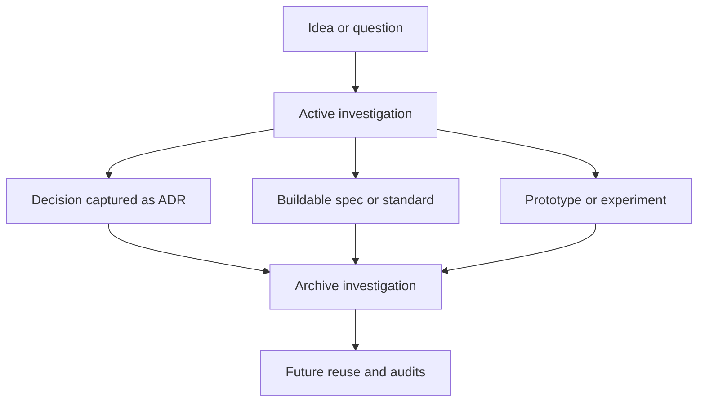

<!-- [KFM_META_BLOCK_V2]
doc_id: kfm://doc/4b0e81d2-45ac-47f9-b15e-9cc844e0c5b0
title: Investigations Archive
type: standard
version: v1
status: draft
owners: ["@TODO"]
created: 2026-03-04
updated: 2026-03-04
policy_label: restricted
related: ["docs/investigations/README.md", "docs/governance/ROOT_GOVERNANCE_CHARTER.md"]
tags: ["kfm", "investigations", "archive"]
notes: ["Closed/superseded investigations kept for traceability; not authoritative unless promoted."]
[/KFM_META_BLOCK_V2] -->

# Investigations Archive
Closed, superseded, or deferred investigation material retained for traceability, reuse, and learning—**not** as a source of truth.

---

## Impact
**Status:** active (archive surface)  
**Owners:** @TODO  
**Policy:** default-deny if unsure; treat as **restricted** until labeled otherwise  
**Badges:**   

**Quick links:** [Scope](#scope) · [Where it fits](#where-it-fits-in-the-repo) · [What belongs here](#acceptable-inputs) · [What-does-not](#exclusions) · [How to archive](#quickstart-archive-an-investigation) · [Taxonomy](#archive-taxonomy) · [Promotion paths](#promotion-paths) · [Definition of done](#definition-of-done) · [FAQ](#faq)

---

## Scope
This directory is the **long-tail storage** for investigations that are no longer active:

- **CONFIRMED:** The work item is closed, superseded, or explicitly deferred.
- **CONFIRMED:** The content is preserved to support reproducibility, audits, or future rework.
- **PROPOSED:** Archive items follow a lightweight metadata convention so they remain searchable.

**Non-goal:** This folder is not where current work happens, and it is not an authority surface for specs, policies, ADRs, or user-facing claims.

---

## Where it fits in the repo
This archive sits under `docs/` and is part of the **documentation lifecycle**, not the data lifecycle.

- Upstream: `docs/investigations/` (active investigations and indices)
- Downstream: promoted work products, when applicable:
  - Architectural decisions → `docs/adr/`
  - Buildable specs/standards → `docs/specs/` or `docs/standards/`
  - Runbooks/ops → `docs/runbooks/`
  - Dataset onboarding evidence → `data/` + catalog/provenance surfaces (per promotion contract)

If you are reading something here and want to use it as evidence, the safe default is: **do not treat it as authoritative** unless it has been promoted and linked.

---

## Acceptable inputs
What belongs in `docs/investigations/_archive/`:

- Closed investigation writeups (spikes, due diligence, prototypes, feasibility checks)
- Superseded drafts (kept for traceability)
- “Why we didn’t do X” notes (constraints, tradeoffs, dead ends)
- Research notes that may contain **UNKNOWN** items or unresolved questions
- Supporting artifacts that are safe to store in-repo:
  - diagrams, tables, lightweight datasets or samples **only if** policy allows
  - screenshots/redacted exports that support reasoning

---

## Exclusions
What must **not** live here (and where it goes instead):

- Active work → `docs/investigations/` (non-archive)
- Canonical decisions → `docs/adr/`
- Contract/spec truth → `contracts/`, `docs/specs/`, `docs/standards/`
- Runbooks/SOPs → `docs/runbooks/` or `mcp/sops/`
- Policies and enforcement logic → `policy/` (and tests)
- Raw sensitive material (PII, precise sensitive coordinates, credentials, unredacted exports) → **do not commit**; follow governance process

If you’re unsure, assume **UNKNOWN** and route to governance review.

---

## Directory tree
> This is a **PROPOSED** shape intended to keep the archive navigable. If your archive already uses a different structure, keep the structure but adopt the metadata conventions.

```text
docs/investigations/_archive/
├── README.md
├── _index.md                      # optional: human index (by topic/date)
├── _index.yml                     # optional: machine index (tags, dates, links)
├── 2024/
│   └── INV__example_topic__2024-09-18/
│       ├── README.md              # investigation summary + outcomes
│       ├── findings.md
│       ├── evidence/              # citations, links, redacted excerpts
│       └── artifacts/             # diagrams, patches, snippets (non-sensitive)
└── 2026/
    └── INV__another_topic__2026-02-14/
        ├── README.md
        ├── decision_notes.md
        └── artifacts/
```

---

## Quickstart: archive an investigation
### 1) Close it explicitly (required)
Add a closure header in the investigation’s own `README.md`:

- **Status:** closed | superseded | deferred
- **Superseded-by:** link (if applicable)
- **Last reviewed:** YYYY-MM-DD
- **Outcome:** 2–5 bullets

### 2) Move it into the archive
```bash
# Example: move an investigation into a year-bucketed folder
git mv docs/investigations/INV__topic docs/investigations/_archive/2026/INV__topic__2026-03-04

# Optional: ensure there is a short README at folder root
${EDITOR:-vim} docs/investigations/_archive/2026/INV__topic__2026-03-04/README.md
```

### 3) Update the index
If you maintain `_index.md` and/or `_index.yml`, add:

- title
- date range
- tags
- outcome (one line)
- promotion links (if any)

### 4) Run doc hygiene checks (recommended)
```bash
# Keep it lightweight; adapt to your repo's toolchain
# - markdownlint docs/investigations/_archive/**/*.md
# - linkcheck (if you have one)
# - repo CI will be the source of truth
```

---

## Archive item metadata convention
Each archived investigation folder should contain a `README.md` with a small metadata block near the top:

- **CONFIRMED / PROPOSED / UNKNOWN** labels for meaningful claims
- Links to any promoted outputs (ADR/spec/policy change)
- A short “what to reuse next time” section

**Recommended fields:**
- `Status:` closed | superseded | deferred
- `Owners:` GitHub handles or team
- `Closed:` YYYY-MM-DD
- `Primary question:`
- `Outcome:`
- `Evidence:` links (and redacted excerpts if needed)
- `Promotion links:` list of authoritative follow-ups

---

## Evidence discipline in the archive
Archived investigations commonly contain partial and time-bound information. Follow this rule:

- **CONFIRMED:** backed by a citation to an authoritative repo artifact (spec, contract, code, policy, dataset receipt) or a primary external source.
- **PROPOSED:** a design recommendation or plan; not yet merged/accepted.
- **UNKNOWN:** requires verification; include a “smallest verification step” to make it CONFIRMED.

**Example (format):**
- **UNKNOWN:** “This endpoint exists in the API.” → Verify by locating OpenAPI entry under `contracts/openapi/` and linking the exact path + revision.

---

## Diagram


---

## Archive taxonomy
Use the taxonomy below to make archived work searchable and to avoid mixing “investigation” with “decision” and “spec”.

| Category | What it is | Typical outputs | Where the authoritative result should live |
|---|---|---|---|
| Spike | short feasibility test | notes, quick POC, risks | spec or ADR if adopted |
| Due diligence | compare tools/options | matrix, tradeoffs, costs | spec, standards, or ADR |
| Debug forensics | incident-like analysis | root cause notes | runbook + postmortem (if you keep them) |
| Data reconnaissance | “what data exists” | source list, licensing notes | data registry + dataset spec |
| UI/UX exploration | exploration of flows | sketches, interaction notes | UI spec + design docs |

---

## Promotion paths
When an archived investigation produces something that must become authoritative, promote it and link back.

| If the investigation produced… | Promote to… | Required follow-up |
|---|---|---|
| A decision that constrains architecture | `docs/adr/` | ADR must state decision, context, consequences |
| A new governance rule or gate | `policy/` + tests | fail-closed tests + docs update |
| A new API contract | `contracts/` | OpenAPI/JSON Schema + contract tests |
| A dataset onboarding plan | `data/registry/` + catalog triplet | license + sensitivity + provenance receipts |
| A runbook | `docs/runbooks/` | operational steps + rollback notes |

---

## Governance and sensitivity handling
**Default rule:** archived does not mean safe to publish.

- If sensitivity is **UNKNOWN**, treat content as restricted and request review.
- Do not store secrets, raw PII, or precise sensitive coordinates.
- Prefer redaction and summaries over raw exports.

### Sensitivity matrix (recommended defaults)

| Policy label | Example content | Allowed in archive | Notes |
|---|---|---:|---|
| public | generic engineering notes | yes | still avoid secrets |
| restricted | internal design deliberations | yes | least privilege access |
| sensitive | anything requiring masking | maybe | requires governance review |
| embargoed | cannot be committed | no | store outside repo per process |

---

## Definition of done
Before considering an investigation “archived”, ensure:

- [ ] Status is set to closed, superseded, or deferred
- [ ] A short summary exists (problem, approach, outcome)
- [ ] Any promoted outputs are linked (ADR/spec/policy/PR)
- [ ] Claims are labeled CONFIRMED / PROPOSED / UNKNOWN
- [ ] Sensitive material is removed or redacted
- [ ] Folder name follows a stable convention (includes date)
- [ ] Index updated (if present)
- [ ] Links are reasonable (avoid link rot where feasible)

---

## FAQ
### Is anything in this folder authoritative?
**No, by default.** Treat it as historical context unless it links to promoted artifacts.

### Should I delete old investigations?
Prefer archiving over deletion for traceability, unless retention policy requires removal.

### How do I reference an archived investigation in new work?
Link it as context, then restate and re-verify key claims in the new doc as CONFIRMED (with fresh evidence).

---

## Appendix
<details>
<summary>Template: archived investigation README skeleton</summary>

```markdown
# INV: <title>

Status: closed | superseded | deferred  
Owners: @...  
Closed: YYYY-MM-DD  
Superseded-by: <link or N/A>  

## Primary question
...

## Outcome
- ...

## Key claims
- **CONFIRMED:** ...
- **PROPOSED:** ...
- **UNKNOWN:** ... (verification: ...)

## Evidence
- ...

## Promotion links
- ADR: ...
- Spec: ...
- Policy: ...
- PR: ...

## Reuse notes
- ...
```
</details>

---

[Back to top](#investigations-archive)
