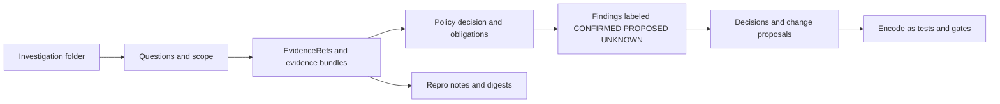

<!-- [KFM_META_BLOCK_V2]
doc_id: kfm://doc/6f5a1c1d-1f15-4d14-bd8a-0d55a3b4fe16
title: Investigations Shared
type: standard
version: v1
status: draft
owners: KFM Stewards (TODO: assign CODEOWNERS for docs/investigations/)
created: 2026-03-04
updated: 2026-03-04
policy_label: public
related: [docs/investigations/README.md, docs/governance/, policy/, tools/validators/]
tags: [kfm, investigations, shared]
notes: ["Contract + templates index for docs/investigations/* investigations. Keep additive + reversible."]
[/KFM_META_BLOCK_V2] -->

# Investigations Shared
Shared, governed templates + checklists used by **all** investigation folders under `docs/investigations/`.

> **IMPACT**
> - **Status:** experimental (directory contract is new; refine as investigations accumulate)
> - **Owners:** KFM Stewards (TODO) · Review cadence: quarterly (TODO)
> - **Badges:** TODO (docs lint) · TODO (linkcheck) · TODO (policy gate)
> - **Quick links:** [Scope](#scope) · [Where it fits](#where-it-fits) · [Quickstart](#quickstart) · [Directory tree](#directory-tree) · [Templates and contracts](#templates-and-contracts) · [Gate checklist](#gate-checklist) · [FAQ](#faq)

---

## Scope

- **PROPOSED:** `_shared/` is the **only** place for investigation-wide reusable scaffolding (templates, checklists, schemas, redaction guidance).
- **PROPOSED:** Individual investigations live in sibling folders like `docs/investigations/YYYY-MM-DD_<slug>/` and MUST NOT modify `_shared/` as part of ordinary writeups (keep `_shared/` stable and reviewed).

### Evidence discipline in investigations

- **CONFIRMED:** In KFM, a “citation” is not just a pasted URL; it is an **EvidenceRef** that resolves through an evidence resolver into an **EvidenceBundle**, and publishing gates can fail-closed when citations do not resolve or are not policy-allowed.  
  (See: “Evidence resolution contract” + “hard gate” notes in KFM delivery plan docs.)  
- **CONFIRMED:** Evidence resolution returns a bundle containing human-readable card data plus machine metadata (including digests + audit references), and the resolver applies policy decisions.  
- **CONFIRMED:** Evidence drawers/trust surfaces must expose license/rights, dataset version, freshness, validation status, provenance chain, artifact links (policy-permitting), and redactions applied.

> **How to write claims inside investigations**
> - ✅ **CONFIRMED:** backed by resolvable EvidenceRefs (or a published dataset version with catalogs).
> - 🧩 **PROPOSED:** a design recommendation or change request; include a verification plan.
> - ❓ **UNKNOWN:** not verified yet; list the minimum steps to verify.

---

## Where it fits

- **PROPOSED (repo topology):**
  - `docs/investigations/` — investigation narratives, decisions, and outcomes
  - `docs/investigations/_shared/` — *this folder*: templates + reusable governance scaffolding
  - `data/` and catalogs (`DCAT/STAC/PROV`) — authoritative pipeline outputs (not stored in docs)

- **CONFIRMED (architecture posture):**
  - Investigations that propose user-visible changes SHOULD respect KFM’s trust membrane expectations (e.g., frontend not fetching directly from storage/DB; policy-safe errors; citation gates).  
  - Use investigations to document **why** and **how** a governance boundary is enforced, then encode it as tests/policy.

---

## Acceptable inputs

- **PROPOSED:** Markdown templates (`.md`) for investigation structure, checklists, and reporting.
- **PROPOSED:** JSON/JSON-Schema (`.json`) and YAML (`.yml/.yaml`) for contracts (evidence bundle schema, promotion manifest schema, redaction profiles).
- **PROPOSED:** Small diagrams embedded in Markdown (Mermaid preferred).

---

## Exclusions

- **PROPOSED:** No raw evidence, scraped content, large binaries, or sensitive materials in `_shared/`.
- **PROPOSED:** No produced pipeline artifacts (Parquet/PMTiles/COGs) in `_shared/`.
- **PROPOSED:** No secrets, tokens, credentials—ever.

If an investigation has sensitive evidence:
- **PROPOSED:** store only **redacted excerpts** in the investigation folder, and keep primary evidence in governed storage with resolvable references.

---

## Directory tree

> **PROPOSED layout (update if the repo differs).**  
> Run `tree docs/investigations/_shared -L 3` and align this tree to reality.

```text
docs/investigations/
├── _shared/
│   ├── README.md                       # This file (directory contract)
│   ├── templates/                      # Copy-forward starter files (optional)
│   │   ├── investigation.README.md     # Investigation README starter
│   │   ├── scope.md                    # Scope + questions + assumptions
│   │   └── decisions.md                # ADR-like decision log for the investigation
│   ├── schemas/                        # JSON Schemas used by investigations (optional)
│   │   ├── evidence_bundle.schema.json
│   │   └── promotion_manifest.schema.json
│   └── checklists/                     # “Fail-closed” checklists (optional)
│       ├── investigation_gate_checklist.md
│       └── redaction_checklist.md
└── YYYY-MM-DD_<slug>/
    ├── README.md
    ├── evidence/                       # refs, digests, redacted excerpts only
    ├── notes/
    └── outputs/                        # links to governed outputs (not the outputs themselves)
```

---

## Quickstart

### Create a new investigation folder (runnable)

```bash
# From repo root:
slug="example-topic"
date="$(date +%F)"  # YYYY-MM-DD
base="docs/investigations/${date}_${slug}"

mkdir -p "${base}/"{evidence,notes,outputs}
cat > "${base}/README.md" <<'MD'
# Investigation: <title>

## Scope
- Question(s):
- In scope:
- Out of scope:
- Assumptions (mark UNKNOWN until verified):
- Stakeholders/owners:

## Evidence log
- EvidenceRefs:
- DatasetVersion IDs:
- Artifacts (digests + paths):
- Notes on policy/redactions:

## Findings
- ✅ CONFIRMED:
- 🧩 PROPOSED:
- ❓ UNKNOWN:

## Decisions
- ADR-style entries (what/why/impact/rollback):

## Next actions
- [ ] Convert PROPOSED → CONFIRMED (list minimum verification steps)
MD
```

### Optional: copy shared templates (pseudocode)

```bash
# PSEUDOCODE — only run if templates exist in _shared/templates/
cp -R docs/investigations/_shared/templates/* "${base}/"
```

---

## Templates and contracts

### EvidenceBundle contract (minimum)

- **CONFIRMED:** The KFM blueprint defines an EvidenceBundle shape that includes:
  - `bundle_id` (digest-based identifier)
  - `dataset_version_id`
  - `policy` decision, label, and obligations
  - `license` (SPDX + attribution)
  - `provenance` (run id / receipt reference)
  - `artifacts[]` with `href`, `digest`, and `media_type`
  - `checks` and an `audit_ref`

**PROPOSED:** Investigations should reference this contract explicitly when they say “we have evidence” (i.e., point at a resolvable EvidenceRef and/or include the bundle fields in a snippet or sidecar).

Example (illustrative; do not treat as real evidence):

```json
{
  "bundle_id": "sha256:<bundle>",
  "dataset_version_id": "<YYYY-MM>.<hash>",
  "title": "<short label>",
  "policy": {"decision": "allow|redact|deny", "policy_label": "public|restricted", "obligations_applied": []},
  "license": {"spdx": "CC-BY-4.0", "attribution": "<rights holder text>"},
  "provenance": {"run_id": "kfm://run/<...>"},
  "artifacts": [{"href": "<path-or-url>", "digest": "sha256:<...>", "media_type": "<mime>"}],
  "checks": {"catalog_valid": true, "links_ok": true},
  "audit_ref": "kfm://audit/<...>"
}
```

### “Cite or abstain” rule (investigations edition)

- **CONFIRMED:** If citations cannot be verified/resolved and policy-allowed, KFM should narrow scope or abstain rather than invent support.  
- **PROPOSED:** Investigation findings should follow the same posture: if you cannot point to an EvidenceRef (or a deterministic derivation), keep the finding ❓ UNKNOWN and document the minimum verification steps.

---

## Diagram



---

## Shared artifacts registry

> **PROPOSED:** keep this table updated as `_shared/` grows.

| Artifact | Purpose | Format | Expected location | Status |
|---|---|---|---|---|
| Investigation README starter | Standardize investigation writeups | Markdown | `_shared/templates/investigation.README.md` | TODO |
| Evidence bundle schema | Validate EvidenceBundle sidecars/snippets | JSON Schema | `_shared/schemas/evidence_bundle.schema.json` | TODO |
| Promotion manifest schema | Validate “ready to promote” claims | JSON Schema | `_shared/schemas/promotion_manifest.schema.json` | TODO |
| Redaction checklist | Prevent sensitive leakage in docs | Markdown | `_shared/checklists/redaction_checklist.md` | TODO |
| Gate checklist | “Fail-closed” completion criteria | Markdown | `_shared/checklists/investigation_gate_checklist.md` | TODO |

---

## Gate checklist

- **CONFIRMED (KFM posture):** fail closed when evidence can’t be resolved or isn’t authorized; publish gates can require resolvable citations.  
- **PROPOSED (investigation DoD):**

### Definition of Done for an investigation PR

- [ ] Scope is explicit (in-scope, out-of-scope, assumptions).
- [ ] Every ✅ CONFIRMED finding has:
  - [ ] at least one resolvable EvidenceRef **or**
  - [ ] a deterministic derivation path (inputs + transform spec + digests).
- [ ] Every ❓ UNKNOWN has “minimum verification steps” listed.
- [ ] Rights and attribution are recorded for every referenced dataset/artifact.
- [ ] Redaction review completed (no sensitive coordinates, PII, or restricted locations in plain text).
- [ ] Any repo changes have:
  - [ ] a rollback plan
  - [ ] tests that encode the invariant (prefer CI/policy gate over “tribal knowledge”)
- [ ] Links are relative where possible and pass linkcheck (TODO: wire linkcheck if not present).

---

## FAQ

### Why a `_shared/` directory at all?
- **PROPOSED:** so investigations converge on one repeatable structure (scope → evidence → findings → decisions) and avoid inventing incompatible formats.

### Where should large evidence files go?
- **PROPOSED:** governed storage (object store / artifact registry) with digests + EvidenceRefs. Keep docs lightweight; store only redacted snippets when needed.

### Can I use an LLM to help write an investigation?
- **PROPOSED:** yes for summarization and structure extraction, but never to “fill in” missing evidence. If a claim can’t be backed by resolvable evidence, mark it ❓ UNKNOWN.

---

## Appendix

<details>
<summary>Minimum verification steps (copy/paste)</summary>

```text
1) Capture repo reality
   - git rev-parse HEAD
   - tree docs/investigations -L 3

2) Validate evidence pointers
   - For each EvidenceRef: resolve it (or document why it cannot be resolved)
   - Confirm policy label + obligations

3) Verify digests
   - For each referenced artifact: recompute sha256 and compare

4) Check rights
   - SPDX id present and compatible with intended use
   - Attribution text present

5) Redaction review
   - Remove raw coordinates for sensitive classes
   - Prefer generalized regions or governed grid ids
```
</details>

---

<div align="center">

**Docs:** `docs/` · **Governance:** `docs/governance/` · **Policies:** `policy/` · **Validators:** `tools/validators/`

</div>

---

### Version history

| Version | Date | Summary | Author |
|---|---:|---|---|
| v1 | 2026-03-04 | Initial `_shared/` directory contract + starter scaffolding | TODO |

---

[Back to top](#investigations-shared)
