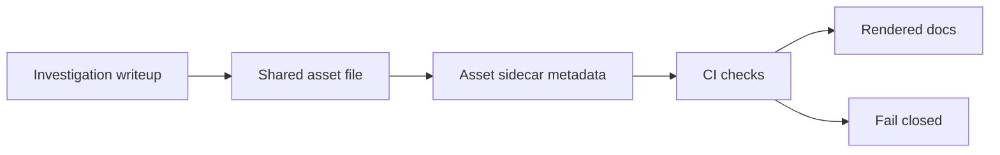

<!-- [KFM_META_BLOCK_V2]
doc_id: kfm://doc/8652d34b-2a32-4ab2-a08d-b3fbc82be551
title: docs/investigations/_shared/assets/README.md
type: standard
version: v1
status: draft
owners: ["@kfm-docs", "@kfm-investigations"]  # TODO: set CODEOWNERS-backed handles
created: 2026-03-04
updated: 2026-03-04
policy_label: public
related: ["docs/investigations/_shared/README.md"]  # TODO: add if/when exists
tags: ["kfm", "investigations", "assets", "evidence"]
notes: ["Shared, governed documentation assets for investigations; not a data-lake or pipeline zone."]
[/KFM_META_BLOCK_V2] -->

# Investigations Shared Assets
One place for shared, governed **documentation assets** used across investigations.

> **IMPACT (required)**
>
>  <!-- TODO: set to active/stable when enforced -->
>  <!-- TODO -->
> 
> 
>
> **Status:** [PROPOSED] `draft` (move to `active` once CI gates exist and are enforced)  
> **Owners:** [UNKNOWN] TODO (must be backed by CODEOWNERS)  
> **Policy label:** [PROPOSED] `public` (do not store restricted assets here)  
> **Quick links:** [Scope](#scope) · [Where-it-fits](#where-it-fits) · [Acceptable-inputs](#acceptable-inputs) · [Exclusions](#exclusions) · [Directory-tree](#directory-tree) · [Quickstart](#quickstart) · [Usage](#usage) · [Diagram](#diagram) · [Asset-registry](#asset-registry) · [Gates](#gates) · [FAQ](#faq) · [Appendix](#appendix)

---

## Scope

- [CONFIRMED] This directory is for **shared assets referenced by investigation docs** (images, diagrams, small tables, short excerpts) and meant to support *evidence-first* writeups.
- [PROPOSED] Every committed asset should be:
  - **referenceable** (stable path),
  - **attributable** (license + source recorded),
  - **auditable** (checksum recorded),
  - **safe** (sensitivity classification stated; default-deny when unclear).

Back to top: [Quick links](#investigations-shared-assets)

---

## Where it fits

**Path:** `docs/investigations/_shared/assets/`

- [CONFIRMED] KFM’s core runtime and data “truth path” is governed and promotion-gated; **this folder is not part of that pipeline**. (Use the data lifecycle zones for actual datasets and pipeline artifacts.)
- [PROPOSED] Use this folder when:
  - multiple investigations need the same figure/diagram/reference snippet,
  - you want consistent shared visuals across writeups,
  - you need a small, redistributable reference artifact for doc clarity.
- [PROPOSED] Downstream consumers:
  - markdown renderers (GitHub),
  - doc-site generators (if present),
  - PR review (humans + CI link checks).

Back to top: [Quick links](#investigations-shared-assets)

---

## Acceptable inputs

### Allowed asset classes

| Asset class | Examples | Storage guidance |
|---|---|---|
| Images | `.png`, `.jpg`, `.svg` | Prefer SVG for diagrams; compress rasters; include alt text in docs. |
| Diagrams (source) | `.mmd`, `.drawio`, `.excalidraw` | Keep the editable source alongside exported images when possible. |
| Small data samples | `.csv`, `.json`, `.geojson` | **Doc-only samples**; must be non-sensitive and clearly labeled “sample”. |
| Short excerpts | `.pdf`, `.md` | Only if redistributable; otherwise store a citation + link, not the file. |

### Required metadata per asset (recommended)

- [PROPOSED] For each asset file `X`, add a sidecar: `X.asset.yml` with:
  - `title`
  - `source` (where it came from)
  - `license` (SPDX where possible)
  - `created` (date)
  - `checksum_sha256`
  - `sensitivity` (`public` / `restricted` / `unknown`)
  - `used_in` (links to investigations that reference it)

Example sidecar:

```yaml
# docs/investigations/_shared/assets/images/example.png.asset.yml
title: "Example figure: basin overview"
source:
  kind: "internal-generated"
  authors: ["@your-handle"]
  inputs: ["docs/investigations/INV-0001.md"]
license: "CC-BY-4.0" # or "MIT" for code-like diagrams; choose appropriately
created: "2026-03-04"
checksum_sha256: "<sha256>"
sensitivity: "public"
used_in:
  - "docs/investigations/INV-0001.md#figure-2"
notes:
  - "Derived from public-domain elevation layer; no restricted overlays."
```

Back to top: [Quick links](#investigations-shared-assets)

---

## Exclusions

- [CONFIRMED] **No secrets** (keys, tokens, credentials), ever.
- [PROPOSED] **No restricted or sensitive data**:
  - PII, personal addresses, or doxxing-adjacent content
  - precise vulnerable-site coordinates (unless explicitly approved and redacted per policy)
- [PROPOSED] **No “real datasets”** (RAW/WORK/PROCESSED artifacts) or production exports.
  - Put datasets under the governed data zones and catalogs (DCAT/STAC/PROV).
- [PROPOSED] **No copyrighted books/articles** unless you have clear redistribution rights.
  - Prefer a bibliographic citation and a link.

Back to top: [Quick links](#investigations-shared-assets)

---

## Directory tree

> [UNKNOWN] The exact subfolders may vary by repo state.
>
> [PROPOSED] Recommended structure (create only what you need):

```text
docs/investigations/_shared/assets/
├── README.md
├── images/
│   ├── example.png
│   └── example.png.asset.yml
├── diagrams/
│   ├── hydrology-overview.mmd
│   ├── hydrology-overview.svg
│   └── hydrology-overview.svg.asset.yml
├── data_samples/
│   ├── sample_table.csv
│   └── sample_table.csv.asset.yml
└── references/
    ├── excerpt_policy_principles.pdf
    └── excerpt_policy_principles.pdf.asset.yml
```

Back to top: [Quick links](#investigations-shared-assets)

---

## Quickstart

### Add a new image + metadata (runnable)

```bash
# 1) Put the asset in the right folder
mkdir -p docs/investigations/_shared/assets/images
cp /path/to/your/figure.png docs/investigations/_shared/assets/images/figure.png

# 2) Compute checksum (Linux/macOS coreutils)
sha256sum docs/investigations/_shared/assets/images/figure.png

# 3) Create a sidecar metadata file (edit values)
cat > docs/investigations/_shared/assets/images/figure.png.asset.yml <<'YAML'
title: "Figure: replace-me"
source:
  kind: "internal-generated"
  authors: ["@your-handle"]
license: "CC-BY-4.0"
created: "2026-03-04"
checksum_sha256: "REPLACE_WITH_SHA256"
sensitivity: "public"
used_in: []
notes: []
YAML
```

### Reference it from an investigation doc

```md

```

Back to top: [Quick links](#investigations-shared-assets)

---

## Usage

### Naming conventions

- [PROPOSED] Prefer **kebab-case** and stable, descriptive names:
  - `river-proximity-buffer-10km.svg`
  - `timeline-dust-bowl-1930s.png`
- [PROPOSED] Avoid spaces, avoid “final_v7_reallyfinal”.

### Markdown hygiene

- [PROPOSED] Always include meaningful alt text:
  - Good: ``
  - Bad: ``

### Asset lifecycle rules

- [PROPOSED] If an asset becomes obsolete:
  - do not silently replace it if it is cited by older investigations
  - instead, add a new file and update references explicitly
  - optionally mark old assets in metadata: `deprecated: true` + `replaced_by: ...`

Back to top: [Quick links](#investigations-shared-assets)

---

## Diagram



- [PROPOSED] CI checks should fail-closed if metadata is missing, license is unknown, or sensitivity is unclear.

Back to top: [Quick links](#investigations-shared-assets)

---

## Asset registry

> [PROPOSED] Maintain a small, human-readable registry table here (or generate it from sidecars).

| Folder | Purpose | Required fields | Notes |
|---|---|---|---|
| `images/` | Figures used in investigations | `title, license, checksum_sha256, sensitivity` | Prefer SVG when possible |
| `diagrams/` | Editable diagram sources + exports | same | Keep source + export together |
| `data_samples/` | Non-sensitive example data | same + `used_in` | Must be clearly labeled “sample” |
| `references/` | Redistributable excerpts | same + `source` | Prefer citations/links over storing files |

Back to top: [Quick links](#investigations-shared-assets)

---

## Gates

### Definition of Done for adding/updating an asset

- [PROPOSED] ✅ File is placed in the correct subfolder.
- [PROPOSED] ✅ Sidecar `*.asset.yml` exists and includes:
  - `license` and `source`
  - `checksum_sha256`
  - `sensitivity` (not `unknown` unless explicitly justified)
- [PROPOSED] ✅ Asset is referenced by at least one doc (or clearly marked as “shared seed”).
- [PROPOSED] ✅ No sensitive content is embedded (including EXIF GPS in photos).
- [PROPOSED] ✅ Any coordinates shown are policy-reviewed if they could be sensitive.

### Suggested CI checks (future enforcement)

- [PROPOSED] `assets_meta_check`: ensure every asset has sidecar + required keys
- [PROPOSED] `assets_size_check`: warn/fail if files exceed threshold (e.g., 10–25 MB)
- [PROPOSED] `assets_link_check`: ensure referenced paths exist (docs build)
- [PROPOSED] `assets_exif_scrub_check`: block images with GPS EXIF

Back to top: [Quick links](#investigations-shared-assets)

---

## FAQ

**Can I store a dataset extract here for convenience?**  
- [PROPOSED] No. Put real datasets in governed data zones and publish via catalogs; keep only tiny, non-sensitive doc samples here.

**What if I don’t know the license?**  
- [PROPOSED] Default-deny: do not commit the asset. Add a citation/link instead, and open a governance task to verify rights.

**How do I handle “restricted” assets?**  
- [PROPOSED] Do not store them in this path. Use the approved restricted storage mechanism and reference it via a governed link (and only in restricted docs).

**Can I replace an image in-place?**  
- [PROPOSED] Only if it is not referenced by published investigations; otherwise version it (new filename) and update references explicitly.

Back to top: [Quick links](#investigations-shared-assets)

---

## Appendix

<details>
<summary>Appendix A — Minimal metadata schema (recommended)</summary>

- `title`: short human name
- `source.kind`: `internal-generated | external | derived`
- `source.url`: if external
- `license`: SPDX string when feasible
- `created`: ISO date
- `checksum_sha256`: hex digest
- `sensitivity`: `public | restricted | unknown`
- `used_in`: list of doc paths/anchors
- `notes`: free-form list

</details>

<details>
<summary>Appendix B — Large binaries</summary>

- [UNKNOWN] Whether Git LFS is enabled in this repo.
- [PROPOSED] If an asset is large:
  1) prefer regenerating it from code + checked-in inputs,
  2) otherwise store it in an approved artifact store and commit only:
     - a small pointer file
     - checksum
     - provenance note
     - retrieval instructions.

</details>
