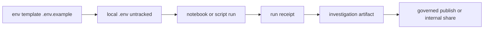

<!-- [KFM_META_BLOCK_V2]
doc_id: kfm://doc/0b4c1d1c-3b88-4d95-9c7f-7b6c7e9a7c3e
title: docs/investigations/_shared/env
type: standard
version: v1
status: draft
owners: TBD
created: 2026-03-04
updated: 2026-03-04
policy_label: public
related:
  - docs/investigations/README.md
  - docs/investigations/_shared/README.md
  - docs/governance/ROOT_GOVERNANCE_CHARTER.md
tags:
  - kfm
  - investigations
  - env
  - reproducibility
notes:
  - "No secrets allowed in this folder; only templates/contracts."
[/KFM_META_BLOCK_V2] -->

# docs/investigations/_shared/env
Shared, investigation-safe environment contract for reproducible runs (no secrets).

> **Status:** experimental **PROPOSED** · **Owners:** **UNKNOWN** (add CODEOWNERS) · **Policy label:** public **PROPOSED**

  

**Quick nav:** [Scope](#scope) · [Where it fits](#where-it-fits) · [Inputs](#inputs) · [Exclusions](#exclusions) · [Directory layout](#directory-layout) · [Quickstart](#quickstart) · [Usage](#usage) · [Diagram](#diagram) · [Registries](#registries) · [Gates](#gates) · [FAQ](#faq) · [Appendix](#appendix) · [Evidence index](#evidence-index)

---

## Scope

- **CONFIRMED:** Investigations are first-class artifacts and must include “run receipts and environment.” (Evidence: **E1**)
- **PROPOSED:** This folder defines the **shared environment contract** for investigations so notebooks/scripts can be run locally or in containers with consistent configuration.
- **PROPOSED:** This folder is the canonical place for:
  - an `.env.example` template (no secrets),
  - a small “env registry” (what variables exist, what they mean, and sensitivity),
  - guidance for recording environment fingerprints into run receipts.

[Back to top](#docsinvestigations_sharedenv)

---

## Where it fits

- **PROPOSED Path:** `docs/investigations/_shared/env/README.md` (this file)
- **PROPOSED Upstream:** investigation templates (e.g., `docs/investigations/_shared/*`) that define what an Investigation artifact contains.
- **PROPOSED Downstream:** scripts/notebooks that:
  - read env vars for connecting to governed APIs and stores,
  - emit a **run receipt** that records environment + toolchain pins (Evidence: **E1**, **E4**, **E5**).

**UNKNOWN:** Which execution modes your repo currently supports (pure local venv, Docker Compose, devcontainer, JupyterHub-like). If unknown, default to local-only + optional container.

[Back to top](#docsinvestigations_sharedenv)

---

## Inputs

Acceptable inputs in this folder:

- **PROPOSED:** `.env.example` (templates only; safe placeholders; no secrets)
- **PROPOSED:** “env registry” tables in Markdown (this README)
- **PROPOSED:** optional lock/pin artifacts that help reproducibility (e.g., tool versions, image tags), as long as they contain **no secrets** (Evidence: **E3**, **E5**)

[Back to top](#docsinvestigations_sharedenv)

---

## Exclusions

These must **not** go here:

- **CONFIRMED (policy intent):** real secrets or credentials (tokens, passwords, private keys). Store them outside git or in secret managers.
- **PROPOSED:** notebooks, results, datasets, derived exports (those belong in the Investigation artifact folder for the specific investigation, not `_shared/`).
- **PROPOSED:** any restricted dataset identifiers or location-revealing details that should not be public.

[Back to top](#docsinvestigations_sharedenv)

---

## Directory layout

> **PROPOSED** shape for `docs/investigations/_shared/env/`

```text
docs/investigations/_shared/env/
├─ README.md               # this file (contract + registry)
└─ .env.example            # template only, safe placeholders (PROPOSED)
```

If you already have other env tooling elsewhere, link to it here rather than duplicating.

[Back to top](#docsinvestigations_sharedenv)

---

## Quickstart

### 1) Create a local `.env` without committing it

**PROPOSED:**

```bash
# From repo root
cp docs/investigations/_shared/env/.env.example .env

# Ensure .env is not committed
git status --porcelain | grep -E '^\?\? .env$' && echo "OK: .env is untracked"
```

> **IMPORTANT:** `.env` must be gitignored. Do not store secrets in any tracked file.

### 2) Export env vars for a one-off run

**PROPOSED:**

```bash
set -a
source .env
set +a

# sanity check: print non-secret vars only
env | grep -E '^KFM_|^AWS_PROFILE=|^AWS_ENDPOINT_URL=|^NEO4J_' || true
```

### 3) Record the environment in the run receipt

- **CONFIRMED:** the Investigation artifact should include run receipts and environment (Evidence: **E1**).
- **PROPOSED:** your run receipt generator should capture:
  - toolchain versions,
  - container image tags/digests if used,
  - and a **redacted** env snapshot (names + sensitivity class, not secret values).

[Back to top](#docsinvestigations_sharedenv)

---

## Usage

### Claim discipline for this folder

This README uses:

- **CONFIRMED** = backed by evidence in KFM design docs (see [Evidence index](#evidence-index))
- **PROPOSED** = recommended contract/pattern to adopt
- **UNKNOWN** = requires repo-specific verification

### Environment contract

#### Principles

- **CONFIRMED:** investigations need environment captured (Evidence: **E1**).
- **PROPOSED:** keep environment configuration:
  - **minimal** (only what’s required),
  - **auditable** (documented vars + meaning),
  - **safe** (no secrets committed),
  - **portable** (works in local dev + CI + container, if present).

#### Sensitivity classes

- **PROPOSED:** classify each variable:
  - `public` — safe to print/log
  - `sensitive` — may reveal infrastructure details; avoid printing in logs by default
  - `secret` — never print; never commit; only injected at runtime

### Recommended baseline variables

- **PROPOSED:** use these as *namespaces*, even if you later refine the list:
  - `KFM_*` for KFM platform config
  - `AWS_*` for object storage config (S3/MinIO/R2)
  - `NEO4J_*` for graph connectivity (if needed)
  - `POSTGIS_*` for spatial DB connectivity (if needed)

> **CONFIRMED (example vars observed in KFM-oriented docs):** `NEO4J_PASSWORD`, `AWS_PROFILE`, `AWS_ENDPOINT_URL` are referenced as env variables in ops contexts. (Evidence: **E2**)

### Environment capture into run receipts

- **CONFIRMED:** run receipts are expected in investigation workflows (Evidence: **E1**).
- **PROPOSED:** capture the environment in a structured way:

1) **Environment fingerprint (non-secret):**
- runtime: `python_version`, `node_version`
- OS: `uname -a` (or container base image)
- dependency lock digests: `requirements.txt sha256`, `poetry.lock sha256`, etc.

2) **Env var inventory (no values for secrets):**
- record **names + sensitivity class**
- optionally record **value digests** for *non-secret* values if you need drift detection

3) **Fail closed:**
- if required vars are missing, abort early with a clear error
- never “guess defaults” for anything that changes security, endpoints, or policy

[Back to top](#docsinvestigations_sharedenv)

---

## Diagram



[Back to top](#docsinvestigations_sharedenv)

---

## Registries

### Environment variable registry

> **PROPOSED**: keep this table small; add rows only when a real investigation needs them.

| Variable | Required | Example | Sensitivity | Used by | Status |
|---|---:|---|---|---|---|
| `KFM_API_URL` | yes | `http://localhost:8000` | sensitive | notebooks, scripts | PROPOSED |
| `KFM_POLICY_LABEL` | yes | `public` | public | run receipts | PROPOSED |
| `KFM_INVESTIGATION_ID` | yes | `inv-YYYYMMDD-shortname` | public | run receipts | PROPOSED |
| `AWS_PROFILE` | no | `kfm` | sensitive | object storage CLI | CONFIRMED (name) |
| `AWS_ENDPOINT_URL` | no | `https://example.r2.cloudflarestorage.com` | sensitive | S3-compatible storage | CONFIRMED (name) |
| `AWS_ACCESS_KEY_ID` | no | `...` | secret | S3-compatible storage | PROPOSED |
| `AWS_SECRET_ACCESS_KEY` | no | `...` | secret | S3-compatible storage | PROPOSED |
| `NEO4J_PASSWORD` | no | `please-change-me` | secret | graph access | CONFIRMED (name) |
| `NEO4J_URI` | no | `bolt://localhost:7687` | sensitive | graph access | PROPOSED |
| `POSTGIS_DSN` | no | `postgresql://...` | secret | spatial access | PROPOSED |

> **NOTE:** “CONFIRMED (name)” means the variable name appears in KFM-oriented docs; it does **not** mean your repo currently uses it. Verify usage before making it required.

### Run receipt minimum fields

- **PROPOSED:** align with a strict schema that includes IDs, timestamps, artifact digests, policy bundle refs, and status. (Evidence: **E4**)

| Field | Why it exists | Status |
|---|---|---|
| `run_id` | stable run identity for audit | PROPOSED |
| `started_at` / `finished_at` | ordering + reproducibility | PROPOSED |
| `artifact_digest` | content-addressed output | PROPOSED |
| `policy_bundle` | what policy was applied | PROPOSED |
| `sbom_ref` | what dependencies/build env were used | PROPOSED |
| `status` | fail-closed gate | PROPOSED |

[Back to top](#docsinvestigations_sharedenv)

---

## Gates

### Definition of done for adding or changing an env var

- [ ] **PROPOSED:** Variable added to the registry table with sensitivity classification
- [ ] **PROPOSED:** `.env.example` updated with a safe placeholder (no real values)
- [ ] **PROPOSED:** Any scripts/notebooks treat missing required vars as **hard errors**
- [ ] **PROPOSED:** Run receipt captures environment fingerprint + env var inventory
- [ ] **PROPOSED:** No secrets were introduced into git history (scan before merge)

### Promotion guardrails for investigations

- **CONFIRMED:** investigations should be reproducible artifacts with run receipts and environment (Evidence: **E1**).
- **PROPOSED:** deny promotion if:
  - run receipt missing required fields
  - environment fingerprint missing or inconsistent
  - secret appears in any committed file
  - policy label missing or mismatched

[Back to top](#docsinvestigations_sharedenv)

---

## FAQ

### Why can’t I commit `.env`?
- **PROPOSED:** because it commonly contains secrets and environment-specific endpoints; committing it violates “no secrets in repo” and breaks reproducibility (others would inherit your personal config).

### What if an investigation needs restricted data?
- **PROPOSED:** run it in a governed environment where access is policy-checked and output is reviewed; do not export uncontrolled local copies.

### Do we need Docker for investigations?
- **UNKNOWN:** depends on repo conventions. If you have it, use it. If not, keep local instructions minimal.

[Back to top](#docsinvestigations_sharedenv)

---

## Appendix

<details>
<summary>Example .env.example template</summary>

```dotenv
# KFM investigation environment template
# PROPOSED: copy to repo root as .env (untracked) before running notebooks/scripts.

# Investigation identity
KFM_INVESTIGATION_ID=inv-20260304-example
KFM_POLICY_LABEL=public

# API (preferred boundary for governed access)
KFM_API_URL=http://localhost:8000

# Optional object storage
AWS_PROFILE=kfm
# AWS_ENDPOINT_URL=https://<accountid>.r2.cloudflarestorage.com
# AWS_ACCESS_KEY_ID=...
# AWS_SECRET_ACCESS_KEY=...

# Optional graph access (avoid direct DB access for restricted data; prefer API)
NEO4J_URI=bolt://localhost:7687
NEO4J_PASSWORD=please-change-me
```

</details>

<details>
<summary>Example environment fingerprint snippet to embed in a run receipt</summary>

```json
{
  "environment": {
    "runner": "local",
    "os": "Linux",
    "python_version": "3.11.8",
    "pip_freeze_sha256": "sha256:...",
    "env_vars": [
      {"name": "KFM_API_URL", "sensitivity": "sensitive"},
      {"name": "KFM_INVESTIGATION_ID", "sensitivity": "public"},
      {"name": "AWS_PROFILE", "sensitivity": "sensitive"},
      {"name": "NEO4J_PASSWORD", "sensitivity": "secret"}
    ]
  }
}
```

</details>

[Back to top](#docsinvestigations_sharedenv)

---

## Evidence index

Use these IDs for traceability in reviews:

- **E1 (CONFIRMED):** Investigations are first-class artifacts and include “run receipts and environment.”
- **E2 (CONFIRMED):** Example env vars referenced in KFM-oriented docs (`NEO4J_PASSWORD`, `AWS_PROFILE`, `AWS_ENDPOINT_URL`) and a minimal `.env.example`.
- **E3 (CONFIRMED):** Recommendation to commit `.env.example` (no secrets) and keep dev artifacts pinned/locked for reproducibility.
- **E4 (CONFIRMED):** Example `run_receipt` JSON Schema fields and CI enforcement pattern.
- **E5 (CONFIRMED):** SBOM guidance that it should include build environment and dependencies for the run.
