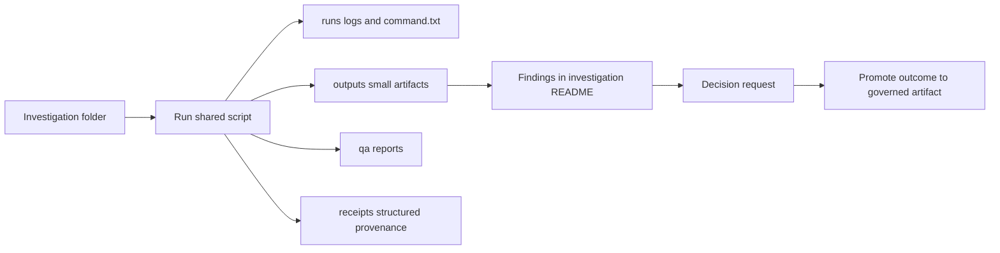

<!-- [KFM_META_BLOCK_V2]
doc_id: kfm://doc/7d4d7f55-0f46-4a60-97d8-9f3f3bd3f5c8
title: docs/investigations/_shared/scripts/README.md
type: standard
version: v1
status: active
owners:
  - TBD
created: 2026-03-04
updated: 2026-03-04
policy_label: public
related:
  - ../../README.md
  - ../env/README.md
  - ../assets/README.md
  - ../../_templates/README.md
tags: [kfm, investigations, scripts]
notes:
  - Shared, deterministic helper scripts used by investigations only (not production).
[/KFM_META_BLOCK_V2] -->

# Shared scripts
Small, deterministic helper scripts shared across investigations.


**Status:** active  
**Owners:** TBD  
**Policy:** default-deny for sensitive content; fail-closed when uncertain  
**Where to start:** [docs/investigations](../../README.md) · [templates](../../_templates/README.md) · [shared env](../env/README.md) · [shared assets](../assets/README.md)

---

## Quick navigation
- [Scope](#scope)
- [Where it fits](#where-it-fits)
- [Acceptable inputs](#acceptable-inputs)
- [Exclusions](#exclusions)
- [Directory layout](#directory-layout)
- [Quickstart](#quickstart)
- [Usage](#usage)
- [Script contract](#script-contract)
- [Diagram](#diagram)
- [Script registry](#script-registry)
- [Task list](#task-list)
- [FAQ](#faq)
- [Appendix](#appendix)

---

## Scope
**Claim status:** CONFIRMED

This directory exists to hold **small reusable helper scripts** that support work in `docs/investigations/` (spikes, reproducible experiments, evidence handling).

These scripts are **not** production interfaces. If a script becomes relied upon beyond investigations, it must be **promoted** into the repo’s governed code surface with tests and policy controls (and removed or clearly deprecated here).

---

## Where it fits
**Claim status:** CONFIRMED

`docs/investigations/_shared/scripts/` is the shared “toolbox” referenced by the investigations directory contract. Prefer using these scripts *from within* an investigation folder so outputs, logs, and receipts stay co-located with the investigation record.

Recommended usage pattern:

- Investigation record lives at: `docs/investigations/YYYY/YYYY-MM-DD_short-slug/`
- Shared scripts live here, and are invoked with explicit `--in` and `--out` paths
- Runs/logs/receipts land in the investigation’s `runs/` and `receipts/` folders (not here)

---

## Acceptable inputs
**Claim status:** PROPOSED

What belongs here:

- Small CLI scripts (bash, Python, Node) that:
  - are deterministic (same inputs → same outputs),
  - have explicit input/output paths,
  - are documented with `--help` and usage examples,
  - are safe-by-default (read-only unless an output path is provided).
- Convenience helpers for investigations, such as:
  - hashing inputs/outputs (e.g., SHA-256),
  - normalizing/canonicalizing small artifacts for diffing,
  - generating small tables/figures for `outputs/`,
  - creating run folder scaffolds or command receipts.

---

## Exclusions
**Claim status:** CONFIRMED

What must **NOT** go here (default-deny):

- **Secrets or credentials** (API keys, tokens, private keys, `.env` with real values).
- **Sensitive targeting enablement** (e.g., scripts that encourage precise vulnerable-location targeting or step-by-step harm).
- **Production code paths** (anything imported/executed by shipped services, pipelines, UI).
- **Non-deterministic tools** without controls (randomness, time-dependent logic, network calls) unless determinism controls are explicit and documented.
- **Huge artifacts** (large binaries, full raw datasets). Prefer links + hashes in the investigation record.

---

## Directory layout
**Claim status:** PROPOSED

Minimum:

```text
docs/investigations/_shared/scripts/
└─ README.md
```

Recommended (as scripts are added):

```text
docs/investigations/_shared/scripts/
├─ README.md
├─ python/
│  ├─ <script_name>.py
│  └─ README.md
├─ bash/
│  ├─ <script_name>.sh
│  └─ README.md
└─ node/
   ├─ <script_name>.mjs
   └─ README.md
```

If you introduce language-specific dependencies, prefer documenting them in:

- the investigation’s `env/` folder (best for reproducibility), or
- `docs/investigations/_shared/env/` only when truly shared across multiple investigations.

---

## Quickstart
**Claim status:** PROPOSED

### Hash a file (portable, no repo dependencies)
```bash
python3 - <<'PY'
import hashlib, sys, pathlib
p = pathlib.Path(sys.argv[1])
h = hashlib.sha256(p.read_bytes()).hexdigest()
print(f"{h}  {p}")
PY docs/investigations/_shared/scripts/README.md
```

### Canonicalize JSON then hash it (stable diffs)
```bash
python3 - <<'PY'
import json, hashlib, sys, pathlib
p = pathlib.Path(sys.argv[1])
obj = json.loads(p.read_text(encoding="utf-8"))
canon = json.dumps(obj, sort_keys=True, separators=(",", ":"), ensure_ascii=False).encode("utf-8")
print(hashlib.sha256(canon).hexdigest())
PY path/to/small.json
```

### Typical invocation pattern (from inside an investigation)
```bash
# Example pattern (replace <script> with an actual script once added)
INV_DIR="docs/investigations/2026/2026-03-04_example"
mkdir -p "$INV_DIR/runs/$(date -u +%Y-%m-%dT%H%M%SZ)_run-01"

# Run a shared helper with explicit inputs/outputs
python3 docs/investigations/_shared/scripts/python/<script>.py \
  --in "$INV_DIR/inputs/samples/example.json" \
  --out "$INV_DIR/outputs/tables/example.cleaned.json"
```

---

## Usage
**Claim status:** PROPOSED

### CLI conventions
Prefer a consistent interface so scripts are discoverable and composable:

- `--help` prints usage and exits 0
- `--in <path>` input file or directory
- `--out <path>` output file or directory
- `--format <name>` optional output format
- `--strict` fail-closed (recommended default)
- `--seed <int>` only if randomness is truly required (default should still be deterministic)

### Logging conventions
- Log human-readable progress to **stderr**
- Emit machine-readable outputs only to the output file(s), not stdout
- Exit codes:
  - `0` success
  - `2` usage error (bad args)
  - `3` validation error (inputs don’t meet expectations)
  - `10+` unexpected/runtime errors

---

## Script contract
**Claim status:** CONFIRMED

All scripts in this directory must follow these rules:

1. **Deterministic and documented**
   - Same inputs, same outputs.
   - Any ordering must be explicit (e.g., sorted keys, stable sort).
2. **No secrets**
   - Never commit credentials.
   - If credentials are unavoidable for a local run, they must be injected at runtime and never written to disk.
3. **Read-only by default**
   - Prefer read-only helpers unless output paths are explicit.
   - Never write outside the declared `--out` directory/file(s).
4. **Safety-first**
   - If sensitivity is unclear: redact/generalize and mark “needs governance review” in the investigation record.
   - Avoid generating precise coordinates or anything that increases harm.

---

## Diagram
**Claim status:** CONFIRMED



---

## Script registry
**Claim status:** PROPOSED

Maintain a lightweight registry here as scripts are added so investigators can find and trust them.

| Script path | Language | Purpose | Inputs | Outputs | Side effects | Determinism notes |
|---|---|---|---|---|---|---|
| `python/<name>.py` | python | One-line purpose | `--in` file/dir | `--out` file/dir | writes only to `--out` | stable sort, fixed locale |

---

## Task list
**Claim status:** PROPOSED

Definition of done for adding or changing a script in this folder:

- [ ] Script has `--help` and at least one example invocation in its doc (or in this README registry).
- [ ] Determinism is explained (ordering, randomness, timestamps, environment).
- [ ] Inputs and outputs are explicit; script is read-only unless `--out` is provided.
- [ ] No secrets, credentials, or sensitive raw data are committed.
- [ ] If any sensitivity could be involved, script includes a safety note and defaults to coarse outputs.
- [ ] A minimal smoke test is documented (command + expected artifact location).
- [ ] If this script is becoming production-relevant, a promotion ticket/path is recorded and this copy is marked “investigations-only”.

---

## FAQ
**Claim status:** CONFIRMED

### Can I use these scripts in production?
No. If something here becomes relied upon for production or governed pipelines, promote it to the repo’s governed code surface with tests and policy controls.

### Where do big artifacts go?
Prefer links to durable storage and record hashes/versions in the investigation record. Avoid committing large binaries here.

### What if a script needs network access?
Default is “no.” If you truly must, document it explicitly, keep it optional, and ensure it runs safely without credentials (fail-closed if credentials are missing).

---

## Appendix
**Claim status:** PROPOSED

<details>
<summary>Script skeletons</summary>

### Bash skeleton (pseudocode)
```bash
#!/usr/bin/env bash
set -euo pipefail

# PSEUDOCODE:
# - parse args: --in, --out
# - validate inputs exist
# - do deterministic work
# - write only to --out
# - log to stderr
```

### Python skeleton (runnable)
```python
#!/usr/bin/env python3
from __future__ import annotations

import argparse
import pathlib
import sys

def main() -> int:
    p = argparse.ArgumentParser(description="One-line purpose of this script.")
    p.add_argument("--in", dest="inp", required=True, help="Input file or directory")
    p.add_argument("--out", dest="out", required=True, help="Output file or directory")
    args = p.parse_args()

    inp = pathlib.Path(args.inp)
    out = pathlib.Path(args.out)

    if not inp.exists():
        print(f"ERROR: input does not exist: {inp}", file=sys.stderr)
        return 3

    out.parent.mkdir(parents=True, exist_ok=True)
    out.write_text(f"OK: read {inp}\n", encoding="utf-8")

    print(f"Wrote: {out}", file=sys.stderr)
    return 0

if __name__ == "__main__":
    raise SystemExit(main())
```
</details>

---

Back to top: [Shared scripts](#shared-scripts)
