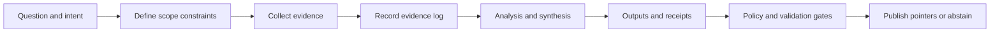

<!-- [KFM_META_BLOCK_V2]
doc_id: kfm://doc/8f6c3f2c-0c1a-4f1b-9c92-23f0c6e9c28a
title: docs/investigations/_templates/README.md
type: standard
version: v1
status: draft
owners: docs-team
created: 2026-03-04
updated: 2026-03-04
policy_label: public
related:
  - docs/investigations/
  - docs/analyses/_templates/
  - docs/templates/
tags:
  - kfm
  - investigations
  - templates
notes:
  - This directory is a governed scaffold for evidence-first “investigations” docs.
[/KFM_META_BLOCK_V2] -->

# Investigations Templates
Templates for writing **evidence-first, policy-aware investigations** in KFM (Kansas Frontier Matrix).

> **IMPACT**
>
> **Status:** experimental  
> **Owners:** `docs-team` (update if different)  
> **Policy:** `public` (change if needed)  
> **Intended users:** contributors, reviewers/stewards, operators  
>
> Badges (TODO wire to CI):
> - 
> - 
> - 
>
> Quick links:  
> [Scope](#scope) · [Where it fits](#where-it-fits) · [Inputs](#acceptable-inputs) · [Exclusions](#exclusions) ·
> [Directory tree](#directory-tree) · [Quickstart](#quickstart) · [Usage](#usage) ·
> [Diagram](#diagram) · [Template registry](#template-registry) · [Gates](#gates-definition-of-done) ·
> [FAQ](#faq)

---

## Scope

**Claim status legend (applies throughout this README):**
- **CONFIRMED** — grounded in existing KFM reference docs (or hard requirements already adopted elsewhere).
- **PROPOSED** — recommended convention for consistency; can change via governance review.
- **UNKNOWN** — not specified / needs repo verification or steward decision.

This folder is intentionally narrow: it contains **copyable scaffolds** for investigations.

### In scope / out of scope

| In scope | Out of scope |
|---|---|
| **CONFIRMED:** Markdown templates to standardize investigation writeups (front-matter, sections, checklists). | **CONFIRMED:** Raw datasets, large binaries, or “data lake” artifacts. |
| **CONFIRMED:** Template stubs for **evidence logs** and **run receipts** (small, verifiable metadata). | **CONFIRMED:** Secrets (API keys, tokens), private PII, or sensitive location details. |
| **PROPOSED:** Optional JSON templates for STAC Item / PROV pointers when an investigation produces governed outputs. | **UNKNOWN:** Whether investigations *must* always emit STAC/DCAT/PROV in your current branch (check governance profile). |

---

## Where it fits

**CONFIRMED:** KFM treats documentation as a production surface: investigations must be **traceable**, **reviewable**, and **policy-aware**. Templates exist to make that repeatable.

This directory sits alongside (and should mirror conventions from):
- `docs/templates/` — universal doc patterns (preferred shared template surface).
- `docs/analyses/_templates/` — analysis scaffolds (investigations often precede analyses).
- `docs/standards/` — profile docs (DCAT/STAC/PROV, Markdown protocol, etc.).

**PROPOSED:** Use investigations when you need a *bounded* research/validation effort (e.g., a Focus Mode research run, a Story Node evidence acquisition run, or a retrieval health check) that should be auditable and repeatable.

---

## Acceptable inputs

Put **templates** here that can be copied into a new investigation folder.

**CONFIRMED acceptable content types:**
- `*.md` template files (investigation README, evidence log, decision log).
- `*.json` / `*.jsonld` template stubs (only if small and clearly “template”, not live catalog records).
- `*.yml` or `*.yaml` template stubs (only if needed for manifests/specs).

**PROPOSED template conventions:**
- Template filenames start with `TEMPLATE__...`
- Templates include:
  - clear placeholders (`<TBD>`, `<fill-me>`)
  - a short “how to use this template” header
  - a minimal checklist

---

## Exclusions

**CONFIRMED: do not put these here**
- Real run outputs (COGs, GeoParquet, STAC exports, graphs, embeddings).
- Any sensitive coordinates/site locations that could enable targeting.
- Anything requiring access control unless the repo segment is explicitly restricted and gated.

**PROPOSED:** If an investigation needs to reference sensitive material, store only:
- a redacted summary, and
- a pointer to governed storage + access policy reference.

---

## Directory tree

**UNKNOWN:** The exact files present in this directory depend on what you’ve already created.

**PROPOSED target layout:**

```text
docs/investigations/_templates/
├── README.md                          # this file
├── TEMPLATE__INVESTIGATION.md          # main investigation writeup scaffold
├── TEMPLATE__EVIDENCE_LOG.md           # evidence intake + citation log
├── TEMPLATE__DECISIONS_LOG.md          # ADR-lite: key choices + rationale
├── TEMPLATE__RUN_RECEIPT.json          # tiny receipt stub for a run/output
├── TEMPLATE__STAC_ITEM.json            # optional: investigation-as-episode STAC Item
└── TEMPLATE__PROV_BUNDLE.jsonld        # optional: PROV-O pointer bundle
```

---

## Quickstart

### 1) Create a new investigation folder

**PROPOSED:** One folder per investigation, named deterministically:

- `docs/investigations/YYYY-MM-DD__<slug>/`
- Example: `docs/investigations/2026-03-04__ssurgo-soils-poc/`

```bash
# create a new investigation folder (example)
mkdir -p docs/investigations/2026-03-04__example-investigation

# copy templates (adjust filenames to what exists in this directory)
cp docs/investigations/_templates/TEMPLATE__INVESTIGATION.md \
   docs/investigations/2026-03-04__example-investigation/README.md

cp docs/investigations/_templates/TEMPLATE__EVIDENCE_LOG.md \
   docs/investigations/2026-03-04__example-investigation/EVIDENCE_LOG.md
```

### 2) Fill metadata + define scope

**CONFIRMED:** Every investigation must declare:
- what question it answers,
- what evidence it used,
- what it produced (if anything),
- what policy constraints applied.

### 3) Gate-check before sharing

**PROPOSED:** Run your docs validation (exact commands are repo-specific):

```bash
# pseudocode: replace with your repo's actual doc validation commands
make docs-lint
make docs-validate
```

---

## Usage

### When to start an investigation

Start an investigation when you need a *bounded, auditable inquiry* before promoting anything.

**CONFIRMED examples of “episode-like” investigations**
- Focus Mode research run over a bounded topic.
- Story Node evidence acquisition run.
- Scheduled retrieval health check run.

### What an investigation should produce

| Output | Required | Notes |
|---|---:|---|
| `README.md` (investigation narrative) | ✅ | **CONFIRMED:** must be readable by humans and LLM retrieval. |
| `EVIDENCE_LOG.md` | ✅ | **CONFIRMED:** list evidence items + what was accepted/rejected. |
| `DECISIONS_LOG.md` | ⚪ | **PROPOSED:** capture key modeling/governance choices. |
| `run-receipt.json` | ⚪ | **PROPOSED:** only if the investigation produced artifacts. |
| STAC Item / PROV pointer | ⚪ | **PROPOSED:** use when the investigation is an auditable “episode”. |

### Determinism and IDs

**CONFIRMED:** Prefer deterministic IDs when representing an investigation as an “episode” (e.g., a STAC Item).  
**PROPOSED:** Seed with canonical JSON: query hash, constraints, workflow/version, policy bundle hash, index/data snapshot identifiers.

### Spatial footprint and redaction

**CONFIRMED:** If the investigation has a spatial footprint, use one of:
- **Generalized geometry** (preferred)
- **Null geometry** (allowed)

**CONFIRMED:** For sensitive heritage contexts, do not publish more specific geometry than policy allows.

---

## Diagram



---

## Template registry

> **Note:** Entries marked **PROPOSED** may not exist yet in this directory.

| Template | Status | Purpose | Copy-to location |
|---|---|---|---|
| `TEMPLATE__INVESTIGATION.md` | **PROPOSED** | Main investigation README scaffold (scope, claims, evidence, results). | `docs/investigations/<inv>/README.md` |
| `TEMPLATE__EVIDENCE_LOG.md` | **PROPOSED** | Evidence intake log + accept/reject + citation anchors. | `docs/investigations/<inv>/EVIDENCE_LOG.md` |
| `TEMPLATE__DECISIONS_LOG.md` | **PROPOSED** | ADR-lite decisions and rationale (what/why/alternatives). | `docs/investigations/<inv>/DECISIONS_LOG.md` |
| `TEMPLATE__RUN_RECEIPT.json` | **PROPOSED** | Minimal receipt stub (spec hash, digests, rights, attestations). | `provenance/receipts/<...>.json` |
| `TEMPLATE__STAC_ITEM.json` | **PROPOSED** | Investigation-as-episode Item stub with policy-safe geometry rules. | `data/stac/<...>/item.json` |
| `TEMPLATE__PROV_BUNDLE.jsonld` | **PROPOSED** | PROV-O pointer bundle stub linking inputs → activity → outputs. | `data/processed/prov/<...>.jsonld` |

---

## Gates

### Gates definition of done

Before an investigation is considered **review-ready**:

- [ ] **CONFIRMED:** Scope is bounded (time range, geography policy, role/policy assumptions).
- [ ] **CONFIRMED:** Claims are labeled **CONFIRMED / PROPOSED / UNKNOWN** inside the investigation writeup.
- [ ] **CONFIRMED:** Evidence log lists sources and why each is admissible.
- [ ] **CONFIRMED:** Any spatial footprint is generalized or null when sensitivity requires it.
- [ ] **PROPOSED:** If artifacts were produced, there is a receipt with digests and a spec hash.
- [ ] **PROPOSED:** If publishing, catalogs/pointers exist (STAC/DCAT/PROV as applicable) and validate.
- [ ] **CONFIRMED:** No secrets, no private PII, no disallowed sensitive locations.

---

## FAQ

### What’s the difference between an investigation and an analysis?

**PROPOSED:**  
- **Investigation** = exploratory, bounded, evidence intake + decisioning, may end in “abstain” or “proceed.”  
- **Analysis** = produces (or updates) a governed output artifact intended for publication/promotion.

### Do investigations always produce catalogs?

**UNKNOWN:** Depends on your branch’s governance rules.  
**PROPOSED:** Produce STAC/PROV when an investigation yields reusable artifacts or a repeatable “episode.”

### Can I link to sensitive evidence?

**CONFIRMED:** Yes, but only via governed pointers and with policy-aware redaction in the doc body.

---

## Appendix

<details>
<summary>Example front-matter (PROPOSED)</summary>

```yaml
---
title: "INVESTIGATION — <topic>"
path: "docs/investigations/YYYY-MM-DD__<slug>/README.md"
status: "draft"
owners: ["<name-or-team>"]
created: "2026-03-04"
updated: "2026-03-04"
policy_label: "public"
sensitivity: "public"
license: "CC-BY-4.0"
---
```

</details>

<details>
<summary>Deterministic episode id recipe (PROPOSED)</summary>

```python
# pseudocode: canonicalize a small JSON seed and sha256 it
import json, hashlib

seed = {
  "query_hash": "<sha256-of-query-or-intent>",
  "constraints": {"time_range": "<...>", "spatial_scope": "<generalized-or-null>"},
  "workflow": {"id": "<...>", "version": "<...>"},
  "policy_bundle_hash": "<...>",
  "snapshot": {"index_snapshot_id": "<...>"}
}

canon = json.dumps(seed, sort_keys=True, separators=(",", ":")).encode("utf-8")
digest = hashlib.sha256(canon).hexdigest()[:16]
episode_id = f"urn:kfm:investigation:episode:{digest}"
print(episode_id)
```

</details>

---

## Back to top

[Back to top](#investigations-templates)
