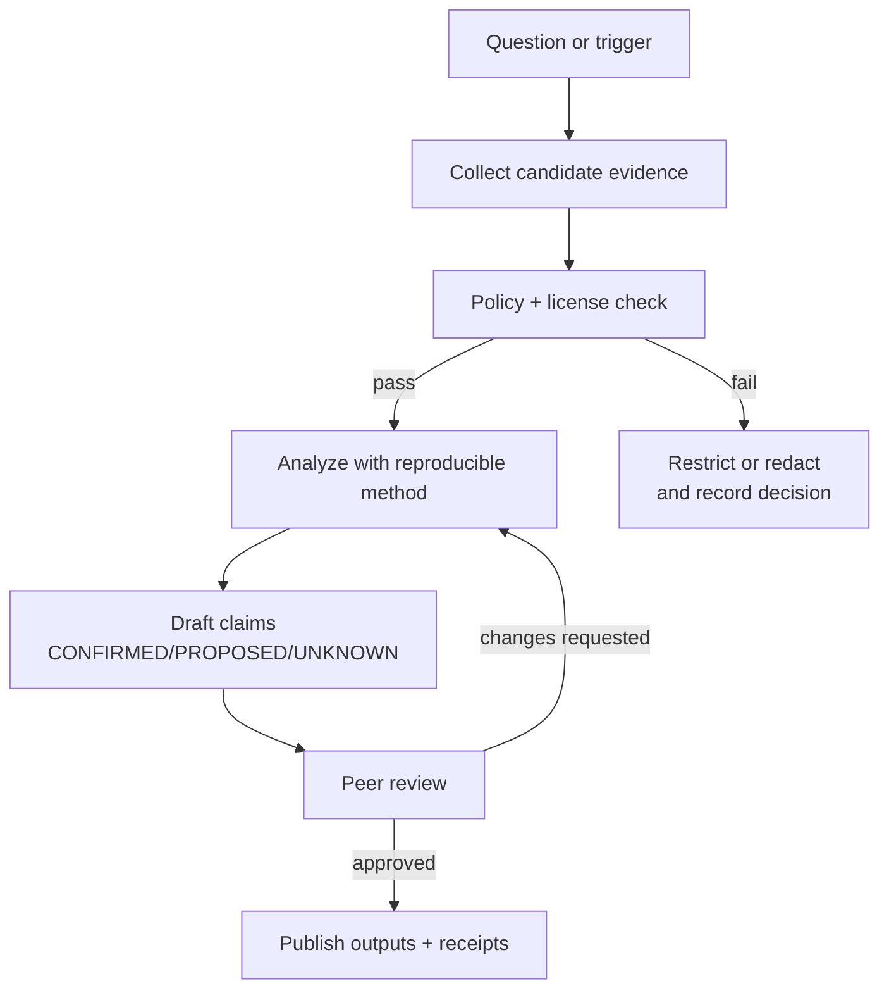

<!-- [KFM_META_BLOCK_V2]
doc_id: kfm://doc/<uuid>
title: Investigation — <INVESTIGATION_TITLE>
type: standard
version: v1
status: draft
owners: <team-or-github-handles>
created: <YYYY-MM-DD>
updated: <YYYY-MM-DD>
policy_label: <public|restricted|sovereignty|...>
related: [
  "docs/investigations/<INVESTIGATION_SLUG>/",
  "docs/governance/",
  "docs/standards/"
]
tags: [kfm, investigation]
notes: [
  "Template file: docs/investigations/_templates/investigation.README.template.md",
  "Every meaningful claim must be labeled CONFIRMED / PROPOSED / UNKNOWN."
]
[/KFM_META_BLOCK_V2] -->

# Investigation — <INVESTIGATION_TITLE>
One-line purpose: <What question are we answering, and why does it matter for KFM?>

> **Status:** `<draft|review|published>` • **Owners:** `<@handle1, @handle2>` • **Policy label:** `<public|restricted|...>`  
> **Last updated:** `<YYYY-MM-DD>` • **Investigation slug:** `docs/investigations/<INVESTIGATION_SLUG>/`  
>
> **Badges (TODO wire up):**  
>   
>   
>   
> 

**Quick nav:**  
- [Scope](#scope)  
- [Where it fits](#where-it-fits)  
- [Research questions](#research-questions)  
- [Claims and evidence discipline](#claims-and-evidence-discipline)  
- [Evidence ledger](#evidence-ledger)  
- [Method](#method)  
- [Findings](#findings)  
- [Open questions](#open-questions)  
- [Outputs](#outputs)  
- [Gates and Definition of Done](#gates-and-definition-of-done)  
- [Appendix](#appendix)

---

## Scope
**In scope**
- <What is explicitly included?>

**Out of scope**
- <What we will NOT do in this investigation?>

**Time bounds**
- **Event/valid time window studied:** `<YYYY–YYYY>` (or `<start> → <end>`)
- **Transaction time:** `<when evidence was acquired/ingested>`

**Geographic bounds**
- <Kansas statewide / county / bbox / “N/A”>  
- **Sensitivity note:** If this investigation touches sensitive locations (e.g., vulnerable sites), **do not** publish precise coordinates. Use coarse geometry (e.g., county, H3) and mark as `restricted` if needed.

[Back to top](#investigation--investigation_title)

---

## Where it fits
**Repo path:** `docs/investigations/<INVESTIGATION_SLUG>/README.md` (this doc)

**Upstream / downstream**
- **Upstream inputs:** `<datasets, code paths, policies, stakeholder requests>`
- **Downstream consumers:** `<pipelines, catalogs, APIs, UI, Focus Mode, reports>`

**Related docs**
- Governance: `docs/governance/` (TODO: link to canonical charter doc)  
- Standards: `docs/standards/` (TODO)  
- Contracts/schemas: `contracts/` (TODO)

[Back to top](#investigation--investigation_title)

---

## Acceptable inputs
Put artifacts here only if they are:
- **Evidence-bearing** (source, capture method, timestamp, checksum) and/or
- **Reproducibility-bearing** (scripts, configs, pinned versions), and/or
- **Governance-bearing** (policy decisions, redaction notes, license terms)

Examples:
- Source PDFs, reports, official datasets, API responses (with capture receipt)
- Notes that include explicit citations to evidence
- QA outputs (validation logs, summary stats, schema checks)

## Exclusions
Do **not** put these in this investigation folder:
- Raw secrets, tokens, private keys
- Unlicensed or unclear-rights content
- Sensitive coordinates or doxxing-adjacent details
- Untraceable “copy/paste” claims without evidence references

If you need them, store in appropriate governed locations (or redact/aggregate).

[Back to top](#investigation--investigation_title)

---

## Directory tree
```text
docs/investigations/<INVESTIGATION_SLUG>/
├── README.md                         # this investigation
├── evidence/                         # evidence refs + capture receipts
│   ├── evidence-ledger.csv           # optional export of the table below
│   ├── receipts/                     # run receipts, fetch logs, checksums
│   └── redactions/                   # redaction notes + rationale
├── analysis/                         # analysis notebooks/scripts (deterministic where possible)
├── outputs/                          # derived charts/tables (publishable versions only)
└── decisions/                        # ADR-like decisions for this investigation
    └── DECISIONS.md
```

[Back to top](#investigation--investigation_title)

---

## Quickstart
### Create a new investigation from this template
```bash
# from repo root
slug="<INVESTIGATION_SLUG>"
mkdir -p "docs/investigations/${slug}"
cp "docs/investigations/_templates/investigation.README.template.md" \
   "docs/investigations/${slug}/README.md"
```

### Optional: add a starter evidence receipt
```bash
mkdir -p "docs/investigations/${slug}/evidence/receipts"
cat > "docs/investigations/${slug}/evidence/receipts/README.md" <<'MD'
# Receipts
Store acquisition receipts here (who/what/when/how + checksums).
MD
```

[Back to top](#investigation--investigation_title)

---

## Research questions
1. <Primary question phrased so it is falsifiable/testable>
2. <Secondary question>
3. <Decision question: what will change if we learn X?>

**Stakeholders**
- Requestor: <name/team>
- Reviewers: <name/team>
- Domain steward: <name/team>

[Back to top](#investigation--investigation_title)

---

## Claims and evidence discipline
Every meaningful claim in this document must be labeled:

- **CONFIRMED:** supported by evidence listed in the [Evidence ledger](#evidence-ledger).  
- **PROPOSED:** plausible but not yet verified; includes a concrete verification plan.  
- **UNKNOWN:** not enough information; list the smallest steps to verify.

### Claim template
> **Claim:** <statement>  
> **Label:** `<CONFIRMED|PROPOSED|UNKNOWN>`  
> **Evidence:** `<EvidenceRef IDs>` (or “None”)  
> **Verification steps (if not CONFIRMED):** <minimal steps>

### Safety defaults
- **Default-deny / fail-closed:** if policy or licensing is unclear, treat as restricted and do not publish.  
- **No targeting:** avoid guidance or outputs that enable targeting vulnerable people/places.

[Back to top](#investigation--investigation_title)

---

## Diagram


[Back to top](#investigation--investigation_title)

---

## Evidence ledger
Maintain an auditable inventory of evidence used for claims. Add rows as evidence is collected.

Blank line required before tables.

| EvidenceRef | Type | Source / Location | Capture method | Date captured (UTC) | Checksum | License / rights | Policy label | Notes |
|---|---|---|---|---:|---|---|---|---|
| E1 | <pdf/dataset/api/log> | <url/path> | <manual download / pipeline run> | <YYYY-MM-DD> | <sha256:…> | <SPDX/terms> | <public/restricted> | <why it matters> |
| E2 |  |  |  |  |  |  |  |  |

**EvidenceRef rules**
- Each EvidenceRef must have enough information to be re-acquired or verified.
- If a checksum cannot be produced (e.g., live API), record request parameters + response hash of canonicalized payload and a receipt.

[Back to top](#investigation--investigation_title)

---

## Method
Describe *exactly* how you go from evidence to findings.

### Data handling
- Inputs used: `<EvidenceRef list>`
- Transformations: `<scripts, tools, versions>`
- Determinism: `<seeded? pinned versions? canonicalization?>`
- Validation: `<schema checks, QA thresholds>`

### Analysis approach
- <statistical method / GIS method / text method / system inspection method>
- <why it’s appropriate>
- <what would falsify the hypotheses>

### Reproducibility notes
- Commands to reproduce (if applicable):
```bash
# Example (replace with real commands)
# python3 analysis/run.py --config analysis/config.yml
echo "TODO: reproducible commands"
```

[Back to top](#investigation--investigation_title)

---

## Findings
Write findings as a list of claims.

### Finding 1
> **Claim:** <finding statement>  
> **Label:** `<CONFIRMED|PROPOSED|UNKNOWN>`  
> **Evidence:** `<E#>`  
> **Details:** <short explanation; cite evidence>

### Finding 2
> **Claim:** <finding statement>  
> **Label:** `<CONFIRMED|PROPOSED|UNKNOWN>`  
> **Evidence:** `<E#>`  
> **Details:** <short explanation; cite evidence>

### Counterevidence and limitations
- <Known limitations, bias, missing coverage>
- <Competing explanations>

[Back to top](#investigation--investigation_title)

---

## Open questions
List UNKNOWN / PROPOSED items with the smallest verification steps.

1. **Question:** <…>  
   - **Status:** UNKNOWN  
   - **Smallest verification steps:**  
     1) <step>  
     2) <step>  
   - **Owner:** <…>  
   - **Due:** <YYYY-MM-DD or “TBD”>

[Back to top](#investigation--investigation_title)

---

## Outputs
What this investigation produces (and where it should live).

### Deliverables
- `docs/investigations/<INVESTIGATION_SLUG>/outputs/<artifact>` — <what it is>
- `<link to PR or commit>` — <what changed>
- `<optional: dataset registry entry>` — <if relevant>

### What we did not produce
- <explicitly list what’s missing and why>

[Back to top](#investigation--investigation_title)

---

## Gates and Definition of Done
### Required gates (fail-closed)
- [ ] **Licensing clear** for every EvidenceRef (SPDX or explicit terms recorded)
- [ ] **Policy label set** and redaction plan documented (if needed)
- [ ] **Evidence ledger complete** (all claims reference EvidenceRef IDs)
- [ ] **Repro steps documented** (or explicitly marked “not reproducible” with reason)
- [ ] **No sensitive coordinates leaked** (if applicable)
- [ ] **Review completed** (names + date)

### Optional but recommended
- [ ] Validation outputs attached (schema lint, QA stats)
- [ ] Checksums for all static artifacts
- [ ] “What changed” diff summary for downstream implementers

[Back to top](#investigation--investigation_title)

---

## Appendix
<details>
<summary>Appendix A — Decision log template</summary>

### Decision D1 — <short title>
- **Date:** <YYYY-MM-DD>
- **Decision:** <what we decided>
- **Rationale:** <why>
- **Alternatives considered:** <…>
- **Policy impact:** <public/restricted, obligations>
- **Evidence:** <E# list>

</details>

<details>
<summary>Appendix B — Copy/paste claim blocks</summary>

```text
Claim:
Label: CONFIRMED|PROPOSED|UNKNOWN
Evidence: E#
Verification steps:
```

</details>

[Back to top](#investigation--investigation_title)
