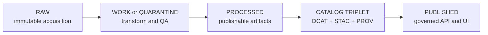

<!-- [KFM_META_BLOCK_V2]
doc_id: kfm://doc/<uuid>
title: Promotion Packet
type: standard
version: v1
status: draft
owners: <team-or-names>
created: 2026-03-04
updated: 2026-03-04
policy_label: public
related: [
  docs/governance/promotion-contract.md,
  docs/catalogs/README.md,
  docs/policy/README.md
]
tags: [kfm, promotion, governance, template]
notes: [
  "Copy this template per dataset_version promotion PR and fill every placeholder.",
  "Default-deny: if anything is missing or unverifiable, mark decision fail-closed."
]
[/KFM_META_BLOCK_V2] -->

# Promotion Packet
One file that makes a dataset version promotion auditable: **what changed, what was validated, what policy decided, and why we are promoting (or blocking).**

> **Status:** template (copy & fill)  
> **Owners:** `<team-or-names>`  
> **Applies to:** promotions from **PROCESSED + CATALOG/TRIPLET → PUBLISHED** (or equivalent in your repo)  
> **Fail mode:** **fail-closed** (missing/unclear → do not promote)

**Quick nav:**  
[Scope](#scope) · [How to use](#how-to-use) · [Truth path](#truth-path) · [Gate checklist](#gate-checklist) ·
[Decision](#promotion-decision) · [Attachments](#attachments) · [Appendix](#appendix)

---

## Scope
**Purpose:** Provide a reviewable, CI-checkable “packet” for promoting one dataset version.

**In scope:**
- Dataset identity + versioning evidence (IDs, hashes, run IDs).
- Licensing/rights snapshot + attribution requirements.
- Sensitivity classification + any redaction/generalization obligations.
- Catalog triplet validation (DCAT/STAC/PROV, or your project’s equivalents).
- Run receipt(s), checksums, and QA threshold evidence.
- Policy tests + contract tests evidence.
- A clear promotion decision with approver(s).

**Out of scope (do not put here):**
- Secrets, credentials, tokens, private keys.
- Raw sensitive location coordinates or unredacted PII (link to restricted artifacts instead).
- Large binaries (store in governed storage; reference by digest + URI).

---

## How to use
1. Copy this file to a promotion location, e.g.:
   - `docs/investigations/promotions/<dataset_id>/<dataset_version_id>/promotion-packet.md` (PROPOSED)
2. Replace every `<PLACEHOLDER>` and check every gate box.
3. Attach or link (by digest) the validator outputs, QA report, and policy decision record.
4. If any required item is UNKNOWN or missing → set **Promotion decision = fail-closed**.

---

## Truth path
> Replace zone names/paths if your repo differs.



---

## Gate checklist

### Summary table
Fill the table; link each row to concrete evidence (path/URI + digest) and the validator output that proves it.

| Gate | Status (pass/fail/na) | Evidence pointers (paths/URIs) | Digests pinned? | Notes / gaps (smallest next step) |
|---|---|---|---|---|
| A. Identity & versioning | ⬜ |  | ⬜ |  |
| B. Licensing & rights | ⬜ |  | ⬜ |  |
| C. Sensitivity & redaction plan | ⬜ |  | ⬜ |  |
| D. Catalog triplet validation | ⬜ |  | ⬜ |  |
| E. Run receipt(s) & checksums | ⬜ |  | ⬜ |  |
| F. Policy tests & contract tests | ⬜ |  | ⬜ |  |
| G. Optional production posture | ⬜ |  | ⬜ |  |

---

## Gate A — Identity and versioning
**Goal:** A stable dataset identity, an immutable dataset version identity, and deterministic hashes tying outputs to a spec/config.

**Fill:**
- `dataset_id`: `<stable-id>`
- `dataset_version_id`: `<immutable-version-id>`
- `spec_hash` (JCS + SHA-256 recommended): `jcs:sha256:<hex>`
- Producing `run_id`(s): `kfm://run/<...>` (or your run ID scheme)
- Repo commit(s):
  - Transform code commit: `<git sha>`
  - Catalog generator commit: `<git sha>` (if different)
- Controlled vocabularies used (if any): `<refs>`

**Evidence pointers:**
- Spec/config file path: `<path>`
- `spec_hash` file path: `<path>`
- Hash recomputation log (CI/job): `<link-or-path>`

**Claims (label each):**

| Claim | Label (CONFIRMED/PROPOSED/UNKNOWN) | EvidenceRef / pointer | Notes |
|---|---|---|---|
| Dataset ID naming is compliant |  |  |  |
| Version ID derivation is deterministic |  |  |  |
| spec_hash matches recomputation |  |  |  |

[Back to top](#promotion-packet)

---

## Gate B — Licensing and rights metadata
**Goal:** Promotion cannot proceed if the license/rights are missing or unclear.

**Fill:**
- SPDX license id: `<e.g., CC-BY-4.0>`
- Rights holder / publisher: `<org>`
- Attribution text required: `<text>`
- Upstream terms snapshot:
  - Source URL: `<url>`
  - Snapshot location (file/URI): `<path-or-uri>`
  - Snapshot digest: `sha256:<hex>`
- Downstream constraints (if any): `<share-alike, non-commercial, etc.>`

**Evidence pointers:**
- DCAT (or equivalent) metadata showing license/rights: `<path>`
- Upstream terms artifact: `<path>`

**Claims:**

| Claim | Label | EvidenceRef / pointer | Notes |
|---|---|---|---|
| License is explicit |  |  |  |
| License is compatible with intended publication mode |  |  |  |

[Back to top](#promotion-packet)

---

## Gate C — Sensitivity classification and redaction plan
**Goal:** Every dataset version has an explicit **policy_label**, and obligations are applied for sensitive/restricted cases.

**Fill:**
- `policy_label`: `<public|restricted|sensitive_location|aggregate_only|...>`
- If not public, describe the public-safe derivative (if any): `<derivative-id>`
- Redaction/generalization plan (link to profile + PROV activity):
  - Redaction profile name: `<profile>`
  - Profile definition path: `<path>`
  - PROV activity id(s): `<prov:Activity id(s)>`

**Obligations applied (if any):**
- ⬜ generalize geometry (min cell size): `<meters>`
- ⬜ remove attributes (fields): `<field list>`
- ⬜ date bucketing (granularity): `<e.g., day/week/month>`
- ⬜ other: `<...>`

**Evidence pointers:**
- Policy decision record: `<path-or-uri>`
- Before/after QA showing redaction effectiveness: `<path-or-uri>`

**Claims:**

| Claim | Label | EvidenceRef / pointer | Notes |
|---|---|---|---|
| policy_label assigned |  |  |  |
| Obligations are implemented and tested |  |  |  |

[Back to top](#promotion-packet)

---

## Gate D — Catalog triplet validation
**Goal:** Metadata and lineage are **contract surfaces**; records validate and cross-link without guessing.

**Fill (paths + digests):**
- DCAT record: `<path>` · digest `sha256:<hex>`
- STAC collection: `<path>` · digest `sha256:<hex>`
- STAC item sample (N≥1): `<path>` · digest `sha256:<hex>`
- PROV bundle: `<path>` · digest `sha256:<hex>`

**Validation outputs:**
- DCAT validator output: `<path-or-link>`
- STAC validator output: `<path-or-link>`
- PROV validator output: `<path-or-link>`
- Link-checker output: `<path-or-link>`

**Cross-link spot checks (list at least 3):**
1. `<DCAT -> PROV link>` — status: pass/fail
2. `<STAC -> DCAT link>` — status: pass/fail
3. `<STAC item -> run receipt/PROV link>` — status: pass/fail

[Back to top](#promotion-packet)

---

## Gate E — Run receipt(s) and checksums
**Goal:** Every producing run emits a receipt with inputs/outputs/environment, and every promoted artifact is checksum-verified.

### Required artifacts
- ⬜ run receipt JSON: `<path>` · digest `sha256:<hex>`
- ⬜ checksums manifest: `<path>` · digest `sha256:<hex>`
- ⬜ QA report: `<path>` · digest `sha256:<hex>`

### Run receipt example
> Provide the actual receipt file and paste only a minimal excerpt here.

```json
{
  "run_id": "kfm://run/<timestamp>.<suffix>",
  "actor": { "principal": "svc:<name>", "role": "pipeline" },
  "operation": "<ingest|transform|publish>",
  "dataset_version_id": "<dataset_version_id>",
  "inputs": [{ "uri": "<raw-or-upstream>", "digest": "sha256:<hex>" }],
  "outputs": [{ "uri": "<processed-artifact>", "digest": "sha256:<hex>", "media_type": "<mime>" }],
  "environment": {
    "container_digest": "sha256:<hex>",
    "git_commit": "<git sha>",
    "params_digest": "sha256:<hex>"
  },
  "validation": { "status": "pass|fail", "report_digest": "sha256:<hex>" },
  "policy": { "decision_id": "kfm://policy_decision/<id>" },
  "created_at": "<ISO8601>"
}
```

### Checksum verification
- Tool/command used: `<sha256sum | custom verifier>`
- Verification output location: `<path-or-link>`
- Result: pass/fail

[Back to top](#promotion-packet)

---

## Gate F — Policy tests and contract tests
**Goal:** Promotion requires **policy** and **contract** checks to pass; evidence resolution must succeed for at least one EvidenceRef.

**Fill:**
- OPA/conftest policy suite run:
  - Command: `<command>`
  - Output: `<path-or-link>`
  - Result: pass/fail
- Contract tests:
  - Schemas validated: `<list>`
  - API/route contract tests (if applicable): `<link>`
  - Result: pass/fail
- Evidence resolver check (minimum):
  - EvidenceRef used: `<evidence ref>`
  - Resolver output bundle digest: `sha256:<hex>`
  - Result: pass/fail

[Back to top](#promotion-packet)

---

## Gate G — Optional but recommended production posture
> If your repo requires these as hard gates, move them into A–F.

- ⬜ SBOM present (pipeline image + runtime artifacts): `<ref>`
- ⬜ Build provenance / attestation present (SLSA/in-toto/cosign): `<ref>`
- ⬜ Performance smoke check (e.g., tile render, evidence resolve latency): `<ref>`
- ⬜ Accessibility smoke check (e.g., evidence drawer keyboard nav): `<ref>`

---

## Promotion manifest
**Goal:** Record the promotion as a single machine-readable index for the release event.

```json
{
  "kfm_promotion_manifest_version": "v1",
  "dataset_id": "<dataset_id>",
  "dataset_version_id": "<dataset_version_id>",
  "spec_hash": "jcs:sha256:<hex>",
  "released_at": "<ISO8601>",
  "artifacts": [
    { "path": "<artifact path>", "digest": "sha256:<hex>", "media_type": "<mime>" }
  ],
  "catalogs": [
    { "path": "<dcat path>", "digest": "sha256:<hex>" },
    { "path": "<stac path>", "digest": "sha256:<hex>" },
    { "path": "<prov path>", "digest": "sha256:<hex>" }
  ],
  "qa": { "status": "pass|fail", "report_digest": "sha256:<hex>" },
  "policy": { "policy_label": "<label>", "decision_id": "kfm://policy_decision/<id>" },
  "approvals": [
    { "role": "steward", "principal": "<id>", "approved_at": "<ISO8601>" }
  ]
}
```

- Manifest file path (in repo): `<path>`
- Manifest digest: `sha256:<hex>`

---

## Promotion decision
> **Default-deny:** if any required evidence is missing or unverifiable, choose **fail-closed**.

**Decision:** `<promote|block|fail-closed>`  
**Decided at:** `<ISO8601>`  
**Deciders / reviewers:** `<names or principals>`  
**PR / change record:** `<link>`  

### Rationale (cite evidence)
- **Why now?** `<short>`
- **What changed?** `<short + pointers>`
- **Risks & mitigations:** `<short>`
- **User-visible impacts:** `<short>`

### If blocked or fail-closed
- Blocking reason(s): `<list>`
- Smallest steps to make promotable: `<list>`
- Audit event file (if produced): `<path>`

[Back to top](#promotion-packet)

---

## Attachments
List every artifact referenced above; prefer digest-pinned URIs.

| Artifact | Purpose | Location (path/URI) | Digest | Notes |
|---|---|---|---|---|
| Spec / config | Reproduce run |  |  |  |
| run receipt | Audit & provenance |  |  |  |
| checksums manifest | Integrity |  |  |  |
| QA report | Quality gate |  |  |  |
| DCAT | Dataset metadata |  |  |  |
| STAC | Asset metadata |  |  |  |
| PROV | Lineage |  |  |  |
| Policy decision record | allow/deny + obligations |  |  |  |
| Validator outputs | proof of validation |  |  |  |
| Evidence bundle | resolvable citation |  |  |  |
| Promotion manifest | release index |  |  |  |

---

## Appendix

### A. Evidence bundle excerpt (optional)
Paste only the minimum needed; full object should be stored as an artifact.

```json
{
  "bundle_id": "sha256:<hex>",
  "dataset_version_id": "<dataset_version_id>",
  "title": "<short title>",
  "policy": {
    "decision": "<allow|deny>",
    "policy_label": "<label>",
    "obligations_applied": []
  },
  "license": { "spdx": "<id>", "attribution": "<text>" },
  "provenance": { "run_id": "kfm://run/<id>" },
  "artifacts": [
    { "href": "<uri>", "digest": "sha256:<hex>", "media_type": "<mime>" }
  ],
  "checks": { "catalog_valid": true, "links_ok": true },
  "audit_ref": "kfm://audit/<id>"
}
```

### B. Unknowns log (required when anything is UNKNOWN)
| Item | Why UNKNOWN | Verification step | Owner | Due |
|---|---|---|---|---|
|  |  |  |  |  |

### C. Change log
- 2026-03-04 — created template.
