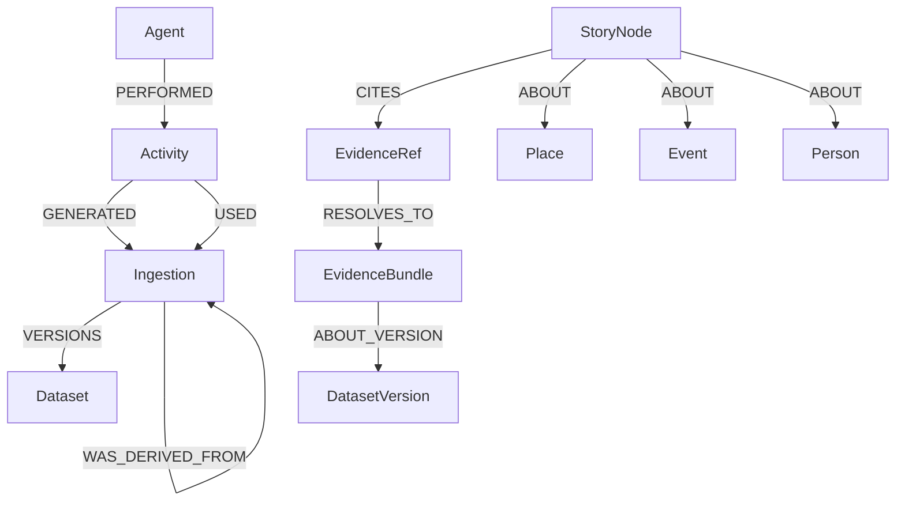

<!-- [KFM_META_BLOCK_V2]
doc_id: kfm://doc/3b7f0e2e-93d6-4a0d-8c12-9a13ad3c6f6a
title: Knowledge Graph Data Model
type: standard
version: v1
status: draft
owners: [TBD]
created: 2026-03-04
updated: 2026-03-04
policy_label: public
related: [docs/knowledge_graph/GRAPH_DATA_MODEL.md]
tags: [kfm, knowledge-graph, neo4j, provenance, evidence]
notes: ["Graph is a rebuildable projection; citations resolve via EvidenceRef → EvidenceBundle."]
[/KFM_META_BLOCK_V2] -->

# Knowledge Graph Data Model
Defines the **rebuildable** property-graph schema (Neo4j) KFM uses for **lineage, entity relationships, and retrieval augmentation** — *without becoming a source of truth*.

> **IMPACT**
>
> **Status:** experimental (v1 draft)  
> **Owners:** TODO (CODEOWNERS)  
> **Badges:** TODO • CI • Contract Tests • Policy Fixtures • Linkcheck  
> **Jump:** [Scope](#scope) · [Invariants](#invariants) · [Model](#graph-model-v1) · [Constraints](#constraints-and-indexes) · [APIs](#governed-api-usage) · [Gates](#definition-of-done-and-gates) · [Open Questions](#unknowns-and-verification-steps)

---

## Scope

### What this model is
- **CONFIRMED:** A *projection* used to answer questions like “what produced this dataset version?”, “what changed?”, and “what entities are connected to this story claim?”  
- **CONFIRMED:** A query surface used by **governed APIs** (not by clients directly).

### What this model is not
- **CONFIRMED:** It is **not** the canonical evidence store. Canonical truth is in artifacts + catalogs + audit receipts.  
- **CONFIRMED:** It is **not** a bypass around policy enforcement. All reads/writes must cross the governed API + policy boundary.

---

## Where this fits in KFM

### Upstream inputs
- **CONFIRMED:** Catalog triplet: **DCAT + STAC + PROV** (and run receipts) is the evidence boundary.
- **CONFIRMED:** Entity-resolution outputs (candidate and steward-approved merges) produce additional edges.

### Downstream users
- **CONFIRMED:** Governed APIs (e.g., lineage and provenance endpoints) query this graph.
- **PROPOSED:** Focus Mode retrieval uses graph traversal as one of several retrieval indexes.

### Directory tree (expected)
> NOTE: This is a documentation layout suggestion. Adjust to your repo structure.

```text
docs/
  knowledge_graph/
    GRAPH_DATA_MODEL.md         # this file (v1)
    CYPHER_PATTERNS.md          # (PROPOSED) reusable query library
    OPS_AND_MAINTENANCE.md      # (PROPOSED) backup/rebuild/runbooks
```

---

## Status legend

- **CONFIRMED** = explicitly required or described as an invariant/pattern in KFM vNext docs
- **PROPOSED** = recommended design, not yet enforced by contracts/tests
- **UNKNOWN** = not found in current sources; must be verified before relying on it

---

## Invariants

### Governance and trust membrane
- **CONFIRMED:** The graph is a **rebuildable projection**, not canonical storage.  
- **CONFIRMED:** No UI/client code may access Neo4j directly; access must go through governed APIs and policy enforcement.
- **CONFIRMED:** Policy labels drive allow/deny plus **obligations** (redaction/generalization), and those obligations must be applied before returning data.

### Evidence discipline
- **CONFIRMED:** KFM “citations” are **EvidenceRefs**, not pasted URLs.  
- **CONFIRMED:** EvidenceRefs must resolve (via the evidence resolver) to an **EvidenceBundle** containing policy decision, provenance, artifacts, and digests.  
- **CONFIRMED:** Focus Mode and Story publishing must “cite or abstain”; citation verification is a hard gate.

### Time discipline
- **PROPOSED:** Use at least **event time** and **transaction time** across time-aware domains; add **valid time** where boundary/administrative history requires it.

---

## Graph model v1

This file specifies a **minimum buildable subgraph** (ProvenanceLineage) and a set of **optional extensions**.

### Model diagram



> NOTE: EvidenceBundle is modeled as a **pointer** (digest + metadata) even if its content lives in an OCI bundle or object store.

---

## Core subgraph: ProvenanceLineage

### Node labels and required properties

| Label | Key | Required properties (v1) | Notes |
|---|---|---|---|
| `Dataset` | `slug` | `slug`, `title`, `sensitivity`, `doc_uuid` | Minimal dataset identity; `doc_uuid` links to internal documentation. |
| `Ingestion` | `ingestion_id` | `ingestion_id`, `at`, `git_sha`, `source_uri`, `stac_id`, `status`, `policy_gate`, `run_id` | Append-only “receipt-like” node per ingestion. |
| `Activity` | `(kind, at)` | `kind`, `at`, `policy_bundle`, `openlineage_run` | PROV-ish execution record. |
| `Agent` | `name` | `name`, `kind`, `email` | Human or service actor. |

**CONFIRMED:** The labels/props above are a documented, copy/paste Neo4j pattern for a provenance timeline.  
**PROPOSED:** Treat these as minimum contracts once implemented (constraints + smoke tests).

### Relationship types and semantics

| Type | From → To | Meaning |
|---|---|---|
| `PERFORMED` | `Agent → Activity` | actor executed activity |
| `GENERATED` | `Activity → Ingestion` | activity produced ingestion record |
| `USED` | `Activity → Ingestion` | activity used an ingestion as input |
| `VERSIONS` | `Ingestion → Dataset` | ingestion produced a new dataset version or published state |
| `WAS_DERIVED_FROM` | `Ingestion → Ingestion` | lineage to parent ingestion(s) |

> IMPORTANT: `WAS_DERIVED_FROM` should only point to **prior** ingestions and must not create cycles.

### Canonical Cypher patterns

#### Upsert an ingestion “receipt”
```cypher
MERGE (d:Dataset {slug: $dataset_slug})
  ON CREATE SET d.title = $dataset_title,
                d.sensitivity = $sensitivity,
                d.doc_uuid = $doc_uuid

MERGE (i:Ingestion {ingestion_id: $ingestion_id})
  ON CREATE SET i.at = datetime($iso_datetime),
                i.git_sha = $git_sha,
                i.source_uri = $source_uri,
                i.stac_id = $stac_id,
                i.status = $status,
                i.policy_gate = $policy_gate,
                i.run_id = $run_id

MERGE (a:Activity {kind:'ingest', at: datetime($iso_datetime), policy_bundle:$policy_bundle})
MERGE (g:Agent {name:$actor_name, kind:$actor_kind})

MERGE (g)-[:PERFORMED]->(a)
MERGE (a)-[:GENERATED]->(i)
MERGE (i)-[:VERSIONS]->(d)

WITH i
FOREACH (p IN $parents |
  MERGE (pi:Ingestion {ingestion_id: p})
  MERGE (i)-[:WAS_DERIVED_FROM]->(pi)
);
```

#### Time-slice query for a dataset timeline
```cypher
MATCH (d:Dataset {slug:$dataset_slug})<-[:VERSIONS]-(i:Ingestion)
OPTIONAL MATCH (i)<-[:GENERATED]-(act:Activity)<-[:PERFORMED]-(agent:Agent)
WHERE i.at >= datetime($from) AND i.at < datetime($to)
RETURN i.ingestion_id AS id, i.at AS at, i.status AS status, i.git_sha AS git_sha,
       i.policy_gate AS policy_gate, i.stac_id AS stac_id,
       act.kind AS activity_kind, agent.name AS who
ORDER BY at ASC;
```

---

## Core subgraph: Dataset and DatasetVersion

- **CONFIRMED:** Runtime surfaces and EvidenceBundles refer to `dataset_version_id`.  
- **PROPOSED:** Materialize `DatasetVersion` nodes as the join point between catalogs, artifacts, and evidence bundles.

### DatasetVersion properties (PROPOSED v1)
| Property | Type | Purpose |
|---|---|---|
| `dataset_version_id` | string | stable identifier used by APIs and EvidenceBundles |
| `dataset_slug` | string | backref to `Dataset.slug` |
| `spec_hash` | string | deterministic spec hash (e.g., JCS sha256) |
| `policy_label` | string | policy classification input |
| `stac_id` / `dcat_id` / `prov_id` | string | catalog cross-links |
| `run_id` | string | run receipt ID for the pipeline run |
| `artifact_digests` | list | quick integrity pointers |

---

## Evidence model

### EvidenceRef
- **CONFIRMED:** EvidenceRefs use typed schemes resolved by the evidence resolver (e.g., `dcat://`, `stac://`, `prov://`, `doc://`).  
- **PROPOSED:** Store EvidenceRefs in graph as opaque strings (do not parse in client code).

**Recommended properties (PROPOSED):**
- `ref` (string, unique)
- `kind` (controlled vocab; e.g., `catalog`, `feature`, `document`)
- `policy_label` (copied from resolver decision, not trusted until verified)

### EvidenceBundle
- **CONFIRMED:** An EvidenceBundle includes a `bundle_id` digest, a `dataset_version_id`, policy decision + obligations, license (SPDX), provenance `run_id`, artifacts with digests, checks, and an `audit_ref`.  
- **PROPOSED:** Graph stores only bundle metadata + digest; the bundle content is fetched through the evidence resolver.

---

## Story and Focus integration

### StoryNode (PROPOSED)
- **CONFIRMED:** Story publishing requires resolvable citations and captures map state (sidecar).  
- **PROPOSED:** Treat StoryNodes as first-class nodes so we can query “what stories cite this dataset version?” and “what entities are discussed?”

Suggested minimal properties:
- `story_id` (stable)
- `title`
- `author_id`
- `review_state`
- `map_state_digest`
- `created_at`, `updated_at`

Suggested relationships:
- `(:StoryNode)-[:CITES]->(:EvidenceRef)`
- `(:StoryNode)-[:ABOUT]->(:Place|Event|Person|Document)`

### FocusRun (PROPOSED)
- **CONFIRMED:** Every Focus Mode query is a governed run and emits a receipt; outputs include answer text, citations (EvidenceRefs), and an `audit_ref`.  
- **PROPOSED:** Store FocusRun metadata in graph only if needed for evaluation and “what did the model cite?” analytics.

---

## Domain entities

### Place / Event / Person / Document
- **CONFIRMED (directional):** KFM domain modeling includes Place and Event; Story Nodes should reference people, places, events, documents via stable graph identifiers.  
- **PROPOSED:** Use CIDOC-CRM alignment for these nodes when the ontology is formalized.

**UNKNOWN:** The authoritative ontology profile(s) (CIDOC-CRM mappings, property names, relationship types) have not been located in the current source set.

---

## Constraints and indexes

### Minimum constraints (PROPOSED)
```cypher
CREATE CONSTRAINT dataset_slug_unique IF NOT EXISTS
FOR (d:Dataset) REQUIRE d.slug IS UNIQUE;

CREATE CONSTRAINT ingestion_id_unique IF NOT EXISTS
FOR (i:Ingestion) REQUIRE i.ingestion_id IS UNIQUE;

CREATE INDEX ingestion_at IF NOT EXISTS
FOR (i:Ingestion) ON (i.at);

CREATE INDEX ingestion_run_id IF NOT EXISTS
FOR (i:Ingestion) ON (i.run_id);
```

### Optional search indexes (PROPOSED)
If you store textual entities or document chunks in Neo4j:
- Full-text index on `Document.title`, `Chunk.text`
- Vector index on `Chunk.embedding` (if embeddings are stored)

---

## Governed API usage

### Supported query shapes (illustrative)

| API surface | Typical question | Graph inputs | Notes |
|---|---|---|---|
| `GET /api/v1/lineage/{dataset_id}` | “What produced this dataset?” | `Dataset ↔ Ingestion ↔ Activity ↔ Agent` | Must return evidence links (run receipts + catalogs), not just graph claims. |
| `GET /provenance/timeline?...` | “Show ingestions over time” | time-sliced ingestions | Must be policy-filtered and cached. |
| `POST /api/v1/focus/ask` | “Answer with citations” | entity traversal + retrieval hints | Must cite EvidenceRefs that resolve, or abstain. |
| `GET/POST /api/v1/story` | “Publish/read Story Nodes” | story ↔ citations ↔ entities | Publishing requires citation resolution gate. |

---

## Rebuild and determinism rules

- **CONFIRMED:** The graph is derived from catalogs + entity resolution and must be fully rebuildable.  
- **CONFIRMED:** Deterministic IDs/hashes (e.g., spec hash stability) are required to prevent version confusion and caching drift.

Rebuild guidelines (PROPOSED):
1. Load **only promoted** DatasetVersions (PUBLISHED zone) into the graph.
2. Recompute derived edges from catalogs (DCAT/STAC/PROV) and steward-approved entity merges.
3. Run “lineage smoke tests” (counts, missing checksums, stale activities) and fail closed if violations exist.

---

## Definition of done and gates

### Gate checklist (graph model changes)
- [ ] **Schema first:** constraints/index migrations are defined and reviewed.
- [ ] **Contract tests:** API contract tests updated (OpenAPI/GraphQL).
- [ ] **Policy fixtures:** allow/deny scenarios cover graph-backed endpoints.
- [ ] **Evidence safety:** no endpoint returns data without EvidenceRef resolution.
- [ ] **Rebuild proof:** graph can be rebuilt from catalogs + receipts deterministically.
- [ ] **CI smoke:** lineage smoke queries run in CI against fixtures.

---

## Unknowns and verification steps

### UNKNOWN: Ontology profile for domain entities (CIDOC-CRM mapping)
Smallest verification steps:
1. Locate ontology/ERD docs (e.g., `docs/knowledge_graph/ontology*` or ADRs).
2. Confirm which classes/relationships are “v1 required” vs “future”.
3. Add controlled vocabulary files and schema contracts.

### UNKNOWN: Canonical StoryNode schema + graph ID strategy
Smallest verification steps:
1. Locate `contracts/schemas/story_node_v3.schema.json`.
2. Confirm stable identifier strategy (`kfm://story/...` vs UUID vs slug).
3. Add Story publish gate tests that ensure entity IDs exist and citations resolve.

---

## References (local)
- Kansas Frontier Matrix (KFM) — Definitive Design & Governance Guide (vNext)
- KFM Integration Kit / New Ideas 2-8-26 (Provenance timeline graph pattern)
- Tooling the KFM pipeline (API + evidence resolver posture)
