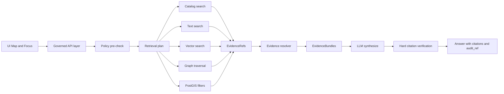

<!-- [KFM_META_BLOCK_V2]
doc_id: kfm://doc/8f3a9a2d-6b1f-4c6f-9a1c-3f6c9b8c6a7e
title: Graph RAG Patterns
type: standard
version: v1
status: draft
owners: TBD
created: 2026-03-04
updated: 2026-03-04
policy_label: public
related: []
tags: [kfm, knowledge-graph, rag, graphrag, evidence, provenance, policy]
notes: [
  "Drafted from KFM vNext design snapshots and pipeline tooling docs.",
  "Does not assert repo implementation state; patterns are a mix of CONFIRMED requirements and PROPOSED implementations."
]
[/KFM_META_BLOCK_V2] -->

# Graph RAG Patterns
One-line purpose: Evidence-first GraphRAG patterns for KFM’s knowledge graph + retrieval indexes, designed to **cite-or-abstain**, **fail-closed**, and remain **governed**.

> **Status:** experimental (doc)  
> **Owners:** TBD  
> **Last updated:** 2026-03-04  
>
>     
>
> Quick links: [Scope](#scope) · [Where it fits](#where-it-fits) · [Hard invariants](#hard-invariants) · [Pattern catalog](#pattern-catalog) · [Evaluation](#evaluation-and-ci-gates) · [Checklist](#implementation-checklist)

---

## Evidence labels used in this document

- **CONFIRMED** = explicitly stated as a requirement/contract in KFM design snapshots/tooling docs.
- **PROPOSED** = recommended implementation pattern consistent with KFM constraints (but not asserted as implemented).
- **UNKNOWN** = missing verification; includes smallest steps to confirm.

> IMPORTANT: This doc is written to avoid fabricating repo state. Even “obvious” endpoints/labels are treated as **PROPOSED** unless verified.

---

## Scope

- **CONFIRMED:** Focus Mode is a governed “cite-or-abstain” loop: policy pre-check → retrieval plan → retrieve evidence → build evidence bundles → synthesize → hard citation verification → audit receipt.  
- **CONFIRMED:** Retrieval may use multiple projections (catalog search, text index, graph edges, PostGIS spatial filtering, optional vector index) but **all retrieval results must map back to EvidenceRefs** and resolve to EvidenceBundles; “raw text from index” is not allowed without evidence linking.  
- **PROPOSED:** Apply the same patterns to Story Node drafting/publishing, dataset discovery, and provenance/lineage exploration.

---

## Where it fits

**Path:** `docs/knowledge_graph/GRAPH_RAG_PATTERNS.md`

- **CONFIRMED:** KFM’s UI is a governed client; it should not bypass policy/PEP boundaries and should surface trust (version, license, policy) as first-class UI elements.  
- **CONFIRMED:** The evidence resolver is central: it resolves an EvidenceRef into an EvidenceBundle after applying policy and redaction obligations; it must fail closed if unresolvable/unauthorized.  
- **PROPOSED:** This doc is the “pattern library” for the Focus Mode orchestrator and any graph-backed retrievers used by API routes.

---

## Acceptable inputs

- **CONFIRMED:** `user_query` plus optional `view_state` (map bbox, time window, active layers) plus user role/policy context.  
- **PROPOSED:** Optional: “task intent” (ask, compare, summarize, explain lineage), desired citation density, and response format (markdown, JSON, story draft).

---

## Exclusions

- **CONFIRMED:** UI/clients must not access DB/storage directly; all access crosses governed APIs and policy boundary.  
- **CONFIRMED:** No “raw index text” to the model without evidence linking (EvidenceRef → EvidenceBundle).  
- **PROPOSED:** No agent/tool calls beyond an allowlist; no free-form browsing of internal stores from the model.

---

## Hard invariants

### Cite-or-abstain and verification

- **CONFIRMED:** The hard gate is citation verification; if citations can’t be verified (resolve + policy-allowed), the system must revise answer or abstain/reduce scope.  
- **CONFIRMED:** Partial answers are acceptable when only part of a question is supported by evidence.

### Policy, redaction, and “don’t leak existence”

- **CONFIRMED:** Policy pre-check happens before retrieval execution.
- **CONFIRMED:** Evidence resolver is the only “source of truth” for citations.
- **CONFIRMED:** Apply redaction obligations before the model sees restricted data.
- **CONFIRMED:** Errors must be policy-safe; avoid leaking sensitive existence via differing 403/404 behavior.

### Governed run receipts

- **CONFIRMED:** A Focus Mode request is treated as a governed run with a receipt and an `audit_ref` suitable for review.

---

## Core contracts

> NOTE: The concrete schema files and route implementations may or may not exist in the repo; treat these as **documented targets** unless verified.

### EvidenceRef

- **CONFIRMED:** Citations are **EvidenceRefs** that resolve to EvidenceBundles (not pasted URLs).
- **PROPOSED:** EvidenceRef minimal shape:
  - `ref_type`: `dcat | stac | doc_chunk | graph_fact | query_result`
  - `ref_id`: stable identifier (dataset_version_id + asset id, or doc chunk id, etc.)
  - `locator`: optional structured locator (bbox/time/offset)
  - `display`: optional title/snippet for UI

### EvidenceBundle

- **CONFIRMED:** Evidence resolver returns an EvidenceBundle with policy decision, license, provenance, artifact digests, and audit references.  
- **CONFIRMED:** Example template fields include `bundle_id`, `dataset_version_id`, `policy.decision`, `policy.obligations_applied`, `license.spdx`, `provenance.run_id`, `artifacts[].digest`, and `audit_ref`.

Example (template, for discussion):
```json
{
  "bundle_id": "sha256:bundle...",
  "dataset_version_id": "2026-02.abcd1234",
  "title": "Storm event record: 2026-02-19",
  "policy": {
    "decision": "allow",
    "policy_label": "public",
    "obligations_applied": []
  },
  "license": { "spdx": "CC-BY-4.0", "attribution": "Source org" },
  "provenance": { "run_id": "kfm://run/2026-02-20T12:00:00Z.abcd" },
  "artifacts": [
    {
      "href": "processed/events.parquet",
      "digest": "sha256:2222",
      "media_type": "application/x-parquet"
    }
  ],
  "checks": { "catalog_valid": true, "links_ok": true },
  "audit_ref": "kfm://audit/entry/123"
}
```

### Focus response

- **CONFIRMED:** Outputs include answer text, citations (EvidenceRefs), and an `audit_ref`.
- **PROPOSED:** Validate outputs against a schema that requires at least one citation object with resolvable evidence links; treat missing citations as policy-deny.

---

## Retrieval building blocks

- **CONFIRMED:** Catalog search (DCAT/STAC) for dataset discovery by theme/coverage.
- **CONFIRMED:** Text search index for OCR corpora/documents.
- **CONFIRMED:** Graph edges for entity resolution and relationship traversal.
- **CONFIRMED:** PostGIS for spatial filtering (bbox/time).
- **CONFIRMED:** Vector index is optional for semantic retrieval.

---

## Reference architecture diagram



---

## Pattern selection matrix

| Use case | Recommended pattern(s) | Why |
|---|---|---|
| “Explain X with sources” | P0 Baseline evidence-first loop | Smallest governed surface |
| “Find all references to entity Y” | P1 Entity-first graph expansion + doc chunks | Recall via graph adjacency |
| “Semantic question over messy docs” | P2 Hybrid vector + full-text + graph expansion | Recall + precision |
| “Corpus-wide synthesis (global themes)” | P3 Community summary GraphRAG | Avoid top-k chunk myopia |
| “Map-context question (bbox/time)” | P4 Spatiotemporal anchored GraphRAG | Align retrieval with view_state |
| “Sensitive location / restricted” | P5 Policy-conditioned GraphRAG with redaction | Prevent leakage; apply obligations |
| “Fast repeated questions” | P6 Cache with audit-safe keys | Performance without breaking trust |

Legend: P0–P6 are defined below.

---

## Pattern catalog

### P0 — Baseline evidence-first GraphRAG loop

**Intent**
- **CONFIRMED:** Enforce policy pre-check, evidence bundling, hard citation verification, and receipts.

**When to use**
- **PROPOSED:** Default for all Focus Mode Q&A and any “explain with sources” feature.

**Inputs**
- **CONFIRMED:** `user_query`, optional `view_state`, role/policy context.

**Outputs**
- **CONFIRMED:** answer text + EvidenceRefs + audit_ref.

**Algorithm**
1. **CONFIRMED:** Policy pre-check (deny by default if topic/role disallows).
2. **CONFIRMED:** Retrieval plan chooses projections and candidate datasets based on query + view_state.
3. **CONFIRMED:** Retrieve evidence from catalogs/search/graph/PostGIS/vector → produce EvidenceRefs.
4. **CONFIRMED:** Resolve EvidenceRefs → EvidenceBundles (apply obligations/redactions).
5. **CONFIRMED:** Synthesize answer referencing EvidenceBundle IDs.
6. **CONFIRMED:** Hard gate: verify every citation resolves + is policy-allowed. If not, revise or abstain.
7. **CONFIRMED:** Emit audit receipt with query, bundle digests, policy decisions, model version, latency, output hash.

**Gotchas**
- **CONFIRMED:** If citations cannot be verified, do not “best effort” — abstain or reduce scope.
- **CONFIRMED:** Do not pass raw index snippets that cannot be tied to EvidenceRefs.

**Tests**
- **CONFIRMED:** Evaluation harness must test citation coverage, citation resolvability, refusal correctness, sensitivity leakage, regression tests (golden queries).

---

### P1 — Entity-first graph expansion, then evidence retrieval

**Intent**
- **PROPOSED:** Use the graph to turn “ambiguous language” into a set of candidate entities, then retrieve only evidence tied to those entities.

**When to use**
- **PROPOSED:** Queries like “Tell me about John Brown’s route” (entity disambiguation) or “How are X and Y connected”.

**Inputs**
- **PROPOSED:** Query + optional entity hints from UI (clicked feature, selected dataset layer).

**Outputs**
- **CONFIRMED:** EvidenceRefs only (still must resolve via evidence resolver).

**Algorithm**
1. **PROPOSED:** Extract candidate entity strings from query.
2. **PROPOSED:** Graph lookup: match Entities by label/alias; return candidates with confidence and `sameAs`/merge status.
3. **PROPOSED:** Expand 1–2 hops along whitelisted relationship types (avoid “graph explosion”).
4. **PROPOSED:** From expanded subgraph, collect “attached evidence handles” (doc chunks, dataset_version_ids, STAC item ids) as EvidenceRefs.
5. **CONFIRMED:** Resolve EvidenceRefs via evidence resolver before any text is shown to the model/UI.

**Gotchas**
- **PROPOSED:** Keep a strict allowlist of relationship types for expansion; log traversal depth in receipt.
- **UNKNOWN:** What are the canonical entity labels/relationship types in KFM’s graph?
  - Smallest steps: inspect graph schema/constraints; publish a controlled vocabulary doc; add tests for allowed rel types.

---

### P2 — Hybrid retrieval: vector top-k + full-text + traversal expansion

**Intent**
- **CONFIRMED (design direction):** Vector index is optional; multiple projections are allowed.
- **PROPOSED (implementation):** Combine semantic similarity (vector), lexical matching (full-text), and structural recall (graph traversal).

**When to use**
- **PROPOSED:** “Messy documents” where vector recall helps, but you still want exact names/dates.

**Algorithm (canonical hybrid)**
1. **PROPOSED:** Run vector search for top-k chunks/doc nodes (semantic).
2. **PROPOSED:** Run full-text for key terms (lexical).
3. **PROPOSED:** Merge + dedupe results (keep provenance of which retriever returned what).
4. **PROPOSED:** For each candidate chunk/entity, expand a small neighborhood in graph to find adjacent relevant evidence handles.
5. **CONFIRMED:** Convert every retrieved item into an EvidenceRef, then resolve to EvidenceBundles.

**Gotchas**
- **CONFIRMED:** Never send “raw chunk text” unless it is within an EvidenceBundle returned by the resolver.
- **PROPOSED:** Control context size by scoring and diversity (avoid 20 chunks from the same doc).
- **UNKNOWN:** Which vector/full-text technologies are selected for KFM (Neo4j vector index, separate search service, etc.)?
  - Smallest steps: verify deployed services; document index ownership and query APIs.

---

### P3 — Community summary GraphRAG for corpus-wide synthesis

**Intent**
- **PROPOSED:** Support “global sensemaking” questions (“what changed over decades”, “common causes”, “themes across counties”) by summarizing communities/clusters in the graph, not just top-k chunks.

**When to use**
- **PROPOSED:** Queries requiring synthesis across the whole corpus.

**Algorithm (high-level)**
1. **PROPOSED:** Build a graph-based index from text: `Document → Chunk → Entity`, plus references to datasets and provenance.
2. **PROPOSED:** Detect communities (by entity co-occurrence or linkage structure).
3. **PROPOSED:** Store “community summary” nodes as governed artifacts with EvidenceRefs to supporting material.
4. **CONFIRMED:** When asked a global question, retrieve relevant community summaries + supporting bundles, then synthesize with citations.

**Gotchas**
- **PROPOSED:** Summaries must be treated as *derived artifacts* with their own provenance and validation.
- **CONFIRMED:** Summaries must not bypass policy; they require the same evidence bundling and obligations.

---

### P4 — Spatiotemporal anchored GraphRAG using view_state

**Intent**
- **CONFIRMED:** Focus Mode can accept `view_state` hints (bbox/time/layers) and retrieval includes PostGIS spatial filtering.
- **PROPOSED:** Treat `view_state` as a first-class retrieval constraint and ranking signal.

**When to use**
- **PROPOSED:** User asks in context of a map view (“Why are there more events here between 1933–1936?”).

**Algorithm**
1. **CONFIRMED:** Ingest `view_state` as inputs to the retrieval plan.
2. **PROPOSED:** Apply bbox/time filters in PostGIS queries and to catalog search (spatial/temporal extents).
3. **PROPOSED:** Use active layers to bias dataset selection.
4. **CONFIRMED:** Map all outputs back into EvidenceRefs and resolve.

**Gotchas**
- **CONFIRMED:** View state must not become a backdoor for restricted data; policy pre-check still applies.
- **PROPOSED:** Log the view_state digest in the run receipt for reproducibility.

---

### P5 — Policy-conditioned GraphRAG with redaction obligations

**Intent**
- **CONFIRMED:** Apply redaction obligations before the model sees text for restricted datasets.
- **CONFIRMED:** Avoid sensitive location leakage; prefer restricted precise datasets + public generalized derivatives; default-deny.
- **PROPOSED:** Make “obligations_applied” affect both retrieval and UI presentation (badges, uncertainty radius, etc.).

**When to use**
- **PROPOSED:** Archaeology, species, private infrastructure, or any dataset labeled restricted.

**Algorithm**
1. **CONFIRMED:** Policy pre-check determines if request can proceed.
2. **PROPOSED:** Retrieval plan selects policy-safe derivative datasets by default (generalized outputs).
3. **CONFIRMED:** Evidence resolver applies obligations and returns `policy.obligations_applied`.
4. **PROPOSED:** The context packer includes only obligation-compliant excerpts/attributes.
5. **CONFIRMED:** Citation verification ensures each citation remains policy-allowed for the user.

**Gotchas**
- **CONFIRMED:** Do not leak restricted existence through error shapes; align 403/404 behaviors with policy.
- **PROPOSED:** Add golden fixtures for “raw → generalized → expected bundles”.

---

### P6 — Cache with audit-safe keys

**Intent**
- **PROPOSED:** Improve performance without breaking evidence discipline.

**When to use**
- **PROPOSED:** Repeated questions, iterative refinement, common story drafts.

**Cache key requirements**
- **PROPOSED:** Cache key should include:
  - query canonical form
  - role/policy label
  - dataset_version_ids (or digest set) used
  - view_state digest (if used)
  - resolver obligations hash (if applicable)

**What may be cached**
- **PROPOSED:** Retrieval plan outputs, resolved EvidenceBundles (or bundle IDs), and verified context packs.
- **CONFIRMED:** Do not cache “raw text” detached from EvidenceBundles.

**Gotchas**
- **PROPOSED:** Always re-run citation verification step (or validate cached verification against unchanged bundle digests).

---

## Implementation checklist

### Minimal “vertical slice” for GraphRAG in KFM

- **CONFIRMED:** Implement/verify evidence resolver contract: EvidenceRef → EvidenceBundle, fail-closed.
- **CONFIRMED:** Implement/verify Focus Mode orchestrator: policy pre-check, retrieval plan, evidence retrieval, bundling, synthesis, citation verification, receipt.
- **CONFIRMED:** Implement evaluation harness with golden queries and regression gating.

### Operational guardrails

- **CONFIRMED:** Structured audit logs for governed operations must include who/what/when/why, inputs/outputs by digest, and policy decisions.
- **CONFIRMED:** Audit logs are sensitive; apply redaction and retention policies.

---

## Evaluation and CI gates

- **CONFIRMED:** Focus Mode evaluation harness must measure:
  - citation coverage
  - citation resolvability (100% for allowed users)
  - refusal correctness for restricted questions
  - sensitivity leakage tests (no restricted coordinates/metadata)
  - regression tests across dataset versions

- **PROPOSED:** Add these additional GraphRAG tests:
  - “retrieval determinism”: same inputs → same EvidenceRef set (within acceptable variance)
  - “context pack determinism”: stable ordering and size under a seed
  - “policy equivalence”: same query with different roles yields expected redactions/abstentions

---

## Quickstart

> This is a “how to implement” sketch; it is not asserting file paths exist.

1. **PROPOSED:** Define an internal `RetrievalPlan` JSON schema:
   - query intent
   - candidate datasets
   - chosen projections
   - bbox/time constraints
   - max evidence refs

2. **PROPOSED:** Implement `retrieveEvidence(plan) -> EvidenceRef[]` where each projection returns only EvidenceRefs:
   - catalog search → dataset/version refs
   - search index/vector → doc_chunk refs
   - graph traversal → graph_fact refs that point to inspectable artifacts

3. **CONFIRMED:** Resolve all EvidenceRefs using evidence resolver before synthesis.

4. **CONFIRMED:** Enforce hard citation verification; abstain or narrow scope on failure.

5. **CONFIRMED:** Emit audit_ref/run receipt.

Example orchestrator pseudocode:
```ts
type EvidenceRef = { ref_type: string; ref_id: string; locator?: any };
type EvidenceBundle = { bundle_id: string; policy: any; artifacts: any[] };

async function focusAsk(input: {
  user_query: string;
  view_state?: any;
  principal: { id: string; role: string };
}): Promise<{ answer: string; citations: EvidenceRef[]; audit_ref: string }> {

  // 1) policy pre-check (fail closed)
  const allowed = await policyPrecheck(input);
  if (!allowed.ok) return abstain(allowed.audit_ref, allowed.reason);

  // 2) retrieval plan
  const plan = await buildRetrievalPlan(input);

  // 3) retrieve evidence refs (no raw text)
  const refs: EvidenceRef[] = await retrieveEvidenceRefs(plan);

  // 4) resolve bundles (apply obligations)
  const bundles: EvidenceBundle[] = await resolveEvidenceBundles(refs);

  // 5) synthesize answer referencing bundle ids
  const draft = await llmSynthesize({ question: input.user_query, bundles });

  // 6) hard citation verification
  const verified = await verifyCitations(draft, bundles, input.principal);
  if (!verified.ok) return abstain(verified.audit_ref, verified.reason);

  // 7) receipt/audit
  const audit_ref = await writeAuditReceipt({ input, plan, bundles, output: verified.answer });

  return { answer: verified.answer, citations: verified.citations, audit_ref };
}
```

---

## FAQ

**Why not just return URLs as citations?**  
- **CONFIRMED:** In KFM, a “citation” is an EvidenceRef that resolves via the evidence resolver to an EvidenceBundle with metadata, artifacts, and provenance needed to inspect and reproduce the claim.

**Can we show partial results?**  
- **CONFIRMED:** Yes. Partial answers are acceptable when only part of the question is supported by admissible evidence.

**How do we prevent prompt injection from documents?**  
- **CONFIRMED:** Use tool allowlists, explicit system policy, evidence resolver as the truth source for citations, and apply redaction obligations before model sees restricted text.

---

## Appendix

<details>
<summary>Appendix A — What is still UNKNOWN and how to confirm it</summary>

- **UNKNOWN:** Actual Neo4j labels/relationship types used for KFM entities, provenance, documents, chunks.
  - Smallest steps: export schema (constraints/indexes); publish controlled vocabulary; add unit tests.

- **UNKNOWN:** Whether vector search is in Neo4j, a separate vector DB, or search index.
  - Smallest steps: inspect service inventory; verify API routes; document query surface.

- **UNKNOWN:** Existence and exact route naming for `/api/v1/focus/ask`, `/api/v1/evidence/resolve`, `/api/v1/lineage/...`.
  - Smallest steps: grep OpenAPI/routers; add contract tests that enforce fail-closed behavior.

</details>

<details>
<summary>Appendix B — Suggested Cypher query shape for provenance timeline</summary>

```cypher
// PROPOSED: align with the documented "provenance timeline" concept.
// VERIFY: confirm label/rel names before using.
MATCH (d:Dataset {slug:$dataset_slug})<-[:VERSIONS]-(i:Ingestion)
OPTIONAL MATCH (i)<-[:GENERATED]-(act:Activity)<-[:PERFORMED]-(agent:Agent)
WHERE i.at >= datetime($from) AND i.at < datetime($to)
RETURN
  i.ingestion_id AS id,
  i.at AS at,
  i.status AS status,
  i.git_sha AS git_sha,
  i.policy_gate AS policy_gate,
  i.stac_id AS stac_id,
  act.kind AS activity_kind,
  agent.name AS who
ORDER BY at ASC;
```

</details>

<details>
<summary>Appendix C — “Citation handshake” UI requirements sketch</summary>

- **PROPOSED:** Citation block should include dataset identifiers (DOI/provider keys where available), and resolvable links to DCAT landing and STAC collection/item.
- **PROPOSED:** If coordinates are generalized, surface a permission badge and a privacy level hint (do not reveal restricted precision).

</details>

---

Back to top: [Graph RAG Patterns](#graph-rag-patterns)
