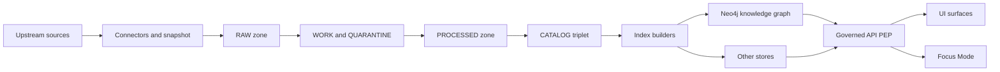

<!-- [KFM_META_BLOCK_V2]
doc_id: kfm://doc/d05dd10e-0f4d-4a02-8b5d-9acbf0fe9cf7
title: Neo4j Operations
type: standard
version: v1
status: draft
owners: [TBD]
created: 2026-03-04
updated: 2026-03-04
policy_label: restricted
related: [docs/knowledge_graph/, docs/governance/, infra/]
tags: [kfm, neo4j, operations, runbook]
notes: ["Operator runbook for Neo4j in KFM. Statements are labeled CONFIRMED/PROPOSED/UNKNOWN."]
[/KFM_META_BLOCK_V2] -->

# Neo4j Operations
Runbook for operating Neo4j as the KFM knowledge graph store (local dev → staging → prod), with governance-first defaults.

---

## Impact
- **Status:** draft
- **Owners:** TBD (suggested: Platform + Data/Graph stewards)
- **Shields:** TODO
  -   
  -   
  - 
- **Quick links:**  
  - [Conventions](#conventions) • [Where it fits](#where-it-fits) • [Deployment modes](#deployment-modes) • [Local dev quickstart](#local-dev-quickstart) • [Configuration](#configuration) • [Plugins](#plugins) • [Backup and restore](#backup-and-restore) • [Upgrades and migration](#upgrades-and-migration) • [Monitoring](#monitoring) • [Security](#security) • [Runbooks](#runbooks) • [Troubleshooting](#troubleshooting) • [Checklists](#checklists) • [References](#references)

---

## Conventions

### Evidence tags used in this document
- **CONFIRMED:** Backed by cited KFM docs and/or official Neo4j docs (see [References](#references)).
- **PROPOSED:** Recommended KFM convention / sane default; validate in your environment.
- **UNKNOWN:** Repo/environment-specific; minimal verification steps are provided.

### Placeholder syntax
- `${LIKE_THIS}` = environment variable
- `<like-this>` = value you must supply
- `kfm_*` names = examples; **do not assume** they exist in your repo unless verified.

---

## Where it fits

**CONFIRMED:** KFM enforces a “truth path / trust membrane”: clients never access storage directly; all access is policy-evaluated at the PEP (Governed API).  
**CONFIRMED:** KFM’s data lifecycle is zoned (RAW → WORK/QUARANTINE → PROCESSED → CATALOG/TRIPLET → PUBLISHED), with promotion gates at each transition.



**PROPOSED:** Treat Neo4j as a **derived index** built from PROCESSED + validated catalog artifacts (not as the source of truth).

**UNKNOWN → verify:** Exact Neo4j write path in your repo (which service runs “index builders” and how it’s triggered).
- Verification steps:
  1. Search repo for `NEO4J_URI` and `bolt://` usage.
  2. Find the “index builder” / “graph builder” job (often in `apps/`, `packages/`, or `tools/`).
  3. Confirm whether it writes directly via Neo4j driver, via a graph ingestion API, or via batch import.

---

## Deployment modes

### Supported Neo4j product lines
**CONFIRMED:** Neo4j publishes a “current” calendar version (e.g., 2026.01) and an LTS line (e.g., 5.26 LTS).  
**CONFIRMED:** Neo4j JVM requirements vary by version (notably Java 21 is required for Neo4j 2025.01+).

| Mode | When to use | Notes |
|---|---|---|
| **Docker Compose (single node)** | Local dev, CI smoke | Fastest. Keep data disposable unless explicitly persisting. |
| **Kubernetes (Neo4j Helm charts)** | Staging/prod self-host | Neo4j recommends productized Helm charts for Kubernetes. |
| **Neo4j Aura** | Managed service | Some operations (notably `neo4j-admin database backup`) are not supported. |

**UNKNOWN → verify:** Which mode KFM uses in your environment (Compose, K8s, Aura).
- Verification steps:
  - Look for `infra/` manifests, Helm values, or Compose files.
  - Check org policy: self-host vs managed.

---

## Local dev quickstart

**CONFIRMED:** Neo4j supports Docker Compose with volume mounts for `/logs`, `/config`, `/data`, `/plugins` and an auth env var `NEO4J_AUTH=neo4j/<password>`.  
**CONFIRMED:** Storing secrets inline in `docker-compose.yml` is discouraged; Docker secrets (`NEO4J_AUTH_FILE`) are a recommended alternative.

### Option A: Minimal docker-compose (dev only)

```yaml
# docker-compose.neo4j.yml
services:
  neo4j:
    image: neo4j:${NEO4J_IMAGE_TAG:-latest}
    ports:
      - "7474:7474"   # HTTP
      - "7687:7687"   # Bolt
    environment:
      - NEO4J_AUTH=neo4j/${NEO4J_PASSWORD:-change_me}
    volumes:
      - ./.neo4j/logs:/logs
      - ./.neo4j/config:/config
      - ./.neo4j/data:/data
      - ./.neo4j/plugins:/plugins
    restart: unless-stopped
```

```bash
# dev shell
export NEO4J_IMAGE_TAG="5.26"           # PROPOSED: pin in .env; choose your supported tag
export NEO4J_PASSWORD="<local-dev-only>"
docker compose -f docker-compose.neo4j.yml up -d
```

**PROPOSED:** Pin `${NEO4J_IMAGE_TAG}` to a known-good version (see [Upgrades and migration](#upgrades-and-migration)).

### Option B: Docker secrets (recommended)

```yaml
# docker-compose.neo4j.yml
services:
  neo4j:
    image: neo4j:${NEO4J_IMAGE_TAG:-latest}
    ports:
      - "7474:7474"
      - "7687:7687"
    environment:
      - NEO4J_AUTH_FILE=/run/secrets/neo4j_auth_file
    secrets:
      - neo4j_auth_file
    volumes:
      - ./.neo4j/logs:/logs
      - ./.neo4j/config:/config
      - ./.neo4j/data:/data
      - ./.neo4j/plugins:/plugins

secrets:
  neo4j_auth_file:
    file: ./secrets/neo4j_auth.txt
```

`./secrets/neo4j_auth.txt` contents:
```text
neo4j/<your_password>
```

---

## Configuration

### Environment variable mapping (Docker)
**CONFIRMED:** Neo4j config settings can be passed to Docker by prefixing with `NEO4J_`, converting `.` → `_`, and converting `_` → `__`.  
Example: `browser.post_connect_cmd` → `NEO4J_browser_post__connect__cmd`.

### Ports
**CONFIRMED:** Common ports include:
- 7474 (HTTP), 7473 (HTTPS), 7687 (Bolt)
- 6362 (Backup), 2004 (Prometheus metrics), 3637 (JMX) in some deployments

**PROPOSED:** In prod, **do not** expose Neo4j ports publicly; only allow access from:
- Governed API service(s)
- Admin bastion / VPN
- Monitoring stack (if needed)

### Memory
**CONFIRMED:** Neo4j memory is typically managed across:
- JVM heap (`server.memory.heap.initial_size`, `server.memory.heap.max_size`)
- Page cache (`server.memory.pagecache.size`)
- OS overhead (important for performance; avoid swapping)
- Vector index memory uses OS memory (not page cache)

**PROPOSED:** For stable behavior, set heap + page cache explicitly (don’t rely on heuristics).

Example (Docker env vars):
```yaml
environment:
  - NEO4J_server_memory_heap_initial__size=2G
  - NEO4J_server_memory_heap_max__size=2G
  - NEO4J_server_memory_pagecache_size=2G
```

**CONFIRMED:** You can get an initial recommendation using:
```bash
bin/neo4j-admin server memory-recommendation
```

### Multi-database basics
**CONFIRMED:** Admin operations like restore commonly require creating a database via `CREATE DATABASE ...` against the `system` database.

**UNKNOWN → verify:** Which databases KFM uses (default `neo4j`, or named DBs like `kfm`, `catalog`, etc.).
- Verification steps:
  - Run `SHOW DATABASES;` in `cypher-shell` (in non-prod first).
  - Check app config for a DB name parameter (often `NEO4J_DATABASE`).

---

## Plugins

### Dev-time plugins
**CONFIRMED:** Neo4j Docker supports `NEO4J_PLUGINS` for automatically downloading/configuring certain plugins at startup.  
**CONFIRMED:** This is intended to facilitate development, and is **not recommended for production**.

Example (dev only):
```yaml
environment:
  - NEO4J_PLUGINS='["apoc"]'
```

### Production plugin strategy
**CONFIRMED:** For Kubernetes, Neo4j recommends adding plugins by building a custom container image that contains Neo4j + plugin artifacts.

**PROPOSED:** Treat plugin versions as **pinned, coupled dependencies**:
- Neo4j version
- APOC version
- GDS version (if used)
- Driver version in the API

**UNKNOWN → verify:** Whether KFM requires APOC and/or GDS in production.
- Verification steps:
  - Search codebase for `CALL apoc.` / `CALL gds.` usage.
  - Search runtime configs for procedure allowlists/unrestricted patterns.

---

## Backup and restore

### Planning
**CONFIRMED:** Back up each database, including the `system` database.  
**PROPOSED:** Define RPO/RTO targets per environment (dev vs staging vs prod) and test restores on a schedule.

### Online backup (Neo4j Enterprise)
**CONFIRMED:** Online backup uses `neo4j-admin database backup` and produces immutable backup artifact files (full + differential chains).  
**CONFIRMED:** `neo4j-admin database backup` is **not supported in Neo4j Aura**.

Example (backup client):
```bash
neo4j-admin database backup --from=<host:6362> --to-path=/backups neo4j
```

### Restore online backup artifacts
**CONFIRMED:** Restore supports inspecting backup artifacts and restoring from the last artifact in a chain.

```bash
# inspect
bin/neo4j-admin database backup --inspect-path=/path/to/mybackups

# restore into a new database name
bin/neo4j-admin database restore --from-path=/path/to/mybackups/<last>.backup mydatabase
```

Then:
```cypher
-- run against system database
CREATE DATABASE mydatabase;
```

### Offline backup (dump)
**CONFIRMED:** Offline backup uses `neo4j-admin database dump` to create `<database>.dump`.  
**CONFIRMED:** Target directory must never be world-readable or world-executable.  
**CONFIRMED:** `database dump` does not back up users/roles metadata.

```bash
# database must be offline
bin/neo4j-admin database dump neo4j --to-path=/full/path/to/dumps
```

**PROPOSED:** Use offline dump for deterministic “snapshotting” in CI (when acceptable to stop the DB), and online backups for prod continuity.

### KFM-specific backup guidance
**PROPOSED:** Because KFM citations can map to Neo4j node IDs, treat **published** graph data as versioned/append-only; avoid destructive changes without a migration plan.

**UNKNOWN → verify:** Whether KFM persists AI answer provenance nodes in Neo4j (and whether those require backup/restore inclusion).
- Verification steps:
  - Search graph model for `Answer`, `Provenance`, or PROV-O node labels.
  - Confirm backup scope includes any provenance DBs.

---

## Upgrades and migration

### Version and JVM policy
**CONFIRMED:** Neo4j 2025.01 requires Java 21; Neo4j 5.26 LTS supports Java 17 and Java 21.

**CONFIRMED:** In Neo4j 2025.01, cluster discovery service v1 is removed; transition to discovery v2 is required before upgrading to 2025–2026 versions.

### Config migration
**CONFIRMED:** Neo4j provides `migrate-configuration` to migrate legacy config files to the current format.

**PROPOSED upgrade order (risk-reducing)**
1. **Drivers first** (API)  
2. **Plugins next** (APOC/GDS)  
3. **Neo4j server last**  
4. Validate: schema, constraints/indexes, critical queries, backup/restore, and governance gates

**UNKNOWN → verify:** Your current Neo4j version + plugin set + driver versions.
- Verification steps:
  - Neo4j: `neo4j --version` (or image tag)
  - APOC/GDS: `RETURN apoc.version()` / `RETURN gds.version()` (if installed)
  - Drivers: inspect lockfiles / dependencies

---

## Monitoring

### Metrics endpoints
**CONFIRMED:** Prometheus endpoint is enabled via `server.metrics.prometheus.enabled=true` (Enterprise Edition) and defaults to `localhost:2004` if not configured.  
**CONFIRMED:** Port tables in Neo4j docs list Prometheus metrics on 2004.

**PROPOSED:** In prod:
- Bind metrics to an internal network/interface
- Scrape via Prometheus
- Alert on:
  - DB availability
  - page cache hit ratio / page faults (if collecting)
  - heap pressure / GC pauses
  - query latency and error rate
  - disk free space in `data/` volume

### Logs
**PROPOSED:** Ship logs to centralized storage (Loki/ELK). Keep security logs per governance needs.

**UNKNOWN → verify:** Where your deployment stores logs (volume mounts vs Kubernetes PVC vs cloud logging).
- Verification steps:
  - Docker: check mounted `/logs`
  - K8s: check log sidecars / stdout aggregation
  - Aura: use Aura console tools

---

## Security

### KFM governance posture
**CONFIRMED:** KFM is “default deny / fail closed” and blocks uncited factual assertions in Focus Mode via governance checks.  
**CONFIRMED:** KFM expects citations to map to Neo4j node IDs / dataset IDs / document refs.

**CONFIRMED:** Trust membrane: clients never access storage directly; all access is policy-evaluated at the PEP.

### Neo4j access model
**PROPOSED:**
- Only the Governed API service account connects to Neo4j over Bolt.
- Human access is limited to break-glass admin roles and audited.
- Use least privilege roles and explicit grants.
- Disable or tightly control procedures:
  - Prefer allowlists; avoid unrestricted patterns unless required.
- Use TLS for Bolt/HTTPS when leaving localhost.

### Secret handling
**CONFIRMED:** Prefer Docker secrets (`NEO4J_AUTH_FILE`) over inline passwords in Compose.

---

## Runbooks

### Start / stop (Docker)
**PROPOSED:**
```bash
docker compose -f docker-compose.neo4j.yml up -d
docker compose -f docker-compose.neo4j.yml logs -f neo4j
docker compose -f docker-compose.neo4j.yml down
```

### Health checks
**PROPOSED:**
- HTTP: `http://<host>:7474`
- Bolt: test via `cypher-shell`

Example:
```bash
cypher-shell -a bolt://localhost:7687 -u neo4j -p "$NEO4J_PASSWORD" "SHOW DATABASES;"
```

### Restore drill (staging)
**PROPOSED (minimum):**
- Monthly restore test from the latest backup artifact
- Validate:
  - DB starts
  - constraints/indexes present
  - top N critical queries succeed
  - API can serve governed requests
  - evidence resolver and citation linking still works

---

## Troubleshooting

### Common issues
- **UNKNOWN:** “Bolt connection refused”
  - Verify container running, port mapping, firewall rules.
- **UNKNOWN:** Auth failures
  - Verify `NEO4J_AUTH` / `NEO4J_AUTH_FILE`, reset password per Ops Manual.
- **UNKNOWN:** OutOfMemory / GC pressure
  - Tune heap/page cache; confirm swap behavior; check query shapes.
- **UNKNOWN:** Slow vector search
  - Ensure sufficient OS memory reserved for vector index; validate index config.

**PROPOSED:** Always capture:
- Neo4j version, edition
- JVM version
- container tag digest (or image digest)
- config diff (neo4j.conf or env vars)
- recent schema migrations
- top slow queries + plans

---

## Checklists

### Production readiness gates (Neo4j)
- [ ] **CONFIRMED:** No direct UI access to Neo4j; only through Governed API (trust membrane)
- [ ] **PROPOSED:** Version pinning: Neo4j + drivers + plugins are pinned and documented
- [ ] **CONFIRMED:** Secrets not embedded in Compose; use secrets/secret manager
- [ ] **CONFIRMED:** Backups include `system` database (plus all application DBs)
- [ ] **PROPOSED:** Restore drill completed successfully within target RTO
- [ ] **PROPOSED:** Monitoring/alerts configured (availability, memory, disk, latency)
- [ ] **PROPOSED:** Procedure allowlist reviewed; no unnecessary unrestricted procedures
- [ ] **PROPOSED:** Policy tests pass for protected datasets; “default deny” validated end-to-end

### Verification steps for UNKNOWN items
- [ ] Locate actual deployment manifests (`infra/`, Helm, Compose)
- [ ] Confirm DB names used by KFM (config + `SHOW DATABASES`)
- [ ] Identify graph write path (index builder job) and enforce gating
- [ ] Confirm whether provenance/AI answer nodes are stored in Neo4j and how they’re versioned

---

## References

### KFM internal docs (authoritative for KFM policy intent)
- Tooling the KFM pipeline (truth path, trust membrane, promotion contract)
- KFM Prime Document (Neo4j + API + OPA integration intent)
- KFM AI Infrastructure – Ollama Integration Overview (No Source, No Answer; citation mapping)

### Neo4j official docs (authoritative for Neo4j operations)
- Operations Manual → Docker Compose standalone
- Operations Manual → Docker config settings env mapping
- Operations Manual → Backup/restore (online + offline)
- Operations Manual → System requirements (Java)
- Operations Manual → Memory configuration
- Operations Manual → Breaking changes (2025.01)
- Upgrade & Migration Guide → 5.26 LTS → 2025.01+

> NOTE: This file intentionally avoids asserting repo-specific paths or service names unless verified in the live repo.
