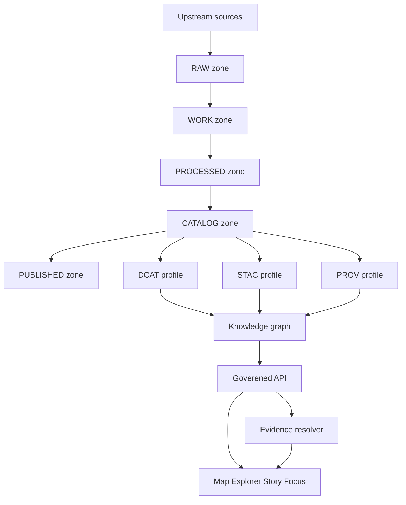

<!-- [KFM_META_BLOCK_V2]
doc_id: kfm://doc/5f6d9e7b-0f5a-4f44-8fe7-7b5aa8b48d19
title: Ontology and Controlled Vocabularies
type: standard
version: v1
status: draft
owners: KFM Knowledge Graph + Governance
created: 2026-03-04
updated: 2026-03-04
policy_label: public
related: [
  docs/knowledge_graph/README.md,
  docs/standards/governance/ROOT_GOVERNANCE_CHARTER.md,
  contracts/openapi/kfm-api-v1.yaml,
  policy/rego,
  contracts/schemas/evidence_bundle_v1.schema.json
]
tags: [kfm, knowledge-graph, ontology, vocabulary, governance]
notes: [
  "Defines KFM KG ontology alignment strategy and versioned controlled vocabularies.",
  "Every meaningful claim is tagged CONFIRMED / PROPOSED / UNKNOWN."
]
[/KFM_META_BLOCK_V2] -->

# Ontology and Controlled Vocabularies
Define how KFM names, types, and links entities across catalogs (DCAT/STAC/PROV), the knowledge graph, and governed APIs.

---

## IMPACT
- **Status:** Experimental (stabilizing toward “Active”)
- **Owners:** KFM Knowledge Graph + Governance
- **Badges (TODO wire to real targets):**  
    
    
    
  

**Quick nav:**  
- [Scope](#scope) · [Where it fits](#where-it-fits) · [Truth labels](#truth-labels) · [Ontology stack](#ontology-stack) ·
  [Prefixes](#prefix-registry) · [Core classes](#core-class-registry) · [Core properties](#core-property-and-relationship-registry) ·
  [Controlled vocabs](#controlled-vocabularies) · [Extension workflow](#extension-workflow) · [Gates](#gates-and-definition-of-done) ·
  [Appendix](#appendix)

---

## Scope
**PROPOSED:** This document is the *semantic contract* for:
- the **knowledge graph** (Neo4j property graph + optional RDF export)
- **contract surfaces** (DCAT/STAC/PROV profiles) used by pipelines and runtime
- **controlled vocabularies** used in policy, catalogs, evidence bundles, and UI badges

**EXCLUDES (do not put here):**
- dataset-specific IDs, dataset release manifests, or per-source mapping playbooks (belongs in dataset registry / source registry)
- raw data schemas for domain tables (belongs in `contracts/schemas/*` and domain docs)
- policy rules (belongs in `policy/rego/*`), except vocabulary values referenced by policy

---

## Where it fits
**CONFIRMED:** KFM treats catalogs (DCAT/STAC/PROV) as contract surfaces and the canonical interface between pipeline outputs and runtime behavior.  
**PROPOSED:** This file documents the ontology/vocab conventions that those contract surfaces must align to.

**Upstream inputs:**
- pipeline outputs and catalogs (DCAT/STAC/PROV)
- policy labels and obligations emitted by policy decision points
- evidence resolver bundle shapes and identifiers

**Downstream consumers:**
- governed API DTOs (discovery, query, evidence resolve, story publish, focus mode)
- UI (Map Explorer evidence drawer, Story Nodes, Focus Mode)
- graph retrieval and lineage queries

---

## Truth labels
To meet **CITE-OR-ABSTAIN**, each meaningful statement is tagged:

- **CONFIRMED**: directly supported by KFM docs cited in `NOTES & CITATIONS`.
- **PROPOSED**: recommended practice/design but not yet locked as a governance decision.
- **UNKNOWN**: decision needed or not yet evidenced; includes smallest verification steps.

---

## Evidence anchors used in this doc
Use these short IDs throughout:

- **[S1]** KFM vNext “Source Snapshots Bundle” (includes policy + OpenAPI fragments + controlled vocab starters + evidence bundle templates)
- **[S2]** “Tooling the KFM pipeline” (evidence resolver contract and UI trust surfaces)
- **[S3]** “New Ideas 6” (CIDOC-CRM + GeoSPARQL + OWL-Time usage for hazard/event KG nodes)
- **[S4]** Projection / CRS references (background for CRS metadata requirements)
- **[S5]** “New Ideas 4” (ontology protocol versioning: KFM-ONT v11, and standards-aligned outputs)

---

## Ontology stack
**CONFIRMED:** KFM relies on the catalog triplet responsibilities:
- DCAT for dataset identity, publisher, license, distributions
- STAC for spatiotemporal extents and asset hrefs
- PROV for lineage (inputs, tools, parameters)  
(See [S1].)

**PROPOSED:** The knowledge graph ontology is layered:

1) **External standards layer (preferred when available)**
- **PROV-O**: provenance entities/activities/agents  
- **DCAT**: datasets/distributions/themes  
- **GeoSPARQL**: geospatial features/geometries  
- **OWL-Time**: temporal instants/intervals  
- **CIDOC-CRM**: historical/heritage event and place semantics (especially archaeology & hazards)

2) **KFM core layer (`kfm:`)**
- stable IDs, versioning, promotion zones, policy labels, evidence bundles, audit references

3) **Domain modules**
- hazards/events, hydrology, archaeology, land, etc.
- domain modules MUST NOT redefine core fields (policy_label, dataset_version_id, spec_hash, digests)

---

## Prefix registry
**PROPOSED:** Prefixes used in documentation, SHACL, and optional RDF exports.

| Prefix | Namespace (string) | Primary use |
|---|---|---|
| `kfm:` | `kfm://schema/` | KFM core classes/properties |
| `prov:` | `http://www.w3.org/ns/prov#` | provenance model |
| `dcat:` | `http://www.w3.org/ns/dcat#` | dataset + distributions |
| `dct:` | `http://purl.org/dc/terms/` | title/description/coverage/license |
| `geo:` | `http://www.opengis.net/ont/geosparql#` | geospatial features/geometries |
| `time:` | `http://www.w3.org/2006/time#` | time instants/intervals |
| `crm:` | `http://www.cidoc-crm.org/cidoc-crm/` | cultural heritage events/places |
| `schema:` | `https://schema.org/` | people/orgs/places for UI display |

**UNKNOWN:** Whether KFM will maintain an official RDF namespace and published TTL/JSON-LD artifacts.  
Smallest verification steps:
1) Decide “RDF export” requirement in governance charter.
2) If yes, reserve a stable HTTPS namespace (preferred) or formalize `kfm://schema/` resolution.

---

## Core class registry
**CONFIRMED:** Evidence and policy artifacts are first-class contract objects (EvidenceBundle, policy_label, obligations).  
**PROPOSED:** Model them in the KG with these classes.

| KFM class | Description | Aligns to | Notes |
|---|---|---|---|
| `kfm:Dataset` | logical dataset across versions | `dcat:Dataset` | stable dataset identity |
| `kfm:DatasetVersion` | immutable versioned release | `prov:Entity` | identified by `dataset_version_id`; hashed by `spec_hash` |
| `kfm:Artifact` | a concrete file/asset | `dcat:Distribution` + STAC asset | must carry `digest`, `media_type`, `zone` |
| `kfm:CatalogTriplet` | DCAT/STAC/PROV bundle | `prov:Collection` | cross-link checks are gateable |
| `kfm:EvidenceRef` | resolvable citation reference | `prov:Entity` (ref) | resolves to EvidenceBundle |
| `kfm:EvidenceBundle` | resolved evidence package | `prov:Collection` | includes policy decision + artifacts + digests |
| `kfm:PolicyDecision` | allow/deny + obligations | (policy-as-code) | referenced by `audit_ref`/decision IDs |
| `kfm:StoryNode` | narrative node with citations + map state | `schema:CreativeWork` | publishing requires resolvable citations |
| `kfm:RunReceipt` | governed run receipt | `prov:Activity` | used for auditability + determinism |
| `kfm:Place` | geographic place reference | `crm:E53_Place` + `geo:Feature` | used for archaeology & hazards |
| `kfm:Event` | event occurrence | `crm:E5_Event` (or domain event class) | hazards pipeline maps events into KG nodes |
| `kfm:TimeSpan` | time interval/coverage | `crm:E52_Time-Span` + `time:Interval` | for temporal reasoning |

---

## Core property and relationship registry
### Identity, versioning, and integrity
**CONFIRMED:** Dataset version identity is tied to deterministic spec hashing, and promotion manifests include digests.  
**PROPOSED:** Standardize these properties:

| Property | Applies to | Type | Meaning |
|---|---|---|---|
| `kfm:dataset_id` | Dataset | string | stable dataset logical id/slug |
| `kfm:dataset_version_id` | DatasetVersion, catalogs, evidence cards | string | immutable version id |
| `kfm:spec_hash` | DatasetVersion | string | deterministic hash of spec |
| `kfm:digest` | Artifact, catalogs, evidence bundle | string | content digest (e.g., `sha256:...`) |
| `kfm:zone` | Artifact | enum | lifecycle zone: raw/work/processed/catalog/published |
| `kfm:released_at` | DatasetVersion | datetime | release timestamp |
| `kfm:run_id` | RunReceipt, provenance | string | governed run identifier |
| `kfm:audit_ref` | EvidenceBundle, API errors, story publish | string | pointer to audit ledger entry |

### Catalog cross-linking
**CONFIRMED:** DCAT/STAC/PROV should cross-link and be strictly validated under a KFM profile.  
**PROPOSED:** Minimal relationships:

- `kfm:DatasetVersion` **HAS_CATALOG** `kfm:CatalogTriplet`
- `kfm:CatalogTriplet` **HAS_DCAT** `dcat:Dataset` record
- `kfm:CatalogTriplet` **HAS_STAC** STAC Collection/Item
- `kfm:CatalogTriplet` **HAS_PROV** PROV bundle
- `kfm:DatasetVersion` **PRODUCED_BY** `kfm:RunReceipt`

### Evidence resolution
**CONFIRMED:** A “citation” is an **EvidenceRef** resolved by the evidence resolver into an **EvidenceBundle**; story/focus gates require resolvable and policy-allowed citations.  
**PROPOSED:** Graph relationships:

- `kfm:Claim` **SUPPORTED_BY** `kfm:EvidenceRef`
- `kfm:EvidenceRef` **RESOLVES_TO** `kfm:EvidenceBundle`
- `kfm:EvidenceBundle` **HAS_ARTIFACT** `kfm:Artifact`
- `kfm:EvidenceBundle` **POLICY_DECIDED_BY** `kfm:PolicyDecision`

### Policy and obligations
**CONFIRMED:** Policy decisions and obligations must be consistent between CI and runtime, with UI showing badges/notices but not making decisions.  
**PROPOSED:** Represent obligations as structured nodes or JSON properties:
- `kfm:obligation.type` (e.g., `show_notice`, `generalize_geometry`, `mask_attribute`)
- `kfm:obligation.message` (human notice)
- `kfm:obligation.applied_by_run_id`

---

## Temporal model
**CONFIRMED:** KFM is time-aware and supports governed run receipts and provenance.  
**PROPOSED:** Adopt a **tri-time** pattern where relevant:
- **Event time** (when it happened): `time:hasTime` / CIDOC time-span
- **Valid time** (when a fact is true in the modeled world): `kfm:valid_from`, `kfm:valid_to`
- **Transaction time** (when KFM recorded/published it): `kfm:recorded_at`, `kfm:published_at`

**UNKNOWN:** Whether tri-time is mandatory for all entities or only for select domains (hazards/hydrology).  
Smallest verification steps:
1) Decide query requirements for “as-known-at” vs “as-of-valid-time” in Focus Mode.
2) If required, formalize tri-time fields in `contracts/schemas/*` and SHACL.

---

## Geospatial model
**CONFIRMED (background):** Projections/CRS introduce distortion tradeoffs; reprojecting requires explicit CRS metadata to be correct and reproducible.  
**PROPOSED:** Every geometry-carrying artifact/feature MUST include:
- `kfm:crs` (EPSG code or WKT/projjson reference)
- `kfm:crs_authority` (EPSG/ESRI/etc)
- `kfm:extent_bbox` + `kfm:extent_time` (mirrors STAC extent expectations)

**CONFIRMED:** KFM pipelines reference CRS standards and record reprojection steps in provenance.  
**PROPOSED:** Model:
- Places as `geo:Feature` (or property graph node) with a geometry (WKT/GeoJSON) + CRS metadata
- Raster assets as artifacts with STAC projection extension metadata (where available)

---

## Controlled vocabularies
**CONFIRMED:** Vocabularies MUST be versioned and maintained; starter lists exist for `policy_label`, `artifact.zone`, `citation.kind`.  
This section defines how vocabularies are represented and extended.

### Vocabulary format
**PROPOSED:** Store controlled lists as versioned files (YAML or JSON) that can be validated in CI:
- `docs/knowledge_graph/vocab/*.yml` (human-editable)
- optional generated artifacts: `contracts/vocab/*.json` for tooling consumption

### policy_label
**CONFIRMED:** Starter values (vocab must be versioned and maintained):
- `public`
- `public_generalized`
- `restricted`
- `restricted_sensitive_location`
- `internal`
- `embargoed`
- `quarantine`

### artifact.zone
**CONFIRMED:** Lifecycle zones:
- `raw`
- `work`
- `processed`
- `catalog`
- `published`

### citation.kind
**CONFIRMED:** Citation kinds:
- `dcat`
- `stac`
- `prov`
- `doc`
- `graph`
- `url` (discouraged)

### Additional KFM vocabs
**PROPOSED:** Add these lists once tooling exists:
- `review.state`: `draft`, `review`, `published`, `retracted`, `superseded`
- `sensitivity.profile`: `public_default`, `generalized_default`, `restricted_default`
- `obligation.type`: `show_notice`, `generalize_geometry`, `thin_locations`, `coarsen_time`, `mask_attributes`
- `role`: `public`, `contributor`, `steward`, `operator`

**UNKNOWN:** Exact role list and whether ABAC attributes are required beyond RBAC + policy labels.  
Smallest verification steps:
1) Decide identity provider (OIDC) and role taxonomy.
2) Confirm whether partner datasets require ABAC.

---

## Proposed directory tree
**PROPOSED:** Keep ontology docs + vocab files close to the KG docs.

```text
docs/knowledge_graph/
  ONTOLOGY_AND_VOCAB.md
  vocab/
    policy_label.yml
    artifact_zone.yml
    citation_kind.yml
    obligation_type.yml
  mappings/
    neo4j_label_map.md
    rdf_prefixes.md
```

---

## Extension workflow
**CONFIRMED:** Policy and contract semantics must match in CI and runtime; policy tests block merges.  
**PROPOSED:** Ontology/vocab changes follow the same discipline.

### Adding a new vocabulary term
1) **PROPOSED:** Add term to the relevant `docs/knowledge_graph/vocab/*.yml`
2) **PROPOSED:** Add/adjust validators so term is enforced where used (catalog validator, policy fixtures, schema enums)
3) **PROPOSED:** Add at least one fixture exercising the new term (allow/deny and obligation behavior if applicable)
4) **PROPOSED:** Update this doc (registry table + rationale)

### Adding a new class/property
**PROPOSED:** Require:
- a mapping to external standards (if applicable)
- a usage example (where it appears in DCAT/STAC/PROV or EvidenceBundle)
- a rollback note (how to deprecate)

---

## Gates and Definition of Done
**CONFIRMED:** CI must block merges if policy tests fail; controlled vocab validation is explicitly planned as a work package.  
Use this checklist when changing ontology/vocab:

- [ ] **Vocabulary versioned** and updated in `docs/knowledge_graph/vocab/*`
- [ ] **Validation exists** (schema enum, validator rule, or conftest check)
- [ ] **Policy fixtures updated** if term affects access/obligations
- [ ] **Evidence resolver / API contract unaffected** (or updated with version bump)
- [ ] **Docs updated** (this file + any dependent docs)
- [ ] **No sensitive leakage risk** introduced by new terms (especially location/time precision)
- [ ] **Rollback path** documented (deprecate term, support aliasing, migration plan)

---

## Appendix
<details>
<summary>Example vocabulary file (YAML)</summary>

```yaml
# docs/knowledge_graph/vocab/policy_label.yml
version: v1
terms:
  - public
  - public_generalized
  - restricted
  - restricted_sensitive_location
  - internal
  - embargoed
  - quarantine
```
</details>

<details>
<summary>Example: EvidenceBundle shape (conceptual)</summary>

> NOTE: The authoritative shape is the OpenAPI/JSON Schema contract; this is only a *reading aid*.

```json
{
  "bundle_id": "sha256:bundle...",
  "digest": "sha256:bundle...",
  "policy": {
    "decision": "allow",
    "policy_label": "public",
    "obligations": []
  },
  "cards": [
    {
      "title": "Storm event record: 2026-02-19",
      "dataset_version_id": "2026-02.abcd1234",
      "license": "CC-BY-4.0",
      "artifacts": [
        {"href": "processed/events.parquet", "digest": "sha256:2222"}
      ]
    }
  ]
}
```
</details>

<details>
<summary>Mermaid: KFM truth path → catalogs → KG → governed API</summary>


</details>

---

### Back to top
[Back to top](#ontology-and-controlled-vocabularies)
