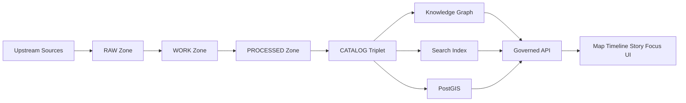

<!-- [KFM_META_BLOCK_V2]
doc_id: kfm://doc/6e6df1e2-0d85-4c16-a4b0-4d4bdaf7fe8a
title: Knowledge Graph Docs
type: standard
version: v1
status: draft
owners: kfm-graph-working-group
created: 2026-03-04
updated: 2026-03-05
policy_label: restricted
related: [docs/knowledge_graph/README.md]
tags: [kfm, knowledge-graph, neo4j, provenance, policy]
notes: [Directory README for Knowledge Graph documentation; align with truth-path and trust-membrane invariants.]
[/KFM_META_BLOCK_V2] -->

# Knowledge Graph
One place for **how the KFM knowledge graph works**: modeling, ingestion, querying, governance, and operational safety.

---

## Impact
**Status:** draft · experimental (CONFIRMED: draft; PROPOSED: “experimental” until steward sign-off)  
**Owners:** `kfm-graph-working-group` (CONFIRMED by MetaBlock; UNKNOWN: GitHub handle/CODEOWNERS mapping)  
**Policy label:** restricted (CONFIRMED by MetaBlock; UNKNOWN: confirm with governance registry)  
**Last updated:** 2026-03-05

Badges (TODO)
- 
- 
- 
- 

Quick links: [Scope](#scope) · [Where it fits](#where-it-fits-in-kfm) · [Directory tree](#directory-tree) · [Quickstart](#quickstart-local-dev) · [Modeling](#modeling-and-ontology) · [Queries](#query-patterns) · [Governance](#governance-and-policy) · [Gates](#gates-definition-of-done) · [Verification checklist](#verification-checklist) · [FAQ](#faq)

---

## Scope

Status vocabulary used here:
- **CONFIRMED:** Supported by KFM design/contract docs or repo-verified artifacts.
- **PROPOSED:** Target direction; safe to discuss as intent, not as deployed reality.
- **UNKNOWN:** Not verified; list the smallest steps to make it CONFIRMED.

What this directory is for:
- **CONFIRMED:** Documentation for the KFM **knowledge graph projection**: relationship modeling, evidence linking, query patterns, and safe operations.
- **CONFIRMED:** The graph is a **rebuildable projection** (query-optimized), not the canonical source-of-truth. Canonical truth surfaces are the artifact zones + catalogs + provenance; runtime indexes (including graph) can be rebuilt.  
- **CONFIRMED:** The graph is used to support relationship-first questions (entity resolution + traversal) while remaining evidence-linked.

What this directory is not for:
- **CONFIRMED:** Not a place to store raw data, sensitive exports, or operational secrets.
- **CONFIRMED:** Not a place to document client-side direct access to storage (that is prohibited by the trust membrane).

Repo reality guardrail:
- **CONFIRMED:** Do **not** claim specific modules/subdirectories exist unless verified in the live repo (commit hash + tree). When unsure, mark **UNKNOWN** and add a verification step.

If you are looking for:
- ingestion connectors and truth-path zone rules → **PROPOSED**: start at `data/`, `packages/`, and `docs/` (exact subpaths UNKNOWN)
- governed API contracts and schemas → **PROPOSED**: `contracts/` (exact files UNKNOWN)
- policy-as-code and tests → **PROPOSED**: `policy/` (exact files UNKNOWN)
- UI behavior and Focus Mode → **PROPOSED**: `apps/` + `docs/` (exact paths UNKNOWN)

---

## Where it fits in KFM

### Core invariants
- **CONFIRMED:** Clients (UI/external) must never access storage directly; access crosses the governed API boundary where policy is enforced (trust membrane).
- **CONFIRMED:** The truth path is a gated lifecycle: **Upstream → RAW → WORK/QUARANTINE → PROCESSED → CATALOG/TRIPLET → PUBLISHED**.
- **CONFIRMED:** Evidence resolution is mandatory: user-facing claims must be citeable back to resolvable EvidenceRefs/EvidenceBundles; if not, the system must abstain or reduce scope.

### System boundary
In one sentence:
- **CONFIRMED:** The knowledge graph is a **governed, query-optimized relationship projection** linking datasets, evidence, places, events, and stories—while every user-facing claim remains traceable to immutable evidence.

### Upstream and downstream connections
- **CONFIRMED:** Upstream inputs are promoted artifacts + catalogs (DCAT/STAC/PROV) + run receipts; the graph is built from these, not from ad-hoc manual loads.
- **CONFIRMED:** Downstream consumers are the governed API and higher-level products (Map/Story/Focus UI) that must show evidence and provenance.

---

## Acceptable inputs

Put **documentation artifacts** here that help engineers and reviewers understand and safely operate the graph.

### Acceptable
- **CONFIRMED:** Modeling/ontology docs: entity types, relationship types, constraints/indexing principles, time modeling.
- **CONFIRMED:** Ingestion mappings: “how a dataset becomes nodes/edges,” including provenance + policy label propagation rules.
- **CONFIRMED:** Query patterns: canonical Cypher (or equivalent) for common retrieval tasks, with expected output shape.
- **CONFIRMED:** Ops runbooks: local dev, migrations, backup/restore, deterministic rebuild procedures.
- **PROPOSED:** Security/RBAC docs for graph access (roles, least privilege, audit events), owned by governance.

### Required doc qualities
- **CONFIRMED:** Chunkable sections, definition-first vocabulary, runnable examples (or clearly labeled **PSEUDOCODE**), and explicit version tags when behavior drifts over time.

---

## Exclusions

Do **not** put these here.

- **CONFIRMED:** No secrets: passwords, tokens, private keys, connection strings.
- **CONFIRMED:** No raw datasets or large generated artifacts (those belong in the data zones).
- **CONFIRMED:** No direct-to-client DB access guidance (UI must not bypass governed APIs).
- **CONFIRMED:** No sensitive coordinates or vulnerable-site location disclosures unless policy allows *and* masking rules are documented + enforced.
- **UNKNOWN:** The authoritative policy-label taxonomy and masking thresholds (link the policy registry once verified).

---

## Directory tree

> **PROPOSED**. Keep this accurate—docs are a production surface.  
> **UNKNOWN:** Update to match the live repo tree for `docs/knowledge_graph/`.

```text
docs/knowledge_graph/
├── README.md
├── modeling/
│   ├── concepts.md                 # Definitions: node, edge, constraint, evidence, story
│   ├── entity_registry.md          # Canonical entity/relationship registry
│   ├── time_model.md               # Event time vs valid time vs transaction time
│   └── id_policy.md                # Deterministic IDs, hashing strategy, namespace rules
├── ontology/
│   ├── overview.md                 # Ontologies in use and how we apply them
│   └── mappings/                   # Dataset→ontology mapping notes (small, auditable)
├── ingestion/
│   ├── ingestion_contract.md       # Required provenance fields, receipts, gates
│   ├── examples/                   # Minimal examples (tiny graphs) for tests
│   └── troubleshooting.md
├── query/
│   ├── common_queries.cypher       # Canonical, copy/paste queries
│   ├── performance.md              # Indexing + profiling checklist
│   └── patterns.md                 # Templates and gotchas
├── ops/
│   ├── local_dev.md                # Docker/dev instructions
│   ├── migrations.md               # Schema changes + rollback guidance
│   ├── backup_restore.md
│   └── invariants.md               # Graph “invariants” to validate rebuilds/upgrades
└── adr/
    └── ADR-0001-graph-db-choice.md # Decision records (why this DB, why this model)
```

---

## Quickstart: local dev

> **PROPOSED.** Replace with repo-standard compose scripts if they exist.

### Option A: Docker (single-node graph DB)
- **PROPOSED:** Neo4j is the documented target graph database; verify current version pin in `infra/` before standardizing.

```bash
# Choose a pinned image tag (avoid `latest`).
export KFM_NEO4J_IMAGE="neo4j:5.26"

# Choose a local dev password (do not commit it).
export NEO4J_PASSWORD="change-me"

docker run --rm \
  --name kfm-neo4j \
  -p 7474:7474 -p 7687:7687 \
  -e NEO4J_AUTH="neo4j/${NEO4J_PASSWORD}" \
  "${KFM_NEO4J_IMAGE}"
```

Open Neo4j Browser:
- http://localhost:7474

### Option B: Use repo-compose (preferred)
```bash
# PSEUDOCODE — replace with actual commands once verified:
# docker compose -f infra/dev/docker-compose.yml up -d neo4j
```

### Sanity check
```cypher
// Verify you can connect and run a trivial query
RETURN datetime() AS now;
```

---

## Usage

## Modeling and ontology

### Core modeling principles
- **CONFIRMED:** Any node/edge that can influence user-facing output must link (directly or indirectly) to evidence that can be resolved by the evidence resolver.
- **CONFIRMED:** IDs should be deterministic and stable across rebuilds.
- **CONFIRMED:** The graph should be rebuildable from promoted artifacts + catalogs + receipts.
- **PROPOSED:** Prefer explicit event nodes for time-bound facts; attach time semantics explicitly (avoid ambiguous timestamps).
- **UNKNOWN:** The authoritative node-label / relationship-type naming conventions for this repo.

### Minimal example model
> **PROPOSED** labels/rel types—align to the actual registry once verified.

- Nodes: `Dataset`, `DatasetVersion`, `EvidenceRef`, `StoryNode`, `Place`, `Event`, `RunReceipt`
- Relationships:
  - `DatasetVersion -[:HAS_EVIDENCE]-> EvidenceRef`
  - `StoryNode -[:SUPPORTED_BY]-> EvidenceRef`
  - `Event -[:LOCATED_AT]-> Place`
  - `Event -[:DERIVED_FROM]-> DatasetVersion`
  - `DatasetVersion -[:HAS_RECEIPT]-> RunReceipt`

### Constraints and indexes
> **PROPOSED**. Adjust to match the ID policy and query patterns you support.

```cypher
// Unique IDs
CREATE CONSTRAINT dataset_id IF NOT EXISTS
FOR (d:Dataset) REQUIRE d.id IS UNIQUE;

CREATE CONSTRAINT dataset_version_id IF NOT EXISTS
FOR (dv:DatasetVersion) REQUIRE dv.id IS UNIQUE;

CREATE CONSTRAINT evidence_ref_id IF NOT EXISTS
FOR (e:EvidenceRef) REQUIRE e.id IS UNIQUE;

// Common lookup indexes
CREATE INDEX event_time IF NOT EXISTS
FOR (ev:Event) ON (ev.event_time);
```

---

## Query patterns

> Keep queries **copy/paste-ready** and show expected output shape.

### 1) Show evidence for a Story Node
- **CONFIRMED intent:** Evidence must resolve; the resolver/API is responsible for policy filtering.
- **PROPOSED query shape:** Depends on the registry.

```cypher
MATCH (s:StoryNode {id: $story_id})-[:SUPPORTED_BY]->(e:EvidenceRef)
RETURN
  s.id AS story_id,
  e.id AS evidence_id,
  e.kind AS evidence_kind,
  e.citation AS citation,
  e.policy_label AS policy_label
ORDER BY e.id ASC;
```

### 2) Events in a time window for a Place
```cypher
MATCH (p:Place {id: $place_id})<-[:LOCATED_AT]-(ev:Event)
WHERE ev.event_time >= datetime($t0) AND ev.event_time < datetime($t1)
RETURN ev.id AS event_id, ev.type AS event_type, ev.event_time AS event_time
ORDER BY ev.event_time ASC;
```

### 3) Explain how a dataset version produced graph assertions
```cypher
MATCH (dv:DatasetVersion {id: $dataset_version_id})-[:HAS_RECEIPT]->(r:RunReceipt)
OPTIONAL MATCH (dv)-[:HAS_EVIDENCE]->(e:EvidenceRef)
RETURN
  dv.id AS dataset_version_id,
  r.run_id AS run_id,
  r.spec_hash AS spec_hash,
  collect(e.id) AS evidence_ids;
```

---

## Diagram



- **CONFIRMED:** UI queries flow through governed APIs (no direct storage calls).
- **CONFIRMED:** Catalog/provenance is the bridge between processed artifacts and runtime projections.
- **CONFIRMED:** “Cite-or-abstain” behavior depends on resolvable EvidenceRefs (hard gate).

---

## Tables

### Entity registry starter
> **PROPOSED** registry—treat as a contract once validated.

| Entity | Required ID field | Time fields | Must carry policy_label | Must link to provenance |
|---|---|---|---|---|
| Dataset | `Dataset.id` | none | yes | yes |
| DatasetVersion | `DatasetVersion.id` | `valid_time?` (PROPOSED) | yes | yes |
| EvidenceRef | `EvidenceRef.id` | `published_at?` (PROPOSED) | yes | yes |
| StoryNode | `StoryNode.id` | `event_time?` (PROPOSED) | yes | yes |
| Place | `Place.id` | none | yes | yes |
| Event | `Event.id` | `event_time` (RECOMMENDED) | yes | yes |
| RunReceipt | `RunReceipt.run_id` | `run_at` (RECOMMENDED) | yes | yes |

### Provenance and policy propagation matrix

| Source artifact | Graph ingest allowed | Required before ingest | Notes |
|---|---:|---|---|
| STAC Item | yes | checksum + license + geometry/time (PROPOSED) | Prefer immutable hrefs/digests |
| DCAT Dataset | yes | license + publisher/provider (PROPOSED) | Drives dataset registry in graph |
| PROV bundle | yes | activity + entities + agent + checksums (PROPOSED) | Enables “why/where did this come from” |

---

## Governance and policy

### Non-negotiable invariants
- **CONFIRMED:** Clients must not access graph DB directly; everything crosses the governed API boundary.
- **CONFIRMED:** Default-deny + fail-closed: missing license, missing provenance, missing policy label blocks promotion and/or graph ingestion.
- **CONFIRMED:** Cite-or-abstain posture: if citations cannot be verified/resolved and policy-cleared, the response must abstain or reduce scope.

### What this directory must document
- **CONFIRMED:** How policy labels are attached to nodes/edges and how obligations (masking/generalization/redaction) are enforced at query time via the governed API.
- **PROPOSED:** A “public query surface” vs “internal/operator graph surface” split (RBAC), with explicit audit trails.
- **UNKNOWN:** Approved label taxonomy + exact masking rules (link authoritative policy doc once verified).

---

## Gates: Definition of Done

A change that affects the knowledge graph docs or contracts is “done” only if:

- [ ] **CONFIRMED:** The doc states whether each major claim is CONFIRMED / PROPOSED / UNKNOWN.
- [ ] **CONFIRMED:** Any new entity/relationship is added to the registry table with required fields.
- [ ] **CONFIRMED:** At least one runnable query example is included for each new concept.
- [ ] **CONFIRMED:** Provenance requirements are explicit (required receipt fields and evidence resolution).
- [ ] **CONFIRMED:** Policy expectations are explicit (deny/redact/allow rules at the API boundary).
- [ ] **PROPOSED:** There is a rollback note for schema changes (migration + downgrade plan).
- [ ] **PROPOSED:** CI has gates for doc lint + linkcheck + schema/query examples.

---

## Verification checklist

Use this checklist to convert UNKNOWN → CONFIRMED (and prevent accidental hallucination in future edits):

- [ ] Capture repo commit hash and root directory tree (`git rev-parse HEAD`, `tree -L 3`).
- [ ] Confirm where the authoritative ontology/schema lives (constraints, rel-type registry, naming rules).
- [ ] Identify the graph build entrypoint (job/command) and its inputs (catalog triplet + receipts).
- [ ] Locate the evidence resolver contract and confirm how EvidenceRefs map to bundles.
- [ ] Confirm that UI cannot bypass the policy enforcement point (tests + network rules).
- [ ] Add at least one deterministic “tiny graph” fixture and a query battery for CI.

---

## FAQ

### Why a graph at all?
- **CONFIRMED:** Some questions are fundamentally relationship-first (event ↔ place ↔ dataset ↔ evidence ↔ story); graphs make these traversals explicit and auditable.

### Where do embeddings and vector search live?
- **PROPOSED:** In a dedicated vector index (or graph-native vector index if approved), but retrieval must remain governed and evidence-linked.
- **UNKNOWN:** Which store is the canonical vector backend in this repo today.

### Can I connect the UI directly to the graph DB in dev?
- **CONFIRMED:** No for shipped UI.  
- **PROPOSED:** Dev-only direct access may be allowed for operators, but must be documented as ops-only and never used by clients.

---

## Sources of truth for this directory

> Keep this list current. Replace UNKNOWN links with repo-relative links.

- **CONFIRMED:** KFM truth path and promotion contract (zones + catalog triplet + gates).
- **CONFIRMED:** Trust membrane architecture (no direct client access; policy enforcement boundary).
- **CONFIRMED:** Focus Mode operating model (governed run, citations + audit ref, citation verification hard gate).
- **PROPOSED:** Neo4j ops/migration playbooks and compatibility matrices (version pinning, upgrade rehearsals).

---

## Appendix

<details>
<summary>LLM-ingestible documentation conventions</summary>

- Write definition-first:
  - “Term” → short definition → one canonical example → one “gotchas” paragraph.
- Prefer stable headings and stable IDs (`## query-patterns`, `## governance-and-policy`).
- Every snippet:
  - Must be runnable or labeled **PSEUDOCODE**.
  - Must state prerequisites (DB version, plugins, privileges) if relevant.
- Avoid ambiguous pronouns (“this/that/it”) when possible; name the entity.
- Version-tag anything unstable (DB features, indexes, preview capabilities).
- If you can’t verify something from repo evidence, label it **UNKNOWN** and list the smallest verification step.

</details>

---

[Back to top](#knowledge-graph)
