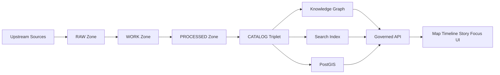

<!-- [KFM_META_BLOCK_V2]
doc_id: kfm://doc/6e6df1e2-0d85-4c16-a4b0-4d4bdaf7fe8a
title: Knowledge Graph Docs
type: standard
version: v1
status: draft
owners: kfm-graph-working-group
created: 2026-03-04
updated: 2026-03-04
policy_label: restricted
related: [docs/knowledge_graph/README.md]
tags: [kfm, knowledge-graph, neo4j, provenance, policy]
notes: [Directory README for Knowledge Graph documentation; align with truth-path and trust-membrane invariants.]
[/KFM_META_BLOCK_V2] -->

# Knowledge Graph
One place for **how the KFM knowledge graph works**, how we model it, how we ingest into it, how we query it, and how we keep it governed.

---

## Impact
**Status:** experimental (PROPOSED)  
**Owners:** `@kfm-graph-working-group` (UNKNOWN — verify CODEOWNERS / governance roster)  
**Policy label:** restricted (PROPOSED — confirm with governance)  
**Last updated:** 2026-03-04

Badges (TODO)
- 
- 
- 
- 

Quick links: [Scope](#scope) · [Where it fits](#where-it-fits-in-kfm) · [Quickstart](#quickstart-local-dev) · [Modeling](#modeling-and-ontology) · [Queries](#query-patterns) · [Governance](#governance-and-policy) · [Gates](#gates-definition-of-done) · [FAQ](#faq)

---

## Scope

- **CONFIRMED:** This directory documents the **knowledge graph** as a first-class KFM knowledge store used for relationship-heavy queries and cross-domain joins (entities/events/places/evidence) and for powering evidence-first UX.
- **CONFIRMED:** The graph is *not* an ungoverned “source of truth” for raw facts; it is an indexed/structured view with provenance links back to immutable artifacts.
- **PROPOSED:** Default graph database is **Neo4j**, with a hybrid retrieval posture (graph traversal + other indexes), and documentation here should remain version-tagged where features may change.
- **UNKNOWN:** Exact “source-of-truth” files for the current graph schema/ontology (labels/rel-types/constraints) and where they live in this repo.

If you are looking for:
- ingestion connectors and RAW/WORK/PROCESSED rules → see **data/pipelines** docs (path UNKNOWN)
- governed API contracts → see **contracts/** (path UNKNOWN)
- UI behavior and Focus Mode rules → see **apps/ui** and **docs/** (paths UNKNOWN)

---

## Where it fits in KFM

- **CONFIRMED:** Clients (UI) must not talk to Neo4j directly; graph access is mediated through the **governed API layer** (the policy enforcement boundary / “trust membrane”).  
- **CONFIRMED:** The KFM “truth path” lifecycle is: **Upstream → RAW → WORK → PROCESSED → CATALOG → PUBLISHED**, and the graph is fed by governed, receipt-backed artifacts promoted along this path (not by ad-hoc manual loads).

### System boundary (in one sentence)
- **CONFIRMED:** The knowledge graph is a **governed, query-optimized relationship store** that links datasets, evidence, places, events, and stories—while every user-facing claim must remain citeable back to immutable evidence.

---

## Acceptable inputs

Put **documentation artifacts** here that help engineers and reviewers understand and safely operate the graph.

### Acceptable
- **CONFIRMED:** Ontology/model docs: entity types, relationship types, identifier policy, time modeling rules.
- **CONFIRMED:** Ingestion mappings: “how a dataset becomes nodes/edges,” including provenance + policy label propagation.
- **CONFIRMED:** Query patterns: canonical Cypher snippets (or equivalent) for common retrieval tasks.
- **CONFIRMED:** Ops runbooks: local dev, migrations, backups, index rebuilds, and performance tuning guidelines.
- **PROPOSED:** Security/RBAC policy docs (roles, least privilege, audit events) specifically for graph access.

### Required doc qualities (LLM + human)
- **CONFIRMED:** Chunkable sections, definition-first vocabulary, examples that are runnable (or explicitly labeled pseudocode), and explicit version tags for any DB features that drift over time.

---

## Exclusions

Do **not** put these here.

- **CONFIRMED:** No secrets, passwords, tokens, connection strings.
- **CONFIRMED:** No raw datasets or large generated artifacts (those belong in data zones, not docs).
- **CONFIRMED:** No direct-to-client connection guidance (UI must not bypass governed APIs).
- **CONFIRMED:** No sensitive coordinates or vulnerable-site location disclosures unless policy allows and masking rules are documented + enforced.
- **UNKNOWN:** Exact policy-label taxonomy and masking thresholds; link the authoritative policy doc once confirmed.

---

## Directory tree

> **PROPOSED** (update to match the actual repo). Keep this tree accurate—docs are a production surface.

```text
docs/knowledge_graph/
├── README.md
├── modeling/
│   ├── concepts.md                 # Definitions: node, edge, constraint, evidence, story
│   ├── entity_registry.md          # Canonical entity/relationship registry
│   ├── time_model.md               # Event time vs valid time vs transaction time
│   └── id_policy.md                # Deterministic IDs, hashing strategy, namespace rules
├── ontology/
│   ├── overview.md                 # Ontologies in use and how we apply them
│   └── mappings/                   # Dataset→ontology mapping notes (small, auditable)
├── ingestion/
│   ├── ingestion_contract.md       # Required provenance fields, receipts, gates
│   ├── examples/                   # Minimal examples (tiny graphs) for tests
│   └── troubleshooting.md
├── query/
│   ├── common_queries.cypher       # Canonical, copy/paste queries
│   ├── performance.md              # Indexing + profiling checklist
│   └── patterns.md                 # Templates and gotchas
├── ops/
│   ├── local_dev.md                # Docker/dev instructions
│   ├── migrations.md               # Schema changes + rollback guidance
│   └── backup_restore.md
└── adr/
    └── ADR-0001-graph-db-choice.md # Decision records (why Neo4j, why this model)
```

---

## Quickstart: local dev

> **PROPOSED**. Replace with repo-standard compose scripts if they exist.

### Option A: Docker (single-node Neo4j)

```bash
# 1) Run Neo4j locally (dev-only)
docker run --rm \
  --name kfm-neo4j \
  -p 7474:7474 -p 7687:7687 \
  -e NEO4J_AUTH=neo4j/test-password \
  neo4j:5

# 2) Open Neo4j Browser
# http://localhost:7474
```

### Option B: Use repo-compose (preferred)

```bash
# PSEUDOCODE — replace with actual commands once confirmed:
# docker compose -f infra/dev/docker-compose.yml up neo4j
```

### Sanity check

```cypher
// Verify you can connect and run a trivial query
RETURN datetime() AS now;
```

---

## Usage

### Modeling and ontology

#### Core modeling principles

- **CONFIRMED:** Every node/edge that can influence user-facing output should link to evidence (directly or via an EvidenceRef/EvidenceBundle-like indirection).
- **CONFIRMED:** IDs should be deterministic and stable across rebuilds.
- **PROPOSED:** Prefer “event nodes” to represent time-bound facts; attach time semantics explicitly (avoid ambiguous timestamps).
- **UNKNOWN:** The authoritative node label / rel-type naming conventions for this repo (add here once confirmed).

#### Minimal example model (illustrative)

> **PROPOSED** label/rel names—align to the real registry.

- Nodes: `Dataset`, `DatasetVersion`, `EvidenceRef`, `StoryNode`, `Place`, `Event`, `RunReceipt`
- Relationships:
  - `DatasetVersion -[:HAS_EVIDENCE]-> EvidenceRef`
  - `StoryNode -[:SUPPORTED_BY]-> EvidenceRef`
  - `Event -[:LOCATED_AT]-> Place`
  - `Event -[:DERIVED_FROM]-> DatasetVersion`
  - `DatasetVersion -[:HAS_RECEIPT]-> RunReceipt`

#### Constraints and indexes (starter set)

> **PROPOSED**. Adjust to match your ID policy.

```cypher
// Unique IDs
CREATE CONSTRAINT dataset_id IF NOT EXISTS
FOR (d:Dataset) REQUIRE d.id IS UNIQUE;

CREATE CONSTRAINT dataset_version_id IF NOT EXISTS
FOR (dv:DatasetVersion) REQUIRE dv.id IS UNIQUE;

CREATE CONSTRAINT evidence_ref_id IF NOT EXISTS
FOR (e:EvidenceRef) REQUIRE e.id IS UNIQUE;

// Common lookup indexes
CREATE INDEX place_h3 IF NOT EXISTS
FOR (p:Place) ON (p.h3);

CREATE INDEX event_time IF NOT EXISTS
FOR (ev:Event) ON (ev.event_time);
```

---

## Query patterns

> Keep queries **copy/paste-ready** and show expected output shape.

### 1) “Show me the evidence for this Story Node”

```cypher
MATCH (s:StoryNode {id: $story_id})-[:SUPPORTED_BY]->(e:EvidenceRef)
RETURN
  s.id AS story_id,
  e.id AS evidence_id,
  e.kind AS evidence_kind,
  e.citation AS citation,
  e.policy_label AS policy_label
ORDER BY e.rank ASC;
```

### 2) “All events in a time window within a place (by H3 or bbox proxy)”

```cypher
MATCH (p:Place {h3: $h3})<-[:LOCATED_AT]-(ev:Event)
WHERE ev.event_time >= datetime($t0) AND ev.event_time < datetime($t1)
RETURN ev.id, ev.type, ev.event_time
ORDER BY ev.event_time ASC;
```

### 3) “Explain how a dataset version produced a graph assertion”

```cypher
MATCH (dv:DatasetVersion {id: $dataset_version_id})-[:HAS_RECEIPT]->(r:RunReceipt)
OPTIONAL MATCH (dv)-[:HAS_EVIDENCE]->(e:EvidenceRef)
RETURN
  dv.id,
  r.run_id,
  r.spec_hash,
  collect(e.id) AS evidence_ids;
```

---

## Diagram



- **CONFIRMED:** UI queries flow through governed APIs (no direct DB calls).
- **CONFIRMED:** Catalog/provenance is the bridge between processed artifacts and runtime stores.
- **PROPOSED:** Graph rebuilds are deterministic, driven by catalog + receipts.

---

## Tables

### Entity registry starter (fill out and enforce)

> **PROPOSED** registry—treat as a contract once validated.

| Entity | Required ID field | Time fields | Must carry policy_label | Must link to provenance |
|---|---|---|---|---|
| Dataset | `Dataset.id` | none | yes | yes |
| DatasetVersion | `DatasetVersion.id` | `valid_time?` (PROPOSED) | yes | yes |
| EvidenceRef | `EvidenceRef.id` | `published_at?` (PROPOSED) | yes | yes |
| StoryNode | `StoryNode.id` | `event_time?` (PROPOSED) | yes | yes |
| Place | `Place.id` | none | yes | yes |
| Event | `Event.id` | `event_time` (RECOMMENDED) | yes | yes |
| RunReceipt | `RunReceipt.run_id` | `run_at` (RECOMMENDED) | yes | yes |

### Provenance + policy propagation matrix

| Source artifact | Graph ingest allowed | Required fields before ingest | Notes |
|---|---:|---|---|
| STAC Item | yes | checksum + license + geometry/time (PROPOSED) | Prefer immutable hrefs/digests |
| DCAT Dataset | yes | license + publisher/provider (PROPOSED) | Drives dataset registry in graph |
| PROV bundle | yes | activity + entities + agent + checksums (PROPOSED) | Enables “why/where did this come from” |

---

## Governance and policy

### Non-negotiable invariants

- **CONFIRMED:** Clients must not access graph DB directly; everything crosses the governed API boundary.
- **CONFIRMED:** “Cite-or-abstain” posture: if evidence can’t be resolved and policy-cleared, the system must reduce scope or abstain.
- **CONFIRMED:** Default-deny + fail-closed: missing license / missing provenance / missing policy label should block promotion and/or graph ingestion.

### What this directory must document (minimum)

- **CONFIRMED:** How policy labels are attached to nodes/edges and how redaction/masking obligations are enforced at query time (via governed APIs).
- **PROPOSED:** A “public query surface” vs “internal graph surface” split (RBAC).
- **UNKNOWN:** The currently approved label taxonomy and exact masking rules—add the authoritative link and keep it updated.

---

## Gates: Definition of Done

A change that affects the knowledge graph docs or contracts is “done” only if:

- [ ] **CONFIRMED:** The doc states whether each major claim is CONFIRMED / PROPOSED / UNKNOWN.
- [ ] **CONFIRMED:** Any new entity/relationship is added to the registry table with required fields.
- [ ] **CONFIRMED:** At least one runnable query example is included for each new concept.
- [ ] **CONFIRMED:** Provenance requirements are explicit (what receipt fields must exist).
- [ ] **CONFIRMED:** Policy expectations are explicit (what is denied, what is redacted, what is allowed).
- [ ] **PROPOSED:** There is a rollback note for schema changes (migration + downgrade plan).
- [ ] **PROPOSED:** CI has a gate for doc lint + linkcheck + schema examples (add once pipeline exists).

---

## FAQ

### Why a graph at all?
- **CONFIRMED:** Some questions are fundamentally relationship-first (event ↔ place ↔ dataset ↔ evidence ↔ story); graphs make these traversals explicit and auditable.

### Where do embeddings / vector search live?
- **PROPOSED:** In a dedicated vector index (or Neo4j vector indexes if approved), but retrieval should remain governed and evidence-linked.
- **UNKNOWN:** Which store is the canonical vector backend in this repo today.

### Can I connect the UI directly to Neo4j in dev?
- **CONFIRMED:** No for shipped UI.  
- **PROPOSED:** Dev-only direct access may be allowed for operators, but should be documented as an ops-only workflow and never used by clients.

---

## Sources of truth for this directory

> Replace “UNKNOWN” entries with real repo links and keep this section current.

- **CONFIRMED:** KFM architecture + governance guide (truth-path, trust-membrane, cite-or-abstain).
- **CONFIRMED:** Executive summary (high-level store separation, standards posture).
- **CONFIRMED:** AI integration overview (Focus Mode orchestrates retrieval from graph + other stores; model calls remain behind APIs).
- **CONFIRMED:** Neo4j guide blueprint (authoring approach: version-tagged, pattern templates, runnable examples).

---

## Appendix

<details>
<summary>LLM-ingestible documentation conventions (recommended)</summary>

- Write definition-first:
  - “Term” → short definition → one canonical example → one “gotchas” paragraph.
- Prefer stable headings and stable IDs (`## entity-registry`, `## query-patterns`).
- Every snippet:
  - Must be runnable or labeled **PSEUDOCODE**.
  - Must state prerequisites (Neo4j version, plugins, privileges) if relevant.
- Avoid ambiguous pronouns (“this/that/it”) when possible; name the entity.
- Version-tag anything unstable (DB features, indexes, preview capabilities).
- If you can’t verify something from repo evidence, label it **UNKNOWN** and list the smallest verification step.

</details>

---

[Back to top](#knowledge-graph)
