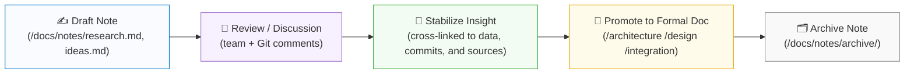
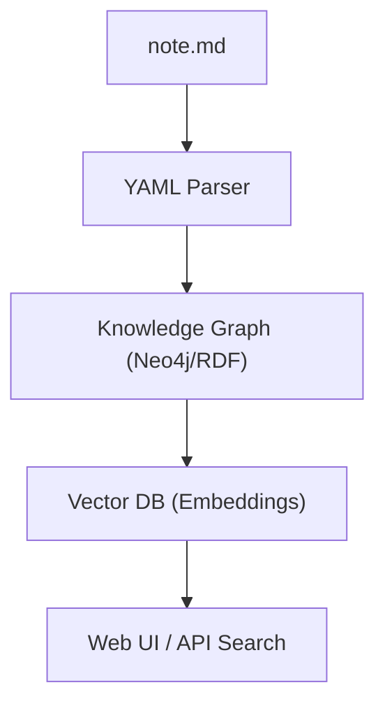

<div align="center">

# 📝 Kansas Frontier Matrix — **Notes Workspace**  
`docs/notes/README.md`

**Mission:** Maintain a **lightweight, versioned knowledge workspace** for  
working notes, research logs, and early drafts that evolve into formal  
MCP documentation and structured knowledge graph entries.

[](../standards/documentation.md)
[](../../.github/workflows/docs-validate.yml)
[](../../.github/workflows/policy-check.yml)
[](../../.github/workflows/site.yml)
[](../../.github/workflows/stac-validate.yml)
[](../../.github/workflows/codeql.yml)
[](../../.github/workflows/trivy.yml)
[](../../LICENSE)

</div>

```yaml
---
title: "Kansas Frontier Matrix — Notes Workspace"
document_type: "README"
version: "v1.5.0"
last_updated: "2025-10-18"
created: "2025-10-04"
owners: ["@kfm-docs","@kfm-architecture","@kfm-data","@kfm-security","@kfm-ai"]
status: "Stable"
maturity: "Production"
scope: "Docs/Notes"
license: "CC-BY 4.0"
semver_policy: "MAJOR.MINOR.PATCH"
tags: ["docs","notes","mcp","provenance","knowledge-graph","search","markdown","ai"]
audit_framework: "MCP-DL v6.3"
ci_required_checks:
  - docs-validate
  - policy-check
  - site-build
  - pre-commit
  - stac-validate
  - codeql
  - trivy
semantic_alignment:
  - STAC 1.0
  - DCAT 2.0
  - JSON Schema
  - ISO 8601
  - CIDOC CRM
  - PROV-O
  - OWL-Time
  - SKOS
provenance:
  workflow_pin_policy: "actions pinned by tag or commit SHA"
  artifact_retention_days: 90
---
```

---

## 📚 Table of Contents

- [🎯 Purpose](#-purpose)  
- [🧩 MCP Note Lifecycle](#-mcp-note-lifecycle)  
- [🧱 Directory Layout](#-directory-layout)  
- [🗂️ Note Types](#️-note-types)  
- [📋 Recommended Note Structure (YAML Front-Matter)](#-recommended-note-structure-yaml-front-matter)  
- [🧭 Metadata Schema](#-metadata-schema)  
- [🧾 Suggested Workflow](#-suggested-workflow)  
- [🧠 Linking Notes to the Knowledge Graph](#-linking-notes-to-the-knowledge-graph)  
- [📦 Example Note Templates](#-example-note-templates)  
- [🏷️ Tagging & Discovery](#️-tagging--discovery)  
- [🗄️ Archiving & Filenames](#️-archiving--filenames)  
- [🤖 AI Assistant & Automation](#-ai-assistant--automation)  
- [✅ Contributor Checklist](#-contributor-checklist)  
- [🔒 Ethics & Data Sensitivity](#-ethics--data-sensitivity)  
- [🤖 CI Integration & Validation](#-ci-integration--validation)  
- [📎 Related Documentation](#-related-documentation)  
- [🚀 Roadmap](#-roadmap)  
- [📅 Version History](#-version-history)

---

## 🎯 Purpose

The `/docs/notes/` directory is a **sandbox for thinking in public** —  
an **idea incubator** where concepts, discussions, and discoveries are captured  
before formalization into architecture, design, or integration documents.

Notes serve as:

- 🧠 **Working drafts** — capture ideas fast before structure hardens.  
- 🔍 **Research digests** — summaries of archives, datasets, and oral histories.  
- 🗓️ **Meeting & sprint logs** — record decisions, blockers, and insights.  
- ⚙️ **Technical backlogs** — track pending work or experimental prototypes.  
- 🧾 **Idea provenance** — keep “why we thought this” context in Git forever.

> **MCP Principle:** *Write fast. Preserve context. Promote when reproducible.*

---

## 🧩 MCP Note Lifecycle



---

## 🧱 Directory Layout

```text
docs/notes/
├── README.md          # Index (this file)
├── research.md        # Ad-hoc research notes & references
├── meetings.md        # Meeting logs, retrospectives, decisions
├── ideas.md           # Early brainstorms, experimental concepts
├── backlog.md         # Pending tasks, technical debt, blockers
├── templates/         # Optional note + meeting templates
└── archive/           # Deprecated or closed notes (retained for provenance)
```

---

## 🗂️ Note Types

| File           | Purpose                                                     |
| :------------- | :----------------------------------------------------------- |
| `research.md`  | Scratchpad for datasets, literature, references.            |
| `meetings.md`  | Agile retrospectives, agenda logs, team updates.            |
| `ideas.md`     | Experimental ideas, hypotheses, technical sketches.         |
| `backlog.md`   | Short-term tasks, tech debt tracking, feature backlog.      |
| `templates/`   | Prebuilt YAML & Markdown templates for uniform structure.   |
| `archive/`     | Long-term record of finalized or deprecated notes.          |

> **Tip:** If a note becomes foundational, promote it to `/docs/architecture/` or `/docs/design/`.

---

## 📋 Recommended Note Structure (YAML Front-Matter)

```yaml
---
title: "Hydrology Dataset Crosswalk — Early Draft"
author: "KFM Hydrology Team"
date: 2025-10-05
status: draft          # draft | review | stable | archived
tags: ["hydrology", "dataset", "integration"]
linked_datasets:
  - data/stac/hydro/usgs_streamflow_ks_1900_2020.json
linked_commits:
  - a3f29e9
linked_docs:
  - ../architecture/data-architecture.md
period:
  id: "perio.do/dust-bowl-1930s"
  label: "Dust Bowl Era"
ai_assist:
  summarize: true
  embed_in_graph: true
  vector_model: "sentence-transformers/all-MiniLM-L6-v2"
references:
  - "url:https://example.org/context"
---
```

---

## 🧭 Metadata Schema

| Field           | Description                        | Example                                 |
| :-------------- | :--------------------------------- | :-------------------------------------- |
| `title`         | Concise subject line               | “LiDAR DEM Pipeline – Draft Hypothesis” |
| `author`        | Individual or team                 | `"KFM Hydrology Team"`                  |
| `date`          | ISO 8601 date                      | `2025-10-05`                            |
| `status`        | Lifecycle stage                    | `draft`, `review`, `stable`, `archived` |
| `tags`          | Keywords / ontology concepts       | `["terrain","LiDAR","ETL"]`             |
| `linked_*`      | Crosslinks to artifacts            | Dataset paths, commits, docs            |
| `period`        | Historical period (PeriodO)        | `"Dust Bowl Era"`                       |
| `ai_assist`     | AI workflow flags                  | Summarization / embedding               |
| `references`    | Bibliography pointers              | `["doi:10.123/abc","url:..."]`          |

> Schema at: `docs/schemas/note.schema.json` (validated in CI).

---

## 🧾 Suggested Workflow

| Stage       | Action                               | Description                    |
| :---------- | :----------------------------------- | :----------------------------- |
| **1️⃣ Capture** | Add a note/section to `research.md`. | Minimal viable capture.        |
| **2️⃣ Link**   | Cross-reference datasets/commits.      | Maintain provenance.           |
| **3️⃣ Review** | Open PR for comments.                  | Team discussion/validation.    |
| **4️⃣ Promote**| Move to `/architecture/` or `/design/`. | When reproducible/validated.   |
| **5️⃣ Archive**| `archive/<year>/`, set `status: archived` | Lock history.                  |

> **Golden Rule:** *Nothing is deleted — preserve knowledge via Git + Archive.*

---

## 🧠 Linking Notes to the Knowledge Graph

Each note is ingested as an entity in the **Neo4j/RDF knowledge graph**, aligned to **CIDOC-CRM**, **PROV-O**, and **OWL-Time**.

```turtle
@prefix kfm: <https://kfm.org/id/> .
@prefix prov: <http://www.w3.org/ns/prov#> .
@prefix dc:   <http://purl.org/dc/terms/> .

kfm:note/hydrology_crosswalk
    a prov:Entity ;
    dc:title "Hydrology Dataset Crosswalk — Early Draft" ;
    prov:wasDerivedFrom kfm:dataset/usgs_streamflow_ks_1900_2020 ;
    prov:wasGeneratedBy kfm:process/research_sprint_oct2025 ;
    dc:creator "KFM Hydrology Team" ;
    dc:date "2025-10-05"^^xsd:date .
```

> Notes are vectorized for semantic search and discoverable via the web UI.

---

## 📦 Example Note Templates

**Quick Idea Template**

```markdown
# 💡 Idea: [Short Title]
*Date:* YYYY-MM-DD  
*Author:* Your Name  
*Status:* draft  

## Context
Origin or trigger of the idea.

## Hypothesis
If X → then Y.

## Linked Data
- `data/sources/...`
- Commit: `<hash>`
- STAC: `<item>.json`

## Next Steps
1. Validate concept.
2. Add to backlog.md if actionable.
```

**Meeting Log Template**

```markdown
# 🗓️ Meeting – [Topic]
*Date:* YYYY-MM-DD  
*Participants:* …  
*Recording:* link (if applicable)

## Agenda
1. …

## Notes & Decisions
- …

## Action Items
- [ ] Owner — Task
```

---

## 🏷️ Tagging & Discovery

Tags map into a **controlled SKOS vocabulary** in `data/vocabularies/tags.skos.ttl`.  
Notes’ tags are converted into RDF triples and indexed for federated search.

| Tag Type  | Example                  | Used For           |
| :-------- | :----------------------- | :----------------- |
| **Domain**| `#climate`, `#archaeology` | Thematic grouping  |
| **Phase** | `#draft`, `#review`, `#archived` | Workflow stage |
| **Concept**| `#ontology`, `#timeline`, `#LiDAR` | Concept linkage |
| **Process**| `#etl`, `#qa`, `#stac-validation`  | Pipeline refs   |

---

## 🗄️ Archiving & Filenames

- **When to archive:** After promotion or phase end.  
- **Where:** `docs/notes/archive/<year>/`  
- **Pattern:** `YYYY-MM-DD_<kebab-title>.md` → `2025-10-05_hydrology-dataset-crosswalk.md`

**Archival Log**

```markdown
### Change Log
- 2025-10-18: Promoted to `/docs/architecture/hydrology.md`
- 2025-10-18: Archived original note (`status: archived`)
```

---

## 🤖 AI Assistant & Automation

- **Summarization:** Notes may trigger AI summaries for dashboards.  
- **Embedding:** Auto-embedding via `scripts/vector_index_notes.py`.  
- **Graph Sync:** Nightly ingestion to Neo4j + VectorDB.  
- **Web Search:** Discoverable via site search.



---

## ✅ Contributor Checklist

| ✅ Item | Description |
| :-- | :-- |
| [ ] Front-matter passes schema validation (`make docs-validate`) |
| [ ] Tags follow controlled vocabulary (`data/vocabularies/tags.skos.ttl`) |
| [ ] Links to datasets, docs, commits verified |
| [ ] Markdown style passes lint (`remark-lint`) |
| [ ] Added to `research.md` index or cross-linked |
| [ ] Sensitive/PII-free content (open data only) |

---

## 🔒 Ethics & Data Sensitivity

> ⚠ **Data Ethics:** Include only public-domain or CC-BY content.  
> Do **not** commit PII or restricted datasets. Cite sources and license terms in `references:`.

---

## 🤖 CI Integration & Validation

| Validation        | Tool                          | Description                         |
| :---------------- | :---------------------------- | :---------------------------------- |
| **Front-matter**  | `yamllint`                    | Validates YAML structure            |
| **Schema**        | `jsonschema`                  | Enforces `docs/schemas/note.schema.json` |
| **Links**         | `remark-lint`                 | Checks internal/relative links      |
| **Tags → SKOS**   | `scripts/parse_tags.py`       | Updates SKOS vocabularies           |
| **Graph ingest**  | `scripts/graph_ingest_notes.py` | Loads notes to Neo4j/RDF          |
| **Embeddings**    | `scripts/vector_index_notes.py` | Builds semantic embeddings        |

> Local: `make docs-validate && make docs-lint`

---

## 📎 Related Documentation

| Path                                   | Description                                   |
| :------------------------------------- | :-------------------------------------------- |
| `../standards/documentation.md`        | Monorepo-wide documentation & writing rules   |
| `../standards/markdown_guide.md`       | Markdown styling & components                 |
| `../standards/markdown_rules.md`       | Official MCP-DL doc rules & header anatomy    |
| `../architecture/knowledge-graph.md`   | Notes → RDF/Neo4j mapping & queries           |
| `../templates/provenance.md`           | Provenance & lineage capture templates        |
| `../standards/ontologies.md`           | CIDOC-CRM · PROV-O · OWL-Time · SKOS alignment|

---

## 🚀 Roadmap

| Milestone | Target  | Description                                      |
| :-------- | :------ | :----------------------------------------------- |
| **v1.6**  | Q2 2026 | Auto-suggest tags via AI + SKOS reconciliation   |
| **v1.7**  | Q3 2026 | Web-based note creation + promotion workflow     |

---

## 📅 Version History

| Version | Date       | Author     | Summary                                                                                           |
| :------ | :--------- | :--------- | :------------------------------------------------------------------------------------------------ |
| **v1.5.0** | 2025-10-18 | @kfm-docs  | Added policy gate & docs-validate badges; clarified schema, AI workflows, and archive patterns.   |
| **v1.4.0** | 2025-10-18 | @kfm-docs  | YAML metadata header; aligned with MCP-DL v6.3; expanded CI checks and ethics section.            |
| **v1.3.1** | 2025-10-17 | @kfm-docs  | AI assist, schema validation, contributor checklist, roadmap.                                     |
| **v1.2.0** | 2025-10-16 | @kfm-docs  | Tagging, ontology links, automation details.                                                      |
| **v1.1.0** | 2025-10-05 | @kfm-docs  | Added YAML schema, tag vocabularies, graph linkage, CI validation.                                |
| **v1.0.0** | 2025-10-04 | @kfm-docs  | Initial workspace for research and drafts.                                                        |

---

<div align="center">

**Kansas Frontier Matrix** — *“Ideas Recorded. Knowledge Preserved. Insight Proven.”*  
📍 `docs/notes/README.md` · Maintained under MCP governance and CI validation.

</div>